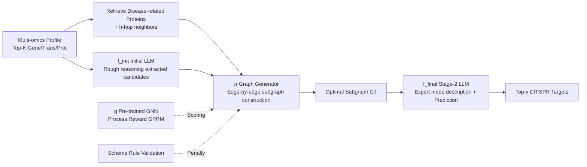

# GALAX: Graph-Augmented Language Model for Explainable Reinforcement-Guided Subgraph Reasoning in Precision Medicine

**Conference**: ICLR 2026  
**OpenReview**: [https://openreview.net/forum?id=ADFXCeYXvR](https://openreview.net/forum?id=ADFXCeYXvR)  
**Code**: TBD  
**Area**: Precision Medicine / Graph-Augmented LLM / Reinforcement Learning  
**Keywords**: Subgraph Reasoning, Process Reward Model, Multi-omics, CRISPR Target Discovery, GNN-LLM Fusion  

## TL;DR
GALAX treats a pre-trained GNN as a "process judge," using reinforcement learning to guide an LLM in incrementally constructing disease-related subgraphs. This enables explainable, patient-specific cancer target prediction without the need for step-by-step annotations.

## Background & Motivation
- **Background**: Precision medicine aims to identify key signaling pathways and therapeutic targets driving diseases. This requires the simultaneous utilization of three types of information: quantitative multi-omics features (genomics/transcriptomics/proteomics), the topological structure of biological networks, and literature-scale textual knowledge. CRISPR large-scale knockout screens provide a reliable experimental "gold standard" for targets.
- **Limitations of Prior Work**: Traditional differential expression or essentiality scoring fails to model the hierarchy and cross-modal dependencies of molecular networks. Graph models excel at outcome prediction but lack the structured supervision required for target prioritization. Knowledge Graph-based RAG (RoG, SubgraphRAG, GNN-RAG, G-Retriever) typically focuses only on the accuracy of the final answer; the retrieved subgraphs are often noisy, oversized, and lack ground-truth mechanistic structures. Crucially, they **generally lose numerical omics signals**, leading to a lack of cell-line-specific information.
- **Key Challenge**: Process Reward Models (PRM) could theoretically provide fine-grained supervision for intermediate reasoning steps, but they face three major bottlenecks: coarse step definitions, difficulty in verifying intermediate correctness, and vulnerability to reward hacking. In biomedicine, these issues are amplified: Text-Omic Numerical Graphs (TNG) lack step-by-step ground-truth labels, and the combinatorial explosion of biological pathways makes exhaustive planning or retrieval impractical.
- **Goal**: To unify numerical omics, textual knowledge, and biological topology into a reinforcement learning framework without explicit step-wise labels, using subgraph reasoning as a bridge to connect "numerical evidence, topological knowledge, and linguistic context" to output accurate and explainable patient-specific targets.
- **Core Idea**: **Utilize a pre-trained GNN as a source of process rewards**—allowing the GNN to score the "biological plausibility and cancer relevance" of partial signal subgraphs generated step-by-step by the LLM, supplemented by schema-based rule validation. This achieves process-level supervision without annotations, translating linguistic reasoning into explainable graph construction.

## Method

### Overall Architecture
GALAX consists of two stages: first, an initial LLM $f_{init}$ performs rough reasoning from multi-omics profiles to extract candidate targets. Then, a reinforcement learning graph generator $\pi$, guided by step-wise rewards from a pre-trained graph foundation model $g$, incrementally builds an explainable subgraph $G^\dagger$. Finally, a second-stage LLM $f_{final}$ reads both the "initial output and the generated subgraph" to make refined predictions. The subgraph $G^\dagger$ itself serves as a transparent basis for reasoning. The data foundation is the TOSG (Text-Omic Signaling Graph), supported by the Target-QA benchmark providing CRISPR ground-truth supervision.

### Key Designs
**1. TOSG welds three modalities into one graph: placing omics values, text, and topology in the same coordinate system.** The authors construct the Text-Omic Signaling Graph $G = \{\mathcal{X}^{(0)}, \mathcal{T}, \mathcal{V}, \mathcal{E}\}$, where nodes are categorized into four types: promoters, genes, transcripts, and proteins ($|\mathcal{V}| = m^{(pm)} + m^{(g)} + m^{(t)} + m^{(p)} = M$). Omics features for each sample are concatenated across categories $X_n^{(0)} = [x_n^{(pm)} \oplus x_n^{(g)} \oplus x_n^{(t)} \oplus x_n^{(p)}]$. The graph is split into an internal signaling subgraph $G^{(in)}$ (propagating along the central dogma: promoter→gene→transcript→protein) and a protein interaction subgraph $G^{(PPI)}$. This preserves numerical evidence from DepMap while attaching textual descriptions and topological relationships from BioMedGraphica, providing an aligned input for both GNN and LLM.

**2. Dual foundation model pre-training: Training the GNN as a "judge of cancer relevance" and the LLM as a "proponent of biological terminology."** The graph side follows a two-stage process: The first stage applies Bernoulli masking to PPI edges $\mathcal{E}_{mask} \sim \text{Bernoulli}(p)$, followed by cross-modal encoding and internal/global masked propagation to learn gene regulatory patterns. The second stage transfers pre-trained parameters $\theta_G^{pre}$ to a downstream classifier, predicting disease types using $\hat{Y}^{(0)} = \arg\max_o \text{Softmax}[\text{MLP}_G(f_G(\cdot))]$ to minimize cross-entropy. This pre-trained GNN becomes the "authoritative judge" for process rewards (achieving 99.46%/96.15% train/test accuracy in disease classification). The language side involves pre-training LLaMA3-8B on biomedical corpora to master terminology and structures related to protein interactions and disease-target relationships.

**3. Modeling subgraph construction as RL with edge-by-edge addition: State-Action-Policy revolving around "adding one edge."** The state is the current graph $G_n^{(i)} = (V_n^{(i)}, E_n^{(i)})$. The action $\Delta_n^{(i)} = (v_{src}^i, v_{tgt}^i)$ adds an edge under a feasibility mask. The policy first uses a message propagation module to obtain node embeddings $X_n^{(i)} = \pi_{MSG}(G_n^{(i)}, X_n^{(cand)})$, then samples source and target nodes using two masked probability functions: $v_{src}^i \sim \pi_{SRC}(X_n^{(i)}, M_{SRC})$ and $v_{tgt}^i \sim \pi_{TGT}(X_n^{(i)}, M_{TGT}; v_{src}^i)$. The mask $M_{SRC}$ restricts source nodes to those already in the graph, while $M_{TGT}$ excludes the source node itself. The starting node set $V_n^{(start)}$ is selected based on priority: Top-$\eta$ disease-related proteins, then Top-$\eta$ initial candidates, or random sampling of $\eta$ omics nodes. The candidate set is $V_n^{(cand)} = V_n^{(init)} \cup V_n^{(sub)} \cup V_n^{(omic)}$.

**4. GPRM Process Reward = GNN immediate feedback + rollout future simulation + rule penalty, replacing step-wise labels.** This is the core mechanism of the paper. Each step's reward first checks the pre-trained classifier's probability for the target class $o^\star$ on the current subgraph, using $L$ rollout simulations for look-ahead:
$$R_n^{(i)} = g_{o^\star}(G_n^{(i+1)}) - \frac{1}{|O|} + \lambda \cdot \frac{1}{L}\sum_{\ell=1}^{L}\left(g_{o^\star}(\text{Rollout}_\ell(G_n^{(i+1)})) - \frac{1}{|O|}\right)$$
A rule-based term $R_{rule}$ based on BioMedGraphica relations penalizes illegal edges violating the schema, yielding $R_{total}^{(i)} = R_n^{(i)} + \lambda_{rule} \cdot R_{rule}(G_n^{(i+1)})$. A greedy acceptance strategy is used: an edge is accepted only if $R_{total}^{(i)} > 0$. The generator is optimized using reward-weighted cross-entropy $L_{step} = -R_{total}^{(i)}[\text{CE}(v_{src}^i, \pi_{SRC}) + \text{CE}(v_{tgt}^i, \pi_{TGT})]$. After multiple samplings, the optimal subgraph $G_n^\dagger$ is retained. This design cleverly externalizes the "correctness of intermediate steps" to an independently trained GNN, bypassing the need for manual labels in PRM.

**5. Subgraph reinjection for final answer: Translating the graph into expert-level text prompts to fine-tune the LLM for target output.** The optimal subgraph $G_n^\dagger$ is verbalized into structured text using an "expert mode," which is appended to the original query to form the final prompt $P_n^{(final)}$. The second-stage LLM generates Top-$\gamma$ targets autoregressively via $\xi_{\theta_{final}}(\hat{A}_n | Q_n, G_n^\dagger)$, aligned with ground truth using token-level cross-entropy $L_{final}$. Finally, NER is used to extract the predicted proteins for comparison with reference targets. The subgraph serves as both a supervision signal and a readable mechanistic explanation.

## Key Experimental Results

### Main Results (Precision / Recall, Excerpt)

| Model | Overall Prec ↑ | Overall Rec ↑ | LUAD Rec | BRCA Rec |
|------|---------------|---------------|----------|----------|
| M2T (Traditional Multi-omics) | 0.0016 | 0.0011 | 0.0014 | 0.0000 |
| L3-FT(QA)+Omics | 0.5250 | 0.4959 | 0.4905 | 0.4856 |
| G-Retriever+pre-GAT | 0.4763 | 0.3929 | 0.3881 | 0.3772 |
| RoG | 0.5248 | 0.4726 | 0.4562 | 0.4311 |
| SubgraphRAG | 0.5280 | 0.4617 | 0.4448 | 0.3917 |
| GNN-RAG | 0.5258 | 0.4735 | 0.5052 | 0.4389 |
| **Ours (GALAX)** | **0.5472** | **0.5332** | 0.5157 | **0.5533** |
| GALAX (Qwen2.5-7B) | 0.5445 | 0.5405 | **0.5462** | 0.5206 |

- Dataset Target-QA: 363 cancer cell line QA pairs, 80/20 split, 4 random seeds. Each answer consists of Top-100 CRISPR prioritized targets.
- GALAX shows the most significant improvement in Recall (approx. +6 points over the strongest RAG baseline), particularly notable in BRCA.

### Hit@10 / Hit@5 (Excerpt)

| Model | Hit@10 ↑ | Hit@5 ↑ |
|------|----------|---------|
| L3-FT(QA)+Omics | 0.8693 | 0.8889 |
| RoG | 0.8450 | 0.8593 |
| SubgraphRAG | 0.8476 | 0.8624 |
| GNN-RAG | 0.8323 | 0.8656 |
| **GALAX** | 0.8815 | **0.9249** |
| GALAX (Qwen2.5-7B) | **0.8841** | 0.9079 |

### Ablation Study (Language Axis × Graph Axis)

| Configuration | Function | Result |
|------|------|------|
| L3+Omics | LLaMA3 without task fine-tuning | Very poor |
| L3-FT(Med)+Omics | Biomedical text domain adaptation | Slight improvement |
| L3-FT(QA)+Omics | Target-QA task fine-tuning | **Qualitative jump** (Performance leap) |
| +KG (Static KG) | Concatenating KG directly | Negligible gain or decrease |
| G-Retriever+pre-GAT | Subgraph retrieval via pre-trained GAT | Unstable (difficult to extract from millions of nodes) |
| **+RL (Full GALAX)** | Reinforcement-guided construction | Further ~2%–5% gain across metrics |

### Key Findings
- **Task-adaptive fine-tuning is the performance watershed**: L3-FT(QA) jumped from ~1% to ~52% compared to domain fine-tuning, indicating that QA-style supervision is more critical than raw biomedical text ingestion.
- **Static KG concatenation can be harmful**: Feeding the Knowledge Graph directly to the LLM yielded little gain or even a loss, confirming that the "noisy subgraph + no mechanism ground-truth" retrieval paradigm is unreliable.
- **Reinforcement-guided process-level subgraph construction is the source of incremental gain**: Adding RL on top of QA fine-tuning provided a stable +2%–5% across datasets, validating that the "GNN as process judge" route outperforms all graph-augmented RAG baselines.
- **Controllable Complexity**: The training/inference complexity of GALAX is $O(\kappa + M\varepsilon + M^2\varepsilon)$, comparable to RoG/GNN-RAG. Since candidates $\eta \ll M$, the graph embedding term dominates the RL reward costs.

## Highlights & Insights
- **Resolving the PRM bottleneck**: The three pain points of PRM (step definition, verification, and reward hacking) stem from a lack of step-wise labels. GALAX uses an **independently pre-trained, objective-oriented (disease classification) GNN** as a judge. This provides verifiable intermediate signals and, because the judge is fixed, makes the strategy difficult to hack. It is an elegant engineering solution.
- **Explainability as a "By-product" rather than "Post-processing"**: Subgraph $G^\dagger$ serves simultaneously as the reasoning process, the supervision object, and the human-readable mechanistic explanation. It is inherently tied to the decision, unlike post-hoc attribution methods.
- **Practical Multi-modal Fusion**: Numerical omics are not discarded (a point of criticism for RAG systems), but instead enter the TOSG alongside text and topology, preserving cell-line-specific information.
- **Rollout Foresight + Greedy Acceptance**: Each step considers both immediate classification gain and simulated future trajectories to avoid nearsighted edge addition, while greedy acceptance ensures monotonic improvement.

## Limitations & Future Work
- **Small Data Scale**: Target-QA contains only 363 QA pairs and 336 pre-training samples. Furthermore, the task is simplified to binary classification ($|O|=2$) using only 1-hop neighbors. Generalization to more cancer types and deeper topologies requires further validation.
- **Judge Performance Ceiling**: Process rewards rely entirely on the judgment of the pre-trained GNN (edge prediction AUC is only 64.4%). Biases in the judge may be amplified by reinforcement learning.
- **High Dependency on External Components**: The pipeline involves GPT-4o-mini for NER, BioMedGraphica for integration, and BioBERT for text embedding. The long chain results in high reproducibility costs, and drift in any segment could affect results.
- **Sensitivity of Reward Hyperparameters**: $\lambda$, $\lambda_{rule}$, rollout depth $L$, and $\eta$ are set empirically (often equal weight or fixed), lacking a systematic sensitivity analysis.
- **Clinical Gap**: There is still a gap between CRISPR cell-line targets and real patient treatment response. The biological accuracy of the "explainable subgraphs" requires validation via wet-lab experiments.

## Related Work & Insights
- **Graph-Augmented RAG** (RoG, SubgraphRAG, GNN-RAG, G-Retriever): These are direct competitors. GALAX differs by actively **generating** subgraphs and scoring the process, rather than just optimizing final answers via subgraph retrieval.
- **Process Reward Models / Large Reasoning Models** (PRM, StepGRPO, RLHF/PPO/GRPO): GALAX inherits the idea of "process-level supervision" but replaces manual or model-based annotations with a pre-trained GNN + rules to avoid reward hacking.
- **Multi-omics GNN** (MOGONET, MoGCN): These provide precedents for graph-structure reasoning in cancer subtyping but typically focus on outcome prediction rather than explainable target prioritization.
- **Insight**: For any reasoning task "lacking step-wise labels but having outcome labels," one can consider **training an independent outcome classifier as a process judge**. This transforms expensive step-wise labeling into a reward design problem—a paradigm applicable beyond biomedicine.

## Rating
- **Novelty**: ⭐⭐⭐⭐⭐ The idea of using a pre-trained GNN as a source for process rewards to bypass the PRM labeling dilemma is novel and self-consistent. It is an organic fusion of GNN, LLM, and RL.
- **Experimental Thoroughness**: ⭐⭐⭐ Ablations across language and graph axes are clear, and complexity analysis is thorough. However, the small dataset size, task simplification, and lack of reward sensitivity analysis are drawbacks.
- **Writing Quality**: ⭐⭐⭐⭐ The motivation is progressively developed, and notation is rigorous. Figure 3 provides a clear workflow; however, high notation density and heavy reliance on the appendix make the initial reading threshold high.
- **Value**: ⭐⭐⭐⭐ This provides a new "generative + process supervision" path for explainable target discovery in precision medicine. The accompanying Target-QA benchmark also has reuse value.

<!-- RELATED:START -->

## Related Papers

- [\[ICLR 2026\] Knowledgeable Language Models as Black-Box Optimizers for Personalized Medicine](knowledgeable_language_models_as_black-box_optimizers_for_personalized_medicine.md)
- [\[AAAI 2026\] MIRAGE: Scaling Test-Time Inference with Parallel Graph-Retrieval-Augmented Reasoning Chains](../../AAAI2026/medical_nlp/mirage_scaling_test-time_inference_with_parallel_graph-retrieval-augmented_reaso.md)
- [\[ICLR 2026\] mCLM: A Modular Chemical Language Model that Generates Functional and Makeable Molecules](mclm_a_modular_chemical_language_model_that_generates_functional_and_makeable_mo.md)
- [\[ICLR 2026\] Doctor-R1: Mastering Clinical Inquiry with Experiential Agentic Reinforcement Learning](doctor-r1_mastering_clinical_inquiry_with_experiential_agentic_reinforcement_lea.md)
- [\[NeurIPS 2025\] CGBench: Benchmarking Language Model Scientific Reasoning for Clinical Genetics Research](../../NeurIPS2025/medical_nlp/cgbench_benchmarking_language_model_scientific_reasoning_for_clinical_genetics_r.md)

<!-- RELATED:END -->
