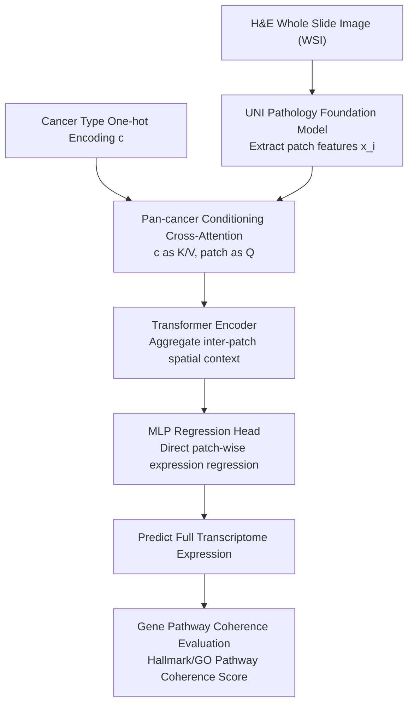

# HistoPrism: Unlocking Functional Pathway Analysis from Pan-Cancer Histology via Gene Expression Prediction

**Conference**: ICLR 2026  
**arXiv**: [2601.21560](https://arxiv.org/abs/2601.21560)  
**Code**: [GitHub](https://github.com/susuhu/HistoPrism)  
**Area**: Computational Biology  
**Keywords**: Spatial Transcriptomics, Gene Expression Prediction, Pan-Cancer, Pathway Analysis, Transformer

## TL;DR

This paper proposes HistoPrism, an efficient Transformer architecture that predicts pan-cancer gene expression from H&E histology images by injecting cancer type conditions via cross-attention. It introduces the Gene Pathway Coherence (GPC) evaluation framework based on Hallmark/GO pathways, significantly outperforming STPath in pathway-level prediction, especially for core biological pathways with low variance.

## Background & Motivation

**Background**: Spatial transcriptomics (ST) is a technology that maps gene expression distributions in situ by combining high-resolution imaging with transcriptomic analysis. However, ST is expensive, labor-intensive, and difficult to scale. Since H&E-stained whole-slide images (WSIs) are routinely collected in clinical practice, computational inference of gene expression from H&E has become a prominent research direction.

**Limitations of Prior Work**: (1) Early methods (BLEEP, GraphST, TRIPLEX) rely on complex multi-stage pipelines, using contrastive learning (difficult to define negative samples) or multi-resolution engineering (high computational overhead); (2) Generative methods (STEM, STFlow) model one-to-many mappings but are validated only on single cancer types and are computationally intensive; (3) STPath utilizes BERT-style masked gene modeling to learn pan-cancer prediction across 38k genes, but assumes stable gene correlations across tissues (prone to failure in heterogeneous pan-cancer settings) and requires high training/inference resources due to its large model size.

**Key Challenge**: Current evaluation benchmarks focus solely on the Pearson correlation of top-N highly variable genes (HVGs), ignoring biological consistency at the functional pathway level. A model might achieve high scores on HVGs while failing to recover biologically meaningful coordinated expression patterns, limiting its clinical translational value.

**Goal**: (1) Design an efficient direct mapping architecture to replace complex reconstruction-based methods; (2) Establish a pathway-level evaluation standard to measure the biological significance of predictions.

**Key Insight**: The authors argue that gene expression prediction is essentially a modality translation task (image → expression) rather than a reconstruction task, making direct mapping more suitable than autoencoder frameworks. Evaluation should shift from isolated gene-level variance toward functional pathway-level coherence.

**Core Idea**: Use cross-attention to inject cancer-type conditions + Transformer encoder to capture inter-patch context + MLP to directly regress gene expression, and evaluate biological fidelity using the pathway-level GPC benchmark.

## Method

### Overall Architecture

HistoPrism treats "predicting gene expression from H&E images" as a **direct modality translation** task, rather than a masked reconstruction task like STPath. The workflow is streamlined: H&E WSIs are first processed by a pathology foundation model (UNI PFM) to extract features $\mathbf{x}_i \in \mathbb{R}^{D_{img}}$ for each patch. These patch features are conditioned using a cancer-type one-hot encoding $\mathbf{c}$ via cross-attention, injecting global information about the cancer type. The conditioned features pass through a Transformer encoder to model spatial context between patches, and finally, an MLP regression head directly outputs the $D_{gene}$-dimensional gene expression for each patch. Beside this prediction backbone, the paper proposes a separate pathway-level evaluation framework, GPC, to measure the biological validity of the predictions.

### Key Designs

**1. Pan-cancer Conditioned Cross-Attention: Handling Multiple Cancers with One Model**

The difficulty in pan-cancer settings lies in the vast differences in expression patterns across cancer types; training on them mixed together can cause interference. The approach here maps the one-hot cancer type vector through a linear layer to $\mathbf{c}_{\text{emb}} \in \mathbb{R}^{D_{img}}$, serving as the Key and Value for cross-attention, while patch features act as the Query to calculate conditioned patch features $\mathbf{X}_{\text{cond}}$. This ensures each patch representation is modulated by the current cancer type, allowing the model to learn both pan-cancer shared patterns and cancer-specific patterns. Ablation studies show performance drops across all cancer types when this cross-attention is removed, validating its effectiveness.

**2. Transformer Encoder for Context Aggregation: From Patches to Tissue Structures**

A single patch only captures local morphology, but gene expression is often related to higher-level tissue structures like tumor boundaries or immune infiltration. Conditioned patch features are projected to a hidden dimension $D_{hidden}=256$ and passed through a 2-layer, 8-head Transformer encoder, outputting $\mathbf{H}_{\text{latent}} \in \mathbb{R}^{N \times D_{hidden}}$, allowing each patch to aggregate information from short-range and long-range neighbors. A counter-intuitive finding was that **excluding positional encodings yielded better results**—likely because UNI PFM features already carry morphological information, making it more appropriate to treat the Transformer as a permutation-invariant set function utilizing global composition.

**3. Gene Pathway Coherence (GPC): Shifting Evaluation from Gene Variance to Functional Pathways**

Existing evaluations focus on Pearson correlations of top-N highly variable genes (HVGs). A model can score highly on HVGs while failing to recover biologically meaningful coordinated expression; pathways that are low-variance but correspond to core biological processes are often ignored. GPC takes a different perspective: it filters 87 non-redundant pathways (50–100 genes each, Jaccard similarity < 0.1) from MSigDB Hallmark (50 pathways) and GO databases. For each pathway, the Pearson correlation coefficient across patches is calculated for member genes and averaged:

$$s_m = \frac{1}{N} \sum_{i=1}^{N} \frac{1}{|P_m|} \sum_{g \in P_m} r_{i,g}$$

Higher $s_m$ indicates more coordinated expression within the pathway, signifying that the prediction is closer to the true functional biological state rather than just predicting isolated high-variance genes.

### Loss & Training

The model is trained end-to-end using the MSE loss function: $\mathcal{L}_{\text{MSE}} = \frac{1}{N} \sum_{i \in N} (\hat{y}_i - y_i)^2$. Training is conducted on the HEST1k dataset, which aggregates spatial transcriptomics data from 153 cohorts and 36 independent studies. HistoPrism requires only approximately 500 WSIs for training, about half that of STPath.

## Key Experimental Results

### Main Results (Top50 HVG PCC)

| Cancer Type | STPath (Micro-avg) | HistoPrism (Ours) (Micro-avg) |
|------|-------------|-----------------|
| CCRCC | 0.117 | **0.206** |
| COAD | **0.459** | 0.397 |
| HCC | 0.094 | **0.113** |
| IDC | **0.629** | 0.477 |
| PRAD | 0.255 | **0.317** |
| Average (Micro-avg) | 0.292 | **0.318** |

### GPC Pathway Evaluation

| Pathway Database | HistoPrism (Ours) Win Rate |
|-----------|-------------------|
| Hallmark Pathways (50) | **86.0%** |
| GO Pathways (87) | **74.7%** |

### Clustering Quality Comparison

| Model | AMI ↑ | ARI ↑ |
|------|-------|-------|
| STPath | 0.395 | 0.402 |
| **HistoPrism (Ours)** | **0.623** | **0.521** |

### Key Findings
- HistoPrism outperforms STPath in micro-average PCC (0.318 vs 0.292), which better reflects overall prediction quality across cancer types.
- **Pathway-level prediction is the highlight**: HistoPrism excels in 86% of Hallmark pathways and 75% of GO pathways, with the greatest advantage seen in low-variance pathways corresponding to core biological processes.
- Clustering experiments showed AMI increased from 0.395 to 0.623 (+57.7%), indicating that HistoPrism's full-transcriptome predictions possess higher global biological consistency.
- Positional encodings do not benefit performance, suggesting the task is primarily local and morphology captures sufficient spatial info via the PFM.

## Highlights & Insights
- **The proposal of the GPC evaluation framework** is the most significant contribution—shifting evaluation from isolated high-variance genes to functional pathway coordination, which aligns better with clinical and biological needs. This holds greater methodological importance than mere improvements in HVG PCC.
- The choice of a direct mapping architecture over an autoencoder framework is insightful. Since gene expression prediction is a one-way translation task without input-side gene information for reconstruction, the inductive bias of an autoencoder becomes a burden.
- The use of cross-attention for pan-cancer conditioning is simple and efficient, and its necessity is validated by performance drops in ablation studies.

## Limitations & Future Work
- STPath still leads in macro-average PCC for specific types like IDC (Infiltrating Ductal Carcinoma) and COAD (Colon Adenocarcinoma), indicating room for improvement in cancer-specific learning.
- The pathway selection criteria for the GPC framework (50-100 genes, Jaccard < 0.1) are heuristic; different thresholds might influence evaluation conclusions.
- Only the UNI PFM was used as a feature extractor; the impact of different PFMs (e.g., GigaPath, CTransPath) remains untested.
- While generative methods (STEM, STFlow) performed poorly in the pan-cancer setting, the authors acknowledge they were limited by computational resources and only trained on subsets of genes for these baselines.

## Related Work & Insights
- **vs STPath**: STPath is the current SOTA foundation model for pan-cancer gene prediction, using BERT-style masked modeling for gene dependencies. HistoPrism dominates in pathway-level metrics but trails on HVGs for certain cancers. The core difference lies in philosophy: STPath is reconstruction-based, HistoPrism is direct mapping.
- **vs BLEEP**: BLEEP uses contrastive learning to align H&E and gene expressions into a joint space, using nearest-neighbor retrieval for inference. Retrieval-based inference limits generalization to unseen samples, and negative samples are ambiguously defined in pathology.
- **vs TRIPLEX**: TRIPLEX introduces a multi-resolution distillation architecture with high computational complexity, validated only on single cancer types. HistoPrism is superior in efficiency and generalization.

## Rating
- Novelty: ⭐⭐⭐⭐ GPC framework provides important methodological contributions; architecture is clean but not revolutionary.
- Experimental Thoroughness: ⭐⭐⭐⭐⭐ 10 cancer types, multiple baselines, pathway-level evaluation, clustering, efficiency, and ablation studies.
- Writing Quality: ⭐⭐⭐⭐ Motivation and evaluation frameworks are clearly explained; methodologies are well-formalized.
- Value: ⭐⭐⭐⭐⭐ The GPC evaluation paradigm could have a profound impact on computational pathology; HistoPrism itself is a practical, high-efficiency tool.

<!-- RELATED:START -->

## Related Papers

- [\[ICLR 2026\] mCLM: A Modular Chemical Language Model that Generates Functional and Makeable Molecules](mclm_a_modular_chemical_language_model_that_generates_functional_and_makeable_mo.md)
- [\[ACL 2026\] ReMedi: Reasoner for Medical Clinical Prediction](../../ACL2026/medical_nlp/remedi_reasoner_for_medical_clinical_prediction.md)
- [\[ICLR 2026\] SurvHTE-Bench: A Benchmark for Heterogeneous Treatment Effect Estimation in Survival Analysis](survhte-bench_a_benchmark_for_heterogeneous_treatment_effect_estimation_in_survi.md)
- [\[ICLR 2026\] Cancer-Myth: Evaluating Large Language Models on Patient Questions with False Presuppositions](cancer-myth_evaluating_large_language_models_on_patient_questions_with_false_pre.md)
- [\[ACL 2026\] Query Pipeline Optimization for Cancer Patient Question Answering Systems](../../ACL2026/medical_nlp/query_pipeline_optimization_for_cancer_patient_question_answering_systems.md)

<!-- RELATED:END -->
