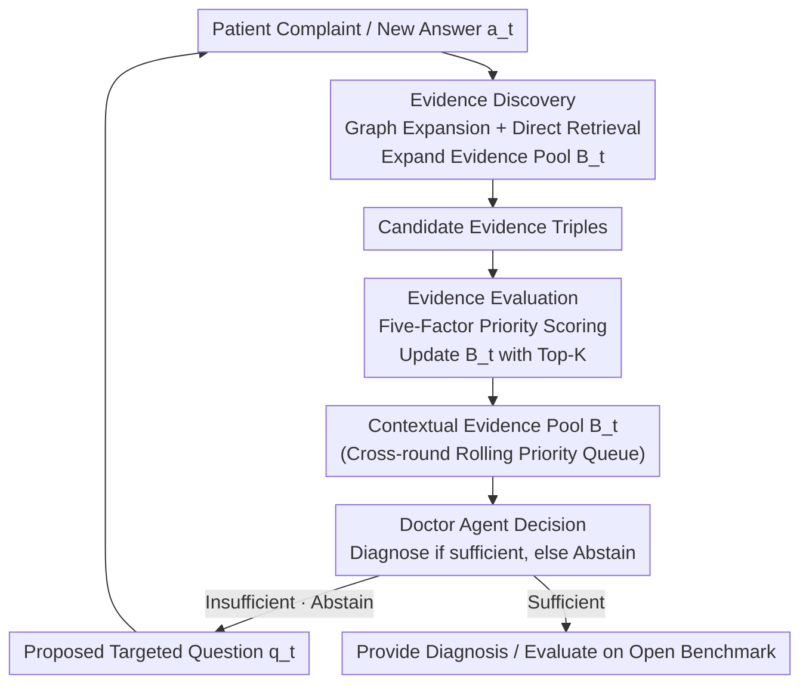

# KnowGuard: Knowledge-Driven Abstention for Multi-Round Clinical Reasoning

**Conference**: ICLR 2026  
**OpenReview**: [https://openreview.net/forum?id=gQRefH8upx](https://openreview.net/forum?id=gQRefH8upx)  
**Code**: https://github.com/IcecreamArtist/KnowGuard  
**Area**: Medical NLP / LLM Agent / Knowledge Graph / Clinical Reasoning  
**Keywords**: Abstention, Multi-round Clinical Consultation, Medical Knowledge Graph, Evidence Pool, Safety

## TL;DR
Addressing the overconfidence issue where LLMs provide diagnoses despite incomplete information in multi-round clinical consultations, KnowGuard proposes an "investigate-before-abstain" paradigm. This approach shifts abstention decisions from model self-assessment to systematic cross-round evidence exploration over a medical knowledge graph. By using a rolling-updated contextual evidence pool to identify "missing evidence," the model decides whether to continue questioning or provide a diagnosis. On a self-constructed open-ended multi-round benchmark, KnowGuard improved average diagnostic accuracy by 3.93% and converged in an average of only 5.74 rounds.

## Background & Motivation
**Background**: Using LLMs as "doctor agents" for clinical consultation has become a significant trend. In real-world diagnostics, patient complaints are often fragmented and vague, requiring doctors to supplement information through multi-round questioning. A critical safety mechanism in this context is **abstention**—refusing to conclude and continuing to inquire when evidence is insufficient, rather than providing a potentially fatal misdiagnosis.

**Limitations of Prior Work**: Existing abstention methods almost exclusively rely on the model's "self-assessed confidence"—asking the LLM to provide a 1-5 confidence score, a binary judgment, or a fine-grained rating, and abstaining only when the score is below a threshold. However, LLMs are inherently overconfident and prone to "choice-supportive bias": once an initial answer is given, they maintain a false sense of certainty even when encountering contradictory evidence. This is particularly severe in medical agents fine-tuned for reasoning. Another approach, such as retrieving entire medical documents via long context, introduces external information but is too coarse-grained to pinpoint exactly "which piece of evidence is missing," often leading to information overload.

**Key Challenge**: The essence of abstention is to identify **knowledge boundaries**—determining whether currently mastered information suffices for a reliable diagnosis. Relying purely on self-assessment is equivalent to repeatedly asking "How confident am I?" instead of "What specific piece of evidence do I lack?". The former lacks an externally verifiable basis and is destined to be unreliable.

**Goal**: To "ground" abstention decisions using external, structured, and verifiable medical knowledge while maintaining exploration consistency across multi-round settings, dynamically adjusting to new patient information.

**Key Insight**: Knowledge graphs (KG) naturally organize relationships between medical entities (symptoms—diseases—drugs—side effects). They support structured multi-hop reasoning and materialize "knowledge boundaries" as "which related triples on the graph are not yet covered," making them better suited for precise evidence gap identification than retrieving entire text blocks.

**Core Idea**: Replace "assess-then-abstain" with "**investigate-before-abstain**"—systematically exploring evidence on a KG across multiple rounds. Knowledge conflicts or insufficient coverage serve as uncertainty signals; a diagnosis is given only when evidence is sufficient, otherwise, targeted follow-up questions are pursued.

## Method

### Overall Architecture
KnowGuard formalizes multi-round clinical abstention as an interactive consultation process: the **Patient Agent** holds complete patient information $K=\{k_0,k_1,\dots,k_n\}$ and discloses relevant subsets only when asked; the **Doctor Agent** starts with only the chief complaint $k_0$. At each round $t$, it makes a binary abstention decision $A_t:K_t\to\{0,1\}$, where $A_t=0$ means insufficient information (continue questioning) and $A_t=1$ means sufficient evidence (provide diagnosis). The difficulty lies in finding the optimal stopping point: ensuring $K_t$ contains enough evidence for reliability while minimizing the number of rounds.

The system revolves around a **Contextual Evidence Pool** $B_t$ (a priority queue of knowledge triples) that **accumulates across rounds**. Rather than restarting each round, it expands by absorbing new patient answers $a_t$ based on existing findings. In each round, the pool undergoes two complementary phases: **Evidence Discovery**, which systematically expands $B_t$ based on new patient info, and **Evidence Evaluation**, which adjusts exploration priorities using a multi-factor scoring system. Finally, the Doctor Agent integrates the evidence pool with the patient context to make an abstention decision. If it abstains, it proposes a targeted question $q_t$.

### Key Designs

**1. Investigate-before-abstain Paradigm and Cross-round Contextual Evidence Pool: Replacing "Self-Assessment" with "Graph Exploration"**

This design directly addresses the fundamental pain point of unreliable model self-assessment and overconfidence. Instead of asking "How confident am I?", KnowGuard asks "What specific evidence is missing?" and grounds the answer in an external KG. The mechanism is a bounded priority queue acting as a contextual evidence pool $B_t=\{(h_i,r_i,t_i,p_i)\}_{i=1}^{|B_t|}$, where each element is a medical triple with a priority $p_i$. Its key property is **cross-round accumulation and rolling updates**: when new patient info $a_t$ arrives, the system continues exploration from old evidence rather than rebooting, maintaining consistency in the reasoning path. The bounded nature (retaining Top-$K$) ensures efficient ranking and selection within vast medical knowledge spaces, focusing exploration on the most promising paths. The final decision is $A_t=\text{LLM}_{\text{doctor}}(K_t,B_t,\{x_{\text{text}},x_{\text{img}}\})$.

**2. Evidence Discovery: Dual Strategy of Graph Expansion + Direct Retrieval**

To solve the coarse granularity of long-context retrieval, this phase uses two complementary paths for structured exploration. **Graph Expansion Retrieval** follows entities within high-priority candidates one hop outward: $T_{\text{exp}}=\{(h,r,t)\in G: h\in E_{B_t}\ \text{or}\ t\in E_{B_t}\}$, where $E_{B_t}$ represents entities in the current pool. This ensures new evidence extends naturally from the existing reasoning path. **Direct Retrieval** uses the LLM to generate queries based on $a_t$ and searches the entire graph: $T_{\text{query}}=\text{GraphRetrieval}(G,\text{LLM}_{\text{query}}(a_t))$. This brings in relevant knowledge introduced by new patient info that might not be directly connected to existing paths.

**3. Evidence Evaluation: Five-Factor Priority Scoring to Locate Reliable Evidence**

Candidate evidence is ranked based on five complementary factors: ① **Embedding Similarity** $s_{\text{sim}}=\cos(\text{Embed}(h,r,t),\text{Embed}(a_t))$ for semantic fit; ② **LLM Relevance** $s_{\text{rel}}=\text{LLM}_{\text{rel}}(a_t,(h,r,t))$ for clinical relevance; ③ **Graph Coherence** $s_{\text{coh}}=\text{count}_B(h)+\text{count}_B(t)$ calculates entity frequency across all round evidence pools to reward triples connecting to "frequently visited entities"; ④ **Patient Population Reasoning (PPR)**: Inferring the patient demographic $P_t=\text{LLM}_{\text{demo}}(K_t,C_{\text{pop}})$ (e.g., adolescents) and weighting triples belonging to that sub-graph by $s_{\text{pop}}=\alpha\ (\alpha>1)$; ⑤ **Turn Decay**: An exponential decay functions to balance history and current info: $p_{t+1}=p_t\times(1-w_{\text{decay}})+p_{\text{new}}\times w_{\text{decay}}$. The final priority aggregates the first four factors:

$$p_{\text{final}}(h,r,t)=(w_{\text{sim}}\cdot s_{\text{sim}}+w_{\text{rel}}\cdot s_{\text{rel}}+w_{\text{coh}}\cdot s_{\text{coh}})\times s_{\text{pop}}$$

**4. Open-set Multi-round Clinical Benchmark and Multi-modal Medical KG**

Abstention capability must be evaluated in open-ended scenarios. The authors converted MEDQA, CRAFT-MD, and AFRIMEDQA into interactive multi-round formats (ioMEDQA / ioCRAFT-MD / ioAFRIMEDQA), parsing cases into age, gender, complaint, and atomic facts. Initial input is limited to force the agent to inquire. An **LLM-as-judge** converts closed-form answers into open-set evaluation by matching free-text predictions to original options or binary truth labels. The supporting KG, constructed from 300+ WHO guidelines, contains 22k nodes and over 100k edges, with each triple carrying original text and document page images.

## Key Experimental Results

Experiments used GPT-4 as the core agent. Key metrics: Accuracy (ACC), Expected Calibration Error (ECE), Brier Score, and average turns (avg. Turn).

### Main Results
In the basic setting (no rationale/self-consistency enhancement), KnowGuard outperformed all baselines. Compared to the strongest confidence-based methods, it saw an average improvement of ~1.07 points (5.64%) and outperformed Long Context by 10.29%, with significantly lower ECE/Brier scores.

| Dataset | Method | ACC | Turn | ECE | Brier |
|--------|------|-----|------|-----|-------|
| ioAFRIMEDQA | Scale Rating | 63.06 | 5.11 | 0.141 | 0.285 |
| ioAFRIMEDQA | **KnowGuard** | **68.70** | 5.26 | **0.050** | **0.236** |
| ioMEDQA | Scale Rating | 64.23 | 5.15 | 0.135 | 0.260 |
| ioMEDQA | **KnowGuard** | **70.98** | 5.41 | **0.065** | **0.219** |
| ioCRAFT-MD | Scale Rating | 65.40 | 4.83 | 0.136 | 0.261 |
| ioCRAFT-MD | **KnowGuard** | **66.47** | 4.89 | **0.050** | **0.216** |

With rationale + self-consistency enhancements, KnowGuard's ACC reached 73.20 / 74.12 / 71.96. Compared to calibration methods (Temperature Scaling, Conformal Abstention), which were overly conservative (often hitting the 12-round limit), KnowGuard achieved higher accuracy with fewer turns.

### Ablation Study
Removing components in the enhanced setting (Reporting ACC for ioAFRIMEDQA / ioMEDQA / ioCRAFT-MD):

| Configuration | ioAFRIMEDQA | ioMEDQA | ioCRAFT-MD | Description |
|------|-------------|---------|------------|------|
| Full (KG+Eval+PPR) | 73.20 | 74.12 | 71.96 | Complete Model |
| w/o PPR | 72.60 | 74.29 | 71.92 | Accuracy holds; turns increase (5.30→7.03) |
| w/o Eval & PPR | 66.22 | 70.66 | 68.92 | Significant drop across all datasets |
| Textual Evidence Only | 66.02 | 64.79 | 62.73 | Replacing multi-modal KG with text triples |
| Baseline (No Ext. Evidence) | 63.06 | 64.23 | 65.40 | Degenerates to self-assessed abstention |

### Key Findings
- **Evidence Evaluation Stage is Critical**: Removing Eval (and PPR) caused the biggest drop in ACC, indicating that finding evidence is not enough—ranking and locating reliable evidence is the key to systematic abstention.
- **Multi-modal KG > Plain Text**: Structured KG triples significantly outperform text evidence, validating the value of structured medical knowledge for abstention.
- **PPR reduces rounds rather than increasing accuracy**: Accuracy remained stable without PPR, but average turns rose from 5.30 to 7.03, showing that population reasoning helps focus on relevant knowledge faster.

## Highlights & Insights
- **Reconceptualizing "How confident am I" as "What specific evidence am I missing"**: This is a powerful shift in perspective. The unreliability of abstention stems from self-assessment; by replacing subjective confidence with graph-based evidence coverage/conflict, the authors provide an externally verifiable anchor.
- **Priority Queue for Multi-round Consistency**: Evidence is not reset but rolling-accumulated. This ensures reasoning consistency while allowing for dynamic adjustments based on new symptoms.
- **Division of Labor (Graph Expansion vs. Direct Retrieval)**: One digs deep into known clues while the other opens new leads for new patient info, perfectly mapping how real inquiries progress.

## Limitations & Future Work
- **Strong Dependency on GPT-4 and KG Quality**: All experiments used GPT-4 and a WHO-based KG. Reliability for weaker models or diseases not covered by the KG hasn't been fully verified.
- **Simulated Patient Agents**: The interaction partner is an LLM, not a real human. Real-world noise, patient non-compliance, and info concealment are more complex.
- **Fixed Multi-factor Weights**: Weights are currently globally fixed and may not adapt to all populations or diseases.

## Related Work & Insights
- **vs. Self-assessed Abstention**: These rely on LLM internal confidence but suffer from overconfidence. KnowGuard uses external grounding, reducing ECE from ~0.15 to ~0.07.
- **vs. Long Context Retrieval**: Long context is coarse and leads to overload. KnowGuard's triple-level exploration is ~10% more accurate.
- **vs. Calibration Methods**: Methods like Conformal Abstention are too conservative, dragging out rounds. KnowGuard achieves better timing for abstention with higher ACC.

## Rating
- Novelty: ⭐⭐⭐⭐⭐ "Investigate-before-abstain" paradigm + cross-round graph evidence pool.
- Experimental Thoroughness: ⭐⭐⭐⭐ Three datasets and extensive baselines, though focused on one core model.
- Writing Quality: ⭐⭐⭐⭐ Clear motivation and complete formulation.
- Value: ⭐⭐⭐⭐⭐ High value for medical safety and LLM agent reliability.

<!-- RELATED:START -->

<!-- RELATED:END -->

## Related Papers

- [\[ACL 2026\] MultiDx: A Multi-Source Knowledge Integration Framework towards Diagnostic Reasoning](../../ACL2026/medical_nlp/multidx_a_multi-source_knowledge_integration_framework_towards_diagnostic_reason.md)
- [\[ACL 2026\] Beyond the Individual: Virtualizing Multi-Disciplinary Reasoning for Clinical Intake via Collaborative Agents](../../ACL2026/medical_nlp/beyond_the_individual_virtualizing_multi-disciplinary_reasoning_for_clinical_int.md)
- [\[ICLR 2026\] ATPO: Adaptive Tree Policy Optimization for Multi-Turn Medical Dialogue](atpo_adaptive_tree_policy_optimization_for_multi-turn_medical_dialogue.md)
- [\[ICLR 2026\] GALAX: Graph-Augmented Language Model for Explainable Reinforcement-Guided Subgraph Reasoning in Precision Medicine](galax_graph-augmented_language_model_for_explainable_reinforcement-guided_subgra.md)
- [\[ICLR 2026\] Doctor-R1: Mastering Clinical Inquiry with Experiential Agentic Reinforcement Learning](doctor-r1_mastering_clinical_inquiry_with_experiential_agentic_reinforcement_lea.md)

<!-- RELATED:END -->
