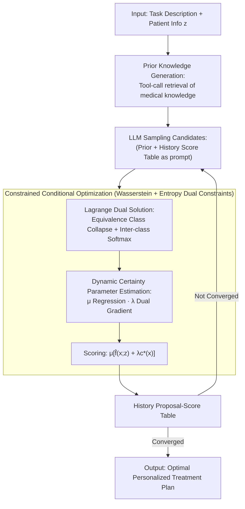

# Knowledgeable Language Models as Black-Box Optimizers for Personalized Medicine

**Conference**: ICLR 2026  
**arXiv**: [2509.20975](https://arxiv.org/abs/2509.20975)  
**Code**: [Code](https://code.roche.com/braid/projects/leon)  
**Area**: Medical Imaging/Personalized Medicine  
**Keywords**: Large Language Model Optimization, Personalized Medicine, Black-Box Optimization, Distribution Shift, Prior Knowledge

## TL;DR

This paper proposes LEON (LLM-based Entropy-guided Optimization with kNowledgeable priors), a mathematically rigorous method that models personalized medical treatment design as a conditional black-box optimization problem. It guides an LLM to serve as a zero-shot optimizer for personalized treatment plans without fine-tuning, utilizing entropy constraints and an adversarial source critic model.

## Background & Motivation

- **Background**: Personalized medicine aims to discover optimal treatment plans based on a patient's genetic and environmental factors. Recently, LLMs have demonstrated potential in black-box optimization within domains such as mathematics and code generation.
- **Limitations of Prior Work**: (1) Evaluating the effects of real-world treatments is extremely costly, necessitates the use of proxy models (digital twins, ML models) for quality assessment; (2) Proxy models are inaccurate under distribution shift (e.g., when facing patients from new hospitals), leading to "spurious" solutions that appear effective but perform poorly in reality; (3) Specific demographic groups are systematically underrepresented in clinical research.
- **Key Challenge**: Simply substituting the true objective $f$ with a proxy model $\hat{f}$ for optimization leads to poor practical outcomes due to out-of-distribution bias. Improving proxy models is further constrained by data availability and privacy concerns.
- **Goal**: To design personalized treatment plans for patients under distribution shift when proxy models are unreliable and the true objective function is inaccessible.
- **Key Insight**: Leverage internalized domain prior knowledge (medical textbooks, knowledge graphs) within LLMs as supplementary signals. Use constrained optimization to simultaneously control the extent of proxy model extrapolation and the certainty of LLM proposals.
- **Core Idea**: Regularize LLM-driven conditional black-box optimization using two constraints (a Wasserstein distance constraint to limit distribution shift and an entropy constraint to enhance LLM certainty). This utilizes prior knowledge to improve the quality of the LLM as a stochastic treatment recommendation engine.

## Method

### Overall Architecture

LEON addresses the dilemma where real treatment effects cannot be directly evaluated, requiring reliance on a proxy model $\hat{f}$ that is unreliable under distribution shift, while the inherent stochasticity of LLMs results in diverse proposals of varying quality. LEON's approach transforms "how much to trust the proxy model" and "how much to trust the LLM" into adjustable parameters within an iterative optimization loop—without modifying LLM weights, relying purely on prompting to guide optimization toward regions that are both in-distribution and certain for the LLM.

Each iteration consists of four steps: First, the LLM retrieves **prior knowledge** (via external sources such as medical textbooks and knowledge graphs). This is combined with the task description, patient information $z$, and a "history proposal-score table" as a prompt to **sample** a batch of candidate treatments. Next, these proposals are **clustered into equivalence classes**. Then, two **certainty parameters are estimated** from the current batch—LLM certainty $\mu$ and source critic certainty $\lambda$. Finally, a scoring formula $\mu[\hat{f}(x;z) + \lambda c^*(x)]$ is used to evaluate each proposal. These scores and proposals are stored in the history table for the next iteration until convergence, at which point the optimal plan is output.

### Key Designs

**1. Knowledgeable Prior Generation: Injecting external medical knowledge to stabilize LLM sampling**

LLMs relying solely on next-token statistical sampling tend to produce low-certainty proposals. LEON enables the LLM to act as a tool-calling agent to autonomously select relevant information from external sources—such as medical textbook corpora, MedGemma 27B, HetioNet/PrimeKG, Cellosaurus, COSMIC, GDSC, and DepMap. This retrieved content is synthesized into natural language prior statements, filling proxy model blind spots in OOD regions and increasing LLM certainty, which subsequently amplifies the rewards for high-quality proposals through the certainty parameter $\mu$.

**2. Constrained Conditional Optimization: Managing proxy extrapolation and LLM stochasticity**

With the priors established, a naive approach would maximize the proxy model $\hat{f}$ directly. However, this is prone to over-optimistic OOD predictions. LEON formulates the problem as conditional black-box optimization with two constraints:

$$\arg\max_{q(x)} \mathbb{E}_{x \sim q(x)}[\hat{f}(x;z)] \quad \text{s.t.} \quad W_1(p_{\text{src}}, q) \leq W_0, \quad \mathcal{H}_\sim(q(x)) \leq H_0$$

The first constraint uses the 1-Wasserstein distance to keep the proposal distribution $q$ within a distance $W_0$ of the historical distribution $p_{\text{src}}$ via an adversarial source critic model $c^*$, which penalizes designs in extrapolation zones. The second constraint uses $\sim$-coarse-grained entropy $\mathcal{H}_\sim(q(x)) = -\sum_i \bar{q}_i \log \bar{q}_i$ (where $\bar{q}_i$ is the occupancy of the $i$-th equivalence class) to limit proposal dispersion, forcing the LLM to converge on certain designs.

**3. Lagrange Dual Solution: Deriving a closed-form sampling rule**

The constrained optimization is simplified into computable sampling rules via Lagrange duality. Lemma 4.2 (Intra-class Collapse) shows the optimal distribution $q^*$ should concentrate on the highest-scoring design within each equivalence class: $x_i^* = \arg\max_{x \in [x]_i} (\hat{f}(x;z) + \lambda c^*(x))$. Lemma 4.3 (Probability Sampling) defines the inter-class probability distribution as $\bar{q}_i \propto \exp[\mu(\hat{f}(x_i^*;z) + \lambda c^*(x_i^*))]$, a softmax where temperature is controlled by $\mu$.

**4. Dynamic Estimation of Certainty Parameters: Adaptive $\mu$ and $\lambda$**

LEON estimates these parameters per iteration from data. LLM certainty $\mu$ is estimated by performing linear regression on the occupancy rates $\hat{q}_i$ against the scores; a low $\mu$ signifies high entropy (disagreement) in the LLM, reducing reliance on its proposals. The source critic parameter $\lambda$ is updated via dual gradient descent: $\lambda_{t+1} = \lambda_t - \eta_\lambda [W_0 - W_1(\text{estimated})]$, tightening the extrapolation penalty when proposals drift too far from the source distribution.

### Loss & Training

LEON does not involve training the LLM. The only component requiring training is the source critic model $c^*$, which is learned via Wasserstein duality. Lipschitz constraints are enforced through weight clipping.

## Key Experimental Results

### Main Results

Evaluated on 5 real-world personalized medicine optimization tasks under distribution shift (100 test patients):

| Method | Warfarin RMSE↓ | HIV Viral Load↓ | Breast TTNTD↑ | Lung TTNTD↑ | ADR NLL↓ | Avg Rank |
|---|---|---|---|---|---|---|
| Human (Actual Treatment) | 2.68 | 4.55 | 29.65 | 21.10 | - | 8.5 |
| Gradient Ascent | 1.37 | 4.52 | 65.23 | 24.09 | 23.7 | 5.2 |
| BO-qEI | 1.36 | 4.53 | 67.05 | 27.97 | 23.2 | 3.4 |
| OPRO | 1.40 | 4.55 | 55.68 | 24.35 | 23.8 | 7.0 |
| Eureka | 1.54 | 4.58 | 63.48 | 25.10 | 21.3 | 6.8 |
| **LEON (Ours)** | **1.36** | **4.50** | **72.43** | **32.71** | **12.4** | **1.2** |

### Ablation Study

- **Removing Prior Knowledge**: Significant performance drop, indicating LEON's sensitivity to knowledge quality.
- **Removing Source Critic Constraint ($\lambda = 0$)**: Proxy model extrapolation leads to degraded ground-truth performance.
- **Removing Entropy Constraint ($\mu = 0$)**: LLM proposals become too dispersed, requiring more iterations to converge.
- **Varying LLMs**: gpt-4o-mini showed the best balance of performance and cost.

### Key Findings

1. LEON achieves an average rank of 1.2 across 5 tasks, significantly outperforming traditional optimization and other LLM-based methods.
2. The plans proposed by LEON **outperform actual treatments received by patients** (Human baseline), suggesting clinical value.
3. The synergy between Wasserstein and entropy constraints is critical; removing either degrades performance.
4. Prior knowledge is vital under distribution shift, helping the LLM bridge proxy model gaps in OOD regions.

## Highlights & Insights

1. **Mathematical Rigor vs. Practical Value**: The derivation from constrained optimization to Lagrange duality is robust, and the results across 5 real clinical tasks are compelling.
2. **Clever Parameter Design**: $\mu$ quantifies LLM "consensus," while $\lambda$ quantifies "in-distribution" validity. Their dynamic interplay balances exploration and exploitation.
3. **Zero-shot Optimization**: The LLM requires no fine-tuning; it exceeds specialized optimization algorithms through prompting and external knowledge.
4. **Privacy Preservation**: The source critic $c^*$ only requires treatment design data $\mathcal{D}_{\text{src}}$, preventing the exposure of patient-specific information.

## Limitations & Future Work

1. **Sensitivity to Prior Quality**: Incorrect or outdated domain knowledge could propagate to optimized outputs, necessitating knowledge verification mechanisms.
2. **Simulation Limitations**: While using real data, the evaluation relies on learned ground-truth functions $f$, which may not capture full patient heterogeneity.
3. **Equivalence Class Definition**: The use of k-means to define equivalence might be surpassed by other clustering or semantic mapping methods.
4. **Computational Cost**: Each patient requires 2048 proxy model queries and significant LLM API calls.
5. **Fairness**: Although demographic fairness is discussed in the appendix, potential social biases in LLMs regarding treatment recommendations require further validation.

## Related Work & Insights

- **LLM Optimization**: OPRO optimizes via prompting but lacks constraints; Eureka adds reflection but lacks distribution control.
- **Optimization under Distribution Shift**: Methods like conservative surrogate models (Trabucco et al., 2021) assume control over the surrogate, whereas LEON handles a black-box proxy.
- **Constraint-governed Design**: The Wasserstein constraint mirrors techniques in biological sequence design (Yao et al., 2024).
- **Insight**: The paradigm of LLMs as conditional optimizers is generalizable to other personalized decision domains (e.g., education, finance) where domain knowledge and confidence control are paramount.

## Rating

⭐⭐⭐⭐ (4/5)

- **Novelty**: ⭐⭐⭐⭐⭐ Integrates LLM optimization, distribution shift robustness, and prior knowledge into a rigorous framework.
- **Experiments**: ⭐⭐⭐⭐ Comprehensive evaluation using 5 clinical tasks and 10 baselines.
- **Writing**: ⭐⭐⭐⭐ Theoretical derivations are clear, though mathematically dense.
- **Value**: ⭐⭐⭐ High dependency on external knowledge sources and APIs may present deployment hurdles.

<!-- RELATED:START -->

<!-- Paper links would go here -->

<!-- RELATED:END -->

## Related Papers

- [\[ICLR 2026\] GALAX: Graph-Augmented Language Model for Explainable Reinforcement-Guided Subgraph Reasoning in Precision Medicine](galax_graph-augmented_language_model_for_explainable_reinforcement-guided_subgra.md)
- [\[ICLR 2026\] Can Large Language Models Match the Conclusions of Systematic Reviews?](can_large_language_models_match_the_conclusions_of_systematic_reviews.md)
- [\[ICLR 2026\] Cancer-Myth: Evaluating Large Language Models on Patient Questions with False Presuppositions](cancer-myth_evaluating_large_language_models_on_patient_questions_with_false_pre.md)
- [\[ICLR 2026\] CounselBench: A Large-Scale Expert Evaluation and Adversarial Benchmarking of Large Language Models in Mental Health Question Answering](counselbench_a_large-scale_expert_evaluation_and_adversarial_benchmarking_of_lar.md)
- [\[ACL 2026\] Beyond the Leaderboard: Rethinking Medical Benchmarks for Large Language Models](../../ACL2026/medical_nlp/beyond_the_leaderboard_rethinking_medical_benchmarks_for_large_language_models.md)

<!-- RELATED:END -->
