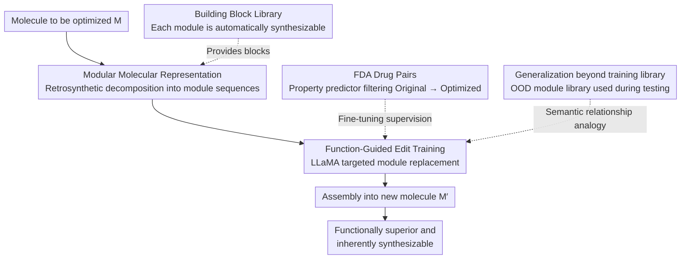

# mCLM: A Modular Chemical Language Model that Generates Functional and Makeable Molecules

**Conference**: ICLR 2026 Oral  
**arXiv**: [2505.12565](https://arxiv.org/abs/2505.12565)  
**Code**: Yes (provided in the paper)  
**Area**: Medicine / Molecule Generation  
**Keywords**: Chemical Language Model, Molecule Optimization, Automated Synthesis, Modular Design, Drug Discovery

## TL;DR
The paper proposes mCLM (Modular Chemical Language Model), which represents molecules as sequences of synthesizable building blocks. This allows LLMs to generate molecules that satisfy both pharmacological functions and automated synthesis feasibility, showing significant improvements in pharmacokinetic and toxicological properties across 430 FDA-approved drugs.

## Background & Motivation

**Background**: LLMs have demonstrated the capability to understand chemical knowledge, but they remain limited in generating functional small molecules—the generated molecules are often incompatible with automated synthesis methods.

**Limitations of Prior Work**: Existing molecule generation methods use atom-level or fragment-level representations (such as SMILES). Although the resulting molecules may meet pharmacological targets, they are nearly impossible to manufacture via automated synthesis workflows. This creates a massive gap between computational prediction and experimental validation.

**Key Challenge**: Molecular "function" (efficacy, toxicity, etc.) and "manufacturability" (known synthetic routes, available building blocks) are two independent optimization objectives. Traditional methods focus only on the former.

**Goal**: To enable LLMs to learn a new molecular language so that the molecules they generate possess both optimized chemical functions and guaranteed synthetic feasibility.

**Key Insight**: Represent molecules as combinatorial sequences from a predefined library of building blocks, where each block corresponds to a known chemical fragment compatible with automated synthesis.

**Core Idea**: Replace traditional SMILES with a modular molecular language, allowing the LLM to search for functionally optimal molecules within a constrained synthetic space.

## Method

### Overall Architecture
Instead of manipulating molecules at the atomic level, mCLM reads each molecule as a string of "building blocks"—an ordered sequence from a building block library compatible with automated synthesis pipelines. Given an initial molecule to be optimized, the model first decomposes it into a module sequence and then outputs a rewritten sequence of modules in a sequence-to-sequence (seq2seq) manner. When assembled, these modules form a new molecule that is functionally superior and inherently synthesizable. The entire process is completed by fine-tuning a LLaMA backbone on "original molecule → optimized molecule" paired data. During testing, the module library can be replaced with out-of-distribution (OOD) modules unseen during training to further expand the searchable chemical space.

### Key Designs

**1. Modular Molecular Representation: Embedding "Manufacturability" into the Representation Itself**

Traditional SMILES describe molecules at the atomic level, making it easy for generators to produce structures with excellent predicted efficacy that are impossible to synthesize automatically. mCLM bypasses this by using a module-level language: it first defines a building block library $\mathcal{B} = \{b_1, ..., b_N\}$, where each $b_i$ is a known synthesizable chemical fragment. Any molecule $M$ is represented as a connected sequence of modules $M = b_{i_1} \oplus b_{i_2} \oplus \cdots \oplus b_{i_k}$, where $\oplus$ denotes a chemical bond connection, and the decomposition is determined via retrosynthetic analysis. Consequently, synthetic feasibility is no longer a post-hoc check but an intrinsic property of the representation—as long as each module is synthesizable and the connection rules are valid, the resulting molecule is guaranteed to be makeable.

**2. Function-Guided Edit Training: From "Generation from Scratch" to "Targeted Rewriting"**

Generating a molecule that is both functional and reasonable from scratch is difficult. mCLM instead learns a more controllable action: replacing specific modules to improve pharmacological properties while preserving the original molecular scaffold. Training data is constructed by decomposing 430 FDA-approved drugs into module sequences and using a property predictor to score various substitution schemes. Substitutions that maintain scaffold similarity but show objective improvement in target metrics (e.g., lower AMES toxicity, higher BBBP permeability, higher HIA absorption) are selected as positive samples to form "original → optimized" pairs. The model learns "where to change and what to swap in" to push properties in a positive direction without discarding the validated parts of the original molecule.

**3. Generalization Beyond the Training Module Library: Expanding Synthetic Space at Test Time**

A fixed module library limits the searchable chemical space and practical utility. During testing, mCLM replaces the module library with an out-of-distribution (OOD) set of blocks never seen during training. This is possible because the model learns semantic relationships (chemical similarities) between modules rather than memorizing individual blocks. When encountering a new module, the model can infer its correct placement in a sequence based on its similarity to known modules. The paper validates this using 122 OOD drugs and only modules compatible with automated synthesis, proving that semantic-relationship-based generalization holds.

### Loss & Training
The training objective is standard seq2seq cross-entropy, fine-tuned on a LLaMA backbone. The focus is on the data rather than the loss function—all "original → optimized" pairs are filtered by pharmacological property predictors to ensure the supervision signal points toward genuine property improvement.

## Key Experimental Results

### Main Results
Molecular optimization was performed on 430 FDA-approved drugs, evaluating six pharmacokinetic/toxicity metrics: AMES mutagenicity (↓), BBBP blood-brain barrier permeability (↑), CYP3A4 metabolic inhibition (↓), DILI hepatotoxicity (↓), HIA intestinal absorption (↑), and PGP efflux (↓). mCLM achieved improvements across all six metrics compared to the original drugs and significantly outperformed text-molecule editing baselines such as MoleculeSTM.

| Comparison | Conclusion |
|------|------|
| mCLM vs. Original FDA Drugs | Improvement across all 6 pharmacokinetic/toxicity metrics |
| mCLM vs. Baselines (e.g., MoleculeSTM) | Significant lead while ensuring synthesizability |

### Ablation Study

| Configuration | Observation | Explanation |
|------|------|------|
| Full mCLM | Best performance | Modular representation + Function-guided editing |
| OOD Module Library (122 drugs) | Still effective | Uses unseen synthesizable modules, verifying semantic generalization |
| SMILES Baseline | Synthesis not guaranteed | Functions might be superior but difficult to manufacture |
| No Function Guidance (Random swap) | No directional improvement | Shows that predictor-filtered supervision is critical |

### Key Findings
- mCLM improved all six pharmacokinetic/toxicological metrics across 430 FDA drugs, proving that module-level editing can directionally optimize properties.
- The model remained effective on 122 OOD drugs using only unseen, synthesizable modules, providing direct evidence that it learns semantic relationships between modules rather than simple memorization.
- The modular representation ensures that synthetic paths are automatically available with the generation results, bridging the gap between computational prediction and experimental manufacturing within the representation itself.

## Highlights & Insights
- **Synthetic feasibility as a hard constraint**: Transforms manufacturability from a "post-hoc check" into an "architectural guarantee," addressing a critical practical need in drug discovery pipelines.
- **Modular language turns chemical search into token sequence optimization**: Converts searching in continuous chemical space into editing discrete module sequences, making it naturally compatible with LLMs.

## Limitations & Future Work
- The coverage of the module library limits the reachable chemical space.
- The accuracy of property predictors directly impacts training data quality.
- Only pharmacokinetics/toxicity were optimized; drug efficacy (e.g., binding affinity) was not addressed.
- The actual execution success rate of synthetic paths has not been experimentally verified.

## Related Work & Insights
- **vs MoleculeSTM**: Traditional text-molecule methods operate in SMILES space and do not guarantee synthetic feasibility.
- **vs RetroGPT**: Retrosynthetic planning focuses on "how to synthesize a given molecule," whereas mCLM focuses on "finding the optimal molecule within a synthesizable space," making them complementary.

## Rating
- Novelty: ⭐⭐⭐⭐ The combination of modular molecular representation and LLMs is highly innovative.
- Experimental Thoroughness: ⭐⭐⭐ Comprehensive multi-property evaluation, though lacks physical experimental validation.
- Writing Quality: ⭐⭐⭐⭐ Interdisciplinary but clearly explained.
- Value: ⭐⭐⭐⭐⭐ Direct practical utility for AI-aided drug discovery.

<!-- RELATED:START -->

## Related Papers

- [\[ICLR 2026\] GALAX: Graph-Augmented Language Model for Explainable Reinforcement-Guided Subgraph Reasoning in Precision Medicine](galax_graph-augmented_language_model_for_explainable_reinforcement-guided_subgra.md)
- [\[ACL 2025\] A Modular Approach for Clinical SLMs Driven by Synthetic Data with Pre-Instruction Tuning, Model Merging, and Clinical-Tasks Alignment](../../ACL2025/medical_nlp/a_modular_approach_for_clinical_slms_driven_by_synthetic_data_with_pre-instructi.md)
- [\[ACL 2026\] CURA: Clinical Uncertainty Risk Alignment for Language Model-Based Risk Prediction](../../ACL2026/medical_nlp/cura_clinical_uncertainty_risk_alignment_for_language_model-based_risk_predictio.md)
- [\[ICLR 2026\] HistoPrism: Unlocking Functional Pathway Analysis from Pan-Cancer Histology via Gene Expression Prediction](histoprism_unlocking_functional_pathway_analysis_from_pan-cancer_histology_via_g.md)
- [\[NeurIPS 2025\] CGBench: Benchmarking Language Model Scientific Reasoning for Clinical Genetics Research](../../NeurIPS2025/medical_nlp/cgbench_benchmarking_language_model_scientific_reasoning_for_clinical_genetics_r.md)

<!-- RELATED:END -->
