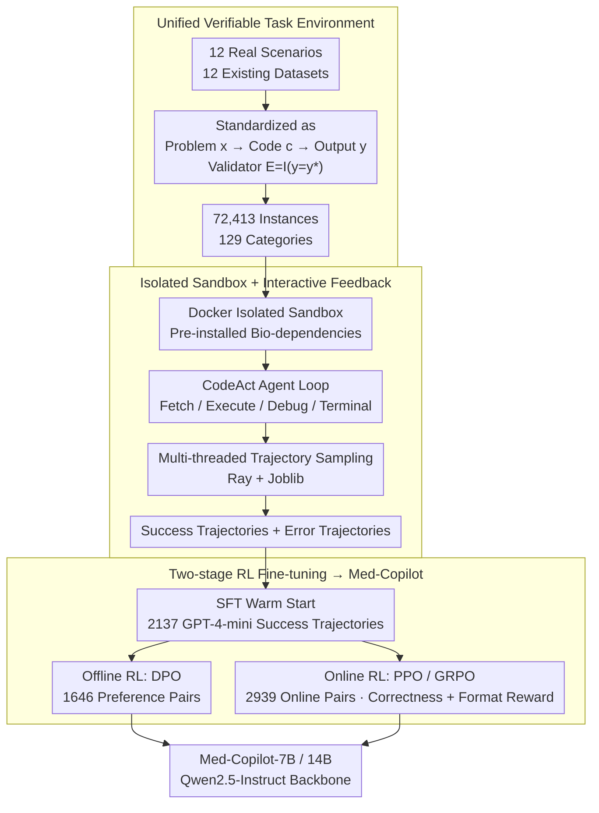

# MedAgentGym: A Scalable Agentic Training Environment for Code-Centric Reasoning in Biomedical Data Science

**Conference**: ICLR 2026 Oral  
**arXiv**: [2506.04405](https://arxiv.org/abs/2506.04405)  
**Code**: Yes  
**Area**: Medical NLP  
**Keywords**: biomedical data science, agentic training, code-centric reasoning, reinforcement-learning, Med-Copilot, LLM agent

## TL;DR
The authors constructed MedAgentGym, the first unified Agent training environment for biomedical data science. It comprises 72,413 task instances covering 12 real-world scenarios across 129 categories, equipped with executable sandboxes and verifiable ground truth. A systematic benchmark evaluation of 29 LLMs revealed a gap between commercial and open-source models. By employing efficient multi-threaded trajectory sampling and offline/online RL, they trained Med-Copilot, achieving +43.02%/+45.28% improvements and reaching performance competitive with GPT-4o.

## Background & Motivation
**Background**: Biomedical data science spans multiple subfields such as genomic analysis, clinical data processing, medical image analysis, and drug discovery. Each task requires complex programming and domain reasoning capabilities. While LLMs have demonstrated potential as coding assistants in general programming, systematic evaluation and training infrastructure specifically for biomedical coding tasks are lacking.

**Limitations of Prior Work**: (1) Existing medical AI benchmarks (e.g., MedQA, PubMedQA) are static multiple-choice or QA evaluations that do not support interactive code execution and iterative debugging. (2) There is no unified platform covering diverse biomedical data science scenarios (genomics, clinical, imaging, and drugs are currently independent benchmarks). (3) A significant gap exists between open-source LLMs and closed-source models (like GPT-4o) on biomedical coding tasks, necessitating effective training methods to bridge this gap.

**Key Challenge**: Training an Agent capable of writing biomedical analysis code requires a large-scale interactive environment, but constructing such an environment is extremely costly (requiring real data, ground truth, secure sandboxes, and feedback mechanisms).

**Goal**: To simultaneously address environment construction and Agent training by providing a large-scale training environment and an RL training pipeline.

**Key Insight**: Unify 12 real-world biomedical scenarios into a standardized format of "input data + task description → execute code → verify output," supporting interactive feedback and automated scoring.

**Core Idea**: A large-scale interactive unified training environment + RL training pipeline = narrowing the performance gap between open-source and closed-source LLMs in biomedical coding.

## Method

### Overall Architecture
MedAgentGym fills the infrastructure void where biomedical data science Agents lacked a trainable environment. Previously, genomics, clinical, imaging, and drug domains had independent static QA benchmarks that could neither run code nor be used for Agent training. This work integrates these components into three steps: first, unifying existing datasets from 12 real scenarios into executable tasks (72,413 instances, 129 categories) of "Question → Write Code → Execution → Verify against Gold Standard"; second, wrapping each task in a Docker-isolated sandbox, allowing Agents to iteratively code and debug using CodeAct-style cycles while sampling success and error trajectories in parallel; finally, performing two-stage Reinforcement Learning fine-tuning on these verifiable trajectories to train the open-source Qwen2.5-7B/14B models into Med-Copilot, capable of competing with commercial models.

### Key Designs

**1. Unified Verifiable Task Environment: Consolidating Fragmented Biomedical Benchmarks**

This corresponds to the first step of the framework. The pain point is that genomics, clinical, imaging, and drug domains have separate benchmarks, mostly static MCQs/QA. MedAgentGym unifies existing datasets from 12 scenarios (MIMIC-III, eICU, TREQS, MedCalcBench, MedAgentBench, BioCoder, EHRSHOT, BioDSBench, plus 4 OOD datasets) into a single format: given a problem description $x$, the Agent generates code $c$ to produce output $y$, which is then checked by a validator $E(c, y) = \mathbb{I}(y = y^*)$ against the gold standard $y^*$. For tasks only providing reference code (e.g., BioCoder), the **execution output** of the reference code is used as the gold standard—since multiple equivalent ways to write code exist, "execution results" are more stable than "code strings."

**2. Isolated Sandbox + Interactive Feedback: Enabling Human-like Debugging**

This corresponds to the second step. Biomedical analysis code rarely runs correctly on the first try. MedAgentGym provides a Docker sandbox for each task (pre-installed with pandas, scikit-learn, biopython, etc.) and uses a CodeAct-style POMDP scaffold. The Agent loops through four actions: `request_info`, `terminal` (package management/file ops), `code_execution`, and `debugging` (translating errors into natural language). Feedback is standardized in JSON, and errors are grounded into natural language. Trajectories are recorded as $\tau = [(o_1, a_1), \dots, (o_n, a_n)]$, capturing both success trajectories $\{c^{(i)} \mid y^{(i)} = y^*\}$ and failed trajectories with errors $\{c^{(i)} \mid y^{(i)} \neq y^*\}$.

**3. Two-stage RL for Med-Copilot: Pushing Small Open-Models via Verifiable Rewards**

Using Qwen2.5-7B/14B-Instruct as backbones, the process involves "SFT warm start followed by RL refinement." Warm starting uses 2,137 success trajectories from GPT-4-mini to teach the basic code-debug paradigm. This is followed by two RL paths: **Offline RL** uses 1,646 preference pairs for DPO (success code vs. intermediate error attempts); **Online RL** allows the Agent to interact with the sandbox using 2,939 pairs for PPO/GRPO. The reward consists of a correctness reward $r = \mathbb{I}(y = y^*)$ and a format reward. Additionally, a Qwen2.5-7B Outcome Reward Model (ORM, $r = \frac{e^{l_y}}{e^{l_y} + e^{l_n}}$) was trained to pick trajectories during inference.

### Loss & Training
- Backbone Models: Qwen2.5-7B-Instruct and -14B-Instruct (yielding Med-Copilot-7B / -14B) with unified CodeAct scaffold.
- Warm Start: SFT on 2,137 GPT-4-mini success trajectories.
- Offline RL: DPO on 1,646 pairs; Online RL: PPO / GRPO on 2,939 pairs.
- Reward: Correctness reward + Format reward.
- Open Resource: ~6K training trajectories + Outcome Reward Model (ORM).

## Key Experimental Results

### Main Results: Zero-shot Benchmark of 29 LLMs (Average Score, Max 100)

| Model Category | Representative Model | Average Score |
| :--- | :--- | :--- |
| Closed-source | gpt-4.1 (2025-04) | 70.15 (SOTA) |
| Closed-source | gpt-o4-mini | 65.67 |
| Closed-source | gpt-4o | 48.75 |
| Open-source Base | Qwen2.5-7B-Instruct (Baseline) | 16.89 |
| Med-Copilot-7B | Qwen2.5-7B + Online RL (GRPO) | 62.17 (+45.28) |
| Med-Copilot-14B | Qwen2.5-14B + Online RL (GRPO) | 71.42 (+51.30, matching gpt-4.1) |

### Ablation Study: Post-training Methods for Med-Copilot-7B

| Configuration | Average Score | Gain |
| :--- | :--- | :--- |
| Base (Qwen2.5-7B-Instruct) | 16.89 | – |
| +SFT | 53.87 | +36.98 |
| +DPO (Offline RL) | 59.90 | +43.02 |
| +PPO (Online RL) | 57.96 | +41.07 |
| +GRPO (Online RL) | 62.17 | +45.28 |

### Key Findings
- A significant gap exists between commercial and open-source LLMs on biomedical coding, but two-stage RL narrows it: the 7B model jumped from 16.89 to 62.17 via GRPO, surpassing gpt-4o (48.75).
- Online RL (GRPO +45.28) slightly outperformed offline RL (DPO +43.02), both significantly exceeding the SFT baseline (+36.98). The 14B model matched the strongest gpt-4.1.
- Multi-turn interaction (debugging loop) is vital; single-pass success rates are much lower than iterative success rates.
- Difficulty varies across scenarios: structured tasks (queries, calculations) are simpler, while open-ended tasks (data analysis, ML modeling) are harder.

## Highlights & Insights
- **Training + Evaluation Integration**: MedAgentGym is not just a benchmark for 29 LLMs but a ready-to-use RL training environment—a first in the medical AI field.
- **Evidence for Bridging the Gap**: Proving that 8B parameter open-source models can reach GPT-4o levels via RL training is highly valuable for privacy-sensitive medical settings (local deployment vs. API).
- **Scalable Design**: 72K tasks + multi-threaded sampling + standardized interfaces provide a truly extensible infrastructure.
- **Code-Centric Approach**: Unlike MCQ benchmarks like MedQA, MedAgentGym requires writing real analysis code, which is closer to actual scientific research.

## Limitations & Future Work
- The tasks are code-centric; evaluation of knowledge-intensive clinical reasoning or diagnostic decision-making is insufficient.
- Ground truth requires predefined standard answers, making it less suitable for open-ended exploratory research.
- Med-Copilot was only trained on 7B/14B models; scaling results for larger models (70B+) were not reported.
- Scoring is based on exact match or numerical error; soft metrics like code quality, readability, or efficiency were not evaluated.
- Generalization to out-of-distribution training tasks was not fully assessed.

## Related Work & Insights
- **vs. MedQA/PubMedQA**: Those are static QA benchmarks; MedAgentGym supports code execution and interactive feedback.
- **vs. SWE-bench**: SWE-bench focuses on software engineering (fixing bugs), whereas MedAgentGym focuses on biomedical data analysis.
- **vs. AgentBench**: AgentBench covers general tasks; MedAgentGym provides deep biomedical scenario coverage.
- **vs. AIME**: AIME evaluates medical reasoning, while MedAgentGym evaluates medical programming practice.

## Rating
- Novelty: ⭐⭐⭐⭐ First unified biomedical Agent training environment; the problem definition is valuable, though the RL methods are established.
- Experimental Thoroughness: ⭐⭐⭐⭐⭐ 72K tasks + 29 LLM evaluation + offline/online RL comparisons + Med-Copilot validation.
- Writing Quality: ⭐⭐⭐⭐ Clear system descriptions and well-organized experimental analysis.
- Value: ⭐⭐⭐⭐⭐ Provides critical infrastructure for biomedical AI Agent research with long-term community value.

<!-- RELATED:START -->

## Related Papers

- [\[ACL 2026\] Ryze: Evidence-Enriched Data Synthesis from Biomedical Papers](../../ACL2026/medical_nlp/ryze_evidence-enriched_data_synthesis_from_biomedical_papers.md)
- [\[CVPR 2026\] Towards Efficient Medical Reasoning with Minimal Fine-Tuning Data](../../CVPR2026/medical_nlp/towards_efficient_medical_reasoning_with_minimal_fine-tuning_data.md)
- [\[NeurIPS 2025\] CureAgent: A Training-Free Executor-Analyst Framework for Clinical Reasoning](../../NeurIPS2025/medical_nlp/cureagent_a_training-free_executor-analyst_framework_for_clinical_reasoning.md)
- [\[ICLR 2026\] Doctor-R1: Mastering Clinical Inquiry with Experiential Agentic Reinforcement Learning](doctor-r1_mastering_clinical_inquiry_with_experiential_agentic_reinforcement_lea.md)
- [\[ACL 2026\] Eliciting Medical Reasoning with Knowledge-enhanced Data Synthesis: A Semi-Supervised Reinforcement Learning Approach](../../ACL2026/medical_nlp/eliciting_medical_reasoning_with_knowledge-enhanced_data_synthesis_a_semi-superv.md)

<!-- RELATED:END -->
