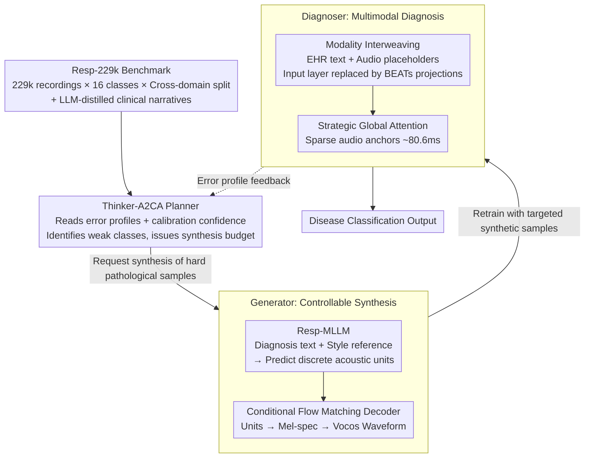

# Resp-Agent: An Agent-Based System for Multimodal Respiratory Sound Generation and Disease Diagnosis

**Conference**: ICLR2026  
**arXiv**: [2602.15909](https://arxiv.org/abs/2602.15909)  
**Code**: [github.com/zpforlove/Resp-Agent](https://github.com/zpforlove/Resp-Agent)  
**Area**: Medical Imaging  
**Keywords**: Respiratory sound analysis, multimodal fusion, controllable audio generation, active adversarial curriculum learning, flow matching, data augmentation

## TL;DR

Ours proposes the Resp-Agent closed-loop multi-agent framework, which coordinates a controllable respiratory sound generator and a multimodal diagnoser via an active adversarial curriculum planner (Thinker-A2CA). It achieves generation↔diagnosis co-design on a 229k-scale benchmark, significantly improving diagnostic performance for long-tail categories.

## Background & Motivation

1. **Unimodal representation bottleneck**: Existing methods convert respiratory sounds into Mel-spectrograms for CNN processing, which loses phase information and transient events (e.g., crackles), failing to capture millisecond-level clinical acoustic features.
2. **Lack of large-scale multimodal datasets**: Public respiratory sound datasets are small-scale, cover few diseases, and lack systematic text-audio pair supervision, severely restricting the development of multimodal models.
3. **Decoupling of analysis and generation**: Existing research focuses on diagnostic tasks like classification/detection, while generative modeling remains largely unexplored, preventing the use of synthetic data to alleviate class imbalance and data scarcity.
4. **Insufficient shallow fusion**: Even with auxiliary metadata (demographics, symptoms), existing methods use basic fusion techniques (e.g., concatenation followed by full attention), failing to achieve deep cross-modal interaction.
5. **Lack of targeted data augmentation**: Traditional augmentation strategies (e.g., SpecAugment) are unconditional/unstructured general perturbations that cannot precisely generate adversarial samples for model failure modes.
6. **Weak cross-domain generalization**: Most systems are only tested on in-distribution data and lack rigorous evaluation protocols across institutions and devices, limiting clinical deployability.

## Method

### Overall Architecture

Resp-Agent integrates "analysis" and "generation" into a closed-loop multi-agent system, operating on the self-constructed Resp-229k large-scale benchmark. The foundation prepares paired text-audio supervision and strict cross-domain splits; above this, the central Thinker-A2CA planner reads the error profiles of the diagnoser to request the generator to synthesize the most difficult samples, which are then used to retrain the diagnoser. This forms an active loop of "diagnosing weaknesses → targeted synthesis → retraining." The three agents perform distinct roles—the planner decides "what to supplement," the generator handles "controllable sample creation," and the diagnoser performs "multimodal interpretation"—and their collaborative results drive the next round of error profiling.

### Key Designs

**1. Resp-229k: Large-scale Cross-domain Benchmark Supporting the Closed Loop**

For the closed-loop to function, large-scale, diverse data with text supervision is required. Five public repositories (UK COVID-19, ICBHI, SPRSound, COUGHVID, KAUH) were aggregated into 229,101 recordings (408 hours) across 16 diagnostic categories. Each recording is paired with a standardized clinical narrative distilled via DeepSeek-R1-Distill-Qwen-7B, providing text-audio supervision. A strict cross-domain split ensures training/validation use ICBHI, SPRSound, and UK COVID-19, while testing is reserved purely for COUGHVID and KAUH to evaluate performance under distribution shifts.

**2. Thinker-A2CA: Transforming Data Augmentation into Targeted Curriculum**

The Resp-Agent utilizes a Large Language Model (DeepSeek-V3.2-Exp) as a central controller. It parses current diagnostic objectives, reuses error profiles and calibrated confidence from the diagnoser to locate weak categories, and instructs the generator with deterministic I/O to "synthesize hard samples for this category." This upgrades passive data expansion to an active adversarial curriculum, where 10k synthetic samples achieve approximately 52% of the total gain, far exceeding random or class-prior rebalancing.

**3. Generator: Discrete Unit Planning followed by Flow Matching Reconstruction**

To ensure pathological and stylistic controllability, generation is split into two steps. First, Resp-MLLM (based on Qwen3-0.6B-Base) converts a text LLM into a multimodal unit generator. It extracts frame-level features $Z\in\mathbb{R}^{T\times D}$ from reference audio via BEATs, compresses them into $K$ style descriptors, and projects them into the LLM latent space $E^{style}$. The LLM then autoregressively predicts discrete acoustic units from the BEATs codebook. Second, a Conditional Flow Matching (CFM) decoder reconstructs the units into Mel-spectrograms by learning a velocity field $v_\theta$ along a linear path $x_t=(1-t)x_0+tx_1$. The waveform is finally restored via a Vocos vocoder.

**4. Diagnoser: Modality Interweaving + Sparse Global Anchors for Transient Events**

Clinical events like crackles are millisecond-scale. The diagnoser uses two strategies: 1) Input-level modality interweaving, where EHR clinical text tokens and 496 audio placeholders are sequenced, directly replacing placeholders with BEATs projections $E_{[A]}=\mathrm{Align}(\Phi_{\text{BEATs}}(x))W$ in the embedding layer. 2) Strategic Global Attention, which places three types of global tokens (classification head [CLS], EHR sentinel [DESCRIPTION], and sparse audio anchors at step $s=4$). Anchors spaced at $\approx 80.6$ms allow the text to query transient acoustic events across long distances with linear time complexity.

### Mechanism

Taking a tail category (e.g., a rare wheeze-type respiratory sound) as an example: The diagnoser frequently misclassifies this class on the validation set. The error profile shows low confidence and frequent confusion with neighboring classes. Thinker-A2CA reads this signal and requests the generator to "synthesize N samples of this pathology." The Resp-MLLM predicts units based on the pathology text and style reference, which the CFM decoder restores into waveforms with correct transient features. After retraining with these targeted samples, the diagnoser effectively "sees" the millisecond wheezing events, improving the Macro-F1_tail in the next cycle.

## Key Experimental Results

### Table 1: Respiratory Sound Classification Performance on ICBHI Official 60-40 Split

| Method | Backbone | Sp (%) | Se (%) | Score (%) |
|---|---|---|---|---|
| Dong et al. (2025) | AST | 85.99 | 49.11 | 67.55 |
| MVST (He et al., 2024) | AST | 81.99 | 51.10 | 66.55 |
| BTS (Kim et al., 2024c) | CLAP | 81.40 | 45.67 | 63.54 |
| **Resp-Agent [Ours]** | **LLM+Longformer** | **79.29** | **66.10** | **72.70** |

Resp-Agent exceeds the Prev. SOTA by over 5 absolute points in Score, with Sensitivity (Se) reaching 66.1%, significantly higher than other methods (max 51.1%).

### Table 2: Diagnostic Performance of Different Planning Strategies on Test-CD (Budget B=50k)

| Planning Strategy | Acc | Macro-F1 | Macro-F1_tail |
|---|---|---|---|
| No Synthesis (CE Baseline) | 0.849 | 0.212 | 0.074 |
| Random Sampling | 0.869 | 0.442 | 0.291 |
| Class Prior Rebalancing | 0.876 | 0.512 | 0.349 |
| Static Uncertainty Sampling | 0.881 | 0.546 | 0.376 |
| **Thinker-A2CA** | **0.887** | **0.598** | **0.421** |

Thinker-A2CA is optimal across all metrics, increasing Macro-F1 from 0.212 to 0.598 (+182%) and Macro-F1_tail by 469%.

### Key Findings: Decoupling Verification
In style swap experiments, fixing pathology labels while changing style references resulted in Style-Sim=0.91 and Pathology-Acc=97.9% (FAD=1.18), proving the generator independently controls acoustic style without altering disease semantics.

## Highlights & Insights

1. **Closed-loop co-design**: First to unify respiratory sound analysis and generation in a multi-agent framework, achieving an active learning loop.
2. **Resp-MLLM**: The first multimodal LLM for respiratory sounds trained under aligned text-audio supervision, enabling controllable decoupling of pathology and style.
3. **Strategic audio anchors**: Sparse global attention anchors at ~80ms intervals enable long-range routing from text to transient acoustic events within linear complexity.
4. **Resp-229k Benchmark**: Fills the gap for large-scale multimodal benchmarks in the respiratory sound field with cross-domain splits and LLM-distilled narratives.
5. **High sample efficiency**: Thinker-A2CA achieves ~52% of total gain with only 10k synthetic samples.

## Limitations & Future Work

1. **Controller dependency on closed-source LLM**: The use of DeepSeek-V3.2-Exp as a planner introduces high deployment costs and reproducibility challenges.
2. **Generation quality ceiling**: CFM decoding is based on Mel-spectrograms, which may not precisely reconstruct extremely fine-grained acoustic transients.
3. **Text supervision via LLM distillation**: Narratives are generated rather than real EHR data, potentially introducing systematic bias or hallucination risks.
4. **16-class system limitations**: Real clinical scenarios involve multi-morbidity, which the current single-label framework does not handle.
5. **Non-medical certification**: Explicitly stated as not for clinical decision-making; requires regulatory approval for deployment.

## Related Work & Insights

- **vs. OPERA/RespLLM**: OPERA is unimodal. RespLLM uses dense concatenations with high computation costs. Resp-Agent’s Modality Interweaving + Sparse Anchors achieves deeper interaction at sub-quadratic complexity.
- **vs. SpecAugment/Unconditional Generation**: Resp-Agent transforms augmentation into a precise curriculum tool by identifying failure modes via the Thinker agent.
- **vs. AudioLM/SoundStorm**: General models lack clinical controllability. Resp-MLLM’s dual-condition design for pathology and style is specifically optimized for medical audio.

## Rating

- Novelty: ⭐⭐⭐⭐⭐ 
- Experimental Thoroughness: ⭐⭐⭐⭐⭐ 
- Writing Quality: ⭐⭐⭐⭐ 
- Value: ⭐⭐⭐⭐⭐ 

<!-- RELATED:START -->

## Related Papers

- [\[ACL 2026\] MARCH: Multi-Agent Radiology Clinical Hierarchy for CT Report Generation](../../ACL2026/medical_nlp/march_multi-agent_radiology_clinical_hierarchy_for_ct_report_generation.md)
- [\[ACL 2026\] SEMA-RAG: A Self-Evolving Multi-Agent Retrieval-Augmented Generation Framework for Medical Reasoning](../../ACL2026/medical_nlp/sema-rag_a_self-evolving_multi-agent_retrieval-augmented_generation_framework_fo.md)
- [\[ACL 2025\] LLMs Can Simulate Standardized Patients via Agent Coevolution](../../ACL2025/medical_nlp/evopatient_standardized_patient.md)
- [\[ICML 2025\] Agent WARPP: Workflow Adherence via Runtime Parallel Personalization](../../ICML2025/medical_nlp/agent_warpp_workflow_adherence_via_runtime_parallel_personalization.md)
- [\[ACL 2026\] RA-RRG: Multimodal Retrieval-Augmented Radiology Report Generation with Key Phrase Extraction](../../ACL2026/medical_nlp/ra-rrg_multimodal_retrieval-augmented_radiology_report_generation_with_key_phras.md)

<!-- RELATED:END -->
## Related Papers

- [\[ACL 2026\] MARCH: Multi-Agent Radiology Clinical Hierarchy for CT Report Generation](../../ACL2026/medical_nlp/march_multi-agent_radiology_clinical_hierarchy_for_ct_report_generation.md)
- [\[ACL 2026\] SEMA-RAG: A Self-Evolving Multi-Agent Retrieval-Augmented Generation Framework for Medical Reasoning](../../ACL2026/medical_nlp/sema-rag_a_self-evolving_multi-agent_retrieval-augmented_generation_framework_fo.md)
- [\[ACL 2025\] LLMs Can Simulate Standardized Patients via Agent Coevolution](../../ACL2025/medical_nlp/evopatient_standardized_patient.md)
- [\[ICML 2025\] Agent WARPP: Workflow Adherence via Runtime Parallel Personalization](../../ICML2025/medical_nlp/agent_warpp_workflow_adherence_via_runtime_parallel_personalization.md)
- [\[ACL 2026\] RA-RRG: Multimodal Retrieval-Augmented Radiology Report Generation with Key Phrase Extraction](../../ACL2026/medical_nlp/ra-rrg_multimodal_retrieval-augmented_radiology_report_generation_with_key_phras.md)

<!-- RELATED:END -->
