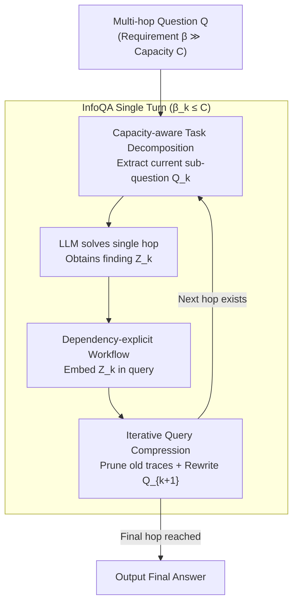

# A Fano-Style Accuracy Upper Bound for LLM Single-Pass Reasoning in Multi-Hop QA

**Conference**: ICLR 2026  
**arXiv**: [2509.21199](https://arxiv.org/abs/2509.21199)  
**Code**: Yes (InfoQA)  
**Area**: Model Compression  
**Keywords**: Multi-hop QA, Information Theory, Fano's Inequality, Accuracy Upper Bound, Multi-turn Reasoning  

## TL;DR
This paper derives a Fano-style accuracy upper bound for single-pass LLM reasoning in Multi-Hop QA (MHQA) using information theory. It reveals a "cliff-like" precipitous drop in accuracy when task information requirements exceed model output capacity. Based on these insights, the authors design InfoQA, a multi-turn reasoning framework that breaks the single-pass bottleneck through capacity-aware decomposition, dependency-explicit workflows, and iterative query compression.

## Background & Motivation

**Background**: Multi-hop Question Answering (MHQA) requires the sequential integration of evidence scattered across long contexts. Currently, LLMs typically process such tasks using a single-pass reasoning paradigm.

**Limitations of Prior Work**: The number of tokens in a single LLM output is finite, and the information capacity per token is bounded. When a reasoning chain spans multiple evidence sources or the context contains significant noise, the total information requirement exceeds the output capacity. Consequently, relevant signals are diluted or obscured, leading to inaccurate intermediate reasoning.

**Key Challenge**: The single-pass reasoning paradigm faces a dual crisis: (a) Single-step capacity overflow, where information requirements grow super-linearly with the number of hops and context length; (b) Inter-step error accumulation, where the chain structure exponentially amplifies errors even if per-step accuracy remains high.

**Goal**: (a) Formalize the theoretical performance upper bound for single-pass LLM reasoning; (b) Explain why MHQA is particularly susceptible to exceeding this bound; (c) Design a multi-turn framework to overcome the single-pass reasoning bottleneck.

**Key Insight**: Leveraging Shannon's information theory and Fano’s inequality, the relationship between "task information requirement" and "model output capacity" is formalized as an accuracy upper bound.

**Core Idea**: Single-pass accuracy is constrained by a Fano-style bound $\text{Acc} \leq \min\{1, (C+1)/\beta\}$. When the information requirement $\beta$ exceeds the capacity $C$, accuracy drops precipitously; multi-turn decomposition is the key to breaking this limit.

## Method

### Overall Architecture
The paper first establishes the theoretical accuracy limits of single-pass reasoning and subsequently develops a framework to surpass them. The theoretical component equates the **information requirement** of an MHQA problem with the **information capacity** of a single model output using an information-theoretic lens to derive a Fano-style upper bound. This explains why MHQA requirements explode as the number of hops increases. The secondary component, the InfoQA framework, addresses the capacity limitation by decomposing multi-hop problems into a sequence of single-hop subtasks. In each turn, the model solves only one hop, explicitly embeds intermediate findings into the next query, and prunes previous traces to compress the query. This iterative process ensures that the information requirement of each step remains below the model's capacity. The following Mermaid diagram illustrates the InfoQA execution loop.

### Key Designs

**1. Fano-Style Accuracy Upper Bound: Reducing "Correctness" to "Information Capacity"**

To explain why LLM performance collapses on difficult problems, the authors define a computable upper bound. The **task information requirement** is defined as the conditional entropy of the answer given the question and context $\beta = H(A\mid Q,C)$, while the **capacity** of a single model output is defined as the output entropy $C = H(Y)$. Applying the conditional Fano inequality results in:

$$h(\text{Acc}) + (1-\text{Acc})\log(|\mathcal{A}|-1) \geq \beta - C$$

Under a simplified uniform distribution, this simplifies to $\text{Acc} \leq \min\{1,\,(C+1)/\beta\}$. The significance of this formula lies in its shape: when the requirement $\beta \leq C+1$, the upper bound remains 1. However, once $\beta$ exceeds $C+1$, the bound drops hyperbolically following $1/\beta$. This suggests that accuracy does not degrade smoothly with difficulty but undergoes a "phase transition" collapse at a specific threshold.

**2. Dissecting MHQA Tasks: Why Multi-hop QA Hits the Wall**

The authors model the information requirement as a function of hops and context length: $\beta(h,L) = \beta_0 + \alpha L \gamma^{h-1}$, where $h$ is the number of hops, $L$ is context length, and $\gamma \geq 1$ is a hop amplification factor. The $\gamma^{h-1}$ term causes the requirement to expand exponentially with hops, compounded by noise in long contexts, leading to "single-step capacity overflow." Furthermore, the "inter-step error accumulation" dictates that for an error rate $\varepsilon$, the probability of a successful $K$-step chain is $\Pr(\text{Succ}) \geq (1-\varepsilon)^{K+1}$. These dual crises explain the performance collapse observed as hop counts increase.

**3. InfoQA Framework: Compressing Requirements via Multi-turn Decomposition**

InfoQA employs three components to address these theoretical bottlenecks. **Capacity-aware task decomposition** splits multi-hop questions into single-hop sub-problems, significantly reducing the per-step $\beta$ to avoid exceeding $C$. **Dependency-explicit workflow** ensures that intermediate discoveries are written as text and explicitly embedded in subsequent queries, preventing error accumulation in implicit reasoning chains. **Iterative query compression** prunes used reasoning traces and rewrites the query after each step, preventing the prompt from growing with reasoning depth. This keeps the $L$ in $\beta(h,L)$ manageable, ensuring each turn remains within the model's capacity limit.

### Loss & Training
InfoQA is a training-free inference-time framework implemented through prompt engineering. All LLM calls utilize the same backbone model and inference settings (temperature=0.2, max 4096 tokens).

## Key Experimental Results

### Main Results

**Performance of Qwen3-14B on Synthetic Multi-Hop QA Benchmark (Mean F1):**

| Method | 1-hop/0.5k | 2-hop/4k | 3-hop/8k | 4-hop/10k |
| :--- | :--- | :--- | :--- | :--- |
| Direct | 1.00 | 0.54 | 0.07 | 0.00 |
| CoT | 1.00 | 0.99 | 0.32 | 0.03 |
| Self-Consistency | 1.00 | 0.99 | 0.46 | 0.09 |
| ReAct | 1.00 | 0.96 | 0.16 | 0.00 |
| **Ours (InfoQA)** | **1.00** | **1.00** | **0.80** | **0.48** |

### Ablation Study

| Configuration | 2-hop/8k F1 | 3-hop/8k F1 | Description |
| :--- | :--- | :--- | :--- |
| InfoQA (Full) | 0.96 | 0.80 | Full framework |
| w/o Task Decomposition | 0.52 | 0.18 | Significant degradation without decomposition |
| w/o Trace Pruning | 0.88 | 0.59 | Clear drop without iterative compression |

### Key Findings
- Results for all single-pass methods closely align with the theoretical prediction curve, confirming the existence of the "accuracy cliff."
- CoT delays the appearance of the cliff by increasing effective output capacity $C$ and reducing the amplification factor $\gamma$, but it ultimately remains bound by the same limit.
- Self-Ask introduces a higher base requirement $\beta_0$, offsetting the benefits of increased capacity.
- InfoQA demonstrates the most significant advantage in difficult settings (high hops + long context), e.g., achieving 0.48 vs. 0.03 for CoT in the 4-hop/10k setting.

## Highlights & Insights
- **Precise Information-Theoretic Modeling**: Using Fano's inequality to formalize LLM reasoning bottlenecks as a measurable "Requirement vs. Capacity" relationship provides a much deeper understanding than empirical descriptions of "long-context failure."
- **Discovery of the Accuracy Phase Transition**: The finding that performance collapses suddenly rather than degrading gradually implies that small increases in task complexity near the threshold can lead to catastrophic failure.
- **Theory-Driven Design**: Every component of InfoQA directly addresses a specific challenge identified in the theoretical analysis, demonstrating a rigorous "understand first, solve later" research paradigm.

## Limitations & Future Work
- Experiments were conducted primarily on synthetic benchmarks; validation on real-world MHQA datasets (e.g., HotpotQA) is required.
- Only Qwen3-8B/14B models were tested; generalization across models like GPT-4 or Claude remains unverified.
- InfoQA's multi-turn approach increases inference costs (API calls scale linearly with hops).
- Theoretical assumptions such as "uniform distribution" and "independent steps" may not fully hold in complex real-world scenarios.
- The capacity parameter $C$ is obtained via post-hoc fitting rather than a prior estimation method.

## Related Work & Insights
- **vs. CoT**: CoT increases effective capacity $C$ by extending the reasoning chain but remains within the single-pass paradigm and thus is subject to the same upper bound. InfoQA breaks this by crossing the paradigm boundary via decomposition.
- **vs. Self-Consistency**: SC improves robustness through multi-path voting (reducing $\gamma$) but still cannot escape the eventual capacity overflow.
- **vs. Self-Ask**: While utilizing decomposition, Self-Ask introduces a larger base requirement $\beta_0$. InfoQA minimizes per-step requirements through iterative query compression.

## Rating
- Novelty: ⭐⭐⭐⭐⭐ 
- Experimental Thoroughness: ⭐⭐⭐⭐ 
- Writing Quality: ⭐⭐⭐⭐⭐ 
- Value: ⭐⭐⭐⭐

<!-- RELATED:START -->

## Related Papers

- [\[ICLR 2026\] SPARTA: Scalable and Principled Benchmark of Tree-Structured Multi-hop QA over Text and Tables](sparta_scalable_and_principled_benchmark_of_tree-structured_multi-hop_qa_over_te.md)
- [\[ICLR 2026\] Scaling Reasoning Hop Exposes Weaknesses: Demystifying and Improving Hop Generalization in Large Language Models](scaling_reasoning_hop_exposes_weaknesses_demystifying_and_improving_hop_generali.md)
- [\[ACL 2026\] A BERTology View of LLM Orchestrations: Token- and Layer-Selective Probes for Efficient Single-Pass Classification](../../ACL2026/model_compression/a_bertology_view_of_llm_orchestrations_token-_and_layer-selective_probes_for_eff.md)
- [\[ICLR 2026\] ParoQuant: Pairwise Rotation Quantization for Efficient Reasoning LLM Inference](paroquant_pairwise_rotation_quantization_for_efficient_reasoning_llm_inference.md)
- [\[ICLR 2026\] Incentivizing Agentic Reasoning in LLM Judges via Tool-Integrated Reinforcement Learning](incentivizing_agentic_reasoning_in_llm_judges_via_tool-integrated_reinforcement_.md)

<!-- RELATED:END -->
