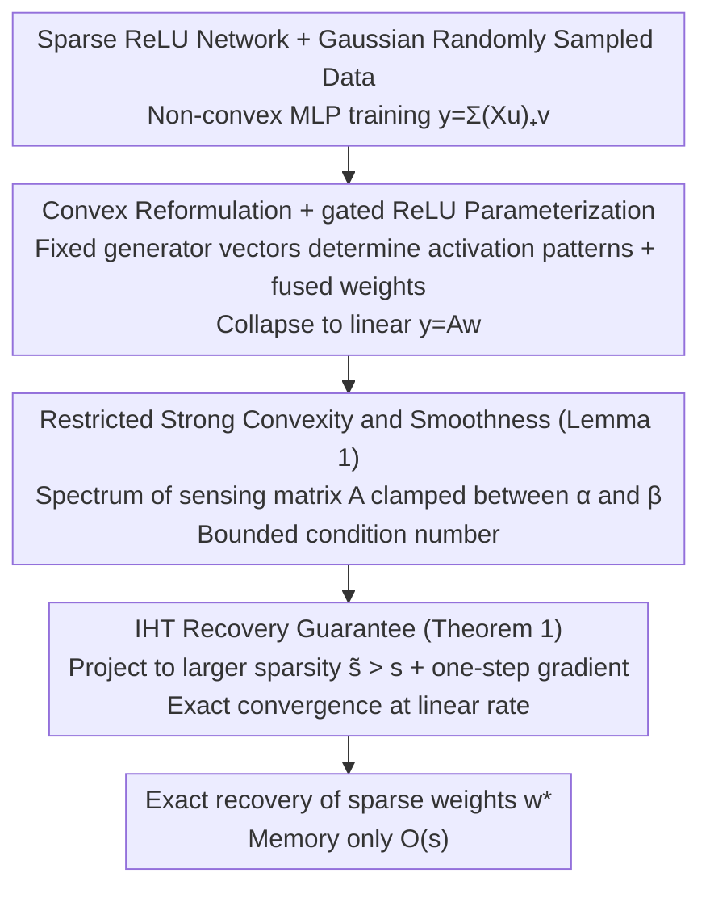

# A Recovery Guarantee for Sparse Neural Networks

**Conference**: ICLR 2026  
**arXiv**: [2509.20323](https://arxiv.org/abs/2509.20323)  
**Code**: [https://github.com/voilalab/MLP-IHT](https://github.com/voilalab/MLP-IHT)  
**Area**: Model Compression / Theory  
**Keywords**: Sparse Neural Networks, Compressed Sensing, Iterative Hard Thresholding, Convex Reformulation, ReLU Networks  

## TL;DR
The authors prove the first sparse recovery guarantee for ReLU neural networks: for two-layer scalar output networks with Gaussian randomly sampled training data, an Iterative Hard Thresholding (IHT) algorithm based on convex reformulation precisely recovers sparse network weights, with memory requirements growing only linearly with the number of non-zero weights.

## Background & Motivation

**Background**: Although large-scale neural networks demonstrate excellent performance, they require massive memory and computational resources. Weights after training are typically highly compressible. While the existence of high-performance sparse subnetworks is known (Lottery Ticket Hypothesis), efficient optimization of sparse networks remains an open challenge.

**Limitations of Prior Work**: Existing methods are either memory-inefficient (e.g., IMP requires training a dense network first), of insufficient quality (e.g., pruning at initialization), or lack theoretical guarantees (all existing methods are heuristic). Although compressed sensing literature contains rich sparse recovery theories, they are applicable only to linear models.

**Key Challenge**: Sparse neural network optimization is a non-convex problem. Classical sparse recovery theories (requiring restricted isometry or strong convexity) do not directly apply to non-linear ReLU networks.

**Goal**: To provide theoretical guarantees for the weight recovery of sparse ReLU MLPs, including unique identifiability and convergence guarantees for efficient recovery algorithms.

**Key Insight**: Utilize the convex reformulation theory of ReLU networks (Pilanci & Ergen, 2020) to transform non-convex sparse network optimization into a highly structured linear sensing problem, and then apply the sparse recovery guarantees of IHT.

**Core Idea**: Transform sparse MLP training into a linear sparse recovery problem via gated ReLU convexification, prove that the sensing matrix satisfies restricted strong convexity/smoothness, such that IHT can precisely recover sparse weights.

## Method

### Overall Architecture
The paper seeks to answer a seemingly simple yet long-unanswered theoretical question: If a sparse ReLU network indeed exists, can it be precisely recovered with memory proportional only to the number of non-zero weights? The pipeline follows three steps: first, reformulate the two-layer ReLU network $\hat{y} = \sum_{j=1}^p (Xu_j)_+ v_j$ into a linear form $y = Aw^*$ by fixing activation patterns, where $A$ is a sensing matrix composed of data and activation patterns, and $w^*$ is the fused sparse weight vector; next, prove that $A$ satisfies the conditions required for sparse recovery under reasonable assumptions; finally, use Iterative Hard Thresholding (IHT) to directly recover $w^*$ for the linear problem. In other words, the originally non-convex MLP training is translated into a textbook-style linear sparse recovery problem from compressed sensing.

### Key Designs

**1. Convex Reformulation + gated ReLU Parameterization: Translating Non-convex MLP Training to Linear Sparse Recovery**

The fundamental obstacle to sparse network optimization is non-convexity—the strong convexity/restricted isometry required by classical sparse recovery theory is inapplicable to non-linear ReLU. This step adopts the convex reformulation approach of Pilanci & Ergen, using fixed random generator vectors $h_i$ instead of trainable $u_i$ to determine activation patterns $D_i = \text{Diag}(\mathbb{I}[Xh_i \geq 0])$. By merging two layers of weights into $w_i = u_i v_i$, the entire network collapses into a linear form $\hat{y} = Aw$. A crucial advantage is that sparsity helps: the number of possible activation patterns is reduced from exponential to polynomial with respect to width. Once non-convexity is eliminated, the mature machinery of linear sparse recovery can be directly applied.

**2. Restricted Strong Convexity and Restricted Smoothness (Lemma 1): Proving the Sensing Matrix Satisfies Spectral Conditions**

After linearization, a core question remains—is the matrix $A$ constructed from data and activation patterns "good enough"? Lemma 1 provides an affirmative answer under Assumption 2: as long as each neuron attends to at least an $\varepsilon$ proportion of the data, and the activation patterns of any two different neurons differ in at least a $\gamma$ proportion of positions, then with high probability $\alpha I_s \preceq A_S^T A_S \preceq \beta I_s$. This means the spectrum of $A$ on all $s$-sparse subsets $S$ is clamped between $\alpha$ and $\beta$, with a finite and bounded condition number $\sqrt{\beta/\alpha}$. The two conditions in Assumption 2 correspond to intuition: the former requires the network not to overfit to a few samples, and the latter requires neurons to be distinct from one another—essentially the idea of RIP in compressed sensing, but with more relaxed requirements.

**3. IHT Recovery Guarantee (Theorem 1): Exact Recovery Under Finite Condition Numbers**

With spectral conditions established, the final step is ground recovery guarantees. The challenge is that standard RIP constant requirements are too strict for MLP sensing matrices to satisfy. The paper instead invokes results from Jain et al. 2014—which allows IHT to guarantee recovery under any finite condition number, at the cost of projecting to a sparsity $\tilde{s} > s$ larger than the true sparsity (the expansion factor increases with the condition number). Substituting the bounded condition number from Lemma 1 yields Theorem 1: IHT converges exactly to the true weights at a linear rate,

$$\|w^{k+1} - w^*\|_2 \leq \rho^k \|w^0 - w^*\|_2.$$

The trade-off is that convergence speed slows as the condition number increases, but exact recovery itself consistently holds—this "relaxed constants, sacrificed speed" trade-off is the key to enabling MLP applicability.

### Loss & Training
The recovery objective is linear least squares MSE $f(w) = \frac{1}{2}\|Aw - y\|_2^2$. The IHT update is written as $w^{k+1} = H_{\tilde{s}}(w^k - \eta A^T(Aw^k - y))$, where a hard thresholding operator $H_{\tilde{s}}$ retains only the $\tilde{s}$ components with the largest magnitudes after a gradient descent step. This is the key to memory efficiency: only $O(s)$ non-zero weights need to be stored throughout the process, avoiding the need to maintain a full dense network as in IMP.

## Key Experimental Results

### Main Results

**Recovery of Sparse Planted MLPs:**

| Method | Recovery Error | Memory Efficiency | Theoretical Guarantee |
|--------|----------------|-------------------|-----------------------|
| IHT    | ~0 (Exact)     | Linear in $s$     | ✓                     |
| IMP    | Comparable/Worse| Requires Dense Net| ✗                     |

### Ablation Study

| Experiment | IHT | IMP | Notes |
|------------|-----|-----|-------|
| MNIST Classification | Competitive/Superior | Requires more memory | Significant memory efficiency advantage for IHT |
| Implicit Neural Repr. | Competitive | Baseline | Extended to 3 layers and vector outputs |

### Key Findings
- IHT achieves exact recovery in sparse planted MLP recovery tasks, validating theoretical predictions.
- In experiments, the performance of IHT typically exceeds IMP while using less memory—translating theoretical guarantees into practical advantages.
- Although the theory only covers two-layer scalar output networks, IHT performs well on 3-layer and vector output networks.
- Sample complexity is proportional to the number of active (non-zero) weights rather than total weights, achieving true compressed sensing.

## Highlights & Insights
- **Bridge between Compressed Sensing and Deep Learning**: Rigorously applies 30-year-old sparse recovery theory to ReLU networks for the first time, demonstrating the vitality of classical theory in new domains.
- **Enabling Role of Convexification**: The convex reformulation by Pilanci & Ergen is not just of theoretical interest; here, it serves as the crucial bridge connecting sparse recovery theory and MLPs.
- **Theoretical Guarantee for Memory Efficiency**: IHT requires only $O(s)$ memory, whereas methods like IMP require $O(dp)$—this represents orders of magnitude in memory savings for large-scale sparse networks.

## Limitations & Future Work
- The theory applies only to two-layer scalar output ReLU networks; generalization to deeper networks and multiple outputs remains an open problem.
- Assumption 1 places restrictions on weight values (binary hidden layer or $\pm 1$ output layer), whereas actual weights are more general.
- Requires enumerating all possible activation patterns, which is computationally infeasible for non-sparse networks.
- The random Gaussian data assumption differs from actual data distributions.
- Experimental scale is relatively small; practicality on large-scale networks needs further verification.

## Related Work & Insights
- **vs Lottery Ticket Hypothesis**: LTH empirically discovered the existence of high-performance sparse subnetworks; this work provides theoretical guarantees for precisely recovering those weights under specific conditions.
- **vs Pilanci & Ergen Convexification**: Convexification provides a convex equivalent form for MLP training; this work combines it with sparse recovery, representing a significant application of convexification theory.
- **vs Jain et al. 2014 IHT**: They proved IHT guarantees for general linear sparse recovery; this work proves that MLP sensing matrices satisfy the required conditions.

## Rating
- Novelty: ⭐⭐⭐⭐⭐ First sparse recovery guarantee for ReLU networks, theoretical contribution is clear and significant.
- Experimental Thoroughness: ⭐⭐⭐ Experimental scale is small, validated only on MNIST and simple tasks.
- Writing Quality: ⭐⭐⭐⭐ Rigorous theoretical derivation, clear assumptions.
- Value: ⭐⭐⭐⭐ Provides a theoretical foundation for sparse neural network training, though practicality remains to be fully verified.

<!-- RELATED:START -->

## Related Papers

- [\[ICLR 2026\] Cannistraci-Hebb Training on Ultra-Sparse Spiking Neural Networks](cannistraci-hebb_training_on_ultra-sparse_spiking_neural_networks.md)
- [\[ICLR 2026\] Adaptive Width Neural Networks](adaptive_width_neural_networks.md)
- [\[ICLR 2026\] Robust Training of Neural Networks at Arbitrary Precision and Sparsity](robust_training_of_neural_networks_at_arbitrary_precision_and_sparsity.md)
- [\[ICLR 2026\] Fine-tuning Quantized Neural Networks with Zeroth-order Optimization](fine-tuning_quantized_neural_networks_with_zeroth-order_optimization.md)
- [\[ICLR 2026\] KLAS: Using Similarity to Stitch Neural Networks for Improved Accuracy-Efficiency Tradeoffs](klas_using_similarity_to_stitch_neural_networks_for_improved_accuracy-efficiency.md)

<!-- RELATED:END -->
