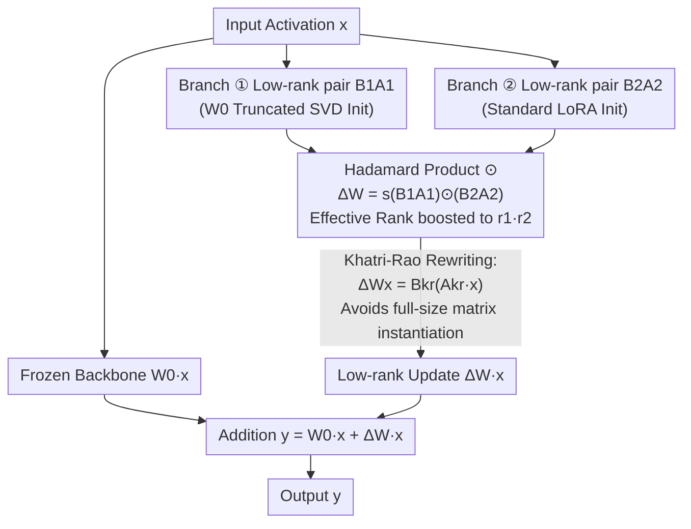

# ABBA-Adapters: Efficient and Expressive Fine-Tuning of Foundation Models

**Conference**: ICLR 2026  
**arXiv**: [2505.14238](https://arxiv.org/abs/2505.14238)  
**Code**: [https://github.com/CERT-Lab/abba](https://github.com/CERT-Lab/abba)  
**Area**: Model Compression / PEFT  
**Keywords**: Parameter-efficient fine-tuning, LoRA, Hadamard product, low-rank adaptation, Khatri-Rao decomposition  

## TL;DR
Ours proposes ABBA-Adapters, which parameterize weight updates as the Hadamard product of two independent learnable low-rank matrices $\Delta W = s(B_1A_1) \odot (B_2A_2)$. This achieves an effective rank significantly higher than LoRA ($r_1 \cdot r_2$ vs. $r$) under the same parameter budget. Through Khatri-Rao reconstruction, it maintains memory efficiency comparable to LoRA and significantly outperforms existing PEFT methods on arithmetic and commonsense reasoning tasks.

## Background & Motivation

**Background**: LoRA is the most popular PEFT method, restricting updates to a rank-$r$ subspace via $\Delta W = BA$ where $B \in \mathbb{R}^{m \times r}, A \in \mathbb{R}^{r \times n}$.

**Limitations of Prior Work**: LoRA's updates are strictly limited by rank-$r$, fundamentally capping its expressivity. HiRA introduces the Hadamard product $\Delta W = W_0 \odot (BA)$ to increase effective rank, but the update is coupled with the frozen weights $W_0$. When the target update-to-$W_0$ element-wise ratio is not low-rank, HiRA offers no advantage.

**Key Challenge**: High expressivity (high-rank updates) typically requires more parameters, yet the core constraint of PEFT is minimizing parameter count. The problem is how to break the rank limit under the same parameter budget.

**Goal**: Significantly enhance the expressivity and effective rank of updates while maintaining LoRA-level parameter efficiency.

**Key Insight**: Both factors of the Hadamard product should be learnable low-rank matrices to completely decouple the update from pre-trained weights. Utilize Khatri-Rao decomposition to avoid instantiating full-sized matrices.

**Core Idea**: The Hadamard product of two rank-$r/2$ matrices can reach an effective rank of $r^2/4$, representing a quadratic increase over LoRA's rank $r$ for the same parameter count.

## Method

### Overall Architecture
ABBA aims to resolve the contradiction where LoRA's expressivity is constrained by rank-$r$ while parameter counts must remain low. It replaces the LoRA update $\Delta W = BA$ with the Hadamard product of two independent low-rank matrix pairs: $\Delta W = s(B_1A_1) \odot (B_2A_2)$. The four matrices $A_1, B_1, A_2, B_2$ form the name "ABBA". To ensure a fair comparison with LoRA, the rank of both branches is set to $r_1 = r_2 = r/2$, making the total parameters exactly equal to a rank-$r$ LoRA. The mechanism focuses on how element-wise products amplify rank without adding parameters, how to compute this without exhausting memory, and how to stabilize initialization. The data flow passes the input activation $x$ through the frozen backbone $W_0$ in one path, and through two low-rank branches synthesized via Hadamard product in the other.

### Key Designs

**1. Hadamard Double Low-rank Parameterization: Amplifying effective rank from $r$ to $r^2/4$ without additional parameters**

LoRA updates are locked within a rank-$r$ subspace. ABBA leverages the rank-amplification property of element-wise products—$\text{rank}(W_1 \odot W_2) \leq r_1 \cdot r_2$. By multiplying two rank-$r/2$ matrices, the upper bound of the effective rank jumps to $r_1 r_2 = r^2/4$. Matrix reconstruction experiments verify that ABBA's reconstruction error is consistently lower than LoRA's at the same parameter count. Unlike HiRA ($\Delta W = W_0 \odot (BA)$), ABBA's factors are both fully learnable and not tied to $W_0$, ensuring the update capability is not bottlenecked by the pre-trained weight structure.

**2. Efficient Khatri-Rao Implementation (Theorem 1): Rewriting the Hadamard product into LoRA form**

Computing $(B_1A_1) \odot (B_2A_2)$ naively requires constructing two $m \times n$ full-sized matrices, which incurs memory costs equivalent to full fine-tuning. Theorem 1 utilizes the Khatri-Rao (column-wise Kronecker) product to bypass this: defining $B_{\text{kr}} = B_1 \odot_r B_2 \in \mathbb{R}^{m \times r_1 r_2}$ and $A_{\text{kr}} = (A_1^\top \odot_r A_2^\top)^\top$, the update becomes $\Delta W x = B_{\text{kr}}(A_{\text{kr}} x)$. Forward propagation thus reduces to two low-rank matrix-vector multiplications with intermediate activations of dimension $r_1 r_2$. This keeps computation and storage at a low-rank level.

**3. SVD Initialization + Rank Stability: Anchoring primary subspaces and scaling correctly**

ABBA uses asymmetric initialization: $(B_1, A_1)$ is initialized using the truncated SVD of the frozen weights $W_0$, while $(B_2, A_2)$ follows standard LoRA initialization. Per the EYM (Eckart–Young–Mirsky) theorem, truncated SVD provides the optimal rank-$r_1$ approximation, anchoring one branch to the meaningful low-rank principal subspace of $W_0$ while allowing the other branch to explore task-specific directions. For the scaling factor $s$, since the effective rank is $r_1 r_2$, the scaling must be adjusted. Ours proves (Theorem 2) that setting $s_{\text{ABBA}} = \alpha^2/\sqrt{r_1 r_2} \in \Theta(1/\sqrt{r_1 r_2})$ keeps the forward/backward second moments at $\Theta(1)$, extending rsLoRA’s $\alpha/\sqrt{r}$ logic to the double low-rank structure.

### Loss & Training
Standard fine-tuning loss is used. Training hyperparameters are identical to LoRA, with the only modification being the replacement of the adapter structure with ABBA. Code is open-sourced.

## Key Experimental Results

### Main Results

**Arithmetic Reasoning (GSM8K, MATH, etc.):**

| Method | Parameters | GSM8K | MATH | Avg. ↑ |
|------|-------|-------|------|-------|
| LoRA (r=16) | Baseline | Baseline | Baseline | Baseline |
| DoRA | Same | Slight improvement | Slight improvement | Slight improvement |
| HiRA | Same | Better than LoRA | Better than LoRA | Better than LoRA |
| **ABBA (r=8+8)** | **Same** | **Significant Best** | **Significant Best** | **Significant Best** |

**Commonsense Reasoning (Average across multiple datasets):**

| Method | LLaMA-7B | LLaMA-3-8B | Note |
|------|---------|-----------|------|
| LoRA | Baseline | Baseline | |
| **ABBA** | **+2-3pp** | **+2-3pp** | Consistent lead |

### Ablation Study

| Configuration | Performance | Note |
|------|------|------|
| $r_1 = r_2 = r/2$ | Best | Equal rank maximizes $r_1 r_2$ |
| $r_1 \neq r_2$ | Slightly worse | Asymmetric allocation is sub-optimal |
| Random Init $(B_1, A_1)$ | Worse | SVD initialization is critical |
| No scaling factor | Unstable training | Rank stability requires proper scaling |

### Key Findings
- Matrix reconstruction tests confirm ABBA consistently outperforms LoRA at equivalent parameter counts, verifying higher expressivity.
- ABBA exhibits faster convergence than LoRA and HiRA.
- Khatri-Rao reconstruction makes ABBA’s actual memory usage superior to HiRA (as HiRA requires storing full $W_0$).
- Rank stability analysis (Theorem 2) indicates scaling should be $s \propto 1/\sqrt{r_1 r_2}$.

## Highlights & Insights
- **Quadratic Rank Increase**: Boosting effective rank from $r$ to $r^2/4$ without adding parameters is the core contribution—essentially buying $r/4$ times more expressivity for the same "budget."
- **Engineering via Khatri-Rao**: The Hadamard product does not naturally distribute over matrix-vector multiplication; KR decomposition is the key technical contribution that makes ABBA practically viable.
- **Distinction from HiRA**: While HiRA uses a fixed $W_0$ (low cost but inflexible), ABBA makes both factors learnable low-rank matrices (parameter cost but high flexibility), representing a superior trade-off.

## Limitations & Future Work
- The intermediate activation dimension for the Khatri-Rao reconstruction is $r_1 r_2$ (compared to LoRA’s $r$), leading to some increase in FLOPs.
- Unlike LoRA, ABBA does not have a closed-form optimal solution (EYM theorem does not apply to Hadamard products), so optimization relies entirely on gradient descent.
- Initialization requires truncated SVD of $W_0$ for each layer, incurring a small one-time pre-processing cost.
- Validation is limited to LLMs; applicability to vision or multimodal models remains unexplored.

## Related Work & Insights
- **vs. LoRA**: ABBA provides a fundamental leap in expressivity from $r$ to $r^2/4$ at the same parameter count, at the cost of slightly more complex initialization.
- **vs. HiRA**: ABBA is fully learnable and decoupled from the frozen weights, leading to better generalization than HiRA.
- **vs. DoRA**: While DoRA decouples magnitude and direction, its update remains low-rank; ABBA breaks the rank limit via the Hadamard product.

## Rating
- Novelty: ⭐⭐⭐⭐⭐ The combination of Hadamard double low-rank parameterization and KR efficiency is elegant.
- Experimental Thoroughness: ⭐⭐⭐⭐⭐ Comprehensive coverage across 4 models, arithmetic/reasoning tasks, and reconstruction tests.
- Writing Quality: ⭐⭐⭐⭐⭐ Fluent narrative from motivation to theory.
- Value: ⭐⭐⭐⭐⭐ A direct, practical improvement over LoRA with significant gains and open-source code.

<!-- RELATED:START -->

## Related Papers

- [\[ICLR 2026\] TRAC: Tensor-Train Based Across-Layer Compression for Parameter-Efficient Fine-Tuning](trac_tensor-train_based_across-layer_compression_for_parameter-efficient_fine-tu.md)
- [\[ICLR 2026\] LoFT: Low-Rank Adaptation That Behaves Like Full Fine-Tuning](loft_low-rank_adaptation_that_behaves_like_full_fine-tuning.md)
- [\[ICLR 2026\] PiCa: Parameter-Efficient Fine-Tuning with Column Space Projection](pica_parameter-efficient_fine-tuning_with_column_space_projection.md)
- [\[CVPR 2026\] Mining Attribute Subspaces for Efficient Fine-tuning of 3D Foundation Models](../../CVPR2026/model_compression/mining_attribute_subspaces_for_efficient_fine-tuning_of_3d_foundation_models.md)
- [\[ICLR 2026\] Expressive yet Efficient Feature Expansion with Adaptive Cross-Hadamard Products](expressive_yet_efficient_feature_expansion_with_adaptive_cross-hadamard_products.md)

<!-- RELATED:END -->
