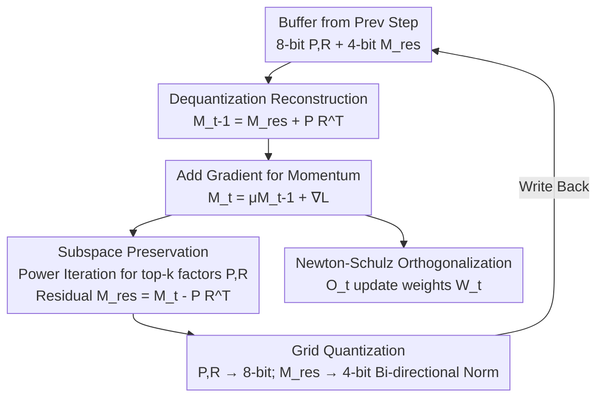

# Achieving low-bit Muon through subspace preservation and grid quantization

**Conference**: ICLR2026  
**OpenReview**: [https://openreview.net/forum?id=g2l9bg9DWx](https://openreview.net/forum?id=g2l9bg9DWx)  
**Code**: https://github.com/wuhuaijin/lowbit-Muon  
**Area**: Model Compression / Optimizer Quantization / Efficient Training  
**Keywords**: Muon Optimizer, Low-bit quantization, Singular subspace preservation, Grid quantization, Memory-efficient training

## TL;DR
This paper presents the first study on 4-bit compression of Muon optimizer states. It reveals that Newton-Schulz orthogonalization primarily amplifies quantization errors in the top singular subspace of the momentum matrix. Consequently, the authors propose 4-bit-Muon-GRASP: utilizing 8-bit to preserve the top subspace, 4-bit for the residual subspace, and grid quantization normalized along both rows and columns to suppress bi-dimensional outliers. This method achieves near-lossless accuracy in LLaMA 130M~1.1B pre-training and Qwen2.5-7B fine-tuning, reducing training memory by up to 28%.

## Background & Motivation
**Background**: A significant portion of the memory bottleneck in large model training stems from optimizer states. AdamW requires storing both first-order and second-order moments, creating a buffer twice the size of the model—a 5B model requires over 40GB just for fp32 optimizer states. Strategies to reduce this memory include low-rank decomposition (e.g., Adafactor, GaLore) and low-bit quantization (8-bit, 4-bit). The latter is particularly attractive due to its simplicity and generality, yet existing low-bit optimizer research focuses almost exclusively on AdamW and SGD.

**Limitations of Prior Work**: Muon is a recently proposed optimizer based on matrix orthogonalization that only needs to store the first-order momentum, naturally saving about half the optimizer memory compared to AdamW while offering nearly double the training efficiency. It has been adopted by models like Kimi-K2. Since Muon already has only one momentum buffer, further compressing it to 4-bit appears highly beneficial, but the "how" remains unexplored. Directly applying low-bit schemes designed for AdamW to Muon leads to failure.

**Key Challenge**: The fundamental difference between Muon and AdamW is that Muon's updates are not element-wise; it requires an orthogonalization of the momentum matrix $M_t$ (using Newton-Schulz iteration to approximate $UV^\top$, where $U\Sigma V^\top = M_t$ is the SVD). Empirical tests show that while the momentum matrix distribution is nearly identical before and after quantization (Relative Error RE=0.07), a massive discrepancy appears **after the NS iteration (RE=1.78)**. In short, the orthogonalization step sharply amplifies the minor perturbations introduced by quantization—the root cause of Muon's failure under direct quantization, a problem AdamW avoids as it lacks this step.

**Goal**: To compress Muon's momentum states to 4-bit while ensuring nearly zero loss in training and downstream accuracy, thereby further reducing training memory. This requires identifying the source of error and designing a targeted compression scheme.

**Key Insight**: The authors performed two critical diagnostic tests. First, error amplification is not caused by "insufficient NS iteration steps"—increasing iterations or polynomial orders actually increases quantization error, suggesting quantized matrices need fewer, not more, iterations. Second, decomposing the momentum matrix via SVD into a top singular subspace $M_{top}$ and a residual subspace $M_{res}$ reveals that while pre-iteration errors are similar (≈0.08/0.09), the error in $M_{top}$ is amplified by approximately 40× after NS iteration, while $M_{res}$ is only amplified by about 5×. The error is concentrated in the top singular subspace.

**Core Idea**: Given that the error source is the top singular subspace, the authors use **mixed precision for different subspaces**—preserving the top subspace with a gentler 8-bit format and compressing the residual with 4-bit. To address outliers occurring in both row and column directions of the momentum matrix, "grid quantization" is employed to provide tighter element-wise quantization boundaries through bi-directional normalization.

## Method

### Overall Architecture
The goal of 4-bit-Muon-GRASP (GRid And Subspace Preserving) is to replace the momentum matrix $M_t \in \mathbb{R}^{m\times n}$ (originally stored in fp32) with a low-bit representation consisting of "8-bit top singular factors + 4-bit residual matrix" in each optimization step. This compresses the Muon buffer to near 4-bit while preventing orthogonalization from amplifying errors to a degree that harms convergence.

The process modifies a standard Muon step. Standard Muon: update momentum $M_t = \mu M_{t-1} + \nabla L_t(W_{t-1})$, orthogonalize $O_t = \text{Newton-Schulz}_p(M_t, T)$, and update weights $W_t = W_{t-1} - \eta_t O_t$. GRASP modifies the momentum storage: in each step, $M_{t-1}$ is recovered from the quantized buffer via dequantization and added to the gradient to get $M_t$; Power Iteration extracts top-$k$ singular factors $P_t, R_t$ (where $P_t R_t^\top \approx M_{top}$); the residual $M_{res,t} = M_t - P_t R_t^\top$ is compressed to 4-bit using grid quantization; $P, R$ are compressed to 8-bit. Orthogonalization still uses the full $M_t$ to calculate the update direction.

### Key Designs

**1. Subspace Preservation: Isolating Error Sources with Mixed Precision**

Based on the diagnosis that "NS iteration primarily amplifies top singular subspace errors," the authors explicitly split the momentum matrix. Let $U\Sigma V^\top = M$ be the SVD, then

$$M_{top} := M_k = U_k \Sigma_k V_k^\top, \qquad M_{res} = M - M_{top}$$

where $U_k, V_k$ are top-$k$ singular vectors and $\Sigma_k$ are top-$k$ singular values. The error-sensitive $M_{top}$ is preserved in 8-bit, while $M_{res}$ is compressed to 4-bit. This prevents the quantization error of the top subspace from spiraling out of control during orthogonalization while maintaining overall low-bit gains since $M_{res}$ contains the vast majority of elements. Crucially, ablation studies show the **residual subspace cannot be discarded**—keeping only the top subspace (even with rank-1/2 approximation) results in training accuracy losses exceeding 2%. This is because NS iteration amplifies even small singular values to non-negligible levels; the top subspace alone cannot cover all momentum information. This explains why Muon cannot simply use low-rank approximation.

Since performing SVD at every step is too costly, the authors use **Power Iteration** to numerically approximate top singular vectors: after computing $M_t$, they find rank-$k$ factors $P_t \in \mathbb{R}^{m\times k}, R_t \in \mathbb{R}^{n\times k}$ such that $P_t R_t^\top \approx M_{top}$. A key trick is using $R_{t-1}$ from the previous step (column-normalized) as a hot start $Q_t$. Because $M_t$ and $M_{t-1}$ are highly similar between adjacent steps, **a single step of power iteration is sufficient to accurately capture the top subspace** (RE as low as 0.01). Since the rank $k$ is small ($k(n+m) \ll mn$), the memory overhead of storing $P, R$ is negligible.

**2. Grid Quantization: Suppressing Bi-dimensional Outliers**

Momentum tensor outliers appear in **both row and column directions**. Traditional per-channel or per-token grouping schemes only take normalization scales along one direction, failing to encompass both and resulting in loose quantization boundaries and accuracy loss.

Grid quantization divides the matrix $X$ into $s\times s$ blocks (where group size $s=128$). For elements within a block, it calculates scales for both row and column directions:

$$scale^r_i = \max_{r_1 \le j \le r_2} x_{i,j}, \qquad scale^c_j = \max_{c_1 \le i \le c_2} x_{i,j}$$

Then, each element is normalized by the **minimum** of the two scales:

$$N_{grid}(x_{i,j}) = \frac{x_{i,j}}{\min(scale^r_i,\, scale^c_j)}$$

Taking the minimum provides a tighter, element-specific quantization boundary for each entry, finely accounting for outliers in both dimensions. The cost is storing roughly twice the number of scales as group quantization, which remains negligible relative to the tensor itself. Ablations show that grid quantization **halves the accuracy loss** of group quantization when compressing the momentum matrix directly.

By combining these two designs, the normalized error (NE) of the momentum matrix after NS iteration drops from 1.78 to 0.14 (when the top subspace rank is 1/16 of the original rank).

### Mechanism
Using step $t$ ($t>0$) as an example:

1.  **Dequantization Reconstruction**: Retrieve 4-bit $M^q_{res,t-1}$ and 8-bit $P^q_{t-1}, R^q_{t-1}$ from the buffer. Reconstruct $M_{t-1} = M_{res,t-1} + P_{t-1}R_{t-1}^\top$.
2.  **Hot Start**: Normalize $R_{t-1}$ columns to get $Q_t$ as the starting point for power iteration.
3.  **Update Momentum**: $M_t = \mu M_{t-1} + \nabla L_t(W_{t-1})$.
4.  **Extract Top Subspace**: $P_t, R_t = \text{PowerIter}(M_t, Q_t)$ (internal steps: $P\leftarrow M_t Q$, QR orthogonalization, $R\leftarrow M_t^\top P$; 1 step total).
5.  **Calculate Residual and Quantize**: $M_{res,t} = M_t - P_t R_t^\top$. Perform 4-bit grid quantization $M^q_{res,t}$. Quantize $P_t, R_t$ to 8-bit and write to buffer.
6.  **Orthogonalize for Weight Update**: Use the full $M_t$ for Newton-Schulz orthogonalization to get $O_t$. Update $W_t = W_{t-1} - \eta_t(O_t + \lambda W_{t-1})$.

Only the low-bit $M^q_{res}$ (4-bit) and $P^q, R^q$ (8-bit) reside permanently in memory. The fp/bf16 matrices are reconstructed on the fly for calculation.

### Loss & Training
The method modifies only the storage and reconstruction of optimizer states without changing the training objective. Implementation uses OpenAI Triton kernels for quantization/dequantization to achieve real memory gains; following Liu et al. (2025), matrix parameters use Muon while RMSNorm/LM head/embeddings use AdamW; INT4/INT8 formats are used with a group/grid size of 128 and a default top subspace rank of 1/16.

## Key Experimental Results

### Main Results
Pre-training used Slimpajama with LLaMA architecture (RMSNorm + SwiGLU) across three scales: 130M, 350M, and 1.1B, using BF16 mixed precision up to 31.5B tokens. Fine-tuning used Qwen2.5-7B and Qwen2.5-7B-Math.

Downstream Zero-shot Average Accuracy (Pre-training):

| Model | Optimizer | HellaSwag | ARC-e | PIQA | SciQ | Avg |
|------|--------|-----------|-------|------|------|------|
| 350M | fp32-Muon | 32.4 | 38.3 | 62.0 | 68.0 | 44.6 |
| 350M | 4bit-Muon-base | 31.6 | 37.7 | 61.8 | 64.4 | 43.7 |
| 350M | **4bit-Muon-GRASP** | 32.4 | 38.5 | 61.4 | 66.6 | **44.5** |
| 1.1B | fp32-Muon | 40.6 | 42.8 | 66.5 | 69.5 | 48.0 |
| 1.1B | 4bit-Muon-base | 39.8 | 41.5 | 66.6 | 69.7 | 47.6 |
| 1.1B | **4bit-Muon-GRASP** | 40.4 | 42.3 | 67.4 | 71.3 | **48.2** |

Naive 4bit-Muon-base drops average accuracy to 43.7 at 350M, while GRASP restores it to 44.5, matching fp32-Muon. In 1.1B tests, GRASP even slightly exceeds fp32 (48.2 vs 48.0). Loss curves show GRASP within <0.2% of fp32-Muon, essentially parity at 1.1B.

Memory and Perplexity (after 10K steps):

| Scale | Optimizer | Memory (GB) | PPL↓ |
|------|--------|----------|------|
| 1.1B | fp32-Muon | 13.22 | 12.48 |
| 1.1B | 4bit-Muon-base | 10.54 | 12.76 |
| 1.1B | **4bit-Muon-GRASP** | 10.14 | **12.48** |

GRASP restores perplexity to parity with fp32-Muon (12.48). Total memory comparisons (including activations, gradients, etc.) show 4-bit Muon saves up to **48%** and **28%** memory compared to fp32-AdamW and fp32-Muon, respectively.

Fine-tuning Qwen2.5-7B: fp32-SFT 62.6, 4bit-base 62.5, **4bit-GRASP 62.8**, demonstrating no degradation of pre-trained capabilities.

### Ablation Study

| Config | Observation | Explanation |
|------|------|------|
| Top Rank 1/64→1/2 | Smaller rank leads to larger gap vs fp32 | 1/2 rank matches baseline curve perfectly |
| Top-only (drop residual) | Accuracy loss >2% (even with 1/2 rank) | Residual is vital; Muon resists simple low-rank approx |
| Grid vs Group Quant | Grid halves group quantization error | Bi-directional norm suppresses dual outliers |
| Power Iter 1/2/3 steps | 1 step yields error as low as 0.01 | Single step suffices with hot-starting |

### Key Findings
- The root cause of error amplification is the **top singular subspace** being amplified (approx 40x) by NS iteration; increasing iterations actually worsens it.
- The residual subspace is critical: NS iteration expands even minor singular values; throwing away the residual loses essential information, leading to >2% accuracy drop.
- Hot-starting power iteration reduces per-step cost to a single iteration, adding negligible training time overhead.

## Highlights & Insights
- **Diagnosis-driven Design**: The authors used a clear pipeline—identifying the error (40x amplification for $M_{top}$ vs 5x for $M_{res}$) before designing the solution (mixed precision). This is more persuasive than generic low-bit templates.
- **Transferable Subspace Idea**: The concept of "preserving sensitive subspaces while compressing residuals" is applicable to any optimizer involving spectral operations or non-linear error amplification (e.g., Shampoo family).
- **Grid Quantization as a General Trick**: Bi-directional normalization with a simple `min(row_scale, col_scale)` suppresses outliers with zero extra overhead and significantly higher precision for 2D tensors.
- **Engineering Efficiency**: Using power iteration with cross-step hot starting makes "subspace-aware quantization" practically viable for high-speed training.

## Limitations & Future Work
- Optimal quantization settings may depend on specific tasks/data; the study is limited to standard LLM scenarios and scales up to 1.1B (pre-training) or 7B (fine-tuning).
- The top subspace rank is a manually tuned hyperparameter (default 1/16); automatic rank selection remains an open problem.
- Memory gains are less pronounced on small models and saturate as bit-width decreases because total memory includes activations, gradients, and fragments; the full dividends of low-bit optimizers materialize at larger model scales.
- Distributed compatibility: Muon requires complete gradient matrices, which is not directly compatible with PyTorch FSDP; the work relies on a distributed Muon implementation for partitioned quantization.

## Related Work & Insights
- **vs 4-bit AdamW (Li et al. 2023) / 8-bit Optimizers (Dettmers et al. 2021)**: These target element-wise updates (AdamW/SGD) using block-level quantization. This paper demonstrates those methods fail on Muon due to NS iteration amplification, necessitating subspace-aware methods.
- **vs Low-rank Decomposition (Adafactor, GaLore, SM3)**: Those methods use low-rank approximations to save memory for second-order moments. This paper proves Muon **cannot be simply approximated by low-rank** (discarding residuals causes >2% drop), choosing "full-rank + mixed-precision quantization" instead.
- **vs 4-bit Shampoo (Wang et al. 2024)**: Both target spectral/matrix-op optimizers, but Shampoo compresses the second-order preconditioner. This is the first work targeting Muon's first-order momentum orthogonalization.

## Rating
- Novelty: ⭐⭐⭐⭐⭐ First 4-bit Muon work with deep insights into error attribution (subspace amplification).
- Experimental Thoroughness: ⭐⭐⭐⭐ Extensive pre-training and fine-tuning, though pre-training stops at 1.1B.
- Writing Quality: ⭐⭐⭐⭐⭐ Extremely logical "Diagnosis—Decomposition—Design" flow.
- Value: ⭐⭐⭐⭐ Practical value is high; 28% memory savings with zero loss is ready for production.

<!-- RELATED:START -->

## Related Papers

- [\[ICML 2026\] TWLA: Achieving Ternary Weights and Low-Bit Activations for LLMs via Post-Training Quantization](../../ICML2026/model_compression/twla_achieving_ternary_weights_and_low-bit_activations_for_llms_via_post-trainin.md)
- [\[ICLR 2026\] MASS: MoErging through Adaptive Subspace Selection](mass_moerging_through_adaptive_subspace_selection.md)
- [\[ICLR 2026\] Towards Quantization-Aware Training for Ultra-Low-Bit Reasoning LLMs](towards_quantization-aware_training_for_ultra-low-bit_reasoning_llms.md)
- [\[ICML 2026\] ReQAT: Achieving Full-Precision Reasoning Accuracy with 4-bit Floating-Point Quantization-Aware Training](../../ICML2026/model_compression/reqat_achieving_full-precision_reasoning_accuracy_with_4-bit_floating-point_quan.md)
- [\[AAAI 2026\] QuantVSR: Low-Bit Post-Training Quantization for Real-World Video Super-Resolution](../../AAAI2026/model_compression/quantvsr_low-bit_post-training_quantization_for_real-world_video_super-resolutio.md)

<!-- RELATED:END -->
