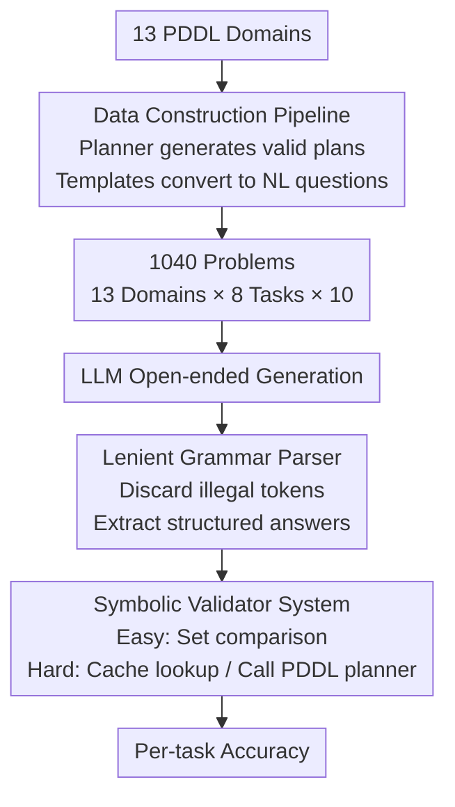

# ACPBench Hard: Unrestrained Reasoning about Action, Change, and Planning

**Conference**: ICLR 2026  
**arXiv**: [2503.24378](https://arxiv.org/abs/2503.24378)  
**Code**: [https://ibm.github.io/ACPBench](https://ibm.github.io/ACPBench)  
**Area**: Model Compression  
**Keywords**: planning benchmark, PDDL, generative evaluation, symbolic validator, action reasoning

## TL;DR

ACPBench Hard is constructed as an **open-ended generative** planning reasoning benchmark based on the PDDL formal system, containing 8 task categories (13 domains × 8 tasks = 1040 problems). Equipped with a symbolic validator that provides rigorous correctness guarantees, a systematic evaluation of 15 LLMs reveals that even the strongest reasoning model, o1-preview, achieves an accuracy of $\le 66\%$ on half of the tasks. Furthermore, all models nearly fail the most basic "enumerate executable actions" task, exposing fundamental deficiencies in current LLMs regarding planning reasoning.

## Background & Motivation

Existing LLM planning evaluations face two levels of bottlenecks. **Level 1**: Benchmarks such as PlanBench and AutoPlanBench focus solely on end-to-end plan generation/verification, making it impossible to locate the specific cause when black-box models fail. ACPBench v1 decomposed the planning process into 7 atomic reasoning tasks (applicability, state progression, reachability, etc.), but utilized **Boolean/multiple-choice** formats. **Level 2**: Multiple-choice formats are decoupled from the requirements of real planners—planners need to *generate* answers from a vast action space rather than selecting one from four options. Success in multiple-choice questions does not imply the ability to perform generative tasks, and the evaluation of open-ended generation is itself far more difficult (the verification complexity of some tasks is PSPACE-complete).

**Core Idea**: This work upgrades the 7 tasks of ACPBench from multiple-choice to **open-ended generation**, adds a "Next Action" task (corresponding to optimal planning), and designs a PDDL-based **symbolic validator** for each of the 8 tasks to completely eliminate the unreliability of LLM-as-judge.

## Method

### Overall Architecture

ACPBench Hard aims to resolve the issue where "existing planning evaluations only look at end-to-end success or failure, failing to locate the root cause of errors." It decomposes "planning capability" into action-level, state-level, and plan-level tiers across 8 atomic tasks. Each task requires the model to **generate open-ended** answers (rather than selecting from options), which are then scored by a symbolic validator with rigorous correctness guarantees. The pipeline is as follows: batch problem generation from 13 PDDL (Planning Domain Definition Language) domains, template-based conversion of formal descriptions into natural language questions, open-ended model response, extraction of structural answers using a lenient parser to remove formatting noise, and final validation by the symbolic validator. This approach precisely identifies model failure points while bypassing the unreliability of LLM-as-judge.

| Level | Task | Abbreviation | Generation Target | Verification Complexity |
|------|------|------|----------|-----------|
| Action-level | Applicability | App | List **all** executable actions in the current state | $O(|A|)$ |
| Action-level | State Progression | Prog | Given an action, list positive effects (add) and negative effects (delete) | $O(|F|)$ |
| State-level | Propositional Reachability | Reach | Identify propositions that can **never** be true from the current state | PSPACE-complete |
| State-level | Action Reachability | AReach | Identify actions that can **never** become executable | PSPACE-complete |
| Plan-level | Plan Validation | Val | Identify the **first** non-executable action in a sequence | $O(1)$ |
| Plan-level | Plan Justification | Just | Remove 1-2 redundant actions and output a simplified plan | $O(|\pi| \cdot |F|)$ |
| Plan-level | Landmarks | Land | Identify **necessary subgoals** that any valid plan must pass through | PSPACE-complete |
| Plan-level | Next Action (New) | NextA | Select an action that reduces the distance to the optimal goal by 1 | PSPACE-complete |

### Key Designs

**1. Data Construction Pipeline: Batch Generating 1040 Problems from 13 PDDL Domains**  
To ensure "open-ended generation" can be accurately scored, every problem must have an objective answer computable by a planner. Problems originate from 13 PDDL domains, with 10 problems per task per domain, totaling $13 \times 8 \times 10 = 1040$. Valid solutions are prioritized using top-quality planners and backed up by diverse planners. Formal descriptions are then translated into natural language using templates. This ensures every question has a ground-truth answer—a prerequisite for symbolic validation.

**2. Lenient Grammar Parser: Extracting Answers from Formatting Noise**  
LLM outputs often contain explanations or formatting drifts; exact matching would penalize correct reasoning due to formatting errors. A grammar-based lenient parser was designed to automatically discard non-compliant tokens and extract only the structurally valid portions. This decouples "planning competence" from "format adherence," ensuring validation focuses solely on reasoning.

**3. Symbolic Validator System: Reliable Automatic Scoring for Open-ended Generation**  
This is the core contribution of the paper. Since open-ended answers are non-unique and inhabit a massive space, traditional benchmarks often revert to multiple-choice or LLM judges. This work assigns a specific validation algorithm to each of the 8 tasks. Simple tasks (App/Prog/Val) use set comparisons. Hard tasks (Reach/AReach/Land/NextA), where verification is PSPACE-complete, involve checking precomputed caches or calling a PDDL planner to ensure **completeness** and **correctness**. For instance, to verify a Landmark (Land), the system constructs an auxiliary planning task $\Pi'$ by introducing a marker proposition $p_{nach}$; if a valid plan exists that bypasses the candidate, it is not a landmark.

## Key Experimental Results

### Results for Small/Medium Models

| Model | App | AReach | Just | Land | NextA | Prog | Reach | Val |
|------|-----|--------|------|------|-------|------|-------|-----|
| Granite 3.1 8B | 0.00 | 0.00 | 0.21 | 0.08 | 0.22 | 0.36 | 0.33 | 0.09 |
| Llama 3.1 8B | 0.00 | 0.00 | 0.22 | 0.06 | 0.25 | 0.40 | 0.33 | 0.13 |
| DeepSeek Coder 33B | 0.02 | 0.02 | 0.21 | 0.10 | 0.17 | 0.42 | 0.18 | 0.15 |
| Granite 34B Code | 0.02 | 0.00 | 0.17 | 0.11 | 0.18 | 0.43 | 0.28 | 0.12 |

Small models scoring near zero on App and AReach, with the highest score being 43% on Prog.

### Results for Large & Reasoning Models

| Model | App | AReach | Just | Land | NextA | Prog | Reach | Val |
|------|-----|--------|------|------|-------|------|-------|-----|
| Mixtral 8x22B | 0.10 | 0.02 | 0.31 | 0.26 | 0.32 | 0.68 | **0.37** | 0.23 |
| Llama 3.1 70B | 0.12 | 0.02 | 0.44 | 0.20 | 0.42 | 0.65 | 0.28 | 0.20 |
| GPT-4o mini | 0.07 | 0.01 | 0.14 | 0.04 | 0.35 | 0.59 | 0.22 | 0.27 |
| Llama 3.1 405B | 0.14 | 0.04 | 0.59 | 0.15 | 0.48 | 0.74 | 0.26 | 0.48 |
| **GPT-4o** | **0.25** | 0.01 | 0.54 | **0.29** | **0.55** | **0.78** | 0.32 | **0.62** |
| DeepSeek V3 | 0.21 | **0.05** | **0.65** | 0.12 | 0.47 | 0.76 | 0.32 | 0.56 |
| o1-mini | 0.38 | 0.06 | 0.44 | 0.38 | 0.64 | 0.70 | 0.60 | **0.78** |
| GPT OSS 20B | 0.03 | 0.09 | 0.14 | 0.47 | 0.62 | 0.72 | 0.50 | 0.14 |
| GPT OSS 120B | 0.00 | 0.13 | 0.05 | 0.49 | 0.78 | 0.79 | 0.68 | 0.70 |
| **o1-preview** | **0.44** | **0.12** | 0.46 | **0.56** | **0.80** | **0.89** | **0.66** | 0.26 |
| DeepSeek R1 | 0.05 | 0.01 | 0.52 | 0.20 | 0.36 | 0.77 | 0.24 | 0.53 |

### Ablation Study (DeepSeek V3)

| Representation | App | AReach | Just | Land | NextA | Prog | Reach | Val | Average |
|------|-----|--------|------|------|-------|------|-------|-----|------|
| NL | 0.21 | 0.05 | 0.65 | 0.12 | 0.47 | 0.76 | 0.32 | 0.56 | 0.39 |
| PDDL | 0.31 | 0.07 | 0.74 | 0.21 | 0.53 | 0.87 | 0.33 | 0.55 | 0.44 |
| PDDL+NL | 0.32 | 0.09 | 0.68 | 0.19 | 0.60 | 0.88 | 0.37 | 0.61 | **0.47** |

Including PDDL formal descriptions improved average accuracy from 39% to 47%, although traditional planners are more suitable when PDDL is available.

### Key Findings

- **Widespread Failure in Applicability**: Even for the basic task of "listing all executable actions," small models score $\approx 0\%$, and the strongest o1-preview only reaches 44%. The strict requirement to generate the **complete** set is the main reason—using Jaccard similarity scoring, o1-preview reaches 57% and Mixtral improves from 10% to 38%.
- **Action Reachability is the Hardest**: It requires reasoning about the **joint reachability** of multiple propositions in action preconditions; o1-preview only manages 12%.
- **No Universal Model**: No model is optimal across all 8 tasks. GPT-4o leads in 5/8 tasks but is outperformed by DeepSeek V3 on Just (by 11%) and AReach (by 4%).
- **Reasoning Models Cost/Value Trade-off**: The o1 series entails significantly higher computational costs but only shows major advantages in Prog (89%) and NextA (80%), scoring $\le 66\%$ on half of the tasks.
- **o1-preview Anomaly in Val (26%)**: In 86% of error cases, the answer was off by only 1 index, suggesting the model is close but fails the final step.
- **Progression is the Easiest Task** (o1-preview 89%), yet models still make elementary errors like failing to recognize "stacking blocks makes the top block clear."

## Highlights & Insights

- **Precise Deficit Diagnosis**: By decomposing the planning process, the work precisely diagnoses which stages models fail. The near-zero performance on App indicates LLMs cannot even perform action enumeration—the foundational requirement for planning.
- **Methodological Significance of Symbolic Validators**: Provides a completely reliable automated evaluation for open-ended generation. The construction of validation algorithms (e.g., Landmarks via auxiliary tasks) is an independent technical contribution.
- **Generation vs. MCQ Gap**: For the same model (GPT-4o), error rates are significantly lower in multiple-choice than in generation (except for Val), indicating that MCQs severely overestimate the planning capabilities of models.

## Limitations & Future Work

- Template-based natural language is not natural enough and differs from real-world planning scenarios.
- Only covers 13 PDDL domains, which may not represent all planning reasoning patterns.
- Evaluates only single-turn final answers, without considering multi-step iterative self-correction.
- Lenient parser only extracts the first answer, potentially missing subsequent correct attempts by the model.
- Future work: Construct training data with Chain-of-Thought (CoT) and expand to new task types such as object counting.

## Related Work & Insights

- **vs ACPBench v1**: v1 used Boolean/MCQ; this work upgrades to open-ended generation, representing a qualitative leap in difficulty.
- **vs PlanBench / AutoPlanBench**: These focus on end-to-end plan generation/verification, which cannot pinpoint atomic capacity deficits.
- **vs ActionReasoningBench**: Combines multiple capabilities into single problems and relies on LLM-as-judge; this work maps each task to an atomic capability and uses symbolic validators.

## Rating

- Novelty: ⭐⭐⭐⭐ Generative planning benchmark + complete symbolic validators
- Experimental Thoroughness: ⭐⭐⭐⭐⭐ 15 models × 8 tasks + representation ablation + complexity analysis + domain analysis
- Writing Quality: ⭐⭐⭐⭐ Clear task definitions and validation algorithms with detailed analysis
- Value: ⭐⭐⭐⭐⭐ A benchmark for diagnosing LLM planning reasoning capabilities

<!-- RELATED:START -->

## Related Papers

- [\[CVPR 2026\] Rethinking Dataset Distillation: Hard Truths about Soft Labels](../../CVPR2026/model_compression/rethinking_dataset_distillation_hard_truths_about_soft_labels.md)
- [\[ACL 2026\] Social Story Frames: Contextual Reasoning about Narrative Intent and Reception](../../ACL2026/model_compression/social_story_frames_contextual_reasoning_about_narrative_intent_and_reception.md)
- [\[ICLR 2026\] QVLA: Not All Channels Are Equal in Vision-Language-Action Model's Quantization](qvla_not_all_channels_are_equal_in_vision-language-action_models_quantization.md)
- [\[ICLR 2026\] Efficient Reasoning with Balanced Thinking](efficient_reasoning_with_balanced_thinking.md)
- [\[ICML 2026\] Hard Labels In! Rethinking the Role of Hard Labels in Mitigating Local Semantic Drift](../../ICML2026/model_compression/hard_labels_in_rethinking_the_role_of_hard_labels_in_mitigating_local_semantic_d.md)

<!-- RELATED:END -->
