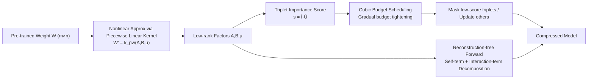

# Adaptive Nonlinear Compression for Large Foundation Models

**Conference**: ICLR 2026  
**OpenReview**: [https://openreview.net/forum?id=p66qXIp5jv](https://openreview.net/forum?id=p66qXIp5jv)  
**Code**: [https://github.com/Liang08/NLA](https://github.com/Liang08/NLA)  
**Area**: Model Compression / Low-rank Approximation  
**Keywords**: Low-rank approximation, nonlinear kernel, piecewise linear kernel, adaptive budget allocation, large model compression  

## TL;DR
NLA employs piecewise linear kernels to perform "nonlinear low-rank approximation" on weight matrices, coupled with a reconstruction-free all-matrix forward algorithm and an adaptive budget scheduler that allocates compression rates based on importance. This allows low-rank compression to achieve lower information loss and higher compression rates under the same parameter budget.

## Background & Motivation
- **Background**: Deployment of Large Language Models (LLMs) is constrained by VRAM. Mainstream compression methods include quantization, pruning, distillation, and low-rank approximation. Low-rank approximation (SVD-based) is regarded as hardware-friendly because it does not rely on specialized hardware (e.g., sparse inference or low-bit units) and can be stacked with other methods.
- **Limitations of Prior Work**: SVD-based methods are inherently **linear**—they decompose weight matrices into linear combinations of singular vectors and truncate directions corresponding to small singular values. At high compression rates, the loss of singular directions escalates rapidly, causing the perplexity of LLaMA-7B to explode to tens of thousands at 50%/60% compression.
- **Key Challenge**: Mapping low-rank factors implicitly into high-dimensional Hilbert spaces using nonlinear kernels can enhance expressiveness and reduce information loss. However, **direct application of kernel functions faces two major hurdles**: (1) Most kernels require reconstructing the full weight matrix during forward propagation, leading to surging VRAM and computational overhead; (2) Kernelized forms make it difficult to perform adaptive rank allocation across different matrices, whereas sensitivity varies significantly between weight matrices.
- **Goal**: Achieve nonlinear low-rank approximation that is VRAM-efficient and supports per-matrix adaptive compression budget allocation, without reconstructing full matrices or relying on specialized hardware.
- **Core Idea**: **"Nonlinear approximation with piecewise linear kernels + Lightweight forward decomposition via self-and-interaction terms + Triplet-importance-driven adaptive budget scheduling."** Piecewise linear kernels replace linear inner products for better expressiveness. The kernel is expanded into three additive terms computable directly on low-rank factors to avoid full matrix reconstruction. Budget allocation follows a cubic schedule using triplets as the granularity.

## Method

### Overall Architecture
NLA (Nonlinear Low-rank approximation with Adaptive budget allocation) represents each pre-trained weight matrix $W\in\mathbb{R}^{m\times n}$ using two low-rank factors $A\in\mathbb{R}^{m\times h\times r}$, $B\in\mathbb{R}^{n\times h\times r}$ and a shared coefficient $\mu\in\mathbb{R}^h$, fitting $W$ nonlinearly via a piecewise linear kernel $k_{pw}$. To enable deployment, the forward pass is rewritten into a "self-term + interaction-term" decomposition that operates only on low-rank factors. During the retraining phase, importance is calculated at the granularity of $h$ piecewise triplets, and unimportant triplets are gradually zeroed out via a cubic budget schedule to achieve varied compression rates for each matrix.

### Key Designs

**1. Nonlinear Low-rank Approximation via Piecewise Linear Kernels: Fitting weights with distance instead of inner products.** Linear low-rank approximation represents $W_{ij}$ as the inner product $a\cdot b$. Limited by the linear hypothesis class, truncation inevitably loses information. NLA adopts a piecewise linear kernel (inspired by DyN), fitting matrix elements as weighted squared distances between low-rank factors: $W'_{i,j}=k_{pw}(A_{i,\cdot,\cdot},B_{j,\cdot,\cdot})=\sum_{l=1}^{h}\mu_l\,\lVert A_{i,l,\cdot}-B_{j,l,\cdot}\rVert^2$. Since the kernel function $k(x,x')=\langle\phi(x),\phi(x')\rangle_{\mathcal H}$ is equivalent to an inner product in a high-dimensional feature space, the same number of parameters $(m+n)\cdot r\cdot h+h$ can express higher-rank structures. Fitting is performed via gradient descent to minimize the MSE reconstruction loss $W^*=\arg\min_{A,B}\mathcal L_{MSE}(W',W)$, shifting the burden of "low-rank to high-rank recovery" to optimization rather than singular values. This is why its fitting loss on OPT-1.3B is typically half that of SVD.

**2. Reconstruction-free Forward Algorithm via Self-Interaction Decomposition: Reducing the VRAM cost of nonlinearity.** The cost of nonlinearity is that the forward pass cannot directly multiply input features by low-rank factors. A naive implementation would reconstruct the full $W$ from $A, B$, causing VRAM explosion. NLA expands the piecewise linear kernel into three additive components: input self-term $\text{InS}=\sum_k Q_{in}[:,:,k]^2\odot\mu$, output self-term $\text{OutS}=\sum_k Q_{out}[:,:,k]^2\odot\mu$, and the interaction term $X_{in\&out}=(Q_{out}\cdot(Q_{in}^\top X^\top))\odot\mu$. The final output is $Y=X_{in}+X_{out}-2\,X_{in\&out}$. Each term is computed using only low-rank factors and the shared coefficient $\mu$. This avoids constructing the full weight matrix, reducing training VRAM to 12.2% and inference VRAM to 15.4% of the naive implementation for OPT-1.3B.

**3. Adaptive Compression via Triplet Importance and Cubic Budget Scheduling: Allocating budget to sensitive matrices.** The paper observes that fitting loss and convergence speed vary greatly across layers and matrix types (Q vs FC). NLA naturally partitions the decomposition of each matrix into $h$ piecewise triplets $\tau_l=\{A_l,\mu_l,B_l\}$ as the unit of allocation. Importance is assigned as $s_{W,l}=s(\mu_l)+\frac{1}{mr}\sum s(A_{i,l,j})+\frac{1}{nr}\sum s(B_{i,l,j})$. Single-parameter importance is measured by sensitivity $I(w)=|w\cdot\nabla_w\mathcal L|$, with exponential smoothing used to derive the smoothed importance $\bar I$ and uncertainty $\bar U$; $s(w)=\bar I(w)\cdot\bar U(w)$ balances stability and dynamics. The budget $b(t)$ follows a cubic sparsity schedule: a conservative warm-up to maintain capacity, aggressive tightening along a cubic curve in the middle, and a smooth cool-down at the end. Only $\mu_l$ within the top-$b$ are updated; others are zeroed out.

## Key Experimental Results

### Main Results

Perplexity on WikiText-2/PTB/C4 for LLaMA-7B (lower is better):

| Method | Compression | WikiText-2 | PTB | C4 |
|------|--------|-----------|-----|-----|
| Original | 0% | 5.68 | 8.35 | 7.34 |
| ASVD | 50% | 15358 | 47690 | 27925 |
| SVD-LLM | 50% | 23.97 | 150.58 | 118.57 |
| SVD-LLM | 60% | 42.30 | 321.27 | 246.89 |
| **NLA (Ours)** | **50%** | **15.21** | **84.65** | **70.32** |
| **NLA (Ours)** | **70%** | 39.91 | 320.35 | 240.56 |

Classification on ImageNet-1K with Swin-Base:

| Method | Params(M) | Compression | Acc(%) |
|------|-----------|--------|--------|
| Swin-Base | 87.8 | 0% | 83.5 |
| PELA | 62.2 | 29.2% | 82.4 |
| **NLA (Ours)** | **40.2** | **54.2%** | **82.7** |

### Ablation Study

| Ablation Item | Setting | Result |
|--------|------|------|
| Reconstruction-free Forward (OPT-1.3B Training VRAM) | w/o Alg.1 | >81920 MB |
| | w/ Alg.1 | 12623.75 MB (~12.2%)|
| Adaptive Budget Allocation (OPT-1.3B PPL) | Disabled | 20.13 |
| | Enabled | 19.77 |
| Kernel Selection (LLaMA-7B Inference) | Gaussian | 1.45s / 6.5GB |
| | Piecewise Linear (ours) | 0.82s / 6.7GB |
| Linear vs Nonlinear Fitting (Conversion only, PPL) | FWSVD 60% | 32194 |
| | NLA (Low-rank 70%) | 16774 |

### Key Findings
- **Nonlinear fitting is inherently stronger**: When performing only weight conversion without further training, NLA's perplexity at 70% compression (16774) is over 70% lower than the best SVD-based result (FWSVD 60%, 32194). Layer-wise fitting loss is generally half that of SVD.
- **The gap widens after fine-tuning**: LLaMA-7B at 50% compression yields an NLA PPL of 9.68 vs 13.26 for SVD-LLM; at 70%, it is 17.77 vs 28.45, indicating that nonlinear approximation preserves the model's recoverability during fine-tuning.
- **Superior Commonsense Reasoning**: At 50% compression, the average accuracy is 0.37 vs 0.33 for SVD-LLM, a relative improvement of ~12%.
- **Stackable with Quantization**: NLA + 4-bit achieves a PPL of 12.18 at lower VRAM (1.9GB), outperforming SVD-LLM + 4-bit (2.1GB, 13.29).
- **Forward algorithm is key to deployment**: Without Algorithm 1, OPT-1.3B training exceeds 80GB VRAM; with it, it drops to ~12.6GB.

## Highlights & Insights
- **From theoretical "Nonlinear Kernel Compression" to deployable**: While kernels provide high expressivity, the need for full matrix reconstruction has prevented deployment. The self-interaction decomposition bypasses reconstruction, serving as the most practical engineering contribution of this work.
- **Distance kernels as an alternative to inner products**: Piecewise linear kernels offer the expressiveness of high-dimensional mapping while being faster and cheaper than Gaussian or Sigmoid kernels, representing a clever trade-off between power and overhead.
- **Triplet-level granularity for adaptive allocation**: By treating the $h$ segments as units that can be independently scored and masked, the authors structurally resolve the difficulty of performing adaptive rank allocation in nonlinear kernels.

## Limitations & Future Work
- Masking the shared coefficient $\mu$ is the sole lever for compression, which is relatively coarse. Whether finer-grained budget allocation within $A/B$ factors is possible remains to be explored.
- The gains from adaptive budget allocation in the ablation study appear modest (OPT-1.3B 20.13→19.77). The primary benefit stems from the nonlinear approximation itself; the value of the adaptive component needs validation at more extreme compression rates.
- Experiments focused on LLaMA-7B / OPT / Swin scales. Larger models (70B class) and real-world inference latency (actual kernel efficiency of piecewise linear forward vs dense GEMM) require further verification.
- Cubic scheduling introduces hyperparameters such as $b_0,b_f,t_i,t_f$. Sensitivity and cross-model transferability are not fully discussed.

## Related Work & Insights
- **Linear Low-rank Compression**: FWSVD (Fisher-weighted SVD), ASVD (scaling by input channel influence), and SVD-LLM (mapping singular values to compression loss). NLA pushes this lineage from "linear inner products" to "nonlinear kernels."
- **Nonlinear Representations**: KPCA uses kernel mapping for nonlinear structures; DyN (Dynamics-inspired Neuromorphic Learning) replaces weight structures with finite sub-models. NLA adapts DyN by treating the piecewise linear model as a low-rank approximator for weight matrices.
- **Hybrid Compression**: CALDERA combines low-rank and low-precision decomposition. NLA demonstrates synergy with GPTQ/4-bit quantization, suggesting that low-rank and quantization are complementary.
- **Insight**: When linear methods hit a wall of information loss at high compression, "switching to a more expressive hypothesis class + ensuring engineering computability" is often more fruitful than optimizing within the linear framework. The kernel expansion into additive terms is a generalizable trick for other nonlinear parameterization methods.

## Rating
- **Novelty**: ⭐⭐⭐⭐ Introducing piecewise linear kernels to low-rank compression while solving forward reconstruction and adaptive allocation hurdles is a clear idea with real engineering value, not just an incremental "kernel-swap."
- **Experimental Thoroughness**: ⭐⭐⭐⭐ Covers LLM (LLaMA/OPT, language modeling + commonsense reasoning) and Vision (Swin), with multi-angled ablations on fitting loss, VRAM, kernels, and quantization. Lacks evaluation on larger models and real inference latency.
- **Writing Quality**: ⭐⭐⭐⭐ The motivation-contradiction-method chain is smooth, with clear formulas, algorithms, and supporting charts.
- **Value**: ⭐⭐⭐⭐ Hardware-friendly, stackable with quantization, and significantly outperforms SVD series at high compression rates, offering real-world significance for resource-constrained deployment.

<!-- RELATED:START -->

## Related Papers

- [\[ICML 2026\] End-to-End Compression for Tabular Foundation Models](../../ICML2026/model_compression/end-to-end_compression_for_tabular_foundation_models.md)
- [\[ICLR 2026\] ABBA-Adapters: Efficient and Expressive Fine-Tuning of Foundation Models](abba-adapters_efficient_and_expressive_fine-tuning_of_foundation_models.md)
- [\[ICLR 2026\] NerVE: Nonlinear Eigenspectrum Dynamics in LLM Feed-Forward Networks](nerve_nonlinear_eigenspectrum_dynamics_in_llm_feed-forward_networks.md)
- [\[ICLR 2026\] UniQL: Unified Quantization and Low-Rank Compression for Adaptive Edge LLMs](uniql_unified_quantization_and_low-rank_compression_for_adaptive_edge_llms.md)
- [\[ICLR 2026\] NLI: Non-uniform Linear Interpolation Approximation of Nonlinear Operations for Efficient LLMs Inference](nli_non-uniform_linear_interpolation_approximation_of_nonlinear_operations_for_e.md)

<!-- RELATED:END -->
