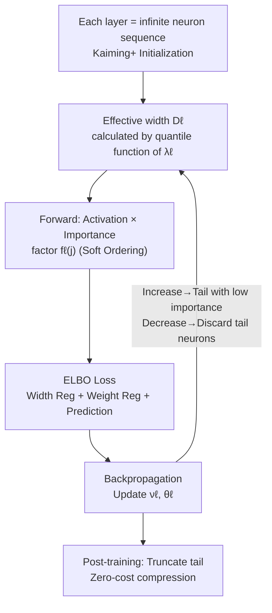

# Adaptive Width Neural Networks

**Conference**: ICLR 2026  
**arXiv**: [2501.15889](https://arxiv.org/abs/2501.15889)  
**Code**: [https://github.com/nec-research/Adaptive-Width-Neural-Networks](https://github.com/nec-research/Adaptive-Width-Neural-Networks)  
**Area**: Model Compression / Neural Architecture Learning  
**Keywords**: Adaptive width, variational inference, neuron importance ordering, network compression, hyperparameter learning  

## TL;DR
The AWN framework is proposed to automatically learn unbounded layer widths (number of neurons) during training via variational inference. By applying a soft ordering to neurons using a monotonically decreasing importance function, it enables width adaptation to task difficulty and supports zero-cost post-training truncation compression.

## Background & Motivation

**Background**: For nearly 70 years, neural network layer widths have relied on manual selection or hyperparameter search (grid search/NAS), remaining a fundamental open problem in deep learning.

**Limitations of Prior Work**: The search space for width as a hyperparameter grows exponentially with the number of layers. In practice, simplified strategies like "equal width for all layers" are often adopted. For foundation models with billions of parameters, the computational cost of hyperparameter tuning is prohibitive.

**Key Challenge**: Networks must be "wide enough" to learn good representations but "not too wide" to avoid wasting resources. Existing methods either search within a fixed width space (NAS) or require additional training-pruning pipelines (pruning/distillation).

**Goal**: Can the width of each layer grow or shrink automatically via gradient descent during a single training run, without a predefined upper bound?

**Key Insight**: Introduce a latent variable $\lambda_\ell$ to control the truncation width of each layer and use a monotonically decreasing importance distribution to rank neurons—low-index neurons are important, while high-index neurons are secondary. New neurons naturally occupy low-importance positions.

**Core Idea**: Width learning is formalized as a variational inference problem, optimizing the ELBO objective to simultaneously refine width parameters and network weights.

## Method

### Overall Architecture
AWN (Adaptive Width Networks) aims to let each layer's width $D_\ell$ grow or shrink via gradients during training, without requiring a preset upper bound or a separate pruning phase. It treats each layer as an **infinite sequence of neurons**, introducing two sets of latent variables for each layer: $\lambda_\ell$ controls "how many neurons are actually active," and $\theta_\ell$ represents the weights of these neurons. Variational inference is then used to maximize the ELBO. In each training step, the current effective width $D_\ell$ is calculated via the quantile function of $\lambda_\ell$, followed by a standard forward-backward pass. Width adjustments occur along this standard SGD path without special optimizers. The methodology relies on three integrated components: modeling width as an inferable latent variable (Design 1), sorting neurons via importance factors for smooth width adjustments (Design 2), and ensuring deep network trainability via modified initialization (Design 3).

In the diagram, the nodes for width calculation via $\lambda_\ell$, forward pass with importance factors, and Kaiming+ initialization correspond to the three key designs below; others (forward/backward/loss) follow the standard SGD framework.

### Key Designs

**1. Probabilistic Graphical Model and Variational Objective: Converting "Width Selection" into "Latent Variable Inference"**

Width is difficult to learn because it is a discrete hyperparameter that lacks direct gradients. AWN solves this by modeling each layer as an infinite sequence of i.i.d. latent variables $\theta_{\ell n}$ (weights of the $n$-th neuron in layer $\ell$). A latent variable $\lambda_\ell$ determines the effective width $D_\ell$ through the quantile function of the importance distribution $f_\ell$—neurons beyond $D_\ell$ revert to the prior and do not participate in computation. Thus, width is managed by a continuous variable $\lambda_\ell$. The training objective maximizes the ELBO, which naturally splits into three components: width regularization $\log \frac{p(\nu_\ell)}{q(\nu_\ell)}$, weight regularization $\sum_{n=1}^{D_\ell} \log \frac{p(\rho_{\ell n})}{q(\rho_{\ell n})}$, and predictive performance $\sum_i \log p(y_i | \nu, \rho, x_i)$. This allows variational parameters $\nu_\ell, \rho_{\ell n}$ to be optimized directly via gradients; the prior term provides regularization and uncertainty quantification without heuristic rules for adding or removing neurons.

**2. Soft Ordering of Neuron Importance: Ranking Neurons in the Sequence**

Treating width as a continuous variable is insufficient—if all neurons are equal, adding one might abruptly perturb the output, and permutation symmetry in weight matrices during early training can cause neurons to "jostle" for positions. AWN addresses this by multiplying activations by a **monotonically decreasing importance factor**. Standard MLP activations are modified to:

$$h_j^\ell = \sigma\!\Big(\sum_k w_{jk}^\ell h_k^{\ell-1}\Big) \cdot f_\ell(j; \nu_\ell),$$

where $f_\ell$ is a discretized exponential distribution. Smaller indices $j$ have larger (more important) factors, while larger indices approach zero. This forces a sequence ordering: low-index neurons carry primary representations, high-index neurons provide fine-tuning, and new neurons naturally fall into the low-importance tail without impacting existing outputs. This step breaks permutation symmetry, eliminates jostling, and makes "post-training truncation" nearly free—discarding tail neurons has minimal impact. This requires **bounded activations** (ReLU6/tanh) to prevent later layers from using weights to compensate for the rescaling factor.

**3. Kaiming+ Initialization for Deep AWN (Theorem 3.1): Preventing Activation Decay**

While importance factors are beneficial, they introduce a side effect: multiplying by $f_\ell < 1$ in each layer causes deep layer activations to be compressed, leading to variance decaying rapidly to zero and vanishing gradients. The paper re-derives the initialization variance to be:

$$\text{Var}[w_{jk}^\ell] = \frac{2}{\sum_{j=1}^{D_{\ell-1}} f_\ell^2(j)},$$

ensuring deep activation variance remains constant at initialization. The only difference from standard Kaiming initialization is the denominator—replacing $D_{\ell-1}$ with $\sum_j f_\ell^2(j)$ (which is smaller since $f_\ell < 1$), effectively compensating for the energy loss from rescaling. Though technically simple, this is decisive for the trainability of such "dynamic architectures"; without it, deep AWN fails to converge.

### Loss & Training
- In each training step, layer widths $D_\ell$ are updated via the quantile function before standard forward-backward passes. New neuron weights are initialized with a standard normal distribution when width increases, while redundant weights are discarded when width decreases.
- During mini-batch training, the predictive loss is scaled by $N/M$ (from a Bayesian perspective, more data makes the regularization term relatively weaker).
- Bounded activations (ReLU6) are recommended to ensure width convergence; with soft ordering, the initial width does not affect the final learned width.

## Key Experimental Results

### Main Results
Comprehensive testing across tabular, image, text, sequence, and graph data:

| Model/Dataset | Fixed Acc/Loss | AWN Acc/Loss | Fixed Width | AWN Learned Width |
|------------|---------------|-------------|----------|-----------|
| MLP/DoubleMoon | 100.0 | 100.0 | 8 | 8.1 |
| MLP/Spiral | 99.5 | 99.8 | 16 | 65.9 |
| MLP/SpiralHard | 98.0 | **100.0** | 32 | 227.4 |
| ResNet-20/CIFAR10 | 91.4 | 91.4 | Linear | 80.1 |
| RNN/PMNIST | 91.1 | **95.7** | 24 | 806.3 |
| GIN/REDDIT-B | 87.0 | **90.2** | 96-320 | 793.6 |
| Transformer/Multi30k | 1.43 | 1.51 | 24576 | **123.2** (200x fewer) |

### Ablation Study

| Importance Function Family | Avg Accuracy | Max Accuracy | Learned Width |
|------------|----------|----------|---------|
| Exponential | 80.27 | 100.00 | 954 |
| Power Law | 81.82 | 100.00 | 2952 (Long-tail) |
| Sigmoidal | 76.85 | 100.00 | 427 (Sharp transition) |

### Key Findings
- **Width adaptation to task difficulty**: Learned widths for DoubleMoon → Spiral → SpiralHard were 8 → 66 → 227, aligning with intuition.
- **Post-training truncation**: On the Spiral dataset, an MLP with 83 units can be truncated by 30% (~58 units) with no loss in accuracy, followed by smooth degradation—zero-cost "distillation."
- **Online compression**: On SpiralHard, introducing an information prior after 1000 epochs reduced width from 800 to 300 (-62%) without loss of accuracy.
- **200x Transformer compression**: For the Multi30k translation task, the learned FFN width was only 123 (fixed at 24576), with loss increasing by only 0.08.
- The initial width does not affect the final converged width under bounded activations, proving the hyperparameter space is successfully reduced.

## Highlights & Insights
- **Elegance of Probabilistic Formalization**: Width learning is fully integrated into a standard variational inference framework. Neurons are added or removed via backpropagation without heuristics—a paradigm shift from "architecture search" to "parameter learning."
- **Soft Ordering → Free Truncation**: The byproduct of soft ordering is highly practical; compression is achieved by simply removing the last columns/rows after training, which is simpler than pruning.
- **Kaiming+ Initialization**: While technically simple, it is critical for the trainability of deep AWN, suggesting that "dynamic architectures" require specialized initialization.
- The 200x compression in Transformers hints at significant redundancy in current LLM FFN layers.

## Limitations & Future Work
- Currently only learns **MLP layer widths**; CNN filter counts require a different formalization (explicitly stated as beyond scope by the authors).
- Occasional non-convergence on CIFAR100 (avg 63.1 vs fixed 66.5); stability needs improvement.
- The choice of the exponential distribution for $f_\ell$ lacks theoretical optimality; different distribution families lead to vastly different widths (exponential 954 vs power law 2952).
- Not yet verified on large-scale models (e.g., LLMs); Transformer experiments were limited to the small Multi30k task.
- First-order approximation of variational inference ($\mathbb{E}[f(\lambda)] \approx f(\nu)$) loses uncertainty information, weakening the Bayesian advantage.

## Related Work & Insights
- **vs NAS**: NAS searches discrete architecture spaces and requires multiple training runs; AWN handles continuous space in one run but only covers the width dimension.
- **vs Pruning**: Pruning requires pre-training a large model before trimming; AWN learns the appropriate width from the start and supports both growth and shrinkage.
- **vs Unbounded Depth Network (Nazaret & Blei 2022)**: Similar logic applied to depth, though width requires a monotonically decreasing importance distribution.
- **vs Firefly (Wu et al. 2020)**: Firefly alternates between training and growth using heuristics; AWN is purely gradient-driven.

## Rating
- Novelty: ⭐⭐⭐⭐⭐ Formalizes width learning as variational inference with unbounded growth; elegant concept and solid theory.
- Experimental Thoroughness: ⭐⭐⭐⭐ Covers 5 data domains with sufficient ablation, but lacks massive-scale verification.
- Writing Quality: ⭐⭐⭐⭐⭐ Mathematically rigorous, thorough experimental analysis, and clear logical flow.
- Value: ⭐⭐⭐⭐ Conceptually very attractive, though feasibility for large-scale practical applications remains to be verified.

<!-- RELATED:START -->

## Related Papers

- [\[ICLR 2026\] A Recovery Guarantee for Sparse Neural Networks](a_recovery_guarantee_for_sparse_neural_networks.md)
- [\[ICLR 2026\] Robust Training of Neural Networks at Arbitrary Precision and Sparsity](robust_training_of_neural_networks_at_arbitrary_precision_and_sparsity.md)
- [\[ICLR 2026\] Fine-tuning Quantized Neural Networks with Zeroth-order Optimization](fine-tuning_quantized_neural_networks_with_zeroth-order_optimization.md)
- [\[ICLR 2026\] BEP: A Binary Error Propagation Algorithm for Binary Neural Networks Training](bep_a_binary_error_propagation_algorithm_for_binary_neural_networks_training.md)
- [\[ICLR 2026\] KLAS: Using Similarity to Stitch Neural Networks for Improved Accuracy-Efficiency Tradeoffs](klas_using_similarity_to_stitch_neural_networks_for_improved_accuracy-efficiency.md)

<!-- RELATED:END -->
