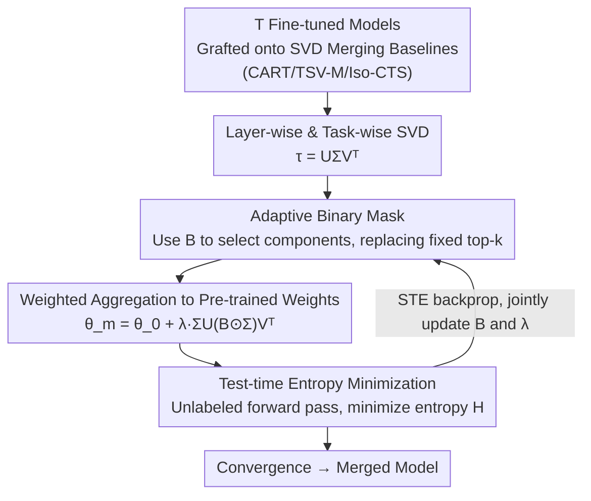

# AdaRank: Adaptive Rank Pruning for Enhanced Model Merging

**Conference**: ICLR 2026  
**arXiv**: [2503.22178](https://arxiv.org/abs/2503.22178)  
**Code**: To be confirmed  
**Area**: Object Detection (Model Merging/Multi-task Learning)  
**Keywords**: Model Merging, SVD, Task Vectors, Test-time Adaptation, Multi-task Learning

## TL;DR

Ours proposes AdaRank, which adaptively selects singular components of task vectors using learnable binary masks (replacing heuristic top-k). Combined with test-time entropy minimization optimization, it significantly mitigates inter-task interference in multi-task model merging, achieving 89.4% accuracy on ViT-B/32.

## Background & Motivation

**Background**: Model Merging integrates multiple independently fine-tuned models into a unified framework to avoid the high computational overhead of multi-model deployment. Task Arithmetic achieves merging by the weighted summation of task vectors (the difference between fine-tuned and pre-trained weights), but it suffers from severe inter-task interference.

**Limitations of Prior Work (SVD Methods)**: Recent SVD-based methods utilize low-rank structures to truncate task vectors and have made progress, but they rely on heuristic fixed top-k selection, presenting two fundamental problems:
   - **Counter-intuitive phenomenon**: While the top singular components reduce the loss of the target task the most, they may cause a larger net increase in loss for other tasks. Authors found in experiments on ViT-B/32 that adding the top singular component of MNIST benefits the semantically similar SVHN but significantly increases the loss for the dissimilar DTD (texture classification).
   - **Huge variance in rank requirements**: The intrinsic rank of different tasks and layers varies greatly—SUN397 (397 classes) requires a higher rank, while MNIST/SVHN require lower ranks; early layers (task-agnostic features) have high rank with small variance, while later layers (task-specific representations) have low rank with high variability.

**Key Challenge**: Fixed top-k truncation might discard critical components for certain tasks while retaining components that cause interference.

**Goal**: To adaptively select the optimal subset of singular components for each task in each layer independently.

## Method

### Overall Architecture

AdaRank transforms the decision of "which singular components to retain" from a hardcoded top-k rule into a binary decision learned independently for each task and layer. It is not a brand-new merging algorithm but an adaptive adapter grafted onto existing SVD merging methods (such as CART, TSV-M, Iso-CTS): it first performs SVD decomposition $\tau_i^l = U_i^l \Sigma_i^l V_i^{l\top}$ on the task vector of the $l$-th layer and $i$-th task, then assigns a learnable binary mask $B_i^l \in \{0,1\}^{1 \times m}$ to each singular component. The retained components are aggregated back to the pre-trained weights to obtain the merged model:

$$\theta_m^l = \theta_0^l + \lambda^l \sum_{i=1}^T U_i^l (\text{diag}(B_i^l) \odot \Sigma_i^l) V_i^{l\top}$$

Since the mask $B$ and layer-wise coefficients $\lambda^l$ have no labels for learning, they are jointly optimized on unlabeled test data by targeting prediction entropy minimization—calculating the output entropy of the merged model in the forward pass and updating $B$ and $\lambda$ in the backward pass. The subset of retained components is fixed after iterative convergence.

### Key Designs

**1. Adaptive Binary Mask: Replacing heuristic top-k with component-wise learnable switches**

The fundamental flaw of fixed top-k truncation is the assumption that "components with large singular values must be kept." However, the authors' counter-intuitive observation suggests that the top components contributing most to the current task's loss reduction might be the ones causing the most interference to other tasks. AdaRank therefore assigns an individual switch $B_{ir}$ to each singular component: $B_{ir}=1$ to retain and $B_{ir}=0$ to prune, letting the model decide which components are worth keeping. This design naturally covers existing methods—it degrades to standard Task Arithmetic when all masks are 1, and to top-k truncation when only the first $k$ masks are 1. Thus, it offers a broader search space that can discard interference-causing components without accidentally deleting critical ranks. The difficulty lies in the fact that binary masks are non-differentiable; AdaRank solves this using a Straight-Through Estimator (STE). A continuous parameter $\tilde{b}_{ir}$ is maintained behind each switch, which is rounded to $\{0,1\}$ after a sigmoid for pruning in the forward pass, while gradients are passed directly back in the backward pass.

**2. Test-time Entropy Minimization: Using unlabeled data to find a proxy target aligned with supervised loss**

In model merging scenarios, labeled multi-task data is usually unavailable, making it impossible to minimize classification loss directly. AdaRank instead uses the Shannon entropy of the prediction distribution as an unsupervised proxy: it makes the output as "confident" (low entropy) as possible on unlabeled test samples. The optimization objective is:

$$\arg\min_B \sum_{i=1}^T \sum_{x_i \in \mathcal{D}_i} H_i(f(\theta(B), x_i))$$

where $H_i$ is the entropy of the output distribution for task $i$, and $\mathcal{D}_i$ is the unlabeled test data for that task. This choice is effective because entropy is highly correlated with multi-task supervised loss—reducing entropy is approximately equivalent to reducing the true task loss. The authors also used a labeled oracle (directly minimizing multi-task cross-entropy) for comparison, verifying that the component subset optimized under the entropy proxy closely approximates the high-quality subset found by the oracle.

**3. Plug-and-Play: Joint optimization of B and λ grafted onto any merging baseline**

Both the mask $B$ and layer-wise coefficients $\lambda^l$ are jointly optimized through Test-time Adaptation (TTA) and are not tied to any specific merging algorithm. Therefore, AdaRank can be directly applied on top of various static or adaptive baselines such as Task Arithmetic, CART, TSV-M, and Iso-CTS, upgrading their singular component selection from fixed rules to adaptive selection. Ablations show that optimizing $B$ or $\lambda$ alone brings significant gains, and the two are orthogonally complementary—$\lambda$ adjusts the overall intensity per layer while $B$ selects which components to keep per layer. The additional parameters of the entire adapter account for only 0.032% of the total, adding almost no deployment cost.

## Key Experimental Results

### Main Results (ViT-B/32, 8 tasks)

| Method Type | Method | Average Accuracy |
|---------|------|----------|
| Static Merging | CART | 84.7 |
| Static Merging | Iso-CTS | 84.9 |
| Adaptive | TA+AdaMerging | 80.1 |
| Adaptive | **TA+AdaRank** | **87.9** |
| Adaptive | **CART+AdaRank** | **89.2** |
| Adaptive | **Iso-CTS+AdaRank** | **89.4** |
| Routing | WEMoE | 89.5 |

### Ablation Study

| Configuration | ViT-B/32 (8 tasks) | Description |
|------|-----------------|------|
| Fixed top-k (k=50) | 84.7 | CART baseline |
| Random Mask | ~82.0 | Worse than top-k |
| λ Optimization Only (AdaMerging) | 80.1 | Insufficient layer-wise coefficient optimization |
| **AdaRank (Joint B+λ)** | **89.2** | Joint mask and coefficient optimization is best |

### Key Findings

- **NLP Tasks**: On RoBERTa, CART+AdaRank reached 0.7547, and on GPT-2 it reached 0.6587, significantly better than AdaMerging.
- **20-Task Scenario**: The advantage is even greater—TSV-M+AdaRank reached 86.9% (ViT-B/32), far exceeding WEMoE's 80.2%.
- Extra parameters account for only 0.032% of the total, and TTA time is comparable to AdaMerging.
- Model parameters remain constant (not growing with the number of tasks), superior to the linear growth of routing methods.

## Highlights & Insights

- It reveals the counter-intuitive phenomenon that top-k singular components are not optimal in multi-task scenarios; this analysis itself has independent value.
- The method is highly general and can be plugged into various static or adaptive model merging frameworks.
- The advantage is more pronounced in large-scale scenarios with 20 tasks, indicating that inter-task interference intensifies as the number of tasks grows.
- Effective across Vision/NLP and across architectures (bi-directional and auto-regressive Transformers).

## Limitations & Future Work

- Requires unlabeled test data for test-time adaptation, making it unsuitable for completely data-free scenarios.
- SVD decomposition itself incurs an additional $O(d^2 d')$ preprocessing overhead.
- Entropy minimization as a proxy target is not always perfectly correlated with multi-task loss and may fail in some scenarios.
- Only classification tasks have been validated; the effectiveness on dense prediction tasks like detection or segmentation remains unknown.

## Related Work & Insights

- **Task Arithmetic / TIES-Merging / DARE**: Element-wise sparsification of task vectors, without preserving low-rank structure.
- **CART / TSV-M / STAR**: SVD low-rank truncation, but with fixed top-k.
- **AdaMerging**: Test-time adaptation of layer-wise coefficients $\lambda$; AdaRank performs adaptation at a finer granularity (singular component level).
- **WEMoE / Twin-Merging**: Routing methods where parameters grow linearly with the number of tasks.

## Rating

- Novelty: ⭐⭐⭐⭐ Adaptive singular component selection replaces heuristic top-k, backed by in-depth analysis.
- Experimental Thoroughness: ⭐⭐⭐⭐⭐ Vision + NLP, multiple backbones, 8/20 tasks, and thorough ablation.
- Writing Quality: ⭐⭐⭐⭐ Clear analysis and intuitive motivational illustrations.
- Value: ⭐⭐⭐⭐ A practical and general method for the model merging field.

<!-- RELATED:START -->

## Related Papers

- [\[ICLR 2026\] MergOPT: A Merge-Aware Optimizer for Robust Model Merging](mergopt_a_merge-aware_optimizer_for_robust_model_merging.md)
- [\[ICLR 2026\] Navigating the Accuracy-Size Trade-Off with Flexible Model Merging](navigating_the_accuracy-size_trade-off_with_flexible_model_merging.md)
- [\[ICLR 2026\] MASS: MoErging through Adaptive Subspace Selection](mass_moerging_through_adaptive_subspace_selection.md)
- [\[ICLR 2026\] Expert Merging: Model Merging with Unsupervised Expert Alignment and Importance-Guided Layer Chunking](expert_merging_model_merging_with_unsupervised_expert_alignment_and_importance-g.md)
- [\[ICLR 2026\] DisTaC: Conditioning Task Vectors via Distillation for Robust Model Merging](distac_conditioning_task_vectors_via_distillation_for_robust_model_merging.md)

<!-- RELATED:END -->
