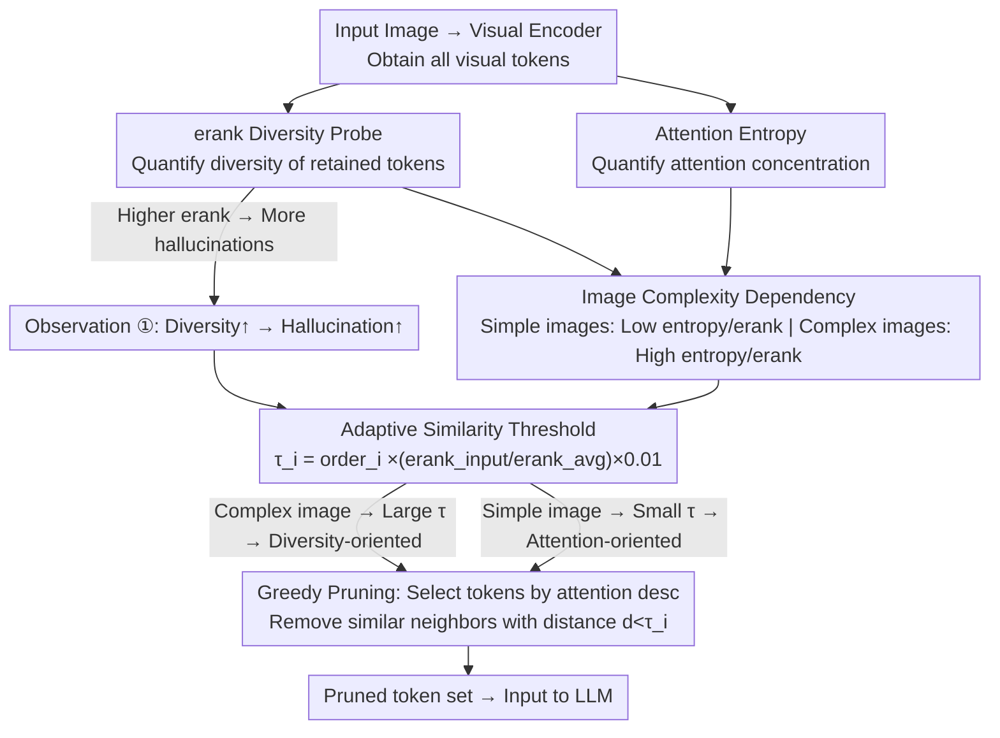

# AgilePruner: An Empirical Study of Attention and Diversity for Adaptive Visual Token Pruning in LVLMs

**Conference**: ICLR 2026  
**arXiv**: [2603.01236](https://arxiv.org/abs/2603.01236)  
**Code**: [https://cvsp-lab.github.io/AgilePruner](https://cvsp-lab.github.io/AgilePruner)  
**Area**: Model Compression  
**Keywords**: visual token pruning, attention, diversity, hallucination, adaptive pruning

## TL;DR
Through a systematic empirical analysis using erank (effective rank) and attention entropy, this study reveals the complementary characteristics of attention-based and diversity-based methods in visual token pruning—attention methods suppress hallucinations but have limited coverage, while diversity methods offer comprehensive coverage but are prone to introducing hallucinations. Based on these findings, AgilePruner is proposed to adaptively switch pruning strategies according to image complexity, demonstrating robust performance across 9 benchmarks.

## Background & Motivation
**Background**: The massive redundancy of visual tokens in LVLMs (hundreds of tokens) leads to low inference efficiency. Existing pruning methods are categorized into attention-based methods (retaining high-attention tokens) and diversity-based methods (retaining the most dispersed features), as well as hybrid strategies.

**Limitations of Prior Work**: The relative merits of various methods remain unclear—(1) How much diversity do diversity-based methods actually preserve? (2) What is the relationship between diversity and hallucination? (3) Which strategy is suitable for different types of images? These questions lack systematic research.

**Key Challenge**: Attention methods perform well on simple images but suffer from insufficient coverage, whereas diversity methods excel on complex images but easily induce hallucinations. No single method is universally optimal.

**Goal**: To reveal the essential behavioral differences between the two paradigms through empirical research and design an adaptive pruning strategy accordingly.

**Key Insight**: Use erank to quantify feature diversity and attention entropy to quantify attention concentration as analytical tools and the basis for adaptive switching.

**Core Idea**: Adaptively switch between attention-based and diversity-based pruning based on image complexity (measured by erank and attention entropy).

## Method

### Overall Architecture
This work addresses the question of what "retaining high-attention tokens" and "retaining the most dispersed tokens" actually achieve in visual token pruning and when each should be applied. It employs two quantifiable probes—effective rank (erank, quantifying the feature diversity of the retained token set) and attention entropy (quantifying the concentration/dispersion of attention)—to analyze various methods. Two core observations are derived: higher diversity leads to more hallucinations, and image complexity determines the optimal paradigm. These observations are integrated into a training-free adaptive pruner: tokens are selected via a greedy approach in descending order of attention scores; for each selected token, neighbors that are too similar are removed. The redundancy threshold $\tau$ dynamically expands or shrinks based on image complexity (measured by erank). The pipeline follows a "diagnosis-driven mechanism" where empirical findings inform the algorithm.

### Key Designs

**1. erank Diversity Probe: Verifying the "Diversity" of Diversity-based Methods**

While various diversity methods claim to retain more dispersed tokens, a metric for validation has been lacking. This study applies Singular Value Decomposition (SVD) to the embedding matrix of retained tokens, defining effective rank as $\text{erank}(A)=\exp(-\sum_i q_i\log q_i)$, where $\{q_i\}$ are normalized singular values. A more uniform distribution of singular values (information dispersed across more directions) results in a higher erank. Results indicate significant differences: DivPrune (21.84) ≫ VisPruner (14.35) ≈ VisionZip (14.02) ≫ PruMerge+ (10.91), showing that many "diversity-based" methods do not actually achieve high diversity. More importantly, erank shows a strong positive correlation with hallucination rates—DivPrune, with the highest erank, reaches a $C_S$ of 57.4 on CHAIR, while attention-based methods are around ~45. This challenges the naive assumption that "higher diversity is always better."

**2. Image Complexity Dependency: Attributing Strategy Performance to the Image**

Since no single paradigm is universally optimal, the performance depends on the image itself. By characterizing image complexity using attention entropy and erank, clear patterns emerge: simple images exhibit low attention entropy and low erank (e.g., OCR tasks: entropy 4.61, erank 78), where information is concentrated in a few tokens. Here, attention methods accurately capture critical information, and their lack of coverage is negligible. Complex images exhibit high attention entropy and high erank (e.g., POPE: entropy 4.87, erank 106), where information is spread across many tokens. In these cases, attention methods may miss critical regions, making the comprehensive coverage of diversity methods advantageous.

**3. Adaptive Similarity Threshold Pruning: Synthesizing Observations into an Algorithm**

The deployment algorithm is intentionally kept simple: tokens are sorted by attention scores in descending order. Starting from the highest-scoring token, any candidate token with a cosine distance $d$ less than a threshold $\tau_i$ (indicating excessive similarity) is removed. The process repeats for the next available high-score token until the budget is met. The key innovation is that $\tau_i$ is not fixed but is driven by image complexity (measured by erank):

$$\tau_i=\text{order}_i\times\left(\frac{\text{erank}_{\text{input}}}{\text{erank}_{\text{avg}}}\times 0.01\right)$$

where $\text{order}_i$ is the attention rank of the token (starting from 1), and $\text{erank}_{\text{avg}}$ is the average effective rank of the LLaVA training set. For complex images ($\text{erank}_{\text{input}} > \text{erank}_{\text{avg}}$), $\tau_i$ increases, leading to a wider removal range and forcing the retained set to be more dispersed (diversity-oriented). For simple images ($\text{erank}_{\text{input}} < \text{erank}_{\text{avg}}$), $\tau_i$ decreases, retaining high-score tokens and fine-grained details (attention-oriented).

### Loss & Training
Ours is training-free; the method prunes visual tokens during the inference stage only.

## Key Experimental Results

### Main Results (Average performance across 9 benchmarks)

| Method | Type | POPE | ScienceQA | MME | CHAIR $C_S$↓ |
|------|------|------|-----------|-----|-------------|
| FasterVLM | Attention | - | Better | - | 45.4 |
| DivPrune | Diversity | Better | - | - | 57.4 |
| PruMerge+ | Hybrid | - | - | - | 45.2 |
| **AgilePruner** | **Adaptive** | **Robust** | **Robust** | **Robust** | **Low** |

### Ablation Study (Attention vs. Diversity Ratio on CHAIR)

| Attention Ratio R | $C_S$↓ | $C_I$↓ | Recall↑ | erank |
|-------------|--------|--------|---------|-------|
| 0 (Pure Diversity) | 57.4 | 18.0 | 76.4 | 21.14 |
| 0.25 | 50.8 | 16.8 | 74.5 | 14.98 |
| 0.50 | 46.2 | 14.5 | 73.7 | 14.38 |
| 0.75 | 45.2 | 14.1 | 70.5 | 13.58 |

### Key Findings
- **Diversity ↔ Hallucination Correlation**: Increasing the attention token ratio from 0 to 0.75 reduces $C_S$ from 57.4 to 45.2, but recall drops from 76.4 to 70.5, showing a clear trade-off.
- The same trends were observed across LLaVA-1.5-13B, LLaVA-NeXT-7B, and Qwen2.5-VL-7B, indicating the findings are model-agnostic.
- Applying the image complexity adaptive strategy to existing hybrid methods consistently improves performance, validating the generalizability of the empirical findings.

## Highlights & Insights
- **Counter-intuitive discovery that "diversity leads to hallucinations"**: While it was previously believed that retaining more diverse tokens is always beneficial, this study reveals that retaining diverse but low-attention tokens can introduce spurious information.
- **erank as an analytical tool**: Using effective rank to quantify the feature diversity of token sets provides a concise and effective metric that can be reused for evaluating token selection quality in other scenarios.
- **Simple yet effective adaptive strategy**: Robust performance across various scenarios can be achieved without complex architectures, using only attention entropy/erank for threshold adjustment.

## Limitations & Future Work
- The setting of the adaptive threshold still depends on hyperparameters, which might require tuning for different models.
- The causality of the erank-hallucination relationship is not fully established (e.g., whether it's due to specific token types rather than pure diversity).
- Validation was primarily conducted on 7B/13B models; behavior on larger models (70B+) remains unknown.
- Analysis of video understanding and high-resolution multi-patch scenarios is insufficient.

## Related Work & Insights
- **vs. VisionZip/FasterVLM (Attention methods)**: AgilePruner analyzes their deficiencies on complex images and complements them with diversity.
- **vs. DivPrune (Diversity methods)**: Reveals their high hallucination risk and mitigates it through attention signal constraints.
- **vs. PruMerge+/VisPruner (Hybrid methods)**: Demonstrates that applying the image complexity adaptive strategy to these methods leads to consistent performance gains.

## Rating
- Novelty: ⭐⭐⭐⭐ Deep empirical analysis; the diversity-hallucination relationship is a new discovery.
- Experimental Thoroughness: ⭐⭐⭐⭐⭐ 9 benchmarks, CHAIR hallucination analysis, multi-model validation, and detailed ablation.
- Writing Quality: ⭐⭐⭐⭐ Clear analysis-driven narrative with rich visualizations.
- Value: ⭐⭐⭐⭐ Provides an empirical foundation and practical guidance for token pruning.

<!-- RELATED:START -->

## Related Papers

- [\[ICLR 2026\] Entropy-Monitored Kernelized Token Distillation for Audio-Visual Compression](entropy-monitored_kernelized_token_distillation_for_audio-visual_compression.md)
- [\[ACL 2025\] A Silver Bullet or a Compromise for Full Attention? A Comprehensive Study of Gist Token-based Context Compression](../../ACL2025/model_compression/gist_token_context_compression.md)
- [\[ICCV 2025\] FastVAR: Linear Visual Autoregressive Modeling via Cached Token Pruning](../../ICCV2025/model_compression/fastvar_linear_visual_autoregressive_modeling_via_cached_token_pruning.md)
- [\[ICLR 2026\] InfoScan: Information-Efficient Visual Scanning via Resource-Adaptive Walks](infoscan_information-efficient_visual_scanning_via_resource-adaptive_walks.md)
- [\[ICLR 2026\] Why Attention Patterns Exist: A Unifying Temporal Perspective Analysis](why_attention_patterns_exist_a_unifying_temporal_perspective_analysis.md)

<!-- RELATED:END -->
