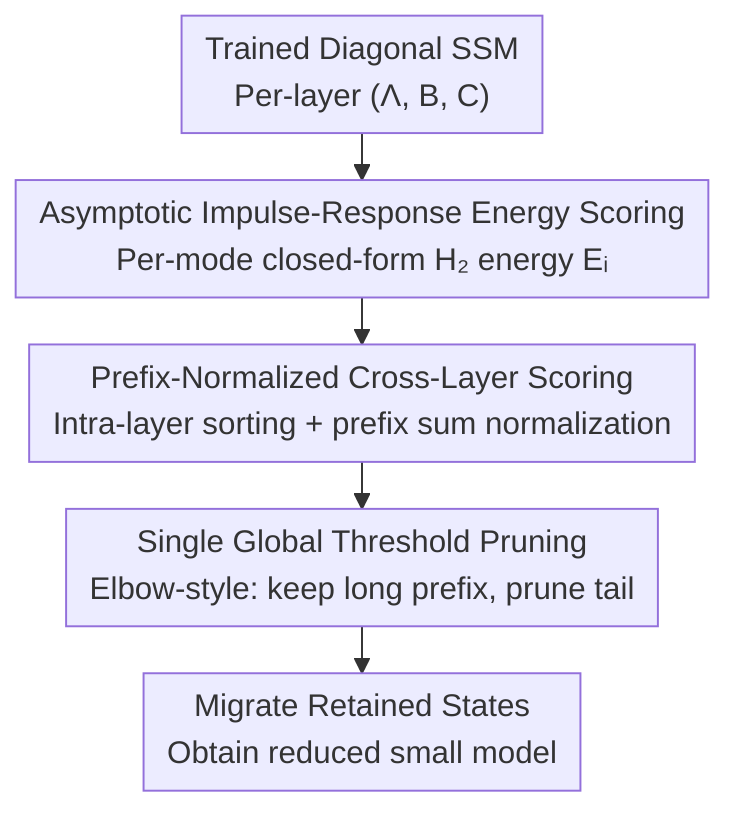

# AIRE-Prune: Asymptotic Impulse-Response Energy for State Pruning in State Space Models

**Conference**: ICLR2026  
**OpenReview**: [https://openreview.net/forum?id=JLUxTl1Um6](https://openreview.net/forum?id=JLUxTl1Um6)  
**Code**: https://github.com/falcon-arrow/AIRE-Prune (Code release promised in paper)  
**Area**: Model Compression / State Space Models  
**Keywords**: State Space Models, Structured Pruning, Model Order Reduction, Impulse Response Energy, Post-Training Compression

## TL;DR
AIRE-Prune calculates a closed-form "infinite-horizon impulse response energy" score for each state of diagonal State Space Models (SSMs). By using prefix normalization to align scores across different layers to a common scale, it prunes an average of 60.8% of states using only a single global threshold without retraining, while maintaining accuracy within a 0.29 percentage point drop.

## Background & Motivation
**Background**: Modern deep State Space Models (S4, S5, Mamba, etc.) efficiently model long sequences by compressing input history into internal states. The key variable determining the computational cost and memory footprint is the **state dimension $n$** per layer. To ensure stable training, mainstream approaches either use multiple parallel small SISO subsystems with channel mixing (multi-SISO) or shared-state MIMO systems (S5-style). In both cases, the state dimension is fixed after training.

**Limitations of Prior Work**: Trained SSMs are typically **heavily over-parameterized**—many states contribute almost nothing to the final output but still consume full computational power and memory during inference. Existing complexity optimizations (frequency domain kernels, transfer function parameterization) either only accelerate training/inference without addressing redundancy in the learned state space, or they restrict the search space or only ensure stability at initialization. In short, there is a lack of a **post-training** mechanism to directly reduce $n$.

**Key Challenge**: To remove states without retraining, one needs an importance metric that is comparable across layers and reflects "how much output distortion is caused by removing this state." The most closely related work, LAST, uses **worst-case** frequency domain gain ($H_\infty$ perspective, i.e., peak amplification) and implements global selection through layer normalization. However, worst-case metrics are conservative for typical workloads—they emphasize peak resonances that tasks rarely trigger, thus underestimating many states that could otherwise be pruned.

**Goal**: Design a post-training, layer-adaptive structured state pruning criterion for diagonal SSMs that (1) provides a closed-form, fast-to-calculate importance score for each state; (2) allows global comparison across layers; (3) works with a simple "one-size-fits-all" global threshold without per-layer tuning or retraining.

**Key Insight**: The authors return to the standard definition of "state importance" in classical linear system theory—how much **output energy** a state direction can transfer from input to output. For stable discrete LTI systems, this energy is the summation of the squared impulse response over an infinite time horizon (equivalent to $H_2$ energy), representing a **typical case** rather than a worst-case quantity.

**Core Idea**: Replace LAST's "worst-case peak gain" ($H_\infty$) with "infinite-horizon impulse response energy" ($H_2$) to score states. This generalizes classical modal truncation from single systems to deep stacks with non-linearities, achieving aggressive compression with negligible accuracy cost.

## Method

### Overall Architecture
AIRE-Prune treats each SSM layer as a diagonal discrete LTI system $x_{k+1}=\Lambda x_k+Bu_k,\ y_k=Cx_k$, where $\Lambda=\mathrm{diag}(\lambda_1,\dots,\lambda_n)$ and all poles strictly lie within the unit circle ($|\lambda_i|<1$ ensures convergence of the infinite sum). Pruning follows four steps: first, calculate a closed-form energy score for each mode (state) in every layer; second, sort modes within each layer and perform prefix normalization to make scores comparable across layers; third, use a single global threshold to uniformly decide which states to keep or remove across all layers; finally, migrate the retained states into a reduced-dimension small model. The entire process is **one-shot scoring, global application, and no retraining**.

### Key Designs

**1. Asymptotic Impulse-Response Energy Scoring: Measuring state importance via typical-case energy instead of worst-case gain**

To address the conservatism of worst-case metrics, the authors define state importance as the total output energy contributed over an infinite time horizon. For a single diagonal mode $\Sigma_i:(\lambda_i, B_{i,:}, C_{:,i})$, the output at step $t$ under a unit impulse is the rank-one slice $H_t^{(i)}=C_{:,i}\,\lambda_i^t\,B_{i,:}$, with a squared Frobenius norm $\|H_t^{(i)}\|_F^2=|\lambda_i|^{2t}\,\|C_{:,i}\|_2^2\,\|B_{i,:}\|_2^2$. Summing $t$ from 0 to $\infty$ yields a geometric series that converges (since $|\lambda_i|<1$), providing the closed-form per-mode energy score:

$$\mathrm{EnergyScore}_{\text{local}}(x_i)=E_i=\frac{\|C_{:,i}\|_2^2\,\|B_{i,:}\|_2^2}{1-|\lambda_i|^2}.$$

This score offers three advantages: **modal separability** (calculated independently for each state without solving large matrices), **scale awareness** (via the coupled norm of $B/C$ reflecting controllability/observability), and **dynamics awareness** (via the pole damping $|\lambda_i|$ reflecting memory length). A state that is easier to excite (large $\|B_{i,:}\|$), easier to measure (large $\|C_{:,i}\|$), and has longer memory (large $|\lambda_i|$) yields a higher $E_i$, indicating greater distortion if pruned. The comparison with LAST is clear: LAST uses $H_\infty$ peak gain $\frac{\|C_i\|^2\|B_i\|^2}{(1-|\lambda_i|)^2}$ (denominator is $(1-|\lambda_i|)^2$), while AIRE uses $H_2$ total energy $\frac{\|C_i\|^2\|B_i\|^2}{1-|\lambda_i|^2}$ (denominator is $1-|\lambda_i|^2$). The former emphasizes rare task peaks, while the latter reflects actual energy expenditure in typical scenarios, making it more suitable for standard workloads.

The layer-level energy can be approximated as the sum of modal energies $\|\Sigma\|_{\text{energy}}^2\approx\sum_i E_i$. The change in layer energy caused by pruning a set of states $P$ is approximately equal to the sum of their individual energies $\sum_{i\in P}E_i$. Thus, "pruning modes with the smallest energy" minimizes layer-level steady-state distortion.

**2. Prefix-Normalized Cross-Layer Scoring: Aligning energy across layers to a global scale**

Directly comparing $E_i$ across layers is problematic—different layers may have energy magnitudes varying by orders of magnitude due to differing encoder/decoder gains. The authors first sort the modes by energy in descending order within each layer, denoted as $E^{(\ell)}_{(i)}$ for the $i$-th largest, calculate the prefix sum $S^{(\ell)}_{(i)}=\sum_{j\le i}E^{(\ell)}_{(j)}$, and then define the prefix-normalized score:

$$\mathrm{AIRE\text{-}Prune}\big(x^{(\ell)}_{(i)}\big)=\frac{E^{(\ell)}_{(i)}}{S^{(\ell)}_{(i)}+\varepsilon}.$$

This "hazard-rate" style ratio is monotonically non-increasing with respect to $i$. It normalizes each state relative to the "cumulative energy of all more important states preceding it," mapping all layers to the same scale for thresholding. $\varepsilon$ is a small constant for numerical stability. This follows LAST's layer normalization logic but uses $H_2$ energy in the numerator.

**3. Single Global Threshold Pruning: Layer-adaptive "elbow" pruning via one threshold**

With cross-layer comparable scores, given a global threshold $\tau$ (or a target pruning rate $p$ which implies a budget $B=\sum_\ell n_\ell\cdot(1-p)$ where $\tau$ is the $B$-th largest score), the longest prefix of states with scores $\ge\tau$ is retained in each layer, while the remaining tail is pruned. Due to the monotonicity of the prefix-normalized scores, this naturally creates an "elbow" style layer-adaptive rule: layers that can be compressed are pruned heavily, while sensitive layers are spared, all automatically allocated by a single threshold. Experiments show that this rule keeps accuracy close to the full model until very high pruning rates, suggesting AIRE's scoring effectively separates important states from irrelevant ones (large head-tail separation). At high pruning rates, it can even push all states of a layer below the threshold, resulting in **entire layer removal**, converting fine-grained sparsity into block-level pruning for better hardware deployment.

### Loss & Training
This method is a **post-training, zero-retraining** one-shot pruning approach: all scores are calculated once in closed-form using the learned $(\Lambda,B,C)$. After pruning, the parameters are frozen and evaluated directly without any additional training objectives or fine-tuning. The algorithmic complexity lies mainly in intra-layer sorting and prefix sums.

## Key Experimental Results

### Main Results
Evaluation was conducted on S5 (MIMO) backbones across six Long Range Arena (LRA) tasks + Speech Commands 35-class keyword spotting (sequence length 16,000), using a single H100. All were one-shot pruned without retraining. The table below shows pruning rates (Prun.) and accuracy (Acc.) after pruning, comparing against strong baselines like LAST (baseline numbers from Gwak et al., 2025):

| Task (Seq Length) | S5 Full Model Acc. | LAST Prun./Acc. | AIRE-Prune Prun./Acc. |
|--------|------|------|------|
| ListOps (2,048) | 61.48 | 0% / 61.48 | 20% / 61.48 |
| Text (4,096) | 88.88 | 60% / 88.52 | 80% / 88.24 |
| Retrieval (4,000) | 91.20 | 50% / 90.42 | 50% / 90.11 |
| Image (1,024) | 87.30 | 30% / 86.34 | 65% / 87.30 |
| Pathfinder (1,024) | 95.15 | 30% / 94.45 | 80% / 95.15 |
| Path-X (16,384) | 98.41 | 30% / 97.95 | 70% / 98.41 |
| Speech (16,000) | 96.43 | 20% / 96.31 | 45% / 96.40 |

**Average Results**: AIRE-Prune prunes an average of 60.8% of states with only a 0.29pp drop, whereas Uniform $H_\infty$ drops 4.32pp, Global $H_\infty$ drops 7.51pp, and LAST drops 0.52pp with an average pruning rate of only ~33% (AIRE is ~1.8× higher). Under a "$\le 1$pp loss" criterion, Text and Pathfinder can be compressed by 80%, Path-X by 70%, Image by 65%, and Retrieval by 50%. Even ListOps, often considered "uncompressible," can be pruned by 20%.

### Cross-Architecture Generalization & Value

| Configuration | Key Metrics | Note |
|------|---------|------|
| S5 (Main Backbone) | Avg 60.8% Pruning, −0.29pp | MIMO backbone, consistently outperforms baselines |
| S4D | Text 90%, Image 40% | Closely follows full model accuracy |
| Mamba (S6) | Text 45%, Retrieval 60%, Image 80% | Negligible degradation; prunability not tied to specific parameterization |
| Inference Speedup (S5) | 1.2×–2.9× | Largest gains in high-pruning tasks (Pathfinder/Path-X) |
| Parameter Reduction (S5) | 19%–65% | Converts sparsity into actual compute/memory savings |

### Key Findings
- **Scoring Quality is Critical**: AIRE's accuracy-pruning curve shows a clear "elbow" or plateau (maintaining accuracy until a high threshold, then dropping sharply), whereas baselines slide down smoothly. The plateau indicates that AIRE clearly separates important states from irrelevant ones, while smooth declines suggest baselines are pruning both types simultaneously.
- **Task-Dependent Layer Profiles**: Path-X/Pathfinder primarily prune later layers, achieving entire layer deletion at high pruning rates. Text/Retrieval retain more in early layers, with middle and later layers contributing most of the budget. ListOps requires non-trivial contributions from all layers, resulting in an early elbow and a conservative 20% pruning limit. This heterogeneous behavior contrasts with LAST's more uniform layer pruning.
- **$H_2$ vs $H_\infty$ core difference**: Changing the denominator from $(1-|\lambda_i|)^2$ to $1-|\lambda_i|^2$ (i.e., from peak gain to total energy) is the fundamental reason AIRE outperforms $H_\infty$-based baselines.

## Highlights & Insights
- **Pruning modern SSMs with classical control theory's $H_2$ energy**: Transferring modal/balanced truncation concepts from single systems to non-linear deep stacks while maintaining diagonal parameterization is a elegant application of "old theory for new problems."
- **Closed-form, modal-separable scores**: $E_i=\frac{\|C_{:,i}\|^2\|B_{i,:}\|^2}{1-|\lambda_i|^2}$ bypasses large matrix equations. It independently scores each state, clearly encoding controllability, observability, and damping, making it extremely easy to implement.
- **Prefix normalization as the key trick for global selection**: Treating the ratio of "current energy vs. prefix cumulative energy" as the score—making it monotonic and scale-aligned—enables "one global threshold for all layers." This normalization logic is transferable to other pruning scenarios requiring cross-module alignment.
- **Scaling fine-grained state sparsity to block-level deletion**: High pruning rates can push entire layers below the threshold for deletion, which is far more deployment-friendly than scattered sparsity.

## Limitations & Future Work
- **Restricted to diagonal (or diagonalizable) SSMs**: The method relies on "layer energy additive decomposition" and closed-form modal energy under diagonal parameterization. It is not directly applicable to non-diagonal/general implementations without further derivation.
- **Cost of typical-case metrics**: Since $H_2$ is a typical-case quantity, there is no explicit bound on worst-case distortion for adversarial/atypical inputs that might trigger peaks (unlike LAST's $H_\infty$ bounds). Safety-critical scenarios might require a combination of both metrics.
- **Approximation of layer energy sum**: The assumption that $\|\Sigma\|^2_{\text{energy}}\approx\sum_i E_i$ and that pruned energy $\approx\sum_{i\in P}E_i$ are approximations. Approximation errors may grow when states are strongly coupled.
- **Evaluation mostly on LRA + Speech, S5/S4D/Mamba**: It has not yet been tested on large-scale generative SSMs for language modeling. Whether the "$\le 1$pp loss" criterion holds for much larger models remains to be verified.
- **Future Directions**: Combining zero-retraining pruning with lightweight fine-tuning might further increase the safe pruning budget. Merging $H_2$ energy criteria with $H_\infty$ bounds could balance typical and worst-case scenarios.

## Related Work & Insights
- **vs. LAST (Gwak et al., 2025)**: Both use layer-adaptive prefix normalization and single-threshold global pruning. However, LAST uses worst-case $H_\infty$ peak gain (denominator $(1-|\lambda_i|)^2$), while AIRE uses infinite-horizon $H_2$ total energy (denominator $1-|\lambda_i|^2$). AIRE is a typical-case criterion with stronger head-tail separation, achieving ~1.8× the average pruning rate with lower accuracy loss (0.29 vs 0.52pp).
- **vs. Modal/Balanced Truncation (Classical MOR)**: Balanced truncation deletes states with minimum energy in a realization that is simultaneously controllable and observable. While it has strong error bounds, the required similarity transforms destroy the diagonal structure required for modern SSM efficiency. AIRE maintains diagonal parameterization and per-state granularity while extending single-system logic to deep non-linear stacks.
- **vs. Magnitude Pruning (Uniform/Global magnitude, LAMP)**: SSMs are governed by transfer functions and dynamic coupling rather than just static weight magnitudes. AIRE's energy score, which encodes controllability, observability, and damping, significantly outperforms magnitude-based baselines.

## Rating
- Novelty: ⭐⭐⭐⭐ Introducing $H_2$ asymptotic energy to deep SSM pruning is a clear and well-justified step beyond LAST.
- Experimental Thoroughness: ⭐⭐⭐⭐ Covers LRA + Speech and three backbones (S5/S4D/Mamba) with system gains, though lacks large-scale generative SSMs.
- Writing Quality: ⭐⭐⭐⭐ Clear theoretical derivation, intuitive contrast with LAST, and complete presentation of algorithms/formulas.
- Value: ⭐⭐⭐⭐ Post-training, zero-retraining, closed-form, and ready-to-use with a single threshold; strong potential for engineering deployment.

<!-- RELATED:START -->

## Related Papers

- [\[ICLR 2026\] The Curious Case of In-Training Compression of State Space Models](the_curious_case_of_in-training_compression_of_state_space_models.md)
- [\[ACL 2025\] State-offset Tuning: State-based Parameter-Efficient Fine-Tuning for State Space Models](../../ACL2025/model_compression/state_offset_tuning_ssm_peft.md)
- [\[ICML 2025\] Parameter-Efficient Fine-Tuning of State Space Models](../../ICML2025/model_compression/parameter-efficient_fine-tuning_of_state_space_models.md)
- [\[ICLR 2026\] SSDi8: Accurate and Efficient 8-bit Quantization for State Space Duality](ssdi8_accurate_and_efficient_8-bit_quantization_for_state_space_duality.md)
- [\[CVPR 2025\] EfficientViM: Efficient Vision Mamba with Hidden State Mixer based State Space Duality](../../CVPR2025/model_compression/efficientvim_efficient_vision_mamba_with_hidden_state_mixer_based_state_space_du.md)

<!-- RELATED:END -->
