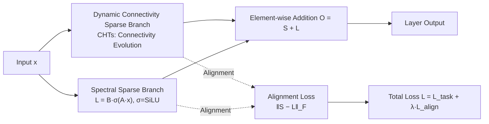

# Alignment-Enhanced Integration of Connectivity and Spectral Sparsity in Dynamic Sparse Training of LLM

**Conference**: ICLR 2026  
**OpenReview**: [https://openreview.net/forum?id=jZplmg7Ad9](https://openreview.net/forum?id=jZplmg7Ad9)  
**Code**: Provided in supplementary materials (repository not public)  
**Area**: Model Compression / Parameter-Efficient Pre-training  
**Keywords**: Dynamic Sparse Training, Low-rank Decomposition, Connectivity Sparsity, Spectral Sparsity, Cancellation Effect, Alignment Loss  

## TL;DR
This work for the first time integrates **dynamic connectivity sparsity** (CHTs) and **dynamic low-rank spectral sparsity** into a unified sparse pre-training framework. It discovers that a naive summation of the two branches leads to an output "cancellation" effect and introduces a simple alignment loss to synchronize them. The resulting CHTsL approaches dense performance on LLaMA-60M/130M while retaining only 10%–30% of the parameters.

## Background & Motivation
**Background**: Training LLMs from scratch is extremely memory and compute-intensive, leading to the emergence of parameter-efficient sparse pre-training. This field is divided into two branches: **connectivity sparse training** (enforcing sparsity on the weight matrix structure, represented by Dynamic Sparse Training (DST) like SET/RigL/MEST/CHT/CHTs) and **spectral sparse training** (constraining weight subspaces via low-rank decomposition, such as ReLoRA/GaLore, or CoLA which maintains low-rank throughout training and inference). Both have strengths: DST approaches dense performance at 10% parameters, while low-rank excels at capturing the global subspace.

**Limitations of Prior Work**: There is almost no work combining these two branches. The only pioneer, SLTrain, has two major flaws: (1) its sparse branch is **static**, acting only as a "supplement" to the low-rank component without leveraging the power of dynamic connectivity; (2) it merely performs a **direct summation** of sparse and low-rank outputs without any collaborative mechanism.

**Key Challenge**: The authors observe that when the sparse branch output $S$ and the low-rank branch output $L$ are trained together, they often **point in opposite directions**—one pushes a feature positively while the other pushes it negatively, neutralizing the net effect and wasting expressive capacity. This **cancellation effect** prevents naive summation $S+L$ from effectively carrying information from both branches, particularly in the Q and K matrices of the Attention mechanism, where dot products are highly sensitive to inconsistencies.

**Goal**: Establish a unified framework that truly merges dynamic connectivity sparsity and dynamic spectral sparsity, quantifying and mitigating the cancellation effect to enable synergy between branches.

**Core Idea**: **Use an alignment loss to pull the outputs of the sparse and low-rank branches into the same direction**, combined with activation stabilization for the low-rank branch, transforming "cancellation" into "complementary collaboration."

## Method

### Overall Architecture
The framework consists of three steps: first, use the OCR metric to **identify and quantify** the cancellation effect; second, use a **training framework** composed of alignment loss and activation adjustments to stabilize collaboration; finally, instantiate the framework as **CHTsL** using state-of-the-art CHTs and low-rank branches. Each layer output is the sum of the branches $O^{(l)}=S^{(l)}+L^{(l)}$. During the forward pass, branches are calculated in parallel; during the backward pass, the alignment loss pulls them together.

### Key Designs

**1. OCR Metric: Quantifying "Cancellation" into an Observable Number**—The authors translate intuition into a metric, defining the **Overlap Cancellation Ratio**: $\mathrm{OCR}=\frac{\sum_i \min(|S_i|,|L_i|)\cdot\mathbb{1}\{S_iL_i<0\}}{\sum_i \min(|S_i|,|L_i|)+\varepsilon}$. The numerator calculates the volume of the neutralized overlapping signal where the two branches have **opposite signs** ($S_iL_i<0$), while the denominator represents the total overlapping signal. OCR ranges in $[0,1)$, where higher values indicate more severe cancellation. This metric allows the "conflict" between branches to be tracked per layer and training step.

**2. Alignment Loss: Synchronizing Branches for Collaboration**—Since cancellation stems from directional conflict, the direct solution is to penalize the difference between branch outputs. The authors define $L^{(l)}_{\text{align}}=\frac{1}{BN}\lVert S^{(l)}-L^{(l)}\rVert_F$ for each layer (where $B$ is batch size and $N$ is the number of elements in the output). The total loss is $L_{\text{align}}=\sum_l L^{(l)}_{\text{align}}$. This Frobenius norm penalty encourages the sparse and low-rank outputs to be consistent, reducing destructive interference. The goal is not to make them identical (which would collapse to a single branch) but to reduce conflict so each branch focuses on complementary aspects. It is weighted by $\lambda$ in the total objective.

**3. Low-rank Activation Stabilization: Ensuring Reliable Output**—Low-rank decomposition can become unstable or lose scale control under extreme sparsity. Borrowing from CoLA, the authors insert a mild non-linearity between the two low-rank factor matrices: $L^{(l)}=B^{(l)}\,\sigma(A^{(l)}x)$, where $\sigma$ is SiLU. The role of activation here is not to enhance expressiveness but to **maintain reasonable scales and prevent numerical divergence**, ensuring the low-rank branch works stably alongside the sparse branch.

**4. CHTsL Instantiation and Unified Objective**—The framework is implemented with CHTs (connectivity evolution inspired by the Cannistracci-Hebbian theory from brain connectomics) as the sparse branch and a stabilized low-rank branch. The total objective is $L=L_{\text{task}}+\lambda L_{\text{align}}$, where $\lambda$ balances alignment strength (0.5 for LLaMA-60M/OpenWebText and 130M; 0.3 for 60M/C4). Joint optimization under this objective stabilizes training and fosters collaboration.

## Key Experimental Results

Models: LLaMA-60M / 130M; Data: OpenWebText, C4; Budgets: Retain 10%/20%/30% of dense parameters (total sparsity 0.9/0.8/0.7). Sparsity is defined as $s=1-\#\text{params}/\#\text{params}_{\text{dense}}$. For hybrid methods, $s_{\text{total}}=1-d_{\text{conn}}-d_{\text{spec}}$, ensuring total trainable parameters remain consistent across methods.

### Main Results (Validation PPL↓, Excerpt)

| Dataset | Method | 60M s=0.9 | 60M s=0.8 | 60M s=0.7 | 130M s=0.9 | 130M s=0.8 | 130M s=0.7 |
|---|---|---|---|---|---|---|---|
| OpenWebText | Dense | 26.56 | — | — | 19.46 | — | — |
| | CHTs | 33.03 | 29.84 | 28.12 | 24.75 | 22.67 | 21.48 |
| | CoLA | 37.58 | 30.87 | 28.53 | 27.07 | 23.24 | 21.61 |
| | SLTrain | 33.90 | 29.83 | 27.86 | 25.33 | 22.81 | 21.25 |
| | **CHTsL** | **31.77** | **29.11** | **27.40** | **24.07** | **21.87** | **20.65** |
| C4 | Dense | 33.21 | — | — | 24.55 | — | — |
| | CHTs | 40.62 | 37.55 | 35.23 | 31.00 | 28.69 | 27.46 |
| | SLTrain | 41.05 | 37.00 | 34.89 | 31.38 | 28.28 | 26.78 |
| | **CHTsL** | **39.29** | **35.95** | **34.19** | **30.03** | **27.59** | **26.19** |

Ours (CHTsL) is the optimal sparse method across **all** model/data/sparsity combinations, coming closest to dense performance (e.g., 20.65 vs. 19.46 for 130M/OpenWebText/s=0.7).

### Ablation Study (Comparison of Integration Strategies, PPL↓)

| Model/Data | Total Sparsity | Naive (Sum) | Act (+Activation) | Act+Align (+Alignment) |
|---|---|---|---|---|
| 60M/OpenWebText | 0.9 | 32.64 | 32.21 | **31.77** |
| 60M/C4 | 0.9 | 189.55 | 39.66 | **39.29** |
| 60M/C4 | 0.7 | 591.42 | 34.55 | **34.33** |
| 130M/OpenWebText | 0.9 | 119.35 | 24.45 | **24.07** |
| 130M/C4 | 0.7 | 920.16 | 26.55 | **26.19** |

Wilcoxon signed-rank test: $p=0.00049$ for Act+Align vs. Naive and Act, both $<0.05$. Naive summation **catastrophically collapses** under extreme sparsity (PPL in the hundreds). Activation restores stability, and alignment further improves results.

### Key Findings
- **Cancellation primarily occurs in Q and K**: OCR layer-wise curves show alignment loss significantly reduces OCR in Query/Key layers, whereas V/O and FFN are more tolerant due to residual connections. Q and K determine attention weights, making them most sensitive to inconsistencies.
- **Sparsity Configuration Sensitivity**: At a fixed total sparsity of 0.7, OpenWebText (homogeneous corpus) favors a higher proportion of connectivity sparsity. In contrast, C4 (diverse corpus) benefits from a higher low-rank proportion to adapt to varied linguistic patterns across the weight matrix.

## Highlights & Insights
- **Translating Vague Intuition into Measurable Metrics**: OCR is not just a diagnostic tool; it turns "branch conflict" into an observable, optimizable target.
- **Compelling Evidence of Collapse under Extreme Sparsity**: The massive PPL spikes (189/591/920) for the Naive method demonstrate that simple addition is "unusable" rather than just "suboptimal," highlighting the necessity of alignment/activation.
- **Self-consistent Explanation for Q/K Sensitivity**: Explaining the benefit through the sensitivity of attention dot products, supported by OCR curves, provides a complete causal chain.
- **Unifying Disconnected Sparsity Paradigms**: Effectively making dynamic connectivity and spectral sparsity collaborate "dynamically" for the first time.

## Limitations & Future Work
- **Scale Constraints**: Only validated on LLaMA-130M via PPL. Testing on larger models (1B+) or downstream tasks is needed to confirm scalability.
- **Heuristic Alignment Loss**: Directly penalizing $\lVert S-L\rVert_F$ lacks theoretical grounding for the "optimal degree of alignment," and $\lambda$ requires per-setting searches (0.3–0.5).
- **Search Cost for Sparse Configuration**: The allocation between sparse and low-rank parameters requires systemic grid searching, which increases deployment costs.
- **Computational Overhead**: The additional FLOPs/memory cost of layer-wise alignment loss and activations was not quantitatively analyzed.

## Related Work & Insights
- **Dynamic Connectivity Sparsity**: Evolution from SET (random reconnect) → RigL (gradient-based) → MEST (weight+gradient) → CHT/CHTs (SOTA). CHTs is used as the sparse branch here.
- **Spectral Sparsity/Low-rank**: Evolution from LoRA (fine-tuning) → ReLoRA/GaLore (pre-training with dense forward pass) → CoLA (full low-rank training/inference). Low-rank and activation designs here draw from CoLA.
- **Insight**: "Output directional conflict" may be a hidden performance killer when combining complementary modules via simple addition. Defining a cancellation metric and consistency regularization is a generic strategy for shifting modules from competition to collaboration, applicable to MoE or ensemble scenarios.

## Rating
- **Novelty**: ⭐⭐⭐⭐ — First dynamic fusion of connectivity and spectral sparsity; the combination of OCR and alignment loss is elegant and addresses the pain points of SLTrain.
- **Experimental Thoroughness**: ⭐⭐⭐ — Solid evidence across two models, two datasets, and three sparsity levels, plus statistical tests; however, lacks large-scale and downstream task validation.
- **Writing Quality**: ⭐⭐⭐⭐ — Clear logic from problem to diagnosis to method; self-consistent explanations for OCR and Q/K behavior.
- **Value**: ⭐⭐⭐⭐ — Provides a practical recipe for "how to merge the two paradigms" in parameter-efficient sparse pre-training.

<!-- RELATED:START -->

## Related Papers

- [\[ICLR 2026\] Dr.LLM: Dynamic Layer Routing in LLMs](drllm_dynamic_layer_routing_in_llms.md)
- [\[ICLR 2026\] ODESteer: A Unified ODE-Based Steering Framework for LLM Alignment](odesteer_a_unified_ode-based_steering_framework_for_llm_alignment.md)
- [\[ICLR 2026\] SLA: Beyond Sparsity in Diffusion Transformers via Fine-Tunable Sparse–Linear Attention](sla_beyond_sparsity_in_diffusion_transformers_via_fine-tunable_sparselinear_atte.md)
- [\[ICLR 2026\] Robust Training of Neural Networks at Arbitrary Precision and Sparsity](robust_training_of_neural_networks_at_arbitrary_precision_and_sparsity.md)
- [\[ICLR 2026\] LeSTD: LLM Compression via Learning-based Sparse Tensor Decomposition](lestd_llm_compression_via_learning-based_sparse_tensor_decomposition.md)

<!-- RELATED:END -->
