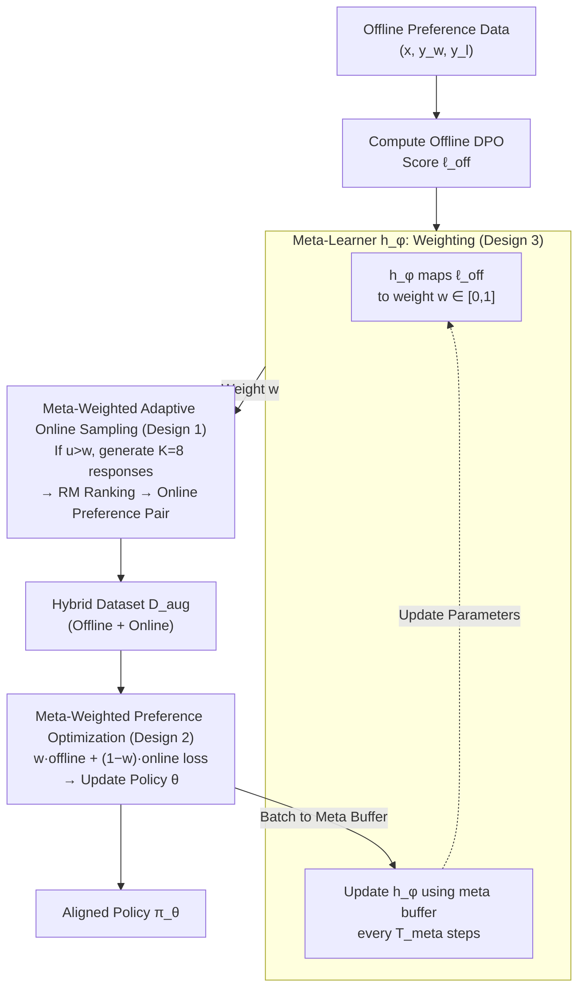

# Alignment through Meta-Weighted Online Sampling: Bridging the Gap between Data Generation and Preference Optimization

**Conference**: ICLR 2026  
**arXiv**: [2509.23371](https://arxiv.org/abs/2509.23371)  
**Code**: [https://github.com/junming-yang/MetaAPO](https://github.com/junming-yang/MetaAPO)  
**Area**: LLM Alignment / Preference Optimization  
**Keywords**: Preference Optimization, Online Sampling, Meta-Learning Weights, Distribution Mismatch, DPO  

## TL;DR
The MetaAPO framework is proposed, using a lightweight meta-learner (two-layer MLP) to dynamically estimate the alignment gap between offline and online data. It guides "which prompts require online sampling" (addressing distribution mismatch) and adaptively weights offline/online data during training (optimizing learning efficiency). MetaAPO surpasses baselines like DPO and Online DPO on AlpacaEval 2, Arena-Hard, and MT-Bench while reducing online labeling costs by 42%.

## Background & Motivation

**Background**: Offline preference optimization methods like DPO are simple and efficient, but the distribution mismatch (OOD issue) between offline data and the dynamically evolving policy limits alignment effectiveness. Online methods like Online DPO mitigate mismatch through on-policy sampling but ignore the value of high-quality offline data.

**Limitations of Prior Work**: (a) Offline methods are restricted by fixed data distributions; (b) Online methods are costly and lack diversity (relying on current policy capabilities); (c) Hybrid methods use heuristic/static thresholds for data selection, overlooking the interaction between data sampling and the optimization process.

**Key Challenge**: Offline data is efficient and diverse but misaligned in distribution; online data is distribution-aligned but lacks diversity and quality—requiring a dynamic balance between the two based on the model's current state.

**Goal**: Design an adaptive framework that tightly couples data generation with preference optimization—allowing the model to decide "which samples need online resampling" and "what weights to assign to offline vs. online data."

**Key Insight**: Use a meta-learner to map the DPO preference score of each sample to a weight. Low weights trigger online resampling, while high weights retain offline data—the weight controls both sampling and training.

**Core Idea**: A meta-learner simultaneously serves as an "alignment gap estimator" and a "sample weight assigner," tightly coupling online sampling with preference optimization.

## Method

### Overall Architecture
MetaAPO aims to resolve the contradiction where offline data is efficient but misaligned, while online data is aligned but lacks diversity, and previous hybrid methods relied on fixed thresholds/ratios. It introduces a lightweight meta-learner $h_\phi$ (a two-layer MLP) as a hub—a single output weight $w$ determines both whether a prompt requires online resampling and the loss weighting for offline/online samples during training. The training iterates through $T$ subsets of the dataset within one epoch: for each subset, the meta-learner evaluates the alignment of offline samples with the current policy, triggering online sampling for poorly aligned ones; then, a weighted preference loss updates the policy on the hybrid dataset; finally, the meta-learner is updated at fixed intervals. These three modules alternate to synchronize data generation and preference optimization.

### Key Designs

**1. Meta-Weighted Adaptive Online Sampling: Resampling only for "Lagging" Prompts**

The pain point of fully online methods is resampling all prompts, which is costly and redundant. Ours triggers resampling on demand: for each offline sample $(x, y_w^{\text{off}}, y_l^{\text{off}})$, the DPO preference score $\ell^{\text{off}}$ is computed. The meta-learner maps this to $w = h_\phi(\ell^{\text{off}}) \in [0,1]$. A lower $w$ indicates higher misalignment. Sampling $u \sim U(0,1)$, online generation of $K=8$ responses occurs only when $u > w$, followed by reward model ranking. Well-aligned samples reuse offline data, while only necessary prompts incur online labeling costs, reducing annotation volume by 42%.

**2. Meta-Weighted Preference Optimization: Dynamically Balancing Offline/Online Loss**

MetaAPO reuses $w$ as the mixing coefficient during training. The loss is defined as:

$$\mathcal{L}(\theta) = -\mathbb{E}\big[\,w \cdot \ell_\theta(\text{offline}) + (1-w) \cdot \ell_\theta(\text{online})\,\big],\quad w = h_\phi(\ell^{\text{off}}).$$

Samples with high $w$ rely more on reliable offline human annotations; samples with low $w$ utilize online data for correction. This sample-wise adaptation is more flexible than fixed ratios, as the optimal balance varies across samples and training stages. Using the same weight for sampling and optimization avoids decoupling the pipeline.

**3. Alternating Updates and Theoretical Guarantees: Learning Choice via Meta-Optimization**

The meta-learner updates alongside the policy. Every $T_{\text{meta}}=8$ steps, the policy $\pi_\theta$ is frozen, and $h_\phi$ is trained using the accumulated meta buffer $\mathcal{B}_{\text{meta}}$. Gradient analysis (Eq.7) shows the update is proportional to $(\ell^{\text{on}} - \ell^{\text{off}}) \cdot \nabla_\phi h_\phi$. When online scores are higher ($\ell^{\text{on}} > \ell^{\text{off}}$), the meta-learner automatically decreases the offline weight. Theorem 1 provides a generalization bound, showing that the meta-learner's learned weights approach optimality when the meta-buffer is sufficiently large and the hypothesis space is simple (justifying the use of a simple two-layer MLP).

## Key Experimental Results

### Main Results (Llama-3.1-8B)

| Method | AlpacaEval 2 LC(%) | Arena-Hard SC(%) | MT-Bench |
|------|-------------------|-----------------|----------|
| SFT | 17.28 | 21.6 | 6.63 |
| DPO | ~21 | ~24 | ~7.1 |
| Online DPO | ~25 | ~28 | ~7.3 |
| Selective DPO | ~22 | ~25 | ~7.1 |
| SELM (Hybrid) | ~24 | ~27 | ~7.2 |
| **MetaAPO (Ours)** | **Best** | **Best** | **Best** |

Ours consistently outperforms offline, online, and hybrid baselines across all three benchmarks. Online labeling costs are reduced by 42% compared to Online DPO.

### Ablation Study
- Removing adaptive sampling → Online ratio becomes uncontrolled, performance drops.
- Removing meta-weight training → Degenerates into fixed-weight mixing.
- Removing meta-learner updates → Weights fail to adapt to policy evolution.
- MetaAPO is compatible with various objectives (DPO, SimPO, KTO).

### Key Findings
- The meta-learner favors low weights (more online sampling) in early training and increases weights later (relying on offline data as alignment improves)—an intuitive adaptive behavior.
- A two-layer MLP is sufficient; complex networks perform worse due to overfitting, consistent with theoretical analysis.
- Effectiveness on Qwen2.5-7B proves cross-model transferability.

## Highlights & Insights
- **Dual-role meta-learner**: Using one weight $w$ to control both "whether to sample" and "how to weight loss" is elegant, ensuring seamless coupling.
- **Gradient Intuition**: $(\ell^{on} - \ell^{off}) \cdot \nabla_\phi h_\phi$ automatically determines which data source is superior, surpassing manual heuristics.
- **Cost Efficiency**: Achieving a 42% reduction in labeling while improving performance is highly practical for engineering.
- **Theoretical Support**: Theorem 1 provides a basis for the "simple meta-learner + sufficient buffer" design.

## Limitations & Future Work
- The meta-learner input is limited to scalar DPO scores; incorporating features like prompt difficulty or response diversity might help.
- Online sampling still relies on a reward model; the RM's quality and bias are not discussed.
- Evaluation is limited to single-epoch training; long-term meta-learner drift requires investigation.
- Verification is currently focused on the UltraFeedback dataset and 7-8B models.
- The selection of the update frequency $T_{\text{meta}}=8$ lacks a rigorous derivation.

## Related Work & Insights
- **vs DPO/SimPO (Offline)**: Offline methods fail to adapt to policy evolution; Ours switches to online completion when necessary.
- **vs Online DPO/SPPO (Online)**: Fully online methods sample every prompt; Ours targets specific prompts, increasing efficiency by 42%.
- **vs SELM/ADPO (Hybrid)**: Hybrid methods use static heuristics; MetaAPO's learner is dynamic and learnable.
- **vs Selective DPO**: Loss-based filtering is static; MetaAPO weights adjust dynamically with training.

## Rating
- Novelty: ⭐⭐⭐⭐ The coupling of sampling and optimization via meta-learning is clever.
- Experimental Thoroughness: ⭐⭐⭐⭐ Comprehensive across benchmarks, baselines, and cost analyses.
- Writing Quality: ⭐⭐⭐⭐⭐ Clear intuition through gradient analysis and a well-defined algorithm.
- Value: ⭐⭐⭐⭐ Practical solution for balancing offline/online data in real-world alignment.

<!-- RELATED:START -->

## Related Papers

- [\[ICLR 2026\] Gradient Intrinsic Dimensionality Alignment：Narrowing The Gap Between Low-Rank Adaptation and Full Fine-Tuning](gradient_intrinsic_dimensionalityalignmentnarrowing_the_gap_between_low-rank_ad.md)
- [\[ICLR 2026\] Bridging the Gap Between Promise and Performance for Microscaling FP4 Quantization](bridging_the_gap_between_promise_and_performance_for_microscaling_fp4_quantizati.md)
- [\[AAAI 2026\] MetaGDPO: Alleviating Catastrophic Forgetting with Metacognitive Knowledge through Group Direct Preference Optimization](../../AAAI2026/model_compression/metagdpo_alleviating_catastrophic_forgetting_with_metacognitive_knowledge_throug.md)
- [\[ACL 2026\] Alignment Tuning for Large Language Models: A Data-Centric Lens on Alignment Data Pipelines](../../ACL2026/model_compression/alignment_tuning_for_large_language_models_a_data-centric_lens_on_alignment_data.md)
- [\[ICML 2025\] ConfPO: Exploiting Policy Model Confidence for Critical Token Selection in Preference Optimization](../../ICML2025/model_compression/confpo_exploiting_policy_model_confidence_for_critical_token_selection_in_prefer.md)

<!-- RELATED:END -->
