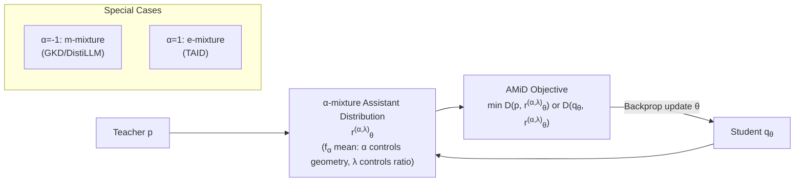

# AMiD: Knowledge Distillation for LLMs with $\alpha$-mixture Assistant Distribution

**Conference**: ICLR 2026  
**OpenReview**: [https://openreview.net/forum?id=7WPJ0EgPdW](https://openreview.net/forum?id=7WPJ0EgPdW)  
**Code**: [https://github.com/aailab-kaist/AMiD](https://github.com/aailab-kaist/AMiD)  
**Area**: Model Compression / Knowledge Distillation  
**Keywords**: Knowledge Distillation, LLM Compression, Assistant Distribution, Information Geometry, α-mixture, mode-covering/mode-seeking  

## TL;DR
This paper unifies various previously proposed "assistant distributions" (teacher-student intermediate distributions) in knowledge distillation into an **α-mixture assistant distribution family** with a newly designed variable $\alpha$ using the "generalized $f_\alpha$-mean" from information geometry. Based on this, the unified distillation framework AMiD is proposed, which theoretically demonstrates optimality, reveals how $\alpha$ regulates mode-covering/mode-seeking behavior, and consistently surpasses existing assistant distribution methods in experiments.

## Background & Motivation
- **Background**: The core of LLM Knowledge Distillation (KD) is to align the token-wise distributions of the teacher and student using a certain divergence. Recent research has focused on "which divergence to choose"—KL (mode-covering), reverse KL (mode-seeking), GKD's generalized JS, ABKD's α-β divergence, etc.—attempting to balance quality and diversity.
- **Limitations of Prior Work**: Merely changing the divergence cannot fundamentally solve two essential challenges: (1) the **capacity gap** between a large teacher and a small student, which is particularly severe in high-dimensional LLM outputs; (2) **numerical instability** caused by a **large number of near-zero probabilities** in high-dimensional probability spaces leading to extreme density ratios (as in KL). To alleviate these, methods like DistiLLM, TAID, and GKD have begun implicitly or explicitly introducing an **assistant distribution $r_\theta$** (an interpolation between teacher $p$ and student $q_\theta$) to serve as a "bridge" for knowledge transfer and stabilize optimization.
- **Key Challenge**: These assistant distributions are currently **fragmented recipes developed independently**—GKD/DistiLLM use the arithmetic mean $\lambda p+(1-\lambda)q_\theta$ (m-mixture), while TAID uses the geometric mean (which this paper identifies as an e-mixture). No study has systematically investigated the geometry of the interpolation path, compatibility with different divergences, or unexplored candidates, leaving various methods at sub-optimal solutions.
- **Goal**: To unify fragmented assistant distributions into a **continuous, adjustable, and theoretically supported** design space and provide a corresponding unified distillation framework.
- **Core Idea** (**Unified Assistant Distribution Family**): Existing assistant distributions are mixtures of $p$ and $q_\theta$ via a "mean function," differing only in the type of mean used. By parameterizing the mean type as a continuous variable $\alpha$ using the generalized $f_\alpha$-mean from information geometry—where $\alpha=-1$ degrades to the arithmetic mean, $\alpha=1$ degrades to the geometric mean, and middle or outer values represent entirely new assistant distributions—the paper opens an **orthogonal new design axis** of "interpolation geometry" beyond "divergence selection."

## Method

### Overall Architecture
AMiD operates in two steps: first, it defines a unified **α-mixture assistant distribution** $r^{(\alpha,\lambda)}_\theta$ via the generalized $f_\alpha$-mean ($\lambda$ controls the interpolation ratio, $\alpha$ controls the interpolation path geometry); second, the distillation objective is modified to "align $r^{(\alpha,\lambda)}_\theta$ with the teacher $p$ or student $q_\theta$," allowing for pairing with any divergence. This framework generalizes existing methods in two dimensions: the assistant distribution dimension ($\alpha$) and the divergence dimension ($D$).

### Key Designs

**1. α-mixture Assistant Distribution: Unifying Fragmented Recipes into a Continuous Family** —— Given $\alpha\in\mathbb{R},\lambda\in[0,1]$, the unnormalized assistant distribution is defined as $\tilde r^{(\alpha,\lambda)}_\theta(z)=\big(\lambda\,p(z)^{\frac{1-\alpha}{2}}+(1-\lambda)\,q_\theta(z)^{\frac{1-\alpha}{2}}\big)^{\frac{2}{1-\alpha}}$ (for $\alpha\neq1$), taking the geometric mean $p^\lambda q_\theta^{1-\lambda}$ when $\alpha=1$. Normalizing this yields $r^{(\alpha,\lambda)}_\theta$. This form originates from generalized $f_\alpha$-means ($\alpha=-1$ for arithmetic, $\alpha=1$ for geometric, $\alpha=3$ for harmonic, and $\alpha\to\pm\infty$ for max/min). Thus, it **subsumes the m-mixture of GKD/DistiLLM ($\alpha=-1$) and the e-mixture of TAID ($\alpha=1$) as special cases**, while populating a vast space of new interpolation distributions never before used in KD. Here, $\lambda$ and $\alpha$ are two orthogonal knobs: once $\alpha$ is fixed, the interpolation "path" is determined, and $\lambda$ merely slides the ratio along that path.

**2. Information Geometry Perspective and Support Controllability** —— The paper proves that $r^{(\alpha,\lambda)}_\theta$ is precisely the internal point in the sense of Amari α-divergence: $r^{(\alpha,\lambda)}=\arg\min_r \lambda D_\alpha(p\|r)+(1-\lambda)D_\alpha(q\|r)$, mapping the "generalization of means" to "geodesics in information geometry"—$\alpha=-1$ corresponds to the minimum point of weighted KL sums (m-geodesic), and $\alpha=1$ corresponds to the minimum point of weighted reverse KL (e-geodesic). $\alpha$ also determines the **support** of the assistant distribution: when $\alpha<1$, $\mathrm{supp}=\mathrm{supp}(p)\cup\mathrm{supp}(q_\theta)$ (matching over a wider region), and when $\alpha\ge1$, the intersection is taken (strengthening matching in overlapping regions). Given the abundance of near-zero probabilities in LLM vocabularies, this property provides an adjustable knob for "where to align." Since $r^{(\alpha,\lambda)}_\theta$ is continuous with respect to $\alpha$, adaptive $\alpha$ curricula based on overlap can be further designed.

**3. AMiD Objective and Optimality Guarantee** —— Distillation is formulated as $\min_\theta \mathbb{E}\sum_l D(p, r^{(\alpha,\lambda)}_\theta)$ or $\min_\theta \mathbb{E}\sum_l D(q_\theta, r^{(\alpha,\lambda)}_\theta)$, which can accommodate any proper divergence and any data strategy (off/on/mixed-policy). A key theorem (Optimality) proves that under perfect optimization assumptions, regardless of the choice of $D, \alpha$, or $\lambda\in(0,1)$, "making the interpolation point coincide with an endpoint" happens if and only if $p=q_\theta$. This theoretically validates DistiLLM ($D_{KL}(p\|r^{(-1,\lambda)}_\theta)$) and TAID ($D_{KL}(r^{(1,\lambda)}_\theta\|q_\theta)$) as legitimate instances.

**4. Gradient Analysis: α Regulating mode-covering and mode-seeking** —— Gradient analysis of the $f$-divergence yields $\nabla_\theta D_f(p\|r^{(\alpha,\lambda)}_\theta)=\mathbb{E}_{r^{(\alpha,\lambda)}_\theta}\!\big[w\cdot(\psi_f(\cdot)-\mathbb{E}[\psi_f])\cdot\nabla_\theta\log q_\theta\big]$, where the weight $w=\frac{(1-\lambda)q_\theta^{(1-\alpha)/2}}{\lambda p^{(1-\alpha)/2}+(1-\lambda)q_\theta^{(1-\alpha)/2}}$ is a per-sample modulation based on the density ratio $p/q_\theta$. Analysis shows that **even with a fixed divergence, $\alpha$ can regulate the modal behavior of the student**: larger $\alpha$ values amplify gradients in regions where the "student underestimates the teacher" (favoring mode-covering), while smaller $\alpha$ values amplify gradients in regions where the "student overestimates" (favoring mode-seeking). This is a unique characteristic derived from the $\alpha$-mixture that cannot be achieved by $\lambda$ or learning rate scheduling alone. Toy experiments (bimodal $p$, unimodal $q_\theta$) verify that $q^*_\theta$ shifts from a converged peak to a heavy-tailed distribution covering the mean as $\alpha$ changes.

## Key Experimental Results

### Main Results Table (Task-Agnostic Instruction Following, ROUGE-L↑, GPT-2 XL 1.5B Teacher; AMiD uses $D_{AB}$, $\lambda=0.1$)

| Student | Method | Avg. (↑) |
|---|---|---|
| GPT-2 (0.1B) | GKD / TAID / DistiLLM(SRKL) / ABKD | 19.77 / 21.24 / 21.30 / 21.76 |
| GPT-2 (0.1B) | **Ours** | **23.40** (≈ Teacher 23.29) |
| GPT-2 Medium (0.3B) | ABKD (Prev. SOTA) | 23.43 |
| GPT-2 Medium (0.3B) | **Ours** | **24.50** |
| GPT-2 Large (0.8B) | ABKD (Prev. SOTA) | 24.88 |
| GPT-2 Large (0.8B) | **Ours** | **25.84** |

AMiD is the best across three student scales, with the 0.1B student's average score even reaching that of the 1.5B teacher.

### Ablation Study Table (Task-Specific Distillation, $D_{KL}$, $\lambda=0.1$; α≠±1 represents new distributions)

| Teacher→Student | Setting | Trans. COMET | Summ. R-L | GSM8K Acc |
|---|---|---|---|---|
| Gemma-7B→2B | $q_\theta$ (No assistant) | 74.21 | 34.88 | 24.26 |
| Gemma-7B→2B | AMiD ($\alpha=-1$, =DistiLLM) | 52.83 | 26.51 | 0.00 |
| Gemma-7B→2B | AMiD ($\alpha=1$, =TAID) | 74.20 | 34.93 | 24.49 |
| Gemma-7B→2B | **AMiD ($\alpha\neq\pm1$, New)** | **74.78** | **35.22** | **24.94** |
| Qwen2-7B→0.5B | $q_\theta$ / $\alpha=-1$ / $\alpha=1$ | 58.07 / 57.23 / 58.17 | 31.67 / 32.27 / 31.65 | 33.13 / 35.63 / 33.28 |
| Qwen2-7B→0.5B | **AMiD ($\alpha\neq\pm1$)** | **58.31** | **32.51** | **36.24** |

New $\alpha$ values (non-endpoint values other than ±1) consistently outperform the special cases that degrade into DistiLLM/TAID, verifying that "opening a new interpolation geometry" indeed provides gains.

### Key Findings
- **$\alpha$ is a genuinely useful new design axis**: Table 3 shows that under a fixed $D_{KL}(p\|r)$, scanning $\alpha$ from $-5$ to $1$ results in the average score monotonically changing from 22.66 to 18.16, with the optimum falling in new regions (e.g., $\alpha=-5$ at 22.66) rather than the endpoints.
- **More stable training**: The ROUGE-L training curve on Dolly shows that AMiD exhibits smoother convergence and a higher ceiling.
- **Controllable mode behavior**: Toy experiments and real experiments consistently support that "$\alpha$ regulates mode-covering/seeking," shifting capabilities previously attributed to "divergence selection" partially to "$\alpha$ selection."

## Highlights & Insights
- **Strong Unification**: Uses a single continuous parameter $\alpha$ to unify assistant distributions from GKD, DistiLLM, and TAID into special cases of the same family, and discovers that TAID is essentially an e-mixture—this is an elegant work of bringing fragmented empirical knowledge into a single mathematical framework.
- **Solid Theory**: The combination of the optimality theorem, interpretation as internal points of α-divergence, and gradient analysis of $f$-divergence explains "why it works" and "what $\alpha$ adjusts" thoroughly, rather than being purely empirical.
- **Orthogonal Knobs**: Clearly distinguishes $\lambda$ (interpolation ratio) from $\alpha$ (interpolation geometry) and points out that $\alpha$ can perform per-sample density ratio modulation that neither $\lambda$ nor learning rate scheduling can achieve.
- **Plug-and-play**: No constraints on divergence or data strategy, allowing it to be layered onto existing KD pipelines.

## Limitations & Future Work
- **Optimality depends on perfect optimization assumptions**: In practice, appropriate $\alpha$ values must be selected for different tasks. The paper provides a heuristic schedule based on overlap (Appendix), which is not yet automatically optimal.
- **$\alpha$ search cost**: Introduces an additional hyperparameter dimension; though orthogonal, it still requires tuning. The universality of the adaptive $\alpha$ curriculum needs validation across more tasks.
- **Scale and model families**: Main experiments mostly use small-to-medium students (GPT-2/Gemma/Qwen2). Performance for extremely large teachers to very small students and for more modern MoE/long-context models remains to be supplemented.
- **Degradation at certain points**: In Table 2, $\alpha=-1$ degrades severely on Gemma translation/GSM8K (GSM8K at 0.00), indicating high sensitivity to endpoint choice and highlighting the necessity of selecting the correct $\alpha$.

## Related Work & Insights
- **Divergence Route**: KL/RKL, GKD (generalized JS), ABKD (α-β divergence), CSD (concrete score)—AMiD is orthogonal to these and can be combined with them.
- **Assistant Distribution Route**: DistiLLM (skew KL/RKL, m-mixture), TAID (adaptive intermediate distribution, e-mixture), adaptive off-policy by Ko et al.—AMiD unifies and generalizes these.
- **Information Geometry**: Amari's α-divergence/dual connections and generalized $f$-means are the mathematical foundations. Connecting KD to geodesics on information geometry manifolds is a promising bridge for future "distillation path design on distribution manifolds."

## Rating
- **Novelty**: ⭐⭐⭐⭐⭐ —— Unifying assistant distributions via generalized $f_\alpha$-means, opening an $\alpha$ design axis orthogonal to "divergence selection," and revealing TAID=e-mixture makes a clear and original conceptual contribution.
- **Experimental Thoroughness**: ⭐⭐⭐⭐ —— Covers three student scales + multiple teacher families + task-agnostic/specific scenarios + divergence × α scan + toy experiments to support theory; however, focuses on small-to-medium models, lacking validation on ultra-large scales and modern architectures.
- **Writing Quality**: ⭐⭐⭐⭐ —— The motivation-unification-theory-experiment chain is complete. The information geometry section requires some background, but visualizations in Figures 2/3 effectively aid understanding.
- **Value**: ⭐⭐⭐⭐ —— Plug-and-play with strong theoretical support, providing a reusable unified design space and new tuning dimensions for LLM KD, which is practical for compression deployment.

<!-- RELATED:START -->

## Related Papers

- [\[ICLR 2026\] Exploring Knowledge Purification in Multi-Teacher Knowledge Distillation for LLMs](exploring_knowledge_purification_in_multi-teacher_knowledge_distillation_for_llm.md)
- [\[ICLR 2026\] Pedagogically-Inspired Data Synthesis for Language Model Knowledge Distillation](pedagogically-inspired_data_synthesis_for_language_model_knowledge_distillation.md)
- [\[ICLR 2026\] Knowledge Distillation for Large Language Models through Residual Learning](knowledge_distillation_for_large_language_models_through_residual_learning.md)
- [\[ICLR 2026\] MoBE: Mixture-of-Basis-Experts for Compressing MoE-based LLMs](mobe_mixture-of-basis-experts_for_compressing_moe-based_llms.md)
- [\[NeurIPS 2025\] Few-Shot Knowledge Distillation of LLMs With Counterfactual Explanations](../../NeurIPS2025/model_compression/few-shot_knowledge_distillation_of_llms_with_counterfactual_explanations.md)

<!-- RELATED:END -->
