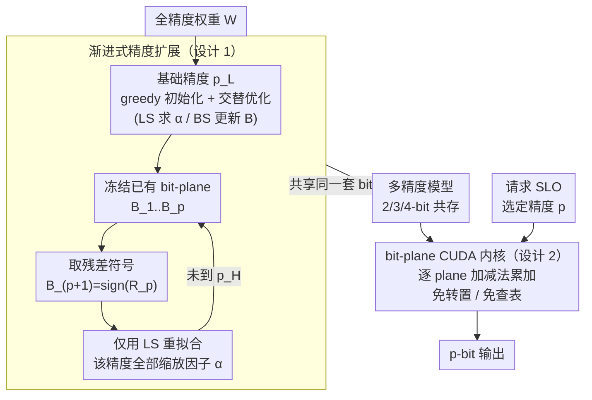

# AnyBCQ: Hardware Efficient Flexible Binary-Coded Quantization for Multi-Precision LLMs

**Conference**: ICLR 2026  
**arXiv**: [2510.10467](https://arxiv.org/abs/2510.10467)  
**Code**: [https://github.com/naver-aics/anybcq](https://github.com/naver-aics/anybcq)  
**Area**: Model Compression / LLM Quantization  
**Keywords**: Binary-coded quantization, multi-precision inference, bit-plane operations, LLM deployment, CUDA kernel  

## TL;DR
The authors propose AnyBCQ, a multi-precision LLM quantization framework based on binary-coded quantization (BCQ). By employing progressive precision expansion (freezing existing bit-planes and adding residual bit-planes), it supports dynamic switching between 2-4 bits for a single model. Dedicated CUDA kernels perform computations directly at the bit-plane level to avoid lookup table (LUT) and transposition overhead. In 2-bit settings, accuracy significantly outperforms Any-Precision LLM (35.3% vs 24.7% MMLU), with throughput reaching up to 3.0x that of FP16.

## Background & Motivation

**Background**: Multi-precision LLM models allow a single model to dynamically select precision at runtime based on Service Level Objectives (SLOs). Any-Precision LLM is the current SOTA but relies on non-uniform quantization (clustering-based), which requires LUTs and bit-transpose operations.

**Limitations of Prior Work**: (a) Non-uniform quantization cannot be computed directly on bit-planes, incurring extra transposition and LUT overhead; (b) existing multi-precision methods suffer from accuracy collapse at extremely low bits (e.g., 2-bit), limiting practical use to the 3-4 bit range; (c) the memory overhead of storing multiple independent precision models is substantial (LLaMA-3.1-8B requires 9.85GB vs 4.99GB for AnyBCQ).

**Key Challenge**: Non-uniform quantization is expressive but unsuitable for hardware acceleration (requires LUTs), while BCQ is naturally hardware-friendly but typically fixed-precision.

**Goal**: To extend BCQ to multi-precision settings, maintaining hardware friendliness while supporting dynamic precision switching.

**Key Insight**: BCQ represents weights as a linear combination of binary bit-planes $\hat{W} = \sum_i \alpha_i B_i$. Since $p$-bit inference corresponds exactly to the computation of $p$ bit-planes, it naturally supports multi-precision.

**Core Idea**: Freeze low-precision bit-planes $\rightarrow$ add new bit-planes from residuals $\rightarrow$ optimize only the scaling factors to achieve progressive precision expansion.

## Method

### Overall Architecture
The starting point of AnyBCQ is to generalize binary-coded quantization (BCQ) from fixed precision to multi-precision. BCQ decomposes weights into a linear combination of binary bit-planes $\hat{W} = \sum_i \alpha_i B_i$ ($B_i \in \{-1,+1\}$). Computing with $p$ bit-planes corresponds to $p$-bit inference, meaning "precision" is inherently determined by the number of active bit-planes. The methodology consists of two stages: offline "growable" quantization, starting from a base precision $p_L$ and expanding to a target precision $p_H$, where existing binary codes are frozen at each step and only scaling factors are re-fitted; and an online CUDA kernel that performs addition/subtraction directly on bit-planes. This allows a single model to select precision at runtime based on SLOs without LUTs or transposition.

### Key Designs

**1. Progressive Precision Expansion: Shared Bit-planes Across Precisions**

A primary bottleneck in multi-precision quantization is the memory overhead of storing one model per precision. AnyBCQ treats high precision as a residual supplement to low precision. The base precision $p_L$ is initialized via greedy BCQ and refined through alternating optimization—fixing $B$ to solve for scaling factors $\alpha$ via Least Squares (LS), then fixing $\alpha$ to update $B$ via Binary Search (BS). To expand from $p$-bit to $(p+1)$-bit, $B_1, \dots, B_p$ are frozen, and the new bit-plane is derived from the sign of the current residual $B_{p+1} = \text{sign}(R_p)$. All scaling factors $\{\alpha_i^{p+1}\}_{i=1}^{p+1}$ for that precision level are then re-optimized using LS. 

This provides two benefits: (1) Storage efficiency: Binary codes account for most overhead, and by sharing them, the multi-precision LLaMA-3.1-8B model size is reduced from 9.85GB to 4.99GB (-49%). (2) Monotonic accuracy: Since higher precision involves adding residual planes, quantization error decreases monotonically with the number of bits.

**2. Bit-plane CUDA Kernel: Mapping Precision to Memory and Compute Scaling**

BCQ's multi-precision compatibility is a layer-level advantage, but actual throughput depends on the inference kernel. Non-uniform quantization (like the clustering in Any-Precision LLM) requires bit-transpose ($O(MKp)$) and centroid lookup ($O(MK)$) during the forward pass. AnyBCQ’s kernel loads bit-planes sequentially. Since $B_i \in \{-1,+1\}$, the GEMM operation with activations reduces to additions and subtractions. Combined with LUT-GEMM to cache partial sums, each plane is multiplied by $\alpha_i$ and accumulated. 

Beyond eliminating transposition and lookups, this "per-plane accumulation" ensures that lower precision is naturally faster. Memory access scales linearly with the number of loaded planes. Running 3-bit only requires reading 3 planes, rather than reading 4-bit data and discarding 1 bit as in standard fixed-point schemes, allowing memory bandwidth to scale linearly with precision.

### Loss & Training
- Calibration uses 512 sequences from C4 to minimize Mean Relative Error (MRE) over 10 epochs.
- Employs asymmetric BCQ with group-wise quantization (group size $g=128$).
- Base precision initialization includes 20 rounds of alternating refinement.

## Key Experimental Results

### Main Results (LLaMA-3.1-8B)

| Method | 2-bit MMLU | 3-bit MMLU | 4-bit MMLU |
|------|-----------|-----------|------------|
| AWQ | 24.12 | 47.28 | 60.49 |
| Any-Precision LLM | 24.66 | 55.53 | **64.04** |
| ShiftAddLLM | 24.83 | 56.53 | 63.50 |
| **AnyBCQ (Ours)** | **35.32** | 58.28 | 63.53 |
| FP16 | 65.02 | - | - |

AnyBCQ outperforms competitors by over 10 percentage points in 2-bit MMLU while performing comparably to Any-Precision LLM at 4-bit.

### Key Findings
- **2-bit is the most discriminative range**: The BCQ scheme used in AnyBCQ is far superior to non-uniform quantization for ultra-low bits.
- **Multi-prec vs Fixed-prec Gap**: A slight performance gap appears at 3-4 bits due to optimization constraints from shared binary codes.
- **Convergence at 4-bit**: Differences between various methods converge as quantization errors become sufficiently small.

## Highlights & Insights
- The insight that **BCQ is naturally suited for multi-precision** is central to this work. Since $p$-bit compute equals $p$ bit-plane additions, BCQ is the only scheme that avoids LUTs in multi-precision scenarios.
- Achieves **49% memory savings** compared to multi-model approaches while maintaining accuracy.
- Achieved a major breakthrough in the traditional 2-bit "dead zone" (MMLU 24% $\rightarrow$ 35%).

## Limitations & Future Work
- Accuracy at 4-bit is slightly lower than Any-Precision LLM, showing the expressive limits of BCQ at higher precisions.
- Evaluation is limited to LLaMA-3.1-8B; larger models require testing.
- Once binary codes are frozen during progressive expansion, they cannot be corrected, potentially propagating early errors to higher precisions.
- Focuses only on weight-only quantization; activation quantization is not addressed.

## Related Work & Insights
- **vs Any-Precision LLM**: Non-uniform quantization is more expressive but hardware-unfriendly; AnyBCQ trades slight high-bit accuracy for massive hardware efficiency and low-bit performance.
- **vs ShiftAddLLM**: Both use BCQ, but ShiftAddLLM supports only fixed precision, whereas AnyBCQ extends this to multi-precision.
- **vs GPTQ/AWQ**: Uniform quantization collapses at 2-bit, while the binary bit-plane structure of BCQ is much more robust.

## Rating
- Novelty: ⭐⭐⭐⭐ The extension from BCQ to multi-precision is natural yet effective; CUDA kernel design shows engineering innovation.
- Experimental Thoroughness: ⭐⭐⭐⭐ Full coverage of benchmarks, throughput, and ablation, though tested on a single model series.
- Writing Quality: ⭐⭐⭐⭐ Figures 1-3 provide very intuitive comparisons.
- Value: ⭐⭐⭐⭐⭐ Fills a gap in multi-precision LLM deployment using BCQ with high practical utility.

<!-- RELATED:START -->

## Related Papers

- [\[ICLR 2026\] Highly Efficient and Effective LLMs with Multi-Boolean Architectures](highly_efficient_and_effective_llms_with_multi-boolean_architectures.md)
- [\[ICLR 2026\] PM-KVQ: Progressive Mixed-Precision KV Cache Quantization for Long-CoT LLMs](pm-kvq_progressive_mixed-precision_kv_cache_quantization_for_long-cot_llms.md)
- [\[ICLR 2026\] STaMP: Sequence Transformation and Mixed Precision for Low-Precision Activation Quantization](stamp_sequence_transformation_and_mixed_precision_for_low-precision_activation_q.md)
- [\[ICLR 2026\] Channel-Aware Mixed-Precision Quantization for Efficient Long-Context Inference](channel-aware_mixed-precision_quantization_for_efficient_long-context_inference.md)
- [\[ICLR 2026\] MicroMix: Efficient Mixed-Precision Quantization with Microscaling Formats for Large Language Models](micromix_efficient_mixed-precision_quantization_with_microscaling_formats_for_la.md)

<!-- RELATED:END -->
