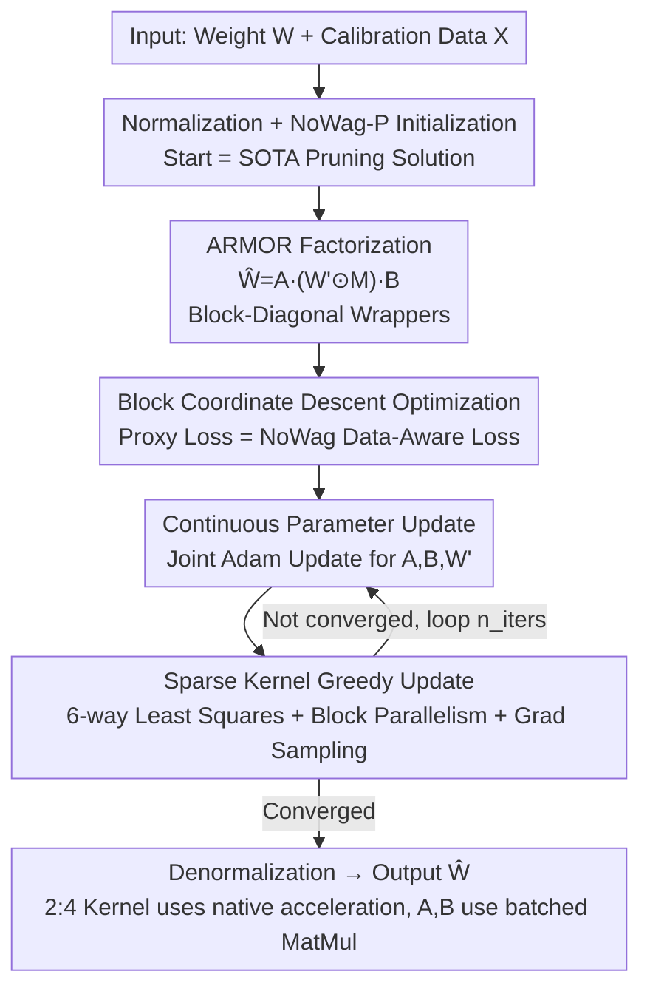

# ARMOR: High-Performance Semi-Structured Pruning via Adaptive Matrix Factorization

**Conference**: ICLR2026  
**OpenReview**: [https://openreview.net/forum?id=8NE554wv0m](https://openreview.net/forum?id=8NE554wv0m)  
**Code**: https://github.com/LawrenceRLiu/ARMOR  
**Area**: Model Compression  
**Keywords**: Semi-structured pruning, 2:4 sparsity, matrix factorization, block coordinate descent, one-shot post-training compression

## TL;DR
ARMOR reformulates 2:4 semi-structured pruning as a "factorization" problem. Instead of directly deleting weights, it decomposes each weight matrix into a 2:4 sparse kernel plus two lightweight block-diagonal "wrapper matrices" acting as error correctors. These components are jointly optimized using block coordinate descent, theoretically guaranteeing a proxy loss no worse than SOTA. Locally, it narrows the perplexity gap between 2:4 pruning and dense models by nearly 50% on Llama/Qwen while preserving most of the 2:4 acceleration and memory efficiency gains.

## Background & Motivation
**Background**: Large language model (LLM) deployment is constrained by compute and VRAM. Pruning is a direct solution, categorized into three types: structured (removes entire rows/columns/heads/layers; hardware-friendly but high accuracy loss), unstructured (removes arbitrary individual weights; preserves accuracy at 50% sparsity but lacks hardware acceleration on modern GPUs), and semi-structured (a compromise). Specifically, 2:4 semi-structured sparsity (retaining 2 out of every 4 consecutive weights) is natively supported by NVIDIA Ampere and later architectures, theoretically doubling matrix multiplication throughput.

**Limitations of Prior Work**: The "fixed 2 out of 4" constraint is too rigid, forcing algorithms to make local trade-offs within small groups rather than preserving globally important weights. This leads to a precipitous drop in accuracy—for instance, SOTA 2:4 pruning on Llama-7B results in a Wikitext2 perplexity nearly 59% higher than unstructured pruning at the same 50% sparsity. Users are thus forced to choose between theoretical efficiency and actual accuracy.

**Key Challenge**: Most existing methods express compressed weights as $\hat W = W' \odot M$, focusing on finding better masks (e.g., Wanda) or updating remaining weights to compensate (e.g., SparseGPT). Within this "element-wise mask" framework, the rigid 2:4 constraint is unavoidable. Attempts to bypass this framework have drawbacks: DSF and OWL are incompatible with 2:4 hardware kernels; WRP relies on highly unstructured sparse components; LoSparse and MaskLLM require expensive iterative retraining; and rotation methods like RotPruner or DenoiseRotator introduce fixed overheads without adjustable precision-latency trade-offs.

**Goal**: To close the accuracy gap caused by pruning while maintaining 2:4 hardware acceleration, via a one-shot (no retraining) method with adjustable overhead.

**Key Insight**: Instead of obsessing over "which weights to delete," it is more effective to transform the weight matrix into a "basis" that is more amenable to 2:4 constraints before pruning. By applying lightweight linear transformations before and after the sparse kernel, the activation and weight spaces can be rotated into a coordinate system where 2:4 patterns are less damaging.

**Core Idea**: Reformulate semi-structured pruning as matrix factorization: $\hat W = A \cdot (W' \odot M) \cdot B$, where the center is a 2:4 compliant sparse kernel, and $A, B$ are block-diagonal "inner/outer error correctors." The parameter count of $A, B$ is only $O(N)$ (relative to $O(N^2)$ for the dense matrix). All four components are jointly optimized via block coordinate descent.

## Method

### Overall Architecture
ARMOR performs layer-by-layer one-shot post-training pruning: each weight matrix $W \in \mathbb{R}^{d_{out}\times d_{in}}$ is processed independently to find a compressed representation $\hat W$ that minimizes a data-aware layer-wise proxy loss $L_{W,X}(\hat W)$, subject to the 2:4 sparsity pattern in the mask $M$.

The pipeline operates as follows: First, $W$ undergoes row/column normalization. The factorization is **initialized** with a solution equivalent to the SOTA pruning algorithm NoWag-P ($A=B=I$, $W'=\bar W$, and $M$ selecting the top-2 elements per group)—ensuring ARMOR starts at the SOTA level. Then, a block coordinate descent loop alternates between updating continuous parameters ($A, B, W'$) and the sparse kernel ($W'\odot M$). After $n_{iters}$, normalization factors are restored (incorporated into $A, B$), and the final $\hat W$ is output. During inference, $A$ and $B$ are efficiently executed as batched small matrix multiplications, while the sparse kernel utilizes native 2:4 acceleration.

### Key Designs

**1. ARMOR Factorization: Block-Diagonal Wrapper Matrices as Error Correctors**

To address the limitations of the rigid 2:4 constraint, ARMOR replaces direct pruning with the decomposition:
$$\hat W(A, B, W', M) := A \cdot (W' \odot M) \cdot B,$$
where $W'\in\mathbb{R}^{d_{out}\times d_{in}}$ is the transformed dense weight, $M\in\{0,1\}^{d_{out}\times d_{in}}$ is the 2:4 mask, and $A\in\mathbb{R}^{d_{out}\times d_{out}}$, $B\in\mathbb{R}^{d_{in}\times d_{in}}$ are **block-diagonal** matrices (with block size $d_{block}$ as a hyperparameter). $A$ and $B$ are learned low-overhead linear transformations that rotate spaces into a basis where the 2:4 constraint is less harmful. This is **computationally cheap**: $A$ is stored as a $(d_{out}/d_{block})\times d_{block}\times d_{block}$ tensor. Storage and compute overhead scale at $O((d_{out}+d_{in})\,d_{block})$, which is sub-linear relative to the original $d_{out}d_{in}$. Furthermore, $d_{block}$ acts as an adjustable knob: larger blocks improve accuracy at the cost of higher latency.

**2. NoWag Data-Aware Proxy Loss: Block-Decomposable for Greedy Optimization**

ARMOR utilizes the layer-wise loss from NoWag:
$$L_{W,X}(\theta) = \lVert \bar W - \hat W \rVert^2_{F,\,\mathrm{diag}(XX^T)} = \sum_i \sum_j (\bar W_{ij} - \hat W_{ij})^2 \lVert X_j \rVert_2^2,$$
where $\bar W$ is the normalized version of $W$. The $\mathrm{diag}(XX^T)$ term weights the squared error by the magnitude of input activations, focusing optimization on weights that impact calibration data most. This requires less calibration data and avoids the expensive Hessian inversions found in SparseGPT. Crucially, the loss is **decomposable** into independent sub-problems for each $d_{block}\times d_{block}$ block:
$$L_{W,X}(\theta) = \sum_i \sum_j \lVert \bar W^{(i,j)} - A^{(i)}(W'^{(i,j)}\odot M^{(i,j)})B^{(j)} \rVert^2_{F,\,\mathrm{diag}(XX^T)^{(j)}}.$$
This property enables the parallel greedy updates of the sparse kernel.

**3. Block Coordinate Descent: Jointly Optimizing Continuous and Discrete Parameters**

Since $\theta=(A,B,W',M)$ contains both continuous and discrete variables, ARMOR uses block coordinate descent. Each iteration alternates between updating continuous parameters ($A, B, W'$) and the sparse kernel ($W'\odot M$). In practice, Adam is used for the **joint** update of $A, B, W'$ to improve efficiency. A convergence theorem (Theorem 3.1) guarantees that the sequence $\{L_{W,X}((\theta)_t)\}$ converges and $L_{W,X}((\theta)_t)\le L_{W,X}((\theta)_0)$. Since initialization $(\theta)_0$ matches the NoWag-P loss, ARMOR is **theoretically guaranteed to be no worse than the SOTA NoWag-P**.

**4. Sparse Kernel Greedy Update: 6-choice Least Squares + Block Parallelism + Gradient Sampling**

To update $W'\odot M$ given $A, B$, ARMOR employs three techniques to manage the combinatorial search space: ① **Leveraging 2:4 patterns**: For each 4-element sparse group, there are only $\binom{4}{2}=6$ possible mask configurations. ARMOR enumerates these, solving a least-squares problem for each to find the optimal values for the 2 non-zero elements. ② **Block Parallelism**: Since the loss is block-decomposable, groups in different blocks can be updated **simultaneously**, allowing parallel updates of $\sim 10^3$ groups. ③ **Gradient-Weighted Sampling**: Groups are selected for updates based on a probability distribution derived from the gradient magnitude of the proxy loss, ensuring "important" weights are prioritized while maintaining stochasticity to avoid local minima.

## Key Experimental Results

### Main Results
Evaluated on Qwen 2.5 (7B to 72B), Qwen 3 (8B, 14B), Llama-2 (7B to 70B), and Llama-3 (8B, 70B). Optimization was performed for 20,000 iterations with $d_{block}=128$. Baselines included SparseGPT, Wanda, and NoWag-P.

Downstream Tasks (excerpt for Qwen 2.5):

| Model | Method | GSM8K | BBH | GPQA | MMLU |
|------|------|-------|-----|------|------|
| Qwen2.5-7B | Dense | 82.33 | 69.16 | 33.03 | 74.19 |
| Qwen2.5-7B | SparseGPT (2:4) | 36.69 | 46.31 | 29.69 | 56.91 |
| Qwen2.5-7B | NoWag-P (2:4) | 28.28 | 39.98 | 27.23 | 53.51 |
| Qwen2.5-7B | **ARMOR (2:4+4.95%)** | **53.28** | **55.11** | **31.47** | **65.56** |
| Qwen2.5-32B | Dense | 88.78 | 81.72 | 38.84 | 83.24 |
| Qwen2.5-32B | **ARMOR (2:4+3.44%)** | **78.77** | **76.56** | **39.51** | **78.18** |

ARMOR consistently leads across all models and tasks. Notably, on GPQA-Qwen2.5-32B, it achieved 39.51, **surpassing the dense model (38.84)** and significantly outperforming SparseGPT (30.36). Improvements are most pronounced in reasoning-heavy tasks.

Perplexity (Wikitext2 ↓, excerpt):

| Dataset | Model | Dense | SparseGPT | Wanda | NoWag-P | ARMOR |
|--------|------|-------|-----------|-------|---------|-------|
| Wikitext2 | Llama-2-13B | 4.57 | 8.39 | 8.36 | 8.28 | **6.37** |
| Wikitext2 | Llama-3-8B | 5.54 | 14.18 | 22.42 | 24.0 | **10.10** |

On Llama-2-13B, ARMOR achieved 6.37, a massive improvement over NoWag-P (8.28), reducing the 2:4 vs. dense perplexity gap by nearly 50%.

### Ablation Study
NoWag-P represents the version of ARMOR without factorization and optimization. Comparing ARMOR to NoWag-P highlights the pure gains of the factorization approach.

| Configuration / Analysis | Key Metric | Description |
|------|---------|------|
| ARMOR vs NoWag-P | Llama-2-13B PPL 6.37 vs 8.28 | Pure gain from factorization + optimization. |
| Inference Efficiency | 1.57× Speedup (MatVec) | Pure 2:4 is 1.86×. ARMOR trades ~3.4% FLOPs for quality. |
| Block Size $d_{block}$ (1→128) | Perplexity decreases exponentially | Larger blocks are more accurate; $d_{block}=1$ is NoWag-P. |
| Proxy Loss Correlation | High Correlation | Proxy loss is a reliable surrogate for model performance. |

### Key Findings
- **"Factorization" is superior to "Weight Deletion"**: Removing factorization (NoWag-P) causes the largest performance drop, especially in reasoning tasks, proving that wrapper matrices are the primary driver of performance recovery.
- **Block size is an accuracy-efficiency knob**: Perplexity follows an exponential decay as $d_{block}$ increases, offering a flexibility that fixed-rotation methods lack.
- **Proxy loss is a reliable surrogate**: Proxy loss reduction correlates strongly with C4 perplexity reduction, with most recovery happening in the first 2,500 iterations.
- **Efficiency remains intact**: ARMOR introduces only ~2.4%–5% block-diagonal overhead. It reduces theoretical speedup from 2.0× to ~1.87×, achieving ~84% of the SOTA performance recovery with a proof-of-concept PyTorch implementation.

## Highlights & Insights
- **Elegant Reformulation**: Reframing pruning as "Factorization = Sparse Kernel + Error Predictors" bypasses the performance ceiling of the traditional element-wise mask framework.
- **Guaranteed SOTA Performance**: By initializing with the NoWag-P solution and employing a convergence-guaranteed optimization, ARMOR ensures performance at least as good as existing SOTAs.
- **The Sweet Spot of Block-Diagonal Structures**: Block-diagonal wrappers are more expressive than diagonal wrappers and cheaper than dense matrices ($O(N)$ vs $O(N^2)$), mapping perfectly to batched matrix operations on hardware.

## Limitations & Future Work
- **Proof-of-Concept Kernels**: The current implementation is a PyTorch proof-of-concept; reaching full theoretical efficiency would require custom fused kernels.
- **Non-Zero Overhead**: The 2.4%–5% additional storage/computation is sub-linear but not zero, which may matter in extremely resource-constrained deployments.
- **N:M and Unstructured Sparsity**: Experiments for general N:M cases were less tuned and represent only a performance lower bound.
- **Instruction-Tuned/MoE Models**: The efficacy of ARMOR on instruction-tuned models and Mixture-of-Experts (MoE) architectures has not yet been verified.

## Related Work & Insights
- **vs. Wanda / NoWag-P**: These use fixed weights and struggle with rigid 2:4 constraints; ARMOR uses wrappers for compensation.
- **vs. SparseGPT**: SparseGPT uses Hessian-based updates; ARMOR uses decomposable NoWag losses, allowing for faster, parallelizable optimization without Hessian inversions.
- **vs. RotPruner / DenoiseRotator**: These use fixed rotations; ARMOR provides an adjustable knob via $d_{block}$.
- **vs. DSF / WRP**: These are either incompatible with 2:4 kernels or rely on inefficient unstructured components; ARMOR's sparse kernel is strictly 2:4 compliant.

## Rating
- Novelty: ⭐⭐⭐⭐⭐ Reformulating pruning as a factorization problem with convergence theory is a paradigm-level innovation.
- Experimental Thoroughness: ⭐⭐⭐⭐ Extensive testing on Llama and Qwen across tasks, though N:M/MoE models are less explored.
- Writing Quality: ⭐⭐⭐⭐⭐ Clear progression from motivation to theoretical proof and empirical results.
- Value: ⭐⭐⭐⭐⭐ Effectively addresses the precision-efficiency trade-off for 2:4 pruning.

<!-- RELATED:START -->

## Related Papers

- [\[ICLR 2026\] Learning Semi-Structured Sparsity for LLMs via Shared and Context-Aware Hypernetwork](learning_semi-structured_sparsity_for_llms_via_shared_and_context-aware_hypernet.md)
- [\[ICLR 2026\] MoNE: Replacing Redundant Experts with Lightweight Novices for Structured Pruning of MoE](mone_replacing_redundant_experts_with_lightweight_novices_for_structured_pruning.md)
- [\[CVPR 2025\] MambaIC: State Space Models for High-Performance Learned Image Compression](../../CVPR2025/model_compression/mambaic_state_space_models_for_high-performance_learned_image_compression.md)
- [\[ACL 2026\] Two-Stage Regularization-Based Structured Pruning for LLMs](../../ACL2026/model_compression/two-stage_regularization-based_structured_pruning_for_llms.md)
- [\[ICLR 2026\] RCPU: Rotation-Constrained Error Compensation for Structured Pruning of Large Language Models](rcpu_rotation-constrained_error_compensation_for_structured_pruning_of_large_lan.md)

<!-- RELATED:END -->
