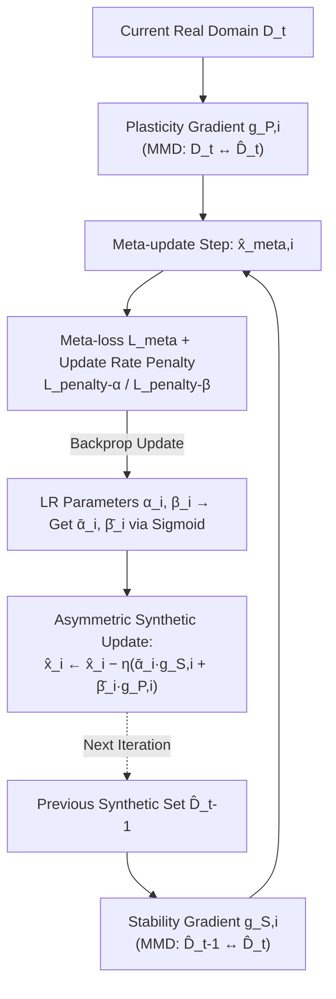

# Asymmetric Synthetic Data Update for Domain Incremental Dataset Distillation

**Conference**: ICLR 2026  
**OpenReview**: [https://openreview.net/forum?id=XcsaCHaoJh](https://openreview.net/forum?id=XcsaCHaoJh)  
**Code**: To be confirmed  
**Area**: Dataset Distillation / Continual Learning / Model Compression  
**Keywords**: Dataset Distillation, Domain Incremental Learning, Catastrophic Forgetting, Bi-level Optimization, Stability-Plasticity  

## TL;DR
This paper introduces the new problem of "Domain Incremental Dataset Distillation (DIDD)" — continuously distilling sequentially arriving data from different domains into a **single, fixed-size** synthetic set. It proposes an **Asymmetric Synthetic Data Update** strategy based on meta-learning bi-level optimization to learn individual stability and plasticity gradient update rates for each synthetic image, thereby alleviating catastrophic forgetting under a fixed storage budget.

## Background & Motivation
- **Background**: Dataset Distillation (DD) compresses large real datasets into a small set of synthetic samples, ensuring that models trained on the synthetic set approximate the performance of those trained on the full data. Common methods include three types of matching (Gradient Matching GM, Trajectory Matching TM, and Distribution Matching DM) to align training dynamics, significantly reducing storage and training costs.
- **Limitations of Prior Work**: All DD methods assume that the "full dataset is available at once." However, in reality, data is often **collected sequentially across different domains over time**. If one distills each new domain separately and aggregates them (Distill-Gather), storage and training costs expand linearly with the number of domains, defeating the original purpose of DD.
- **Key Challenge**: If distilling sequentially onto a single fixed-size synthetic set (Finetune), knowledge of new domains will **overwrite** that of old domains, resulting in catastrophic forgetting. This is essentially a **conflict between stability (preserving old domains) and plasticity (adapting to new domains)**. The authors empirically find that the cosine similarity between the stability gradient $g_{S,i}$ and the plasticity gradient $g_{P,i}$ remains negative over time (Fig. 3), meaning their directions directly conflict. Using a uniform update rate for both is clearly sub-optimal.
- **Goal**: Under a fixed budget of $|\hat{\mathcal{D}}_t| = \text{IPC} \times C$, enable a single synthetic set to accommodate the current domain $\mathcal{D}_t$ while preserving knowledge from historical domains $\mathcal{D}_{1:t-1}$.
- **Core Idea**: **[Sample-wise Asymmetry]** Instead of a uniform update for all images, learn distinct stability and plasticity update rates for **each synthetic sample**. This allows some samples to focus on "remembering old domains" while others focus on "adapting to the new domain." **[Meta-learning Bi-level Optimization]** is used to automatically estimate these update rates, mechanistically decoupling the stability-plasticity conflict.

## Method

### Overall Architecture
The method uses Distribution Matching DD (minimizing the Maximum Mean Discrepancy MMD between synthetic and real set features) as the foundation. When the $t$-th domain data $\mathcal{D}_t$ arrives, two gradients are computed for each synthetic image simultaneously: the **plasticity gradient** $g_{P,i}$ (pulling $\hat{\mathcal{D}}_t$ toward the current real domain $\mathcal{D}_t$) and the **stability gradient** $g_{S,i}$ (constraining the features of $\hat{\mathcal{D}}_t$ to the previous synthetic set $\hat{\mathcal{D}}_{t-1}$). Crucially, instead of simple summation, a pair of scaling coefficients $(\bar\alpha_i, \bar\beta_i)$ is learned for each image to weight these gradients. These coefficients are obtained via bi-level optimization (Fig. 2), where the inner loop "tries an update step and calculates meta-loss" and the outer loop "backpropagates to update the coefficients."

### Key Designs

**1. Stability Loss: Explicitly incorporating "remembering old domains" into the objective.** DD originally only optimizes the plasticity loss $L_{\text{plastic}}(\hat{x}^t) = d(F(x^t), F(\hat{x}^t))$ (where $d$ is Gaussian kernel MMD and $F$ is ConvNet features), which only aligns the synthetic set with the current real domain, causing forgetting. The authors add a stability loss $L_{\text{stable}}(\hat{x}^t) = d(F(\hat{x}^{t-1}), F(\hat{x}^t))$, requiring the features of the new synthetic set to remain consistent with the previous iteration, thereby "anchoring" historical knowledge. Combining them as $\hat{x}^t_i \leftarrow \hat{x}^t_i - \eta_x(g_{S,i} + g_{P,i})$ exposes the aforementioned gradient conflict, leading to the next step.

**2. Asymmetric Update: Decoupling stability-plasticity conflicts per sample.** Since $g_{S,i}$ and $g_{P,i}$ point in opposing directions, a uniform weighted sum for all samples leads to mutual cancellation. The authors introduce a pair of scaling coefficients for each image, rewriting the update as $\hat{x}^t_i \leftarrow \hat{x}^t_i - \eta_x(\bar\alpha_i \cdot g_{S,i} + \bar\beta_i \cdot g_{P,i})$, where $\bar\alpha_i, \bar\beta_i$ are derived from learnable parameters $\alpha_i, \beta_i$ mapped to $(\alpha_{\min}, \alpha_{\max})$ and $(\beta_{\min}, \beta_{\max})$ via sigmoid. Thus, if $\bar\alpha_i > \bar\beta_i$, the sample emphasizes stability; otherwise, it emphasizes plasticity. Conflict is resolved by allowing different samples to handle different objectives, achieving an overall balance.

**3. Bi-level Optimization for Optimal Update Rates (Meta-learning).** The difficulty lies in the lack of direct supervision for $\alpha_i, \beta_i$. The authors adopt a MAML-style bi-level optimization: the inner loop performs a trial update using current coefficients to obtain meta-samples $\hat{x}^t_{\text{meta},i} = \hat{x}^t_i - \eta_x(\bar\alpha_i g_{S,i} + \bar\beta_i g_{P,i})$ and calculates a meta-loss $L_{\text{meta}}(\hat{x}^t_{\text{meta}}) = L_{\text{stable}}(\hat{x}^t_{\text{meta}}) + L_{\text{plastic}}(\hat{x}^t_{\text{meta}})$. The outer loop updates $\alpha_i, \beta_i$ via backpropagation: $\alpha_i \leftarrow \alpha_i - \eta_\alpha \frac{\partial}{\partial \alpha_i} L^{\text{penalty}}_{\text{meta}}$ (similarly for $\beta$). Intuitively, directions that reduce the "post-update" combined loss more receive higher update rates.

**4. Selective Penalty: Preventing trivial coefficient inflation.** A first-order Taylor expansion of the meta-loss show that as long as the inner products $\langle \frac{\partial}{\partial \hat{x}^t}L_{\text{meta}}, g_{S,i}\rangle$ and $\langle \cdots, g_{P,i}\rangle$ are positive, increasing all $\bar\alpha_i, \bar\beta_i$ will decrease the meta-loss. This leads to a trivial "maximize everything" solution, losing asymmetry. To counter this, penalties on the mean update rates are added: $L_{\text{penalty-}\alpha} = \frac{1}{N}\sum_i \bar\alpha_i$ and $L_{\text{penalty-}\beta} = \frac{1}{N}\sum_i \bar\beta_i$. The total meta-objective becomes $L^{\text{penalty}}_{\text{meta}} = L_{\text{meta}} + \lambda_\alpha L_{\text{penalty-}\alpha} + \lambda_\beta L_{\text{penalty-}\beta}$. This forces the model to spend its "budget" on truly necessary samples, creating an asymmetric update pattern. The authors further provide a KKT condition interpretation: $\bar\alpha_i, \bar\beta_i$ act like sample-level Lagrange multipliers; complementary slackness $\bar\alpha_i(L_{\text{stable}} - \epsilon_{\text{stable},i}) = 0$ implies that larger update rates are only assigned when a sample "nearly violates" the stability/plasticity constraints.

## Key Experimental Results

Datasets: Rotated-MNIST (20 domains, longest sequence), Seq-CORe50 (11 domains), PACS (4 domains); 3-layer ConvNet, IPC ∈ {1, 10, 20}; Metrics: average accuracy $A_T(\uparrow)$ and average forgetting $F_T(\downarrow)$, across three runs.

### Main Results Table (Selected $A_T$ / $F_T$)

| Method | R-MNIST IPC=1 | R-MNIST IPC=20 | Seq-CORe50 IPC=20 | PACS IPC=20 |
|---|---|---|---|---|
| Finetune (Lower Bound) | 38.9 / 59.2 | 41.9 / 56.7 | 26.4 / 79.2 | 27.4 / 44.4 |
| EWC | 38.8 / 59.2 | 41.6 / 56.7 | 26.4 / 79.1 | 28.6 / 43.5 |
| MAS | 43.2 / 50.2 | 45.0 / 51.8 | 27.0 / 66.1 | 35.6 / 12.9 |
| LwF | 32.9 / 48.5 | 36.2 / 38.7 | 17.6 / 24.7 | 34.5 / 14.5 |
| Joint (M3D) (Upper Ref.) | 80.2 / – | 91.5 / – | 84.7 / – | 54.5 / – |
| **Ours** | **58.6 / 21.0** | **59.0 / 39.3** | **60.6 / 38.7** | **52.1 / 10.0** |

- Significant leads across all settings compared to Finetune and various continual learning baselines (EWC/MAS/LwF/LF): $A_T$ improved from 38.9 to 58.6 on R-MNIST IPC=1.
- On Seq-CORe50 and PACS (IPC=10/20), it even **surpasses the Joint distillation upper bound of DSA/DC**; on PACS, it recovers 91% (IPC=10) and 95% (IPC=20) of Joint performance, demonstrating high data efficiency.

### Ablation Study Table (R-MNIST, $A_T$ segmented by 5 domains)

| Method | IPC=10 $A^T_{1:5}$ | $A^T_{6:10}$ | $A^T_{11:15}$ | $A^T_{16:20}$ |
|---|---|---|---|---|
| Finetune | 33.4 | 19.4 | 23.7 | 80.9 |
| + $L_{\text{stable}}$ | 26.9 | 27.5 | 59.3 | 87.1 |
| + Asym. (Linear Assign) | 31.0 | 33.4 | 56.6 | 82.7 |
| + Asym. (Bi-level Opt.) | **36.3** | **43.8** | **76.3** | **94.5** |

- Only adding $L_{\text{stable}}$ helps recent segments but degrades the earliest segment $A^T_{1:5}$ (26.9 < 33.4), suggesting that in long sequences, stability loss only preserves recent domains and hinders plasticity.
- Simple linear assignment of $\bar\alpha_i, \bar\beta_i$ based on sample index fails to consistently improve all segments; only bi-level optimization improves **all segments** simultaneously, proving that learned update rates are superior to manual rules.

### Key Findings
- **Conflict Visualization** (Fig. 3): The consistently negative cosine similarity between $g_{S,i}$ and $g_{P,i}$ provides direct motivation for asymmetric updates.
- **Sample Division of Labor** (Fig. 6): Samples with minimal $\bar\alpha_i - \bar\beta_i$ capture the rotation angles of the latest domain (plasticity-biased), while those with the largest difference remain consistent across domains (stability-biased). Visualization confirms "per-sample specialization."
- **Value**: Bi-level optimization makes distillation costs approximately 2.7x higher than the baseline (PACS IPC=10: 1123s vs 411s), but DD is a one-time offline process; performance remains significantly better than baselines even when reduced to 1000 iterations (344s).

## Highlights & Insights
- **Valuable Problem Definition**: DIDD bridges "Continual Learning" and "Dataset Distillation," addressing the unrealistic assumption in DD that full data is available at once. The fixed budget constraint clearly distinguishes it from "stacked distillation."
- **Granular Conflict Resolution**: While previous continual learning methods often balance trade-offs at the parameter/model level, this work innovatively assigns update rates at the **synthetic pixel** level on a **per-sample** basis. The visualization makes the "division of labor" intuitive.
- **Theoretical Coherence**: The logical flow from identifying trivial solutions via Taylor expansion to adding penalties and interpreting them via KKT as sample-level multipliers creates a sound argument for "why penalty is necessary" and "what the meta-learning approximates."
- **Exceeding Joint Upper Bounds**: The cross-domain regularization provided by the stability loss proves to be more beneficial for generalization than one-time joint distillation.

## Limitations & Future Work
- **High Distillation Cost**: Bi-level optimization (including second-order gradients for meta-samples) doubles overhead; scalability is questionable as IPC or the number of domains increases.
- **Small-scale Verification**: Experiments are limited to 32x32 images and 3-layer ConvNets. Effectiveness on ImageNet-scale data or deeper backbones remains unknown.
- **Base Method Binding**: The method is built on Distribution Matching (MMD). Experiments on its effectiveness for Gradient Matching or Trajectory Matching DD are missing.
- **Shared Label Space Assumption**: The DIDD setting assumes consistent categories across domains (Domain Incremental). If class incremental learning (new classes appearing) is added, the current framework is not directly applicable.
- **Hyperparameter Sensitivity**: Requires tuning of $\alpha/\beta$ bounds, $\eta_\alpha, \eta_\beta, \lambda_\alpha, \lambda_\beta$, etc.; sensitivity analysis is lacking.

## Related Work & Insights
- **Dataset Distillation**: Stemming from Wang et al. (2018), categorized into Gradient Matching (DC/DSA), Trajectory Matching (MTT), and Distribution Matching (DM/M3D). This work uses DM and adds the "temporal/sequential arrival" dimension.
- **Domain Incremental Learning (DIL)**: Regularization (EWC/MAS), Replay (GEM/ER), and Dynamic Structure (PNN). This work **transfers the "protecting important parameters" concept from regularization methods to synthetic data** (changing the target from model parameters to synthetic pixels) while intentionally avoiding replay methods to fit the storage-saving goal of DD.
- **Meta-learning**: Using MAML-style bi-level optimization for hyperparameter tuning (here, per-sample update rates) is a concrete application of "automated trade-off via meta-learning," applicable to other sample-wise or task-wise weighting scenarios (e.g., sample reweighting, curriculum learning).

## Rating
- **Novelty**: ⭐⭐⭐⭐ First to propose the DIDD problem; original combination of sample-level synthetic pixels and meta-learned update rates.
- **Experimental Thoroughness**: ⭐⭐⭐ Robust results on three datasets with multiple IPCs, segmental ablation, and visualization, but limited in scale and base method coverage.
- **Writing Quality**: ⭐⭐⭐⭐ Logical flow from motivation to conflict visualization to method and theoretical interpretation.
- **Value**: ⭐⭐⭐⭐ Opens a meaningful new direction for distillation with sequential data; provides significant insights by exceeding Joint bounds under fixed budgets.

<!-- RELATED:START -->

## Related Papers

- [\[ICLR 2026\] Understanding Dataset Distillation via Spectral Filtering](understanding_dataset_distillation_via_spectral_filtering.md)
- [\[ICLR 2026\] Grounding and Enhancing Informativeness and Utility in Dataset Distillation](grounding_and_enhancing_informativeness_and_utility_in_dataset_distillation.md)
- [\[AAAI 2026\] DP-GenG: Differentially Private Dataset Distillation Guided by DP-Generated Data](../../AAAI2026/model_compression/dp-geng_differentially_private_dataset_distillation_guided_by_dp-generated_data.md)
- [\[ICLR 2026\] Beyond Student: An Asymmetric Network for Neural Network Inheritance](beyond_student_an_asymmetric_network_for_neural_network_inheritance.md)
- [\[ICLR 2026\] Pedagogically-Inspired Data Synthesis for Language Model Knowledge Distillation](pedagogically-inspired_data_synthesis_for_language_model_knowledge_distillation.md)

<!-- RELATED:END -->
