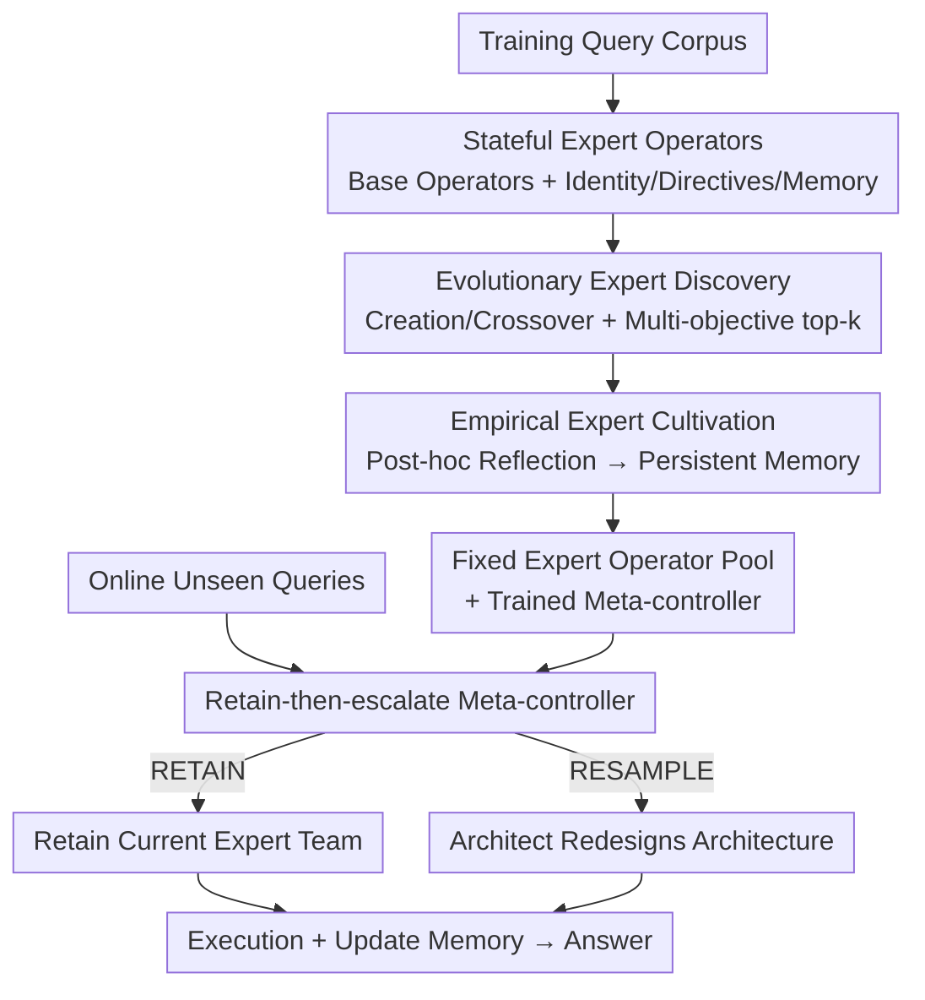

# Automated Stateful Specialization for Adaptive Agent Systems

**Conference**: ICLR 2026  
**OpenReview**: [https://openreview.net/forum?id=UESTP6dR1K](https://openreview.net/forum?id=UESTP6dR1K)  
**Code**: https://github.com/myanvoos/ASpec  
**Area**: Multi-Agent Systems / Automated Agent Design / Self-Evolving Agents  
**Keywords**: Multi-Agent, Automated Design, Expert Agents, Evolutionary Search, Meta-Controller

## TL;DR
ASPEC proposes a fully automated lifecycle framework for "stateful expert agent teams": it first uses evolutionary search offline to discover a set of domain expert operators, then cultivates persistent memory through experience-based reflection, and finally utilizes a lightweight online "retain-then-escalate" meta-controller to decide whether to reuse the existing team or re-search the architecture for each query. It improved Gemini 2.0 Flash from 56.3% to 62.8% on the expert-level scientific benchmark GPQA, while maintaining significantly lower training and inference costs than similar automated frameworks.

## Background & Motivation
**Background**: Currently, automated multi-agent system design is divided into two mutually exclusive routes. One is **task-level architecture search** (ADAS, AFlow, AgentSquare), which searches for a **static optimal workflow** for a specific task domain, similar to AutoML / NAS. The other is **query-level architecture adaptation** (MaAS, FlowReasoner, MAS-Zero), which generates or samples a customized agent architecture on-the-fly for **each incoming query**.

**Limitations of Prior Work**: Task-level methods are "one-size-fits-all"—a static workflow must handle all queries in a domain, failing to allocate inference resources dynamically per query. While query-level methods are highly adaptive, they rebuild the architecture from scratch for every query, incurring massive "rediscovery" costs. More critically, **individual agents never have the opportunity to accumulate long-term expertise**—the architecture is resampled every time, treating components as disposable temporary workers.

**Key Challenge**: A gap exists between static task-level robustness and dynamic query-level adaptability; both extremes miss the middle ground of **"persistent agent-level expertise."** Simply attaching a memory module to an agent (agent-level memory) does not solve this system-level problem because the architecture itself keeps changing, leaving no stable carrier for the memory.

**Goal**: To create a team of **stateful expert agents** that accumulate knowledge over time and can be reconfigured without human intervention to handle new tasks, unifying "expert-level deep specialization" and "on-demand adaptability" into a single lifecycle.

**Key Insight**: The authors draw an analogy to the growth of human experts—first learning concepts broadly, then deepening expertise through **practice and reflection**. Consequently, the "birth" of an agent is split into two stages: **Discovery** (exploratory creation of diverse expert prototypes) and **Cultivation** (reflecting on training corpora to deposit experience into memory). At runtime, a high-level policy manages "when to reuse and when to rebuild."

**Core Idea**: Use a two-stage offline lifecycle of "discovery-cultivation" to create **persistent expert operators**, and an online "retain-then-escalate" meta-controller that **defaults to reuse and only escalates to architecture re-search when necessary**, thereby achieving expertise, adaptability, and cost efficiency simultaneously.

## Method

### Overall Architecture
ASPEC models the entire system as a **Hierarchical Reinforcement Learning (HRL)** framework: the bottom layer is a generative process (Architect) responsible for architecture redesign and operator pool evolution, while the top layer is a lightweight policy (Meta-controller) that learns "when to invoke the bottom layer." The pipeline is divided into **Offline** and **Online** phases.

The offline phase (Figure 3) performs two tasks: **Expert Discovery**—the Architect uses evolutionary operators (creation/crossover) to derive expert operator candidates with "identity + methodology instructions" from base operators (stateless operators like CoT, Debate, ReAct), retaining the top-$k$ through multi-objective selection; **Expert Cultivation**—selected experts execute tasks on training corpora and reflect post-hoc, writing experiences into their respective persistent memories, while this process simultaneously trains the meta-controller. The offline outputs are a **fixed expert operator pool** and a **trained meta-controller**.

In the online phase (Figure 2), the operator pool is frozen. For unseen queries, the system loops: the meta-controller reads the embeddings of the current query and the current architecture to make a binary decision—**RETAIN** (reuse the current expert team architecture) or **RESAMPLE** (let the Architect redesign the architecture). After execution, individual expert memories are updated, and the system proceeds to the next query. In multi-step scientific coding tasks, retained experts can accumulate context and learned knowledge across steps, which is decisive for tasks like SciCode involving multiple sub-problems.

### Key Designs

**1. Stateful Expert Operators: Providing a stable carrier for expertise in place of disposable agents**

To allow expertise to accumulate, there must be a **stable carrier unit** that is not rebuilt. Following MaAS, an agent operator is defined as a triplet $O=(M,P,\{T_i\})$—LLM backbone $M$, prompt $P$, and available toolset $\{T_i\}$. A multi-agent system is a directed acyclic graph $G=\{V,E\}$, where each vertex is an operator instance. ASPEC splits the operator pool into two categories: **Base Operators** $O_{\text{base}}$ are static, stateless general structures (e.g., CoT, LLM-Debate), and **Expert Operators** $O_{\text{spec}}$ are dynamic sets derived from base operators. An expert operator $O^S_i=(O_i, P_s, M)$ inherits the reasoning skeleton of a base operator (e.g., "think step-by-step") while adding a **specialization prompt** $P_s$ and a **persistent empirical memory** $M$. $P_s$ is further decomposed into **identity** ("Who am I"—e.g., "An expert physicist proficient in theoretical physics") and **directives** (a set of methodological principles—e.g., "Calculate the Lorentz factor before time dilation"). This "identity + directives" decomposition gives experts a rich "genetic space" and is precisely what distinguishes them from stateless role-playing: identity and directives are **retained and cultivated**, rather than being temporarily generated for a single collaboration and then discarded.

**2. Evolutionary Expert Discovery: Automatically generating diverse, high-level expert prototypes via creation + crossover**

Experts are not handcrafted but discovered by the Architect (an in-context LLM performing multi-round iterative reasoning) via evolutionary search. The Architect's formal mapping is $f_A(q_t, H_{t-m:t-1}, O_{t-1}, G_{t-1}) \to (G_t, O_t)$, taking the current query, a sliding window of the last $m$ historical experiences, the previous operator pool, and the previous architecture as input, and outputting a new architecture and operator pool. Its goal is to maximize "cost-aware utility" $U_t - \lambda C_t(G_t)$ plus future value terms. The discovery phase uses two actions: **Creation**—deriving experts from a base operator for a query using "multi-variant synthesis + LLM review," over-generating $S=3$ identity-directive variants at once, then having a Judge select the best based on reasoning methodology and domain coverage; **Crossover**—given two parent experts $O^S_1, O^S_2$, synthesizing a child expert that inherits identities and directives from both (the physics expert in Figure 4 can trace its "ancestry" through crossover). To prevent premature fragmentation, the pool size is dynamically capped at $2k$; once exceeded, the Architect is forbidden from creating and must merge or prune, forcing the integration of scattered capabilities. At the end of discovery, **Selection** is performed by solving a multi-objective problem balancing performance and diversity: $O^{(2)}_{\text{spec}}=\arg\max_{|O_{\text{spec}}|\le k}\big[\sum p(O^S_i) + \text{Diversity}(O_{\text{spec}})\big]$, where diversity is based on K-means clustering of expert embeddings, taking the highest performer from each cluster to ensure the top-$k$ are both strong and complementary.

**3. Empirical Expert Cultivation: Letting selected experts solidify experiences into retrievable domain memory via reflection**

Discovery only ensures "breadth and diversity"; deep expertise relies on cultivation. The selected top-$k$ experts execute tasks **independently** on the training corpus and reflect on the results afterward, writing structured experiences such as "problem patterns / solution summaries / failure modes / general rules" into their respective memories $M_i$ (e.g., in Figure 4: 'Always normalize the wavefunction before calculating expectation values'). This step deliberately **binds cultivation explicitly to the output of discovery**—experiences only accumulate into designated, persistent expert prototypes rather than being scattered across temporary agents, fostering role-specific expertise. At runtime, experiences are injected via semantic retrieval (RAG-style): memory is split into structured chunks, and for a query $q_t$, the most relevant chunks are retrieved as context for expert execution.

**4. retain-then-escalate Meta-Controller: Using a lightweight neural policy to reuse by default and escalate to expensive re-search only when necessary**

Architecture reconstruction by the Architect is expensive, and constant rebuilding prevents experts from deepening their expertise on new tasks. The meta-controller is a lightweight neural policy $\pi_\theta(a_t|s_t)$ with a binary action space $\mathcal{A}=\{a_{\text{RETAIN}}, a_{\text{RESAMPLE}}\}$. Training is modeled as an MDP aimed at maximizing discounted cumulative reward $\arg\max_{\pi_\theta}\mathbb{E}[\sum_t \gamma^t R_t]$. The state $s_t=(e_q(q_t), e_g(G_{t-1}))$ is formed by concatenating fixed-length query embeddings and architecture text embeddings (both using MiniLM). A clever design here: the architecture representation does not use a GNN but a **"bag-of-operators"** approach—representing the architecture as an **attention-weighted average** of its constituent operator embeddings. The weights are calculated based on the similarity between each operator and the query embedding, yielding a query-aware representation of "what this architecture can do for this query," avoiding the overhead of training a GNN. The essence of "retain-then-escalate" is to **RETAIN by default**: relying on the persistent knowledge of experts for efficient execution, and only ESCALATING to Architect resampling when the query truly mismatches, saving costs while allowing experts to continuously specialize across related queries.

### Loss & Training
The meta-controller maximizes the expected discounted return in an MDP: $\pi^*_\theta=\arg\max_{\pi_\theta}\mathbb{E}[\sum_{t=0}^{T}\gamma^t R_t(s_t,a_t)]$, with $\gamma\in[0,1)$. The reward combines utility $U_t$ and total API call cost $C_t$ (with cost coefficient $\lambda$). In implementation, Gemini 2.0 Flash is used for the execution model ($T=0.3$), with a sliding window $m=10$ and an expert pool cap $k=5$.

## Key Experimental Results

### Main Results
Five public benchmarks across three domains: Math (MATH), QA (MMLU, GPQA), and Code (HumanEval, SciCode), with GPQA and SciCode being expert-level. Compared against 13 representative baselines (manual single/multi-agent, automated specialization methods, automated architecture frameworks).

| Benchmark | Vanilla | LLM-Debate | EvoAgent | AFlow | MaAS | ASPEC |
|-----------|---------|-----------|----------|-------|------|-------|
| MATH      | 73.2    | 74.4      | 75.9     | 76.5  | 74.4 | **77.3** |
| HumanEval | 87.8    | 85.5      | 90.2     | 89.3  | 91.6 | 91.4 |
| MMLU      | 86.0    | 87.1      | 88.3     | 90.5  | 87.3 | 90.0 |
| GPQA      | 56.3    | 59.7      | 61.5     | 61.3  | 57.8 | **62.8** |
| SciCode   | 24.0    | 24.0      | 24.8     | 24.3  | 25.6 | **26.6** |
| Average   | 65.3    | 66.1      | 68.1     | 68.4  | 67.4 | **69.6** |

ASPEC's performance is most prominent on the expert-level GPQA: 62.8%, 6.5% higher than vanilla Gemini 2.0 Flash, 3.1% over the strongest manual multi-agent (LLM-Debate), 1.5% over the strongest automated framework (AFlow), and 1.3% over the strongest automated specialization method (EvoAgent). It also leads on SciCode, benefiting from retained experts accumulating context across sub-questions. Cross-model/cross-benchmark transfer results (Figure 5) show robust gains: GPT-4o-mini on GPQA improved 38.2→43.8, and Llama 3.3 70B improved 45.6→53.5. Remarkably, using only "experts trained in other domains" (ONLYSPEC) could match or slightly exceed the full system, which the authors attribute to experts learning "T-shaped" reasoning strategies and the restricted pool forcing the system to truly utilize experts rather than reverting to "safe but mediocre" general operators.

In terms of efficiency (GPQA, Table 2), ASPEC is the most economical in both training and inference:

| Method   | Training Cost (USD) | Inference Cost (USD) | Accuracy (%) |
|----------|---------------------|----------------------|--------------|
| EvoAgent | –                   | 1.45                 | 61.8         |
| AFlow    | 20.14               | 1.58                 | 61.3         |
| MaAS     | 3.43                | 2.07                 | 57.8         |
| ASPEC    | **1.38**            | **0.88**             | **62.8**     |

Once a strong expert pool is found, the Architect tends to prefer streamlined architectures, significantly reducing costs.

### Ablation Study
Ablations of five components and the control strategy on GPQA (Table 6):

| Configuration       | Accuracy (%) | Total Cost (USD) | Note |
|---------------------|--------------|------------------|------|
| ASPEC (Full)        | 62.8         | 0.88             | Baseline |
| w/o Expert Ops      | 57.4         | 2.26             | -5.4%, ~3x cost—Experts drive performance & efficiency |
| w/o Base Ops        | 61.3         | 0.48             | Only -1.5%, further proving experts are more critical |
| w/o Meta-controller | 62.7         | 2.0              | Same performance but ~2.3x cost (constant resampling) |
| w/o Architect       | 61.0         | 1.28             | Static combination of all experts |
| w/o Expert Memory   | 61.4         | 0.94             | Removes cultivated memory |
| w/ Random Policy    | 58.3         | 1.05             | Alternative control strategy is significantly worse |
| w/ LLM-as-gate      | 62.5         | 3.74             | Similar accuracy but ~4.25x cost |

### Key Findings
- **Expert operators are the dual drivers of performance and efficiency**: Removing experts not only drops accuracy by 5.4% but nearly triples costs—because the Architect lacks "confidence" in the general operator pool and samples highly complex, redundant multi-agent architectures to compensate.
- **The value of the meta-controller lies in cost reduction, not score improvement**: Removing it leaves accuracy almost unchanged (62.7 vs 62.8) but increases cost by 2.3x; LLM-as-gate is accurate but over 4x more expensive, indicating that lightweight learned policies are the cost-effective choice.
- **Expert pool size $k$ has a "Goldilocks" effect**: At $k=1$, accuracy is 58.8% (insufficient domain coverage); at $k=10$, it is 60.9% (experience fragmentation, sparse experts fail to accumulate dense history); $k=5$ is optimal.
- **Discovery processes converge/diverge based on domain width**: On narrow-domain GPQA, 5 independent trials strongly converged to the same roles (Chemistry/Biology/Physics); on wide-domain MMLU, they diverged to explore different viable team combinations.

## Highlights & Insights
- **The "discovery-cultivation" two-stage process stitches automated design and self-evolving memory into a single lifecycle**: Whereas previous work either searched architectures or attached memory, ASPEC explicitly binds memory to discovered persistent experts, providing a stable carrier for expertise—a fundamental difference from "stateless role-playing."
- **"Retain-then-escalate" is a highly practical cost philosophy**: Reusing by default and escalating to expensive architecture re-search only upon mismatch explicitly delegates "when to rethink" to a lightweight gate. This can be directly transferred to any system design involving "whether to trigger expensive modules" (e.g., when to re-retrieve in RAG, when to re-plan in agents).
- **Bag-of-operators state representation**: Replacing GNN architecture topology encoding with a query-aware attention-weighted average of operator embeddings saves training overhead while capturing "what this architecture can do for this query"—a neat, reusable trick.
- **The ONLYSPEC phenomenon is counter-intuitive**: Restricting the operator pool to "experts trained in other domains" can match or exceed the full system, revealing that "forcing the system to use experts instead of reverting to safe general operators" is itself a form of regularization.

## Limitations & Future Work
- **Decision gap between the meta-controller and "oracle proxy"**: Lightweight state representations can lead to "unnecessary resampling / overly conservative reuse"; the authors admit that good GPQA scores might mask this deviation from an ideal LLM-as-gate policy. Achieving oracle-level decision fidelity at low overhead remains a core challenge.
- **Lack of theoretical characterization for convergence**: The convergence properties of the expert discovery process relative to domain width lack a theoretical framework, which the authors list as a key future direction.
- **Scenarios still biased towards QA/Code benchmarks**: Not yet validated on real-world software engineering tasks like SWE-bench; the authors envision that experts could automatically internalize a repository's conventions and APIs, but this remains a prospect.
- **Memory may amplify bias**: Allowing experts to learn from experience during the cultivation phase could solidify biases from training data into memory, requiring mitigation strategies.
- (Observer's note) The execution models are primarily smaller models like Gemini 2.0 Flash; whether the marginal utility of specialization is as high on stronger models remains to be seen. ASPEC did not achieve the best results on HumanEval/MMLU (surpassed by MaAS/AFlow), indicating gains are highly concentrated in "expert-level narrow domains."

## Related Work & Insights
- **vs. Task-level Architecture Search (ADAS / AFlow / AgentSquare)**: These search for a static workflow for a whole domain, which is invariant at inference time and lacks query-level adaptation. ASPEC retains a stable team that can be reused but uses a meta-controller to decide whether to rebuild per query, balancing robustness and adaptation.
- **vs. Query-level Architecture Adaptation (MaAS / FlowReasoner / MAS-Zero)**: These regenerate architectures for every query, incurring rediscovery costs and failing to accumulate long-term expertise in components. ASPEC's experts are persistent and their memories have stable carriers; reusing by default saves significant money (GPQA inference cost of 0.88 vs. MaAS's 2.07).
- **vs. Self-evolving/Memory-based (Reflexion / ExpeL / AutoGuide / Agent Workflow Memory)**: These have explored "reflection-memory" independently, but often in stateless contexts or focused on single-task optimal teams. ASPEC explicitly links the cultivation phase to the output of discovery, ensuring experience accumulates into specified persistent experts to form role-specific expertise.
- **vs. Specialized Prompting (ExpertPrompting / EvoAgent / MASS / AutoAgents)**: These also create expert roles, but expertise is often stateless and generated for single tasks. ASPEC's expert structure is deliberately designed to be "retainable and cultivatable over time."

## Rating
- Novelty: ⭐⭐⭐⭐⭐ Successfully unifies two opposing routes of automated agent design into a "discovery-cultivation-retain-then-escalate" lifecycle, providing a clear perspective and filling the gap in "persistent agent-level expertise."
- Experimental Thoroughness: ⭐⭐⭐⭐ Solid results across five benchmarks, three domains, 13 baselines, cross-model/cross-benchmark transfer, and detailed ablation/sensitivity studies; however, validation on stronger models and real software tasks is still missing.
- Writing Quality: ⭐⭐⭐⭐⭐ Motivation (the gap between two routes) is well-derived; provide clear HRL formalization and diagrams.
- Value: ⭐⭐⭐⭐ Achieves significant gains on expert-level GPQA at low cost; the "retain-then-escalate" cost philosophy is highly valuable for practical agent system design.

<!-- RELATED:START -->

## Related Papers

- [\[ICLR 2026\] Textual Equilibrium Propagation for Deep Compound AI Systems](textual_equilibrium_propagation_for_deep_compound_ai_systems.md)
- [\[ICLR 2026\] Rejuvenating Cross-Entropy Loss in Knowledge Distillation for Recommender Systems](rejuvenating_cross-entropy_loss_in_knowledge_distillation_for_recommender_system.md)
- [\[CVPR 2026\] Enhancing Mixture-of-Experts Specialization via Cluster-Aware Upcycling](../../CVPR2026/model_compression/enhancing_mixture_of_experts_specialization_via_cluster_aware_upcycling.md)
- [\[ICLR 2026\] Adaptive Width Neural Networks](adaptive_width_neural_networks.md)
- [\[ICML 2026\] PRISM: Synergizing Vision Foundation Models via Self-Organized Expert Specialization](../../ICML2026/model_compression/prism_synergizing_vision_foundation_models_via_self-organized_expert_specializat.md)

<!-- RELATED:END -->
