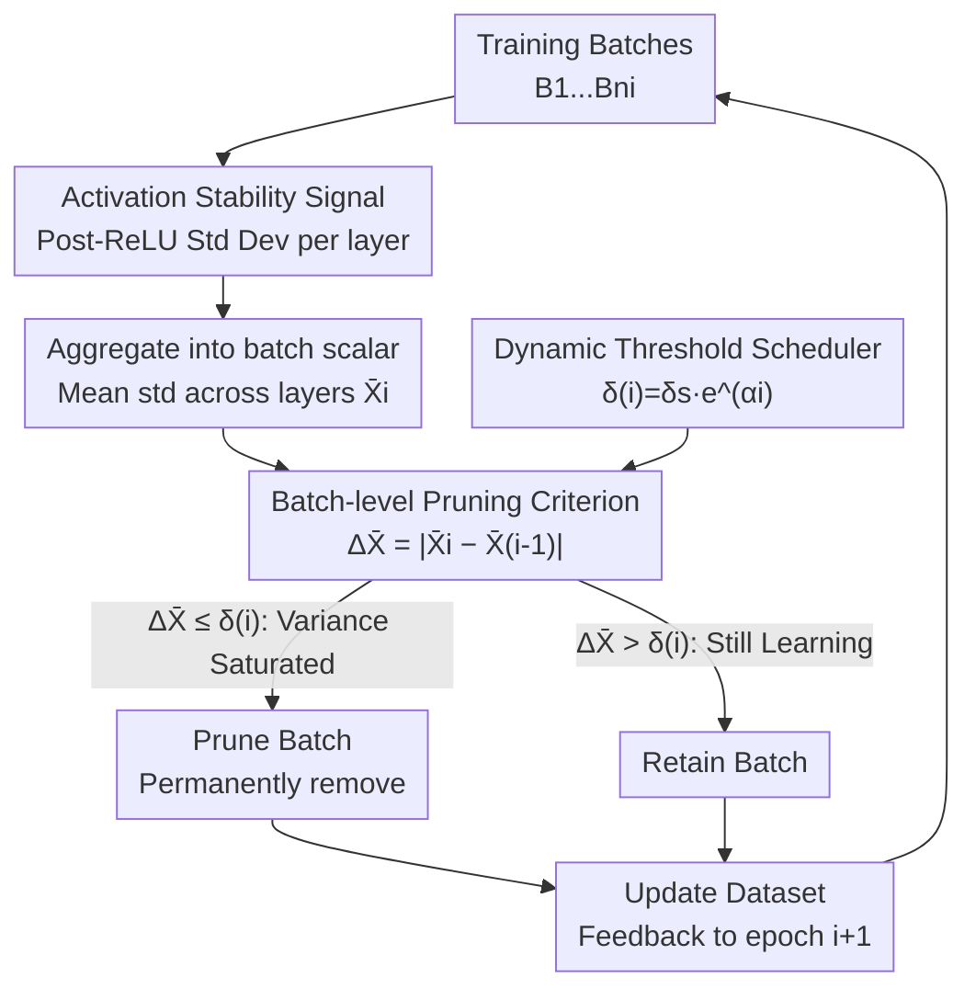

# Batch Pruning by Activation Stability

**Conference**: ICLR 2026  
**OpenReview**: [https://openreview.net/forum?id=TUADW7db5n](https://openreview.net/forum?id=TUADW7db5n)  
**Code**: https://github.com/mustakinalam/Batch-Pruning-by-Activation-Stability  
**Area**: Model Compression / Efficient Training  
**Keywords**: Data Pruning, Activation Stability, Dynamic Batch Pruning, Training Acceleration, Neural Collapse

## TL;DR
The paper proposes B-PAS—a method that monitors the variance of ReLU activations for each batch across epochs during training. It dynamically discards entire batches whose "activations have stabilized and no longer contribute to effective learning." On ResNet, CvT, and GPT-2, it achieves up to 57% data savings and 61% GPU node-hour reduction with maintained or slightly improved accuracy.

## Background & Motivation
**Background**: Training deep networks is increasingly expensive—data, time, and energy are all bottlenecks. One mainstream path to reduce costs is "feeding less data": dataset distillation and coreset selection attempt to synthesize or select a compact, informative subset; weighted sampling increases the frequency of useful samples. Another path is data pruning, classified into static and dynamic types: static methods use "sample utility scores" before training to discard low-value samples, while dynamic methods (e.g., InfoBatch) prune data adaptively during training.

**Limitations of Prior Work**: These methods have various overheads. Distillation and coreset selection often introduce significant preprocessing costs and may lead to accuracy drops; weighted sampling is sensitive to models and datasets. Static pruning requires a full pass over the dataset to calculate scores, lacking adaptability during training. Among dynamic pruning methods, the strongest, InfoBatch, relies on **per-sample loss statistics** and requires gradient rescaling to maintain unbiasedness. Furthermore, pruned samples must be revisited in subsequent epochs—all of which require extra bookkeeping and computation. Existing signals are either external heuristics (difficulty, uncertainty) or loss/gradient statistics, which are not "cheap."

**Key Challenge**: Does determining whether "a batch is still worth training" require such heavy external signals? Loss statistics, auxiliary models, and manual rules seek evidence **outside** the network, while the information reflecting whether a batch still has something to learn is actually hidden within the **internal activations** already calculated during the forward pass.

**Key Insight**: The authors turn to internal network dynamics. The Neural Collapse phenomenon indicates that as training converges, representations of samples from the same class align and activation patterns stabilize. Ahmad et al. (2024) further linked the stability of convolutional activations to "near-optimal learning capacity" for early stopping. This paper applies this observation, originally used for global early stopping, at a **batch granularity**: since the activation variance of certain batches stop changing across epochs, their contribution to weight updates is essentially saturated and they can be discarded.

**Core Idea**: Use "activation stability" instead of "loss/gradient statistics" to judge batch learning utility. By monitoring the cross-epoch variation of post-ReLU activation standard deviation for each batch, the method permanently prunes a batch when the variation falls below a threshold. This process incurs zero extra forward passes, requires no labels, and needs no rescaling.

## Method

### Overall Architecture
B-PAS is a **plug-in** module for training acceleration. The original CNN training workflow remains unchanged, except at the end of each epoch, where the stability of activation variance determines whether a batch should be fed in the next epoch. The input is a training set organized into batches, and the output is a training trajectory where the number of retained batches decreases monotonically, eventually training to equal (or better) accuracy with less data.

The mechanism consists of five steps: "signal acquisition → aggregation → comparison → pruning → feedback." Crucially, the signal acquisition step **reuses the activation values already computed** during the forward pass, resulting in near-zero overhead. The following diagram illustrates how data is scored within an epoch and how decisions are fed back to the next:

### Key Designs

**1. Activation Stability Signal: Measuring utility via post-ReLU standard deviation**

The problem is how to judge batch utility using only internal network status without relying on loss or labels. The authors look at whether the activation variance has "moved." Specifically, for each convolutional layer and each batch, the post-ReLU activation tensor is flattened to calculate the standard deviation $\sigma=\sqrt{\frac{1}{N}\sum_{k=1}^{N}(t_k-\mu)^2}$, where $t_k$ represents each value in the flattened tensor, $\mu$ is the mean, and $N$ is the total number of elements. Calculating variance **after ReLU** (instead of before) is preferred because ReLU not only introduces nonlinearity but also suppresses inactive neurons to 0, ensuring the variance reflects sparse, meaningful features rather than noisy pre-activation values. When this variance remains nearly constant across epochs, the features for that batch have "crystallized," and its contribution to weight updates is saturated. The brilliance of this step is that $\sigma$ uses **existing** activations, requiring no extra network passes or auxiliary models.

**2. Cross-epoch Batch-level Pruning Criterion: Discarding the batch when variance stops changing**

Standard deviation from a single layer is insufficient, so the authors aggregate the standard deviations $\sigma_{1,ni},\dots,\sigma_{l,ni}$ from all $l$ convolutional layers into a **single scalar per batch**—the mean standard deviation $\bar{X}_i(\sigma_{1,ni},\dots,\sigma_{l,ni})$. Starting from the second epoch, the current mean standard deviation is compared with that of the previous epoch to find the variation:

$$\Delta\bar{X} = \left|\bar{X}_i(\sigma_{1,ni},\dots,\sigma_{l,ni}) - \bar{X}_{i-1}(\sigma_{1,ni},\dots,\sigma_{l,ni})\right| \le \delta(i)$$

If $\Delta\bar{X}$ is below the threshold $\delta(i)$, the batch is considered converged and is **permanently** removed from training starting from epoch $i{+}1$. This criterion is executed for all batches at the end of every epoch, making the number of retained batches $n_i$ monotonically non-increasing ($n_i \le n_{i-1}$). A key engineering choice is **batch-level rather than sample-level** pruning. Batches are fixed at initialization (not regenerated every epoch), though internal shuffling is maintained. Pruning entire batches preserves class diversity, whereas sample-level pruning might disproportionately remove certain classes, leading to imbalance and accuracy collapse (sample-level achieved only 70.87% vs. 78.43% for batch-level in experiments).

**3. Dynamic Threshold Scheduling: Conservative early, aggressive late**

A fixed threshold is ineffective: a $\delta$ that is too small is overly conservative (pruning only when variance is absolutely still), while one that is too large is overly aggressive (pruning batches that are still learning, potentially causing training to collapse as early as epoch 2). The authors use an exponential schedule to balance this:

$$\delta(i) = \delta_s \cdot e^{\alpha i}, \quad \alpha = \frac{1}{I}\ln\!\left(\frac{\delta_e}{\delta_s}\right)$$

where $\delta_s$ and $\delta_e$ are initial and final thresholds, $i$ is the current epoch, and $I$ is the total number of epochs. This curve matches training dynamics: early in training, features are still forming, so the threshold is small to be conservative; late in training, learning stabilizes, and the threshold increases to aggressively discard saturated batches. Empirical default values are $\delta\in[10^{-6}, 5\times10^{-5}]$ for 32×32 images (CIFAR/SVHN) and $\delta\in[5\times10^{-6}, 5\times10^{-5}]$ for ImageNet-1K. A practical note is that $\delta$ can be calibrated using **only 10% of the data** rather than a full training run.

**4. Data Savings Index (DSI): A hardware-agnostic data efficiency metric**

GPU node-hours (node-hours $= g\times h$) are influenced by hardware and system factors, making them hard to compare across machines. The authors introduce DSI to directly quantify the "proportion of data saved during training":

$$\text{DSI} = 1 - \frac{\sum_{i=1}^{e_s} n_i}{e_0 \cdot n_0}$$

where $n_i$ is the number of batches in epoch $i$, $n_0$ is the total batches before pruning, $e_s$ is the actual stopping epoch, and $e_0$ is the planned epochs without pruning ($e_s \le e_0$). DSI ranges from $[0,1]$, where higher values indicate more savings. For example, if a 5-epoch plan with 200 batches per epoch stops at epoch 3, having processed 200/190/180 batches respectively, $\text{DSI} = 1 - \frac{200+190+180}{5\times200} = 0.43$, meaning 43% of potential training data was saved. Experiments confirm DSI aligns with node-hour savings, showing data usage is tightly coupled with training cost but DSI is more system-independent.

### Loss & Training
B-PAS **does not modify the loss function**—it is a data-side plug-in, and the training objective remains the original task objective (e.g., cross-entropy for classification, language modeling loss for GPT-2 fine-tuning). A significant setting for B-PAS is Batch Normalization: BN normalizes feature statistics per batch, which stabilizes activation trajectories and amplifies the discriminative signal that B-PAS relies on. Without BN, trajectories are less stable, requiring more aggressive thresholds to achieve meaningful DSI.

## Key Experimental Results

### Main Results
The experiments cover ResNet-18/50 and CvT on CIFAR-10/100, SVHN, and ImageNet-1K, as well as GPT-2 large fine-tuning on Alpaca. The primary comparison target is the current SOTA, InfoBatch.

| Dataset / Model | Method | DSI (Data Saved %) | GPU Time Saved (%) | Accuracy |
|-----------------|--------|-------------------|--------------------|----------|
| ImageNet-1K / ResNet-50 | Baseline | 0 | 0 | 78.07 |
| ImageNet-1K / ResNet-50 | InfoBatch (40%) | 28 | 40 | 78.07 |
| ImageNet-1K / ResNet-50 | **B-PAS** ($\delta\in[10^{-5},10^{-4}]$) | **57** | **61** | 78.07 |
| ImageNet-1K / ResNet-50 | **B-PAS** ($\delta\in[5\times10^{-6},5\times10^{-5}]$) | 47 | 48 | **78.43** |
| CIFAR-100 / ResNet-50 | InfoBatch (30%) | 18 | — | 80.60 |
| CIFAR-100 / ResNet-50 | **B-PAS** | 30 | 29 | 80.60 |

B-PAS shows the most significant advantage in large-scale scenarios like ImageNet-1K: while maintaining 78.07% accuracy, it saves 29% more data and 21% more GPU time than InfoBatch. With a more conservative threshold, it improves accuracy to 78.43% (higher than the baseline) while saving 47% of data. The gains on smaller datasets like CIFAR are more modest but consistent.

### Ablation Study

| Configuration | Key Metric | Description |
|---------------|------------|-------------|
| Batch vs Sample Pruning | 78.43% vs 70.87% | Sample-level pruning causes class imbalance; batch-level preserves diversity. |
| +BN vs -BN (CIFAR-10) | DSI 25%/Acc 95.60 vs DSI 19.72%/Acc 89.87 | BN stabilizes activations and amplifies the signal. |
| 90 vs 200 epochs (ImageNet) | DSI 12% vs 47% | Longer training allows activations to stabilize more, increasing pruning potential. |
| Randomly Pruning Batches | Continuous accuracy drop | Proves activation stability correctly identifies "uninformative" batches. |
| SGD/Adam/AdaGrad Optimizers | Accuracy consistent with baseline, DSI 22–25% | Pruning criterion is robust to optimization dynamics. |

### Key Findings
- **Batch-level granularity is critical for accuracy**: Sample-level pruning drops to 70.87% whereas batch-level reaches 78.43%. Keeping pruning at the batch level avoids class imbalance.
- **Random pruning baseline proves signal validity**: Pruning the same number of batches randomly leads to a significant accuracy drop, indicating B-PAS correctly identifies batches that have nothing more to contribute.
- **Longer training is more cost-effective**: 90 epochs only allow for 12% pruning, while 200 epochs allow for 47%. Activation stabilization occurs mostly in the later stages of training, making B-PAS most beneficial for long-term, large-scale training.
- **Transferable across architectures and tasks**: The method extends from CNNs to CvT (requiring longer training or more aggressive $\delta$ as transformer activations stabilize later and noisier) and GPT-2 fine-tuning (reducing 23% batches with no change in loss/perplexity, saving ~1 hour on 2×A100).

## Highlights & Insights
- **Decentralizing "Early Stopping" to the batch level**: Activation stability was originally a global signal used to decide when to stop the entire training run. This paper cleverly refined it to individual batches, turning "early stopping" into "progressive batch-level thinning"—a core shift in perspective.
- **Zero-overhead pruning signal**: The criterion uses post-ReLU activations already computed during the forward pass. No auxiliary models, no per-sample loss storage, and no gradient rescaling are needed. This makes it much lighter than "bookkeeping" methods like InfoBatch, which is why it saves more at scale.
- **Permanent vs. Temporary Pruning**: While InfoBatch uses temporary sample-level pruning (samples must be revisited), B-PAS uses **permanent batch-level pruning**. Pruned batches never return, leading to a genuine reduction in data access and higher wall-clock savings.
- **Reusability of DSI**: Defining "data saved" as a cumulative ratio across epochs decoupled from hardware is a useful convention. It allows for a more standard comparison of different pruning methods than raw GPU hours.

## Limitations & Future Work
- **Empirical Threshold Scheduling**: The exponential scheduling of $\delta_s$ and $\delta_e$ is empirical. Although it can be calibrated with 10% data, a more adaptive or theoretical method for determining thresholds is lacking.
- **Diminishing Returns on Transformers**: Activations in CvT and GPT-2 stabilize later and are noisier. With moderate thresholds, only 13–14% can be pruned. Higher efficiency requires more aggressive $\delta$ or longer training.
- **Dependency on Training Length**: Benefits are limited for short-training tasks (only 12% at 90 epochs). The sweet spot is large-scale, long-duration training.
- **Reliance on BN**: Without BN, activation trajectories are unstable, and default thresholds barely prune anything (DSI only 2%), questioning applicability to architectures without BN.
- **Future Directions**: Replacing fixed exponential scheduling with thresholds that adapt to the observed $\Delta\bar{X}$ distribution or designing specific stability metrics for transformers could further unlock potential.

## Related Work & Insights
- **vs InfoBatch (SOTA Dynamic Sample Pruning)**: InfoBatch relies on per-sample loss, soft pruning, and gradient rescaling to ensure unbiasedness. It is temporary and sample-level. B-PAS uses activation stability for permanent, batch-level pruning without loss/label access, rescaling, or revisiting data. B-PAS saves 29% more data and 21% more GPU time on ImageNet at the same accuracy.
- **vs Static Data Pruning (GraNd / EL2N / DeepFool, etc.)**: Static methods calculate importance before training using difficulty scores or geometry. They require a full dataset pass and preprocessing and are not adaptive. B-PAS is online and requires no preprocessing.
- **vs Dataset Distillation / Coreset**: Distillation synthesizes compact sets but struggles to scale to high resolution and large models. B-PAS prunes original data dynamically, offering better scalability.
- **Origins in Neural Collapse / Ahmad et al. (2024)**: The former revealed stabilization of activation patterns at convergence; the latter used activation stability for early stopping. This work extends the line of "internal dynamics as progress indicators" from global stopping to batch-level dynamic pruning.

## Rating
- Novelty: ⭐⭐⭐⭐ decentralizes activation stability from global early stopping to batch-level pruning; the signal is "free," though the underlying observation leverages existing work.
- Experimental Thoroughness: ⭐⭐⭐⭐ covers three architectures, four datasets, 45 threshold scans, and extends to CvT/GPT-2 with comprehensive ablations. Lacks validation on larger LLMs.
- Writing Quality: ⭐⭐⭐⭐ motivations are clear, and DSI definitions are precise. Diagrams are slightly crowded but readable.
- Value: ⭐⭐⭐⭐ plug-in, zero overhead, and 61% GPU savings on ImageNet without accuracy loss; highly practical for resource-constrained training.

<!-- RELATED:START -->

## Related Papers

- [\[CVPR 2026\] Batch Loss Score for Dynamic Data Pruning](../../CVPR2026/model_compression/batch_loss_score_for_dynamic_data_pruning.md)
- [\[ICLR 2026\] SERE: Similarity-based Expert Re-routing for Efficient Batch Decoding in MoE Models](sere_similarity-based_expert_re-routing_for_efficient_batch_decoding_in_moe_mode.md)
- [\[ICLR 2026\] Steering MoE LLMs via Expert (De)Activation](steering_moe_llms_via_expert_deactivation.md)
- [\[ICLR 2026\] Null-Space Filtering for Data-Free Continual Model Merging: Preserving Stability, Promoting Plasticity](null-space_filtering_for_data-free_continual_model_merging_preserving_stability_.md)
- [\[ICLR 2026\] STaMP: Sequence Transformation and Mixed Precision for Low-Precision Activation Quantization](stamp_sequence_transformation_and_mixed_precision_for_low-precision_activation_q.md)

<!-- RELATED:END -->
