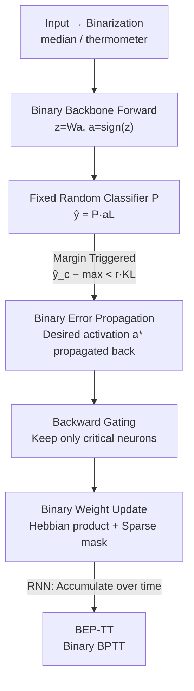

# BEP: A Binary Error Propagation Algorithm for Binary Neural Networks Training

**Conference**: ICLR 2026  
**OpenReview**: [https://openreview.net/forum?id=jxtCMoZIu8](https://openreview.net/forum?id=jxtCMoZIu8)  
**Code**: https://github.com/AI-Tech-Research-Lab/BEP  
**Area**: Model Compression / Binary Neural Networks  
**Keywords**: Binary Neural Networks, Backpropagation, Gradient-free Learning, Bitwise Operations, Edge Devices

## TL;DR
BEP proposes a **purely binary discrete version** of the chain rule in backpropagation: error signals are propagated layer-wise as binary $\pm 1$ vectors. The entire forward and backward process is executed using only bitwise operations such as XNOR, Popcount, and integer increments/decrements. This achieves the first end-to-end full binary training of binary MLPs and RNNs, providing gains of up to +6.89% on MLPs and an average of +10.57% on RNNs compared to previous local learning rules.

## Background & Motivation
**Background**: Binary Neural Networks (BNNs) constrain both weights and activations to $\pm 1$. Forward inference can replace expensive floating-point multiply-accumulate (MAC) operations with lightweight bitwise operations (XNOR + Popcount), which is highly attractive for edge devices with limited compute, memory, and power. However, training BNNs is challenging because the sign activation function is non-differentiable, making standard gradient-based optimization inapplicable.

**Limitations of Prior Work**: The current mainstream training method is Quantization-Aware Training (QAT). It bypasses the non-differentiability by maintaining full-precision "latent weights," binarizing them during the forward pass, and using a Straight-Through Estimator (STE) to approximate the derivative of the sign function as an identity mapping during the backward pass. The issue is that the backward pass remains entirely in floating-point, requiring extra FP32 latent weights and Adam's first/second moments. Consequently, the bitwise efficiency of BNNs is **only realized during inference, not during training**, and there exists a mismatch between training and inference dynamics.

Another approach involves purely binary, gradient-free local learning rules (inspired by statistical physics). Recent work (Colombo et al., 2025) uses a **fixed random classifier** for each layer of a binary MLP to generate local error signals for updates. However, the fatal flaw is that credit assignment is **local**, meaning the error from the final output layer **cannot be propagated back** to the deeper layers of the network.

**Key Challenge**: QAT is global but not binary (relying on floating-point gradients for global credit assignment), while local rules are binary but not global (failing to propagate task loss end-to-end). This contradiction results in existing purely binary methods being unable to handle architectures that rely heavily on end-to-end error propagation, such as RNNs which require credit assignment across time steps.

**Goal**: Can we design a **multi-layer, global** credit assignment mechanism where errors propagate layer-wise through the entire network while **operating entirely in the binary domain**?

**Key Insight**: The authors observe that the standard chain rule in backpropagation essentially consists of three steps: projecting error signals $\delta$ back through $W^\top$, multiplying by the activation derivative $\sigma'$, and controlling the update magnitude with a learning rate. If a **binary equivalent** can be found for each step, a discrete version of backpropagation can be constructed.

**Core Idea**: Use a binary "desired activation vector" $a^*$ as the error signal, binary matrix multiplication with $W^\top$ for error projection, a binary gate to represent the activation derivative $\sigma'$, and a sparse mask to serve as the learning rate—creating a "binary chain rule" operating entirely in the $\pm 1$ domain.

## Method

### Overall Architecture
BEP trains a network consisting of a "trainable binary backbone + fixed random classifier." During the forward pass, inputs are binarized into $\pm 1$ vectors and fed into an $L$-layer fully connected binary backbone, where each layer performs $z_l = W_l a_{l-1}$ and $a_l = \text{sign}(z_l)$. The backbone output passes through a fixed classifier $P$ to obtain logits $\hat{y} = P a_L$. The key to training is the backward pass: when the correct class logit for a sample does not exceed others by a sufficient margin, BEP propagates "ideal binary activation patterns" $a^*$ backward from the output layer, which are then used to update the integer latent weights of each layer. The entire pipeline manipulates only $\pm 1$ binary values and integer weights, without any floating-point gradients.

The process is illustrated below:

### Key Designs

**1. Binary Desired Activation Propagation: Using $\pm 1$ vectors as error signals**

This is the foundation of BEP, addressing the core problem of how error signals propagate through layers in the binary domain. Each layer's state is characterized by two matrices: integer latent weights $H_l \in \mathbb{Z}^{K_l \times K_{l-1}}$ (encoding "synaptic inertia" for learning stability and mitigating catastrophic forgetting, typically constrained to Int16) and visible binary weights $W_l = \text{sign}(H_l) \in \{\pm 1\}$ used for the actual forward pass.

Propagation starts at the output layer. Since the logit is the inner product of the activation and the class prototype $\hat{y} = P a_L$, to maximize the correct class $c^\mu$ logit, the ideal activation is the class prototype itself: $a^{*\mu}_L = \rho_{c^\mu}$ (where $\rho_{c^\mu}$ is the $c^\mu$-th row of $P$). For hidden layers $l < L$, the goal is to find an activation that aligns with the next layer's desired activation: $\arg\max_{a} \langle a^{*}_{l+1}, \text{sign}(W_{l+1} a)\rangle$. This is a combinatorial search over $2^{K_l}$. BEP introduces a relaxation—removing the non-linear sign and maximizing alignment with the **pre-activation**: $\arg\max_a \langle a^{*}_{l+1}, W_{l+1} a\rangle$. The authors prove (Lemma 1) that this relaxation has a unique analytical solution $a^* = \text{sign}(W^\top(g \odot b))$. Linking the base case and Lemma 1 yields a layer-wise recursion:

$$a^{*\mu}_l = \begin{cases} \rho_{c^\mu}, & l = L \\ \text{sign}\big(W^\top_{l+1}(g^\mu_{l+1} \odot a^{*\mu}_{l+1})\big), & l < L \end{cases}$$

Note that this recursion **only involves binary matrix multiplication and sign functions**—this is the "binary chain rule."

**2. Backward Gating: Using binary gates to target "critical" neurons**

This step corresponds to $\sigma'(z)$ in standard backpropagation. Intuitively, neurons whose pre-activations are far from 0 are saturated; pushing them is unlikely to flip their activation sign, making updates wasteful. Updates should focus on neurons near the decision boundary. BEP introduces a binary gating vector at layer $l+1$:

$$(g^\mu_{l+1})_i = \begin{cases} 1, & |z^\mu_{l+1,i}| \leq \nu K_l \\ 0, & \text{otherwise} \end{cases}$$

Where $\nu \in [0,1]$ is a tunable threshold. This gate excludes saturated neurons from propagation, concentrating updates on the most "flippable" parts of the network.

**3. Binary Weight Update: Hebbian product + Sparse mask**

After obtaining $a^*_l$, the integer latent weights $H_l$ are updated. The candidate update direction is given by a Perceptron-style Hebbian outer product:

$$\Delta H^\mu_l = \text{sign}\big(a^{*\mu}_l (a^\mu_{l-1})^\top\big) = a^{*\mu}_l (a^\mu_{l-1})^\top \in \{\pm 1\}^{K_l \times K_{l-1}}$$

A binary mask $M^\mu_l \in \{0,1\}$ then selects which weights to actually update. By grouping neurons and only updating the "most easily corrected" perceptron in each group (the one with the lowest stability $a^*_l H_{l,j}$), the update becomes $H_l \leftarrow H_l + 2\sum_{\mu \in M}(M^\mu_l \odot \Delta H^\mu_l)$. This sparse "winner-takes-all" mechanism acts as a discrete, data-dependent learning rate control.

**4. BEP-TT: Extending global error propagation to the time dimension**

The primary benefit of BEP's global credit assignment is its direct applicability to RNNs. Unrolling the RNN in time leads to a binary version of BPTT, termed BEP-TT. Desired states are propagated back from $t=T$ to $t=1$. For RNNs, updates for $H_{xs}$ and $H_{ss}$ are **accumulated** across all time steps and triggered samples. This design makes BEP the first method capable of end-to-end binary training for RNNs.

## Key Experimental Results

### Main Results
**Binary MLP (vs. Local Rules SotA + QAT)**: BEP was compared against SotA local rules and QAT (without batchnorm to ensure a purely binary model at inference). On four datasets, both purely binary methods outperformed QAT. BEP's improvements over local SotA are as follows:

| Dataset | BEP Gain relative to Local SotA |
| :--- | :--- |
| Random Prototypes | +6.89% |
| FashionMNIST | +1.22% |
| CIFAR-10 | +3.70% |
| Imagenette | +2.85% |

**Binary RNN (vs. QAT)**: On 30 UCR time-series datasets, **BEP-TT outperformed the equivalent QAT baseline on every dataset, with an average gain of +10.57%.**

| Method | Memory (Weights) | Memory (Error/Gradient) | Boolean Gates (Backward) | Boolean Gates (Update) |
| :--- | :--- | :--- | :--- | :--- |
| QAT (Adam) | 32 bit (FP32) | 32 + 64 (Moments) | ~$10^4$ | ~$10^4$ |
| Ours (BEP) | 16 bit (Int16) | 1 bit | ~$10$ | ~$10$ |

BEP achieves a 2x reduction in weight memory, 32x in error/gradient memory, and reduces Boolean gate costs by approximately 3 orders of magnitude.

### Ablation Study
| Configuration | Observation | Explanation |
| :--- | :--- | :--- |
| Gating threshold $\nu$ | $\nu \approx 10^{-2}$ is optimal | Too low or too high degrades performance. |
| Window length increase | Gating benefit increases | Deeper propagation (longer sequences) makes focusing on critical neurons more vital. |
| Remove global propagation | MLP performance drops; RNN untrainable | Global credit assignment is essential for RNNs. |

### Key Findings
- **An optimal gating threshold $\nu$ exists**: This suggests that "updating only neurons near the decision boundary" is crucial, especially in deeper or sequential models.
- **Global error propagation is the fundamental reason RNNs can be trained binarily**: Local rules cannot handle the cross-time-step credit assignment required for RNNs.
- **QAT with batchnorm achieved higher results on some UCR datasets**, but such models are not purely binary during inference, thus violating the "full binary" constraint of BEP.

## Highlights & Insights
- **Binary Correspondences**: $a^* \leftrightarrow \delta$; $W^\top$ projection $\leftrightarrow$ Error Propagation; Binary Gate $\leftrightarrow \sigma'$; Sparse Mask $\leftrightarrow$ Learning Rate. This mapping provides clear theoretical grounding.
- **Analytical Solution of Lemma 1**: Replacing a $2^{K_l}$ search with a bitwise $\text{sign}(W^\top(g \odot b))$ operation is the key to making the algorithm computationally feasible.
- **Dual-Weight Design**: Using integer latent weights for stability (synaptic inertia) and visible binary weights for bitwise inference cleverly resolves the contradiction between optimization stability and inference efficiency.

## Limitations & Future Work
- **Architectural Constraints**: Currently limited to binary MLPs and RNNs. Extensions to CNNs or Transformers require binary-compatible designs for weight sharing and spatial structures.
- **Task Constraints**: Focused on classification. Other tasks like regression or segmentation would require specific output encoding schemes.
- **Scale Constraints**: Validated on medium-scale datasets. Scaling to ImageNet-sized models remains a challenge.
- **Hyperparameter Sensitivity**: The margin trigger and sparse mask strategies introduce several hyperparameters ($r, p_r, \gamma_0, \nu$) and currently lack formal convergence proofs.

## Related Work & Insights
- **vs. QAT (BinaryConnect / Larq)**: QAT relies on "continuous optimization for discrete problems." BEP eliminates real-valued parameters and surrogate gradients, achieving efficiency gains of three orders of magnitude in gate costs.
- **vs. Local Learning Rules**: Previous local rules fail on RNNs because task loss cannot propagate deeply. BEP's global propagation unlocks RNN training and provides higher accuracy on MLPs.
- **vs. Statistical Physics Rules (CP / CP+R)**: BEP inherits the integer stability variables but adds a deterministic, layer-wise error propagation rule, bridging the gap between purely binary optimization and multi-layer deep training.

## Rating
- Novelty: ⭐⭐⭐⭐⭐ 
- Experimental Thoroughness: ⭐⭐⭐⭐ 
- Writing Quality: ⭐⭐⭐⭐⭐ 
- Value: ⭐⭐⭐⭐ 

<!-- RELATED:START -->

## Related Papers

- [\[ICML 2026\] SURGE: Surrogate Gradient Adaptation in Binary Neural Networks](../../ICML2026/model_compression/surge_surrogate_gradient_adaptation_in_binary_neural_networks.md)
- [\[ICML 2025\] An Efficient Matrix Multiplication Algorithm for Accelerating Inference in Binary and Ternary Neural Networks](../../ICML2025/model_compression/an_efficient_matrix_multiplication_algorithm_for_accelerating_inference_in_binar.md)
- [\[AAAI 2026\] BD-Net: Has Depth-Wise Convolution Ever Been Applied in Binary Neural Networks?](../../AAAI2026/model_compression/bd-net_has_depth-wise_convolution_ever_been_applied_in_binary_neural_networks.md)
- [\[ICLR 2026\] AnyBCQ: Hardware Efficient Flexible Binary-Coded Quantization for Multi-Precision LLMs](anybcq_hardware_efficient_flexible_binary-coded_quantization_for_multi-precision.md)
- [\[ICLR 2026\] Zeros Can Be Informative: Masked Binary U-Net for Image Segmentation on Tensor Cores](zeros_can_be_informative_masked_binary_u-net_for_image_segmentation_on_tensor_co.md)

<!-- RELATED:END -->
