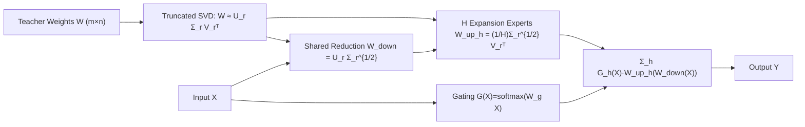

# Beyond Student: An Asymmetric Network for Neural Network Inheritance

**Conference**: ICLR 2026  
**OpenReview**: [https://openreview.net/forum?id=mp67iSM7qn](https://openreview.net/forum?id=mp67iSM7qn)  
**Code**: [https://github.com/zyy-2001/InherNet-Demo](https://github.com/zyy-2001/InherNet-Demo)  
**Area**: Model Compression / Knowledge Distillation / Low-Rank Decomposition  
**Keywords**: Neural Network Inheritance, SVD Initialization, Low-Rank Decomposition, Mixture-of-Experts, Knowledge Distillation  

## TL;DR
Instead of training a small-capacity student network to approximate a teacher, this work directly performs asymmetric low-rank decomposition on teacher weights, inherits principal component knowledge via SVD initialization, and reconstructs a "wide and deep" yet lightweight "Inherited Network" with an MoE-style "one dimension-reduction + multiple dimension-expansion experts" structure. It achieves faster convergence and higher accuracy than traditional student networks under the same parameter constraints.

## Background & Motivation

**Background**: Knowledge Distillation (KD) is the dominant paradigm for model compression, transferring knowledge from large teacher networks to lightweight student networks, extending from single-modality vision/text to multi-modal cross-modal transfer.

**Limitations of Prior Work**: Student networks are constrained by capacity and architecture, leading to performance inferior to teachers and a persistent "capacity gap." This mirrors the situation of LoRA in PEFT, where low-rank matrices approximate the weight increment $\Delta W$, still lagging behind full fine-tuning. More importantly, existing low-rank decomposition works are fragmented, mostly limited to early CNN vision tasks, and often use tensor decompositions like CP/MPO to split one layer into multiple sub-layers, making the network "deeper and narrower," which easily leads to vanishing/exploding gradients and training instability.

**Key Challenge**: KD forces students to "implicitly imitate" teachers, limited by the difficulty of heterogeneous knowledge transfer and student capacity. Pure low-rank decomposition destroys structural stability. The core question is how to explicitly inherit the teacher's structure and knowledge without compromising architectural stability.

**Goal**: To propose a universal, architecture-agnostic Neural Network Inheritance (NNI) method that "inherits" teacher capacity directly in low-rank form, and to systematically compare the performance and efficiency of "inherited networks vs. student networks" under equivalent parameter counts.

**Core Idea**: **From "approximating increments" to "approximating weights themselves"**—Unlike LoRA approximating $\Delta W$, InherNet directly uses SVD to approximate the teacher's full pre-trained weights $W$, thereby more directly preserving the teacher's expressiveness; it then overlays an **Asymmetric MoE Inheritance Structure** to achieve "widening + deepening" without significantly increasing network depth.

## Method

### Overall Architecture
InherNet decomposes each layer to be compressed into two components: **Knowledge Inheritance** (what values to use for initialization) and **Structural Inheritance** (what shape to build). Knowledge inheritance relies on truncated SVD performed on teacher weights, approximating a layer as a "reduction + expansion" pair initialized with the square root of singular values. Structural inheritance expands the expansion side into multiple expert heads with a gate for adaptive fusion, forming an asymmetric structure of "one shared reduction branch + H expansion expert heads." This combination preserves the teacher's principal components while expanding expressivity through multi-head specialization.

### Key Designs

**1. SVD-Driven Knowledge Inheritance: Starting with Principal Components Instead of Random Noise** InherNet avoids random initialization common in prior decomposition methods. Instead, it performs SVD on teacher weights $W \in \mathbb{R}^{m\times n}$, where $W = U\Sigma V^\top \approx U_r\Sigma_r V_r^\top$, truncating to the subspace of the top $r$ singular values. Per the Eckart-Young-Mirsky Theorem, this is the optimal rank-$r$ approximation in the Frobenius norm sense, with error $\|W-W_r\|_F=\sqrt{\sum_{i=r+1}^{\min(m,n)}\sigma_i^2}$. Each layer is split into only two layers (reduction + expansion), preventing the network from becoming excessively deep and fragmented like CP/MPO. For convolutional layers, the kernel $K\in\mathbb{R}^{N\times c\times k_w\times k_h}$ is reshaped into a 2D matrix before channel decomposition, resulting in $W_{down}\in\mathbb{R}^{N\times r\times1\times1}$ and $W_{up}\in\mathbb{R}^{r\times c\times k_w\times k_h}$. Since SVD is a one-time offline operation, its overhead is negligible, yet it positions the network's starting point within the teacher's principal subspace.

**2. Asymmetric Expert Head Structure: One Reduction Branch with Multiple Expansion Experts** Inspired by MoE, InherNet multiplies the expansion side into $H$ expert heads while keeping only one reduction branch, creating a deliberate "asymmetry." Given input $X$, the output is $Y=\sum_{h=1}^{H}G_h(X)\cdot W_h^{up}\big(W^{down}(X)\big)$, where $W^{down}$ and $W_h^{up}$ are initialized with $U_{[:,:r]}\Sigma_{[:r,:r]}^{1/2}$ and $\frac{1}{H}\Sigma_{[:r,:r]}^{1/2}V_{[:,:r]}^\top$ respectively (distributing the square root of singular values across heads). This design simultaneously achieves "widening" (multiple heads) and "deepening" (two layers), alleviating the risk of gradient vanishing/exploding inherent in pure low-rank decomposition. Ablations show asymmetry outperforms symmetric (LoRA+MoE-like) structures by introducing structural inductive bias and enhancing expert diversity.

**3. Adaptive Gating Fusion: Task Allocation by Input** Expert heads are aggregated via gating weights $G(X)=\mathrm{softmax}(W_g(X))$, where $W_g\in\mathbb{R}^{m\times H}$ is a learnable parameter. Based on Lemma 2.2, gradients naturally decompose into "expert head contributions + gating network contributions," routing gradients to the most relevant experts for a given input. Ablation studies emphasize that gating is critical for lightweight inherited networks—precision drops significantly without the gate (w.o. gate).

**4. Theoretical Support for Convergence and Parameter Efficiency: Explaining Faster Convergence** The authors provide three theoretical guarantees. First, convergence: due to $U_r, V_r$ orthogonal initialization, the effective gradient Lipschitz constant decreases from $L$ to $L'\approx L/\kappa$ (where $\kappa$ is the condition number of $W$). Under non-convex settings and decaying learning rates $\eta_t=\eta/\sqrt{t}$, the network reaches $\frac{1}{T}\sum_t\mathbb{E}\|\nabla L(\theta^{(t)})\|^2=O(1/\sqrt T)$, explaining the observed "faster convergence." Second, parameter efficiency: the compression ratio $\rho$ for rank-$r$ and $H$ heads is approximately $\rho=\frac{mn}{Hr(m+n)}$. Per Proposition 2.7, functional similarity increases monotonically with rank but not with $H$—**rank is the dominant factor in inherited knowledge volume.** Third, Proposition 2.10 gives the marginal utility of multiple heads as $O(1/H^2)$, meaning multiple heads are better than one but yield diminishing returns, echoing experimental insights.

## Key Experimental Results

### Main Results: CIFAR-100 Image Classification (top-1 Acc %, selected)

| Method | RN32×4 | VGG13 | WRN-40-2→40-1 | RN56 | RN110 |
|---|---|---|---|---|---|
| Teacher | 79.42 | 74.64 | 75.61 | 72.34 | 74.31 |
| Student | 72.50 | 70.36 | 71.98 | 69.06 | 71.14 |
| DKD | 76.32 | 74.68 | 74.81 | 71.97 | 74.11 |
| MLKD+Logit Std. | 78.28 | 75.22 | 75.56 | 72.33 | 74.32 |
| **InherNet-Small** | 77.57 | **75.68** | 76.04 | 72.67 | 74.13 |
| **InherNet-Large** | **78.53** | 75.16 | **76.39** | **73.67** | **75.88** |

InherNet-Large generally outperforms all KD baselines and **surpasses the teacher accuracy** on RN56/RN110; Small is comparable to the strongest Logit Std. baseline under equivalent parameters.

### Cross-modal Retrieval (CC3M) + ImageNet Zero-shot Classification (%, selected)

| Method | I2T R@1 | T2I R@1 | top-1 | top-5 |
|---|---|---|---|---|
| ResNet-101 (Teacher) | 30.58 | 29.31 | 15.70 | 32.75 |
| EfficientNet-B0 (CLIP-KD) | **33.65** | 32.65 | 17.30 | 35.75 |
| **InherNet** | 32.17 | **33.01** | **17.39** | **36.65** |

In multi-modal scenarios, InherNet generally outperforms CLIP-KD distilled students and consistently performs significantly better than the teacher network. On GLUE, InherNet surpasses T5-Small+KD on tasks like MNLI/QNLI/CoLA; scaled to LLaMA-2-7B, the constructed 4.2B model slightly outperforms the 7B teacher on GSM8K.

### Ablation Study (InherNet-Large, CIFAR-100 top-1 Acc %)

| Variant | RN32×4 | WRN-40-2 | RN56 | RN110 |
|---|---|---|---|---|
| w.o. svd | 76.68 | 75.42 | 69.35 | 74.13 |
| w.o. gate | 78.17 | 76.08 | 73.22 | 75.64 |
| w. sym. | 77.92 | 75.98 | 73.28 | 75.45 |
| **InherNet** | **78.53** | **76.39** | **73.67** | **75.88** |

### Key Findings
- **SVD initialization contributes most**: Removing it (w.o. svd) causes RN56 to drop to 69.35, as it both inherits beneficial knowledge and stabilizes training while accelerating convergence.
- **Three Major Insights**: ① Distillation benefits small-scale InherNet but **hurts large-scale InherNet** (at high rank, task loss alone beats the teacher, and KD loss acts as overly strong regularization); ② rank significantly affects performance, and multiple heads outperform a single head; ③ InherNet converges significantly faster than traditional distillation.

## Highlights & Insights
- **Clean Paradigm Shift**: Replaces "training a student to imitate a teacher" with "direct weight inheritance." Using SVD to inject principal components bypasses the long-standing hurdle of heterogeneous knowledge transfer in KD.
- **Clever Combination of Asymmetry + MoE**: Single reduction + multiple expansion adds both width and depth, avoiding the structural risks of "narrower" tensor decompositions while using gating to specialize experts, balancing efficiency and expressivity.
- **Theoretical and Empirical Closure**: Conclusions such as "rank determines knowledge volume," "diminishing returns of heads," and "SVD reduces Lipschitz constant" are supported by both theorems and ablations, thoroughly explaining why convergence is faster.
- **Counter-intuitive "Beating the Teacher" Result**: High-rank InherNet can slightly outperform the teacher, leading to the practical suggestion: "Do not use KD loss for larger inherited models."

## Limitations & Future Work
- **Dependence on Teacher Weight Quality**: SVD inheritance assumes teacher weights are well-trained and principal components carry knowledge; truncation error might erode effects for under-trained or spectrally flat teachers.
- **Rank/H Tuning**: Rank and number of expert heads are key hyperparameters; while the paper suggests "rank dominates, heads provide diminishing returns," optimal configurations still require task-specific searches.
- **Lack of LLM KD Comparison**: On LLaMA-2-7B, InherNet was not compared against standard KD due to issues like vocabulary size, teacher-forcing, and tokenizer mismatches; self-distillation baselines are less comprehensive.
- **Most Theory and Scaled Experiments in Appendix**: ImageNet results, convergence curves, and the proof for asymmetric design are mostly in the Appendix, while the main text focuses on CIFAR-100 scales.

## Related Work & Insights
- **Knowledge Distillation**: Logit-based (KD/DKD/MLKD/Logit Std.) and feature-based (CRD/OFD/ReviewKD/SimKD/CAT-KD) methods focus on implicit imitation; InherNet uses explicit inheritance to bypass the capacity gap.
- **Low-Rank / Tensor Decomposition**: Early CNN decompositions (Jaderberg, Zhang) and CP/MPO methods tend to make networks overly deep/narrow; InherNet splits into only two layers and uses SVD for stability.
- **LoRA / PEFT**: While InherNet shares a similar form with LoRA, it approximates $W$ instead of $\Delta W$, migrating low-rank ideas from PEFT to "compression + inheritance."
- **MoE**: Borrows the "widening" capability of Mixture-of-Experts, using asymmetric heads and gating to enhance expressive diversity. For practitioners in compression, the takeaway is "compression doesn't need to start from scratch; it can inherit from the teacher's spectrum."

## Rating
- **Novelty**: ⭐⭐⭐⭐ Reformulates "training students" as "inheriting weights," approximating $W$ instead of $\Delta W$ with an asymmetric MoE structure. The perspective is fresh and consistent.
- **Experimental Thoroughness**: ⭐⭐⭐⭐ Covers vision, language, and multi-modal tasks with ablations; however, direct KD comparisons on LLMs are missing, and many results are relegated to the Appendix.
- **Writing Quality**: ⭐⭐⭐⭐ Clear theoretical-empirical loop. Figures 1 and 2 intuitively explain "$W$ vs. $\Delta W$ approximation" and "knowledge + structural inheritance."
- **Value**: ⭐⭐⭐⭐ Opens a new path for model compression via direct inheritance, with practical implications regarding "beating the teacher" and the use of KD loss for large models.

<!-- RELATED:START -->

## Related Papers

- [\[AAAI 2026\] A Closer Look at Knowledge Distillation in Spiking Neural Network Training](../../AAAI2026/model_compression/a_closer_look_at_knowledge_distillation_in_spiking_neural_ne.md)
- [\[ICLR 2026\] The Lattice Geometry of Neural Network Quantization -- A Short Equivalence Proof of GPTQ and Babai's Algorithm](the_lattice_geometry_of_neural_network_quantization_--_a_short_equivalence_proof.md)
- [\[NeurIPS 2025\] On the Creation of Narrow AI: Hierarchy and Nonlocality of Neural Network Skills](../../NeurIPS2025/model_compression/on_the_creation_of_narrow_ai_hierarchy_and_nonlocality_of_neural_network_skills.md)
- [\[CVPR 2026\] Decompose, Mix, Adapt: A Unified Framework for Parameter-Efficient Neural Network Recombination and Compression](../../CVPR2026/model_compression/decompose_mix_adapt_a_unified_framework_for_parameter-efficient_neural_network_r.md)
- [\[AAAI 2026\] Renormalization Group Guided Tensor Network Structure Search](../../AAAI2026/model_compression/renormalization_group_guided_tensor_network_structure_search.md)

<!-- RELATED:END -->
