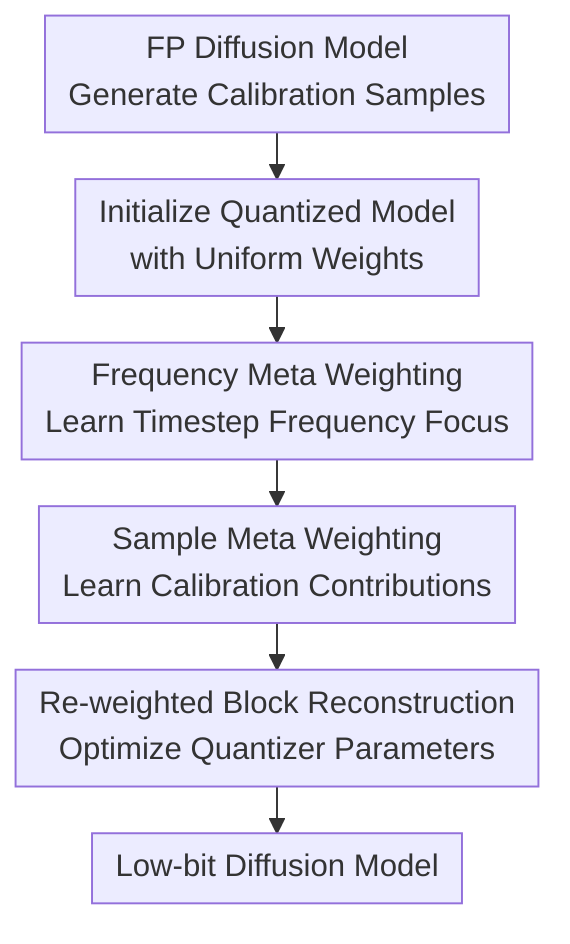

# Beyond Uniformity: Sample and Frequency Meta Weighting for Post-Training Quantization of Diffusion Models

**Conference**: ICLR2026  
**OpenReview**: [https://openreview.net/forum?id=FDdOD3qwS7](https://openreview.net/forum?id=FDdOD3qwS7)  
**Code**: Not released  
**Area**: Model Compression / Diffusion Model Quantization  
**Keywords**: Post-Training Quantization, Diffusion Models, Calibration Sample Weighting, Frequency Domain Loss, Meta-Learning  

## TL;DR
This paper proposes a sample and frequency meta-weighting method for post-training quantization (PTQ) of diffusion models. Instead of treating all calibration samples and frequency components equally, it automatically learns which samples and which timestep-specific frequency components should influence quantization calibration through bi-level optimization, stably reducing FID in low-bit diffusion models.

## Background & Motivation
**Background**: Diffusion models generate high-quality images but require repeated calls to noise estimation networks during sampling, incurring high parameter counts and multi-step denoising costs. To deploy diffusion models on resource-constrained devices, post-training quantization (PTQ) is an attractive route: it adjusts quantizers using a small amount of calibration data without full retraining, reducing storage and computation overhead for weights and activations.

**Limitations of Prior Work**: PTQ for diffusion models is more challenging than for classification networks because the input distributions vary significantly across different denoising timesteps. Methods like PTQ4DM, Q-Diffusion, and TFMQ-DM typically sample generated instances from multiple timesteps as a calibration set, but they default to each sample contributing equally during calibration. This assumption may not suit the diffusion process: early timesteps involve high-noise inputs, while structures and textures form in middle and late stages. Different samples exhibit inconsistent sensitivity to quantization errors.

**Key Challenge**: The denoising process inherent in diffusion models follows distinct temporal and spectral evolution patterns. Low-frequency structures are typically recovered first, while high-frequency textures and edge details are filled in later. Conventional PTQ calibration losses average errors across different timesteps and frequency bands, causing the quantized model to waste limited calibration capacity on non-critical samples or frequency components, especially in low-bit settings like W4A8 and W4A32.

**Goal**: The authors aim to solve two closely related problems: first, determining which samples in the calibration set should have more authority over quantizer updates; second, deciding whether the quantized model should focus more on low-frequency structural errors or high-frequency detail errors at each denoising timestep. Neither should be fixed by manual rules; instead, they should be learned automatically from validation loss.

**Key Insight**: The paper stems from two observations. One empirical observation is that when samples in the same calibration set are randomly assigned different weights, many random weight combinations yield better FID than uniform weighting, indicating "all samples are equally important" is suboptimal. Another domain observation is that the frequency recovery sequence of diffusion models changes with timesteps; if quantization calibration ignores these frequency dynamics, it is difficult for low-bit models to accurately mimic full-precision models.

**Core Idea**: Use meta-learning to turn "sample weights" and "timestep frequency weights" into learnable variables. By using validation set performance to guide the calibration loss via back-propagation, PTQ is transformed from uniform averaging into a process that quantizes diffusion models based on sample importance and stage-specific frequency requirements.

## Method

### Overall Architecture
The method adds a "calibration weight learner" to the existing diffusion model PTQ framework. The input consists of a full-precision diffusion model, a calibration set sampled from multiple timesteps (as in Q-Diffusion), and a small validation set. The output is a quantized noise estimation network. Rather than retraining the diffusion model, the core process involves alternating between learning two types of weights—calibration sample weights $\omega$ and frequency weight matrices $\lambda$—during layer-wise or block-wise quantization, then re-weighting the quantization reconstruction loss.

Specifically, each calibration sample is denoted as $(x_i, t_i)$. The method assigns a learnable weight $\omega_i$ to each sample and four frequency sub-band weights $\lambda_{t,0}, \lambda_{t,1}, \lambda_{t,2}, \lambda_{t,3}$ to each timestep. These sub-bands come from the Haar Discrete Wavelet Transform (DWT): low-frequency $ll$ represents overall structure, while high-frequencies $lh, hl, hh$ represent vertical, horizontal, and diagonal detail changes.

The overall optimization is a bi-level problem: the inner loop updates the quantized model using current $\omega$ and $\lambda$ to align quantized block outputs with full-precision outputs; the outer loop evaluates the reconstruction error of this "temporarily updated model" on the validation set to update $\omega$ and $\lambda$. Since exact bi-level optimization is costly, the paper uses a one-step gradient approximation for the temporary model and executes alternating updates for frequency weights, sample weights, and quantizer parameters within each block.

### Key Designs
**1. Sample Meta Weighting: Let the validation set decide which calibration samples to trust**

Traditional PTQ calibration losses typically sum calibration samples equally, assuming all $(x_i, t_i)$ are equally important for final generation quality. This paper replaces uniform averaging with a weighted reconstruction loss where each sample has its own $\omega_i$. The key is not the "weighting" itself, but that weights are learned from validation loss via meta-learning rather than manual heuristics.

The quantized model's update is written as an approximation: current quantization parameters $\theta_Q$ move one step along the gradient of the weighted calibration loss to obtain $\hat{\theta}_Q$. Subsequently, the reconstruction error of $\hat{\theta}_Q$ is evaluated on validation set $S_v$ to compute the gradient for $\omega_i$. If a calibration sample helps reduce validation loss after an inner update, its weight is increased; otherwise, it is suppressed. This effectively converts calibration samples from "passive materials" into "training signals filtered by generalization contribution."

**2. Frequency Meta Weighting: Learning timestep-specific frequency focus**

Diffusion models do not recover frequency information all at once. Early stages favor coarse structures and low-frequency contours, while later stages gradually supplement high-frequency details. This method decomposes both full-precision and quantized block outputs into four DWT sub-bands and calculates a frequency loss using timestep-dependent weights.

For two tensors $a, b$, the frequency difference is defined as $L_f(a,b,\hat{\lambda})=\hat{\lambda}_0\|a_{ll}-b_{ll}\|^2+\hat{\lambda}_1\|a_{lh}-b_{lh}\|^2+\hat{\lambda}_2\|a_{hl}-b_{hl}\|^2+\hat{\lambda}_3\|a_{hh}-b_{hh}\|^2$. At timestep $t_i$, the sample uses the corresponding $\lambda_{t_i}$, constrained to sum to 1. This allows the model to focus on low-frequency structural alignment at some timesteps and high-frequency details at others.

**3. Frequency Trend Regularization: Injecting denoising priors into weight shapes**

Learning frequency weights solely from validation loss may be susceptible to noise in small validation sets. Thus, a frequency trend regularization $L_{Reg}$ is introduced. It focuses on the ratio $r=\lambda_{:,0}\oslash(\lambda_{:,1}+\lambda_{:,2}+\lambda_{:,3})$ of low-frequency to high-frequency weights, punishing trends inconsistent with expectations using $\sum_{t=0}^{T-2}\max(0,r_t-r_{t+1})$. This ensures that as denoising progresses (as $t$ decreases), the relative importance of low frequencies decreases while high frequencies increase.

**4. Three-step Alternating Quantization**

Meta-weighting is embedded into block-level quantization reconstruction. For each block, the method initializes uniform weights and then loops through three steps: updating frequency weights with fixed sample weights, updating sample weights with fixed frequency weights, and finally optimizing quantizer parameters $\theta_Q$ using the final combined loss.

## Loss & Training
The method utilizes three types of losses. The block reconstruction loss is $L_{Q}(\theta_Q, x_i, l) = \|\epsilon^{(l)}_{FP}(x_i, t_i) - \epsilon^{(l)}_Q(x_i, t_i)\|^2$. The frequency loss $L_F$ weights the squared errors of four DWT sub-bands by $\lambda_{t_i}$. Finally, the validation loss $L_{val}=\|\epsilon_{FP}(x_j,t_j)-\epsilon_Q(x_j,t_j)\|^2+\beta L_{Reg}(\lambda)$ guides the updates of $\omega$ and $\lambda$. The final quantization loss is $L_{FINAL}=\sum_i\omega_i[L_Q(\theta_Q,x_i,l)+\gamma L_F(\theta_Q,x_i,\lambda,l)]$.

## Key Experimental Results

### Main Results
Evaluations on DDPM and LDM-4 across CIFAR-10, LSUN-Bedrooms, FFHQ, and ImageNet show that adding meta-weighting to the strong TFMQ-DM baseline further reduces FID in low-bit settings.

| Dataset / Model | Quantization | Ours FID / sFID | Prev. SOTA (TFMQ-DM) FID / sFID | Gain |
|---|---:|---:|---:|---|
| CIFAR-10 32×32 / DDPM | W4A32 | 4.21 / 4.47 | 4.73 / - | FID -0.52 |
| CIFAR-10 32×32 / DDPM | W4A8 | 4.25 / 4.46 | 4.78 / - | FID -0.53 |
| LSUN-Bedrooms / LDM-4 | W4A32 | 3.16 / 6.92 | 3.60 / 7.61 | Better FID & sFID |
| ImageNet / LDM-4 | W4A32 | 10.10 / 7.32 | 10.50 / 7.98 | Effective on ImageNet |

### Ablation Study
| Configuration | LSUN-Bedrooms W4A8 FID↓ | LSUN-Bedrooms W4A8 sFID↓ | Description |
|---|---:|---:|---|
| TFMQ-DM baseline | 3.68 | 7.65 | No weighting mechanism |
| + Sample weighting | 3.47 | 7.20 | Significant gain from samples |
| + Frequency weighting | 3.38 | 7.39 | Larger FID gain from frequency |
| Ours without $L_{Reg}$ | 3.41 | 7.18 | Weighted without trend prior |
| Ours full | 3.28 | 7.05 | Both weightings + regularization |

### Key Findings
- Both sample and frequency weighting provide independent gains, proving that "unequal sample importance" and "timestep frequency dynamics" are distinct signals.
- Frequency trend regularization is crucial for stable learning; without $L_{Reg}$, performance degrades, showing that meta-learning needs guidance from diffusion priors.
- Low-bit settings benefit most. Gains at W4A32/W4A8 are significant, while W8A8 shows smaller improvements, aligning with the intuition that stronger quantization errors benefit more from re-weighted calibration.

## Highlights & Insights
- The core insight is treating the calibration set as an object for "re-learning" rather than a fixed set to be averaged. This is more universal than heuristic sampling methods.
- Frequency weighting fits the diffusion mechanism naturally. It addresses "where the quantization error matters most" in the spectral domain, aligning PTQ loss with generation quality.
- Bi-level optimization naturally avoids overfitting the calibration set at the expense of generation quality by using a validation performance target.

## Limitations & Future Work
- **Experimental Thoroughness**: Additional computation costs are non-negligible due to the alternating bi-level optimization. While generative performance improves, the overhead in calibration time and memory compared to standard PTQ is not fully explored.
- **Novelty**: Experiments are limited to U-Net and LDM-4 architectures. Whether frequency patterns and DWT sub-bands hold the same importance for DiT or video diffusion remains to be verified.
- **Background**: The frequency prior (low-freq first, high-freq later) is suitable for natural images but may vary in specialized domains like medical imaging or multi-modal generation.

## Related Work & Insights
- **Comparison with Q-Diffusion**: Q-Diffusion focuses on *how to select* timesteps for calibration; this work focuses on *how to use* those samples via learned weights.
- **Comparison with TFMQ-DM**: TFMQ-DM emphasizes temporal feature maintenance; this work uses TFMQ-DM as a baseline and enhances it with re-weighted calibration loss.
- **Novelty**: Unlike generic meta-quantization methods, this approach targets the unique denoising dynamics of diffusion models by weighting according to samples and timesteps.

## Rating
- Novelty: ⭐⭐⭐⭐☆
- Experimental Thoroughness: ⭐⭐⭐⭐☆
- Writing Quality: ⭐⭐⭐⭐☆
- Value: ⭐⭐⭐⭐☆

<!-- RELATED:START -->

- **Q-Diffusion**: Post-training Quantization of Diffusion Models (ICCV 2023)
- **TFMQ-DM**: Temporal Feature Maintenance Quantization for Diffusion Models (CVPR 2024)
- **PTQ4DM**: Post-Training Quantization for Diffusion Models (CVPR 2023)

<!-- RELATED:END -->

## Related Papers

- [\[ICLR 2026\] Gradient-Aligned Calibration for Post-Training Quantization of Diffusion Models](gradient-aligned_calibration_for_post-training_quantization_of_diffusion_models.md)
- [\[ICLR 2026\] Quant-dLLM: Post-Training Extreme Low-Bit Quantization for Diffusion Large Language Models](quant-dllm_post-training_extreme_low-bit_quantization_for_diffusion_large_langua.md)
- [\[ICLR 2026\] PTQ4ARVG: Post-Training Quantization for AutoRegressive Visual Generation Models](ptq4arvg_post-training_quantization_for_autoregressive_visual_generation_models.md)
- [\[ECCV 2024\] MetaAug: Meta-Data Augmentation for Post-Training Quantization](../../ECCV2024/model_compression/metaaug_meta-data_augmentation_for_post-training_quantization.md)
- [\[ICLR 2026\] Post-Training Quantization for Video Matting](post-training_quantization_for_video_matting.md)

<!-- RELATED:END -->
