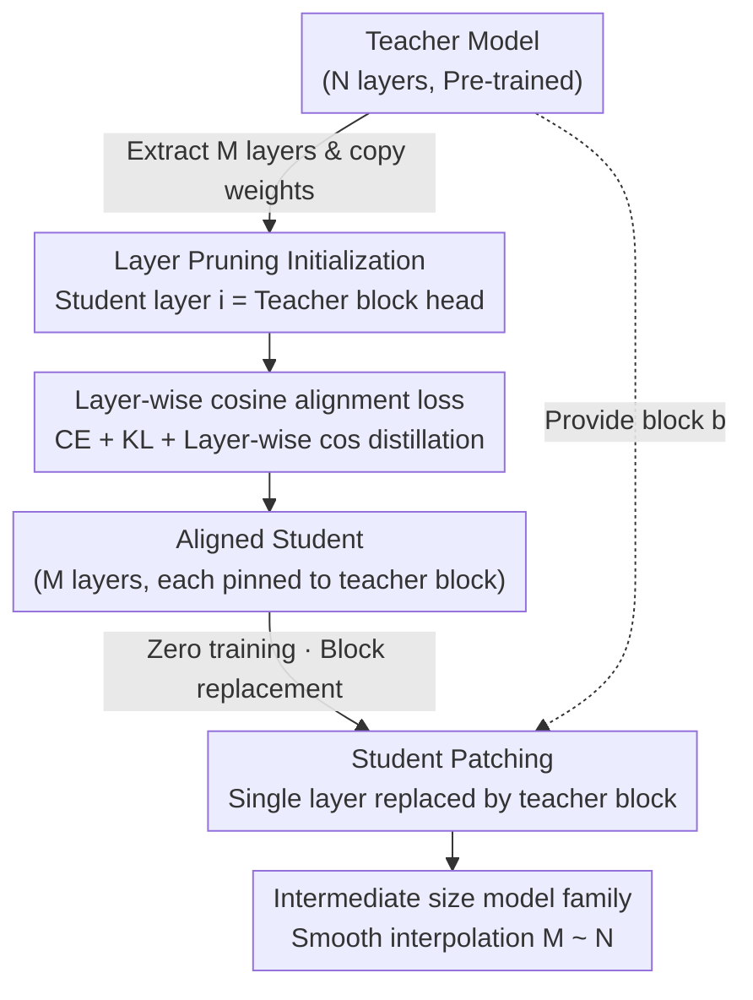

# Boomerang Distillation Enables Zero-Shot Model Size Interpolation

**Conference**: ICLR2026  
**arXiv**: [2510.05064](https://arxiv.org/abs/2510.05064)  
**Code**: [https://github.com/dcml-lab/boomerang-distillation](https://github.com/dcml-lab/boomerang-distillation)  
**Area**: Model Compression  
**Keywords**: Knowledge Distillation, Model Compression, Zero-Shot Interpolation, Layer Pruning, Model Families  

## TL;DR
The "Boomerang Distillation" paradigm is proposed: by training only a single small student model and progressively "patching" the teacher's transformer layers back into the student, a whole family of intermediate-sized models can be constructed with zero training cost. Their performance smoothly interpolates between the student and teacher, matching or even exceeding same-sized models distilled individually.

## Background & Motivation

**Background**: LLM deployment scenarios span a vast range—from mobile devices to large-scale clusters. Model developers typically release model families of varying parameter scales (e.g., Qwen3-0.6B/1.7B/4B/8B/32B, Llama 3.2-1B/3B/8B). However, each size requires independent pre-training or distillation from scratch, causing training costs to grow linearly with the number of family members.

**Limitations of Prior Work**: Although knowledge distillation is more efficient than training from scratch, each student still requires a complete training pipeline (initialization via layer pruning $\rightarrow$ distillation $\rightarrow$ alignment), making it impossible to scale to fine-grained size options without training. Existing layer pruning methods (e.g., ShortGPT, LaCo) only utilize teacher information; after removing a few layers, classification performance drops sharply, and generation capabilities collapse to near zero.

**Key Challenge**: Practical deployment requires fine-grained trade-offs in the "size–performance" space, but training costs limit model families to only a few coarse-grained options.

**Key Insight**: The authors observe that if a student model is initialized from the teacher via layer pruning (rather than random initialization), a high degree of representation alignment is maintained between each layer of the student and its corresponding teacher block after distillation. This implies that teacher blocks can be "patched back" into the student to replace the corresponding single layers without additional training, increasing model size without destroying functionality—much like a boomerang flying out (layer removal) and returning (layer patching).

**Core Idea**: One-time distillation + progressive patching of teacher blocks = a fine-grained model family with zero training cost.

## Method

### Overall Architecture
Boomerang distillation strings "layer pruning—distillation—patching" into a single pipeline: First, $M$ layers (along with embedding layers and the LM head) are extracted at equal intervals from $N$ teacher layers to initialize a small student. Then, the student is distilled on a text corpus using a combination of CE, KL, and layer-wise cosine losses to align its output distribution and intermediate representations with the teacher. Finally, without any further training, the teacher's continuous blocks are "patched" back into the student's corresponding positions one by one to assemble models of any intermediate size between $M$ and $N$ layers at zero cost.

### Key Designs

**1. Layer Pruning Initialization: Letting each student layer naturally act as a proxy for a teacher block**

The $N$ transformer layers of the teacher are partitioned into $M$ continuous blocks $\mathcal{B} = (\mathbf{b}^{(1)}, \dots, \mathbf{b}^{(M)})$, where the $i$-th block covers layers $(\theta_T^{(\ell_i)}, \dots, \theta_T^{(\ell_{i+1}-1)})$. Instead of random initialization, the $i$-th layer of the student directly copies the first layer of the corresponding block $\theta_S^{(i)} = \theta_T^{(\ell_i)}$; the embedding layer and LM head are also copied. This initialization ensures structural compatibility—each student layer starts at the position of its corresponding teacher block, making it possible to patch back the entire block later without breaking functionality. Ablations prove this is a necessary condition for the boomerang phenomenon; students with random initialization gain almost no performance from patching teacher layers even after identical distillation.

**2. Layer-wise Cosine Alignment Loss: Pinning each layer's output to the teacher block to stabilize extreme sizes**

The total loss is $\mathcal{L} = \mathcal{L}_{CE} + \lambda_{KL} \mathcal{L}_{KL} + \lambda_{cos} \sum_{i=1}^{M} \mathcal{L}_{cos}^{(i)}$, where $\mathcal{L}_{KL}$ calculates KL divergence using temperature $\tau$ scaled logits to learn the teacher's output distribution. $\mathcal{L}_{cos}^{(i)}$ aligns the hidden state of student layer $i$ with the hidden state of the last layer in teacher block $\mathbf{b}^{(i)}$ using cosine distance ($\lambda_{KL}, \lambda_{cos}$ are hyperparameters). Patching can only occur seamlessly when the student layer's output is sufficiently close to the teacher block's output. Interestingly, this loss does not primarily raise average performance; even with only CE loss, the boomerang effect occurs (due to teacher initialization). However, without it, performance fluctuates significantly for interpolation models at the most extreme sizes (first and last layers). The true role of cosine alignment is to stabilize these peripheral layers.

**3. Student Patching: One-step layer replacement for an entire family of intermediate sizes**

After distillation, this step requires no training. The operation simply involves replacing a single student layer $\theta_S^{(i)}$ with the entire teacher block $\mathbf{b}^{(i)}$, increasing the model's layer count from $M$ to $M + |\mathbf{b}^{(i)}| - 1$. By performing this at different positions, models of any intermediate size between $M$ (pure student) and $N$ (fully restored teacher) layers can be assembled. During assembly, the embedding layer is taken from the model contributing the first layer, and the LM head from the model contributing the last layer. Patching from the last layer forward generally yields the best results, except for Llama, where the low cosine similarity between the first two layers makes them special; they should be kept in the student and patched from front to back.

### Loss & Training
The primary teacher is Qwen3-4B-Base (36 layers), with an 18-layer, 2.7B parameter student extracted. Distillation uses the deduplicated The Pile corpus for only 2.1B tokens. Cross-model validation uses Qwen3-8B-Base, Pythia-6.9B, and Llama-3.2-3B as teachers.

## Key Experimental Results

### Main Results: Boomerang Distillation vs. Baselines & Standard Distillation

| Method | Params | Classification Acc | Generation Acc | Extra Training |
|--------|--------|---------------------|-----------------|----------------|
| Qwen3-4B (Teacher) | 4.0B | Benchmark (Max) | Benchmark (Max) | - |
| Boomerang (Student) | 2.7B | Close to Teacher | Close to Teacher | 1 Distillation |
| Boomerang Interpolation | 2.7B–4.0B | Smooth Interpolation ✅ | Smooth Interpolation ✅ | 0 (Zero-shot) |
| Standard Distillation (Individual) | 2.7B–4.0B | Small size ≈ Boomerang, Large size < Boomerang | Similar trend | 1 per size |
| Naive Layer Pruning | <4.0B | Drops sharply <4B ❌ | Collapses to ~0 ❌ | 0 |
| Rand-Init Distill + Patching | 2.7B–4.0B | Almost no gain ❌ | Almost no gain ❌ | 1 Distillation |
| Pythia-2.8B (Pre-trained) | 2.8B | Comparable | Comparable | Full Pre-training |
| Llama-3.2-3B (Pre-trained) | 3.0B | Comparable | Comparable | Full Pre-training |

Key Finding: Large-sized interpolation models actually **outperform** independently distilled models. This is because the distillation corpus (The Pile) is of lower quality than Qwen3's original pre-training data; independent distillation of more layers on low-quality data leads to catastrophic forgetting, while Boomerang Distillation preserves original knowledge by patching back original teacher weights. This effect disappears when Pythia is the teacher (as Pythia was trained on The Pile).

### Ablation Study: Loss Function Combinations

| Loss Combination | Perplexity (WikiText) | Class. Acc | Peripheral Stability |
|------------------|-----------------------|------------|-----------------------|
| CE only | Higher | Usable, Boomerang occurs | High fluctuation ❌ |
| CE + KL | Slightly lower | Slightly better | Still fluctuates |
| CE + Layer cos | Lower | Little improvement | Significantly stable ✅ |
| **CE + KL + Layer cos (Full)** | **Lowest** | Optimal | **Most stable ✅** |

Key Findings: (1) Boomerang distillation occurs even with only CE loss—teacher weight initialization is the core requirement. (2) The main contribution of layer-wise cos loss is "stabilizing peripheral layers" rather than "improving mean performance"; the first and last layers are most prone to failure without proper alignment. (3) The full loss shows a significant advantage in PPL.

### Comparison with Layer Pruning Methods
Boomerang distillation significantly outperforms popular layer pruning methods like ShortGPT and LaCo across **all intermediate sizes**. The difference is particularly pronounced in generation tasks: ShortGPT/LaCo generation accuracy collapses to near zero after removing a few layers (ShortGPT authors acknowledge error accumulation), whereas the small models created by Boomerang distillation maintain high generation levels, and classification performance transitions smoothly.

### Cross-Model Family and Open-Source Model Validation
- The boomerang phenomenon is observed using Qwen3-8B, Pythia-6.9B, and Llama-3.2-3B as teachers, indicating it is a **universal phenomenon** in LLM distillation.
- This phenomenon exists in legacy DistilBERT $\leftrightarrow$ BERT and DistilGPT2 $\leftrightarrow$ GPT2 pairs—patching BERT layers back into DistilBERT yields smooth intermediate models without any additional training. This is the first discovery of zero-shot size interpolation in these classic models.
- Llama's specific characteristic: low cosine similarity between the first two layers requires keeping the first two layers and patching in reverse order.

### Additional Ablations
- More aggressive layer pruning (smaller student): Boomerang distillation works as long as the student has non-trivial performance on the target task.
- Training token volume: Increasing the training budget can improve interpolation model performance, but 2.1B tokens are sufficient for smooth interpolation.

## Highlights & Insights
- **"One training, infinite sizes" paradigm**: The method requires no routers, no elastic architectures, and no multiple training runs. It only needs a standard distillation pipeline plus a simple layer replacement operation, making it highly practical.
- **Revealing an overlooked "byproduct" of distillation**: Layer pruning initialization + distillation training not only achieves a good output distribution but also implicitly maintains representation compatibility between each student layer and its corresponding teacher block. This compatibility was previously unexploited.
- **"Reverse utilization" of catastrophic forgetting**: On low-quality distillation corpora, independent distillation of more layers leads to more forgetting of original knowledge. Boomerang distillation is naturally immune to this by patching back original teacher weights, making large sizes stronger. This provides a practical route for building model families when original pre-training data is unavailable.

## Limitations & Future Work
- **Only supports same-architecture, same-hidden-dimension teacher-student pairs**: If a student uses neuron pruning (like Minitron), hidden dimensions will not match, preventing patching. This limits compatibility with certain industrial pipelines.
- **Requires simultaneous storage of teacher and student weights**: The patching phase requires access to teacher layer weights. Although only the final interpolated model is needed at inference time, storage overhead is higher than for standalone small models.
- **Distillation corpus quality impacts the student**: In Pythia experiments using the teacher's original pre-training data (The Pile), independently distilled intermediate models outperformed Boomerang interpolation. This suggests Boomerang's advantage partly comes from "avoiding contamination of large models by low-quality corpora"; if high-quality data is available, the advantage diminishes.
- **Sensitivity to patching order**: Llama requires special handling (retaining the first two layers, reverse patching); different model families may require different strategies.

## Related Work & Insights
- **vs. Elastic Transformer (Cai et al., 2025)**: Elastic methods require training Gumbel Softmax routers within the teacher for size interpolation, which is complex and requires architectural changes. Boomerang distillation uses standard pipelines without architecture modification.
- **vs. ShortGPT / LaCo Layer Pruning**: Layer pruning is unidirectional (compression only), while Boomerang is bidirectional. Pruning suffers from error accumulation across layers leading to generation collapse, which Boomerang eliminates via distillation training.
- **vs. Minitron (Muralidharan et al., 2024)**: Minitron performs both layer and neuron pruning, which is more efficient but requires independent distillation for each size and is incompatible with patching due to dimension mismatches. Future work could explore Minitron variants with only layer pruning to enable compatibility.

## Rating
- Novelty: ⭐⭐⭐⭐⭐ First discovery and systematization of "zero-shot size interpolation after distillation."
- Experimental Thoroughness: ⭐⭐⭐⭐⭐ Verified across four model families, legacy models (DistilBERT/GPT2), full ablations, and comparison with pruning baselines.
- Writing Quality: ⭐⭐⭐⭐ Clear structure and rich visualizations, though some Appendix content could be integrated into the main text.
- Value: ⭐⭐⭐⭐ Provides a very low-cost route for building LLM families, though restricted by architecture and dimension compatibility.

<!-- RELATED:START -->

## Related Papers

- [\[ICLR 2026\] Distilling and Adapting: A Topology-Aware Framework for Zero-Shot Interaction Prediction in Multiplex Biological Networks](distilling_and_adapting_a_topology-aware_framework_for_zero-shot_interaction_pre.md)
- [\[NeurIPS 2025\] Enhancing Semi-supervised Learning with Zero-shot Pseudolabels](../../NeurIPS2025/model_compression/enhancing_semi-supervised_learning_with_zero-shot_pseudolabels.md)
- [\[ICLR 2026\] Navigating the Accuracy-Size Trade-Off with Flexible Model Merging](navigating_the_accuracy-size_trade-off_with_flexible_model_merging.md)
- [\[ECCV 2024\] Improving Zero-Shot Generalization for CLIP with Variational Adapter](../../ECCV2024/model_compression/improving_zero-shot_generalization_for_clip_with_variational_adapter.md)
- [\[ICML 2026\] Float8@2bits: Entropy Coding Enables Data-Free Model Compression](../../ICML2026/model_compression/float82bits_entropy_coding_enables_data-free_model_compression.md)

<!-- RELATED:END -->
