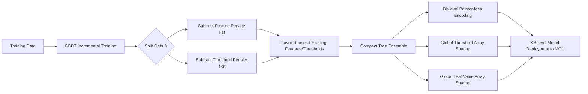

# Boosted Trees on a Diet: Compact Models for Resource-Constrained Devices

**Conference**: ICLR 2026  
**OpenReview**: [https://openreview.net/forum?id=batDcksZsh](https://openreview.net/forum?id=batDcksZsh)  
**Code**: [https://github.com/TinyAIoT/LightGBM-ToaD](https://github.com/TinyAIoT/LightGBM-ToaD)  
**Area**: Model Compression / TinyML / Gradient Boosted Decision Trees  
**Keywords**: Gradient Boosted Decision Trees, GBDT, Model Compression, TinyML, IoT, LightGBM, Feature Reuse, Bit-level Encoding  

## TL;DR
ToaD (Trees on a Diet) introduces regularization terms during GBDT training that encourage "feature and threshold reuse." Combined with a pointer-less, bit-coded memory layout featuring globally shared thresholds and leaf values, it compresses LightGBM models by 4–16 times without accuracy loss, allowing boosted trees to fit within KB-level microcontrollers.

## Background & Motivation
**Background**: The rise of IoT and TinyML has made running models directly on microcontrollers a critical requirement. A typical Arduino Uno R4 has only 32 KB RAM and 256 KB flash, which must be shared with the operating system, sensing, and data processing routines. Gradient Boosted Decision Trees (XGBoost/LightGBM) remain the preferred models for such devices due to their accuracy on structured/tabular data, interpretability, and low computational cost.

**Limitations of Prior Work**: Existing "slimming" methods primarily focus on pre-training or post-training stages, such as quantization (reducing thresholds/leaf values to fp16 or FPGA fixed-point) and pruning (post-training clipping like CCP or CEGB). The shared short-coming of these methods is that **they can only compress models passively after they are fixed, failing to proactively generate compressibility during the training phase**.

**Key Challenge**: Decision trees naturally contain a significant amount of "shareable" redundancy—the same feature, threshold, or leaf value often appears repeatedly within a single tree or across the entire ensemble. However, standard training gain functions treat "reusing an existing feature/threshold" and "introducing a brand-new feature/threshold" equally. Consequently, models tend to use a large number of distinct values, each of which must be stored independently with full precision, leading to significant memory waste.

**Goal**: To incorporate "memory footprint" into the optimization objective during training, enabling a controllable trade-off between fitting quality and model size, ultimately producing compact boosted trees capable of autonomous execution on KB-level devices.

**Core Idea**: **Soft constraints on the training side + hard encoding on the deployment side**. On one hand, regularization terms are used to penalize the introduction of "new features/thresholds," inducing the model to spontaneously reuse existing values. On the other hand, a bit-level, pointer-less, globally shared memory layout is designed to store these reused values almost "for free."

## Method

### Overall Architecture
ToaD consists of two interlocking components: the **training side** modifies the GBDT split gain to penalize the introduction of new features or thresholds, making new trees favor reusing previously encountered ones; the **deployment side** utilizes a bit-encoded memory layout that stores trees as pointer-less complete tree arrays and extracts all thresholds and leaf values into global shared arrays for referenced reuse. Both components are essential—the regularization creates "reusability," and the memory layout converts that "reuse" into actual bit savings.

### Key Designs

**1. Reuse-aware Regularization: Incorporating "Memory Cost" into Split Gain.** Boosted trees greedily select the leaf and split point with the maximum gain per round. However, standard gain $\Delta(I,i,\mu)$ does not distinguish whether a split uses "old features/thresholds" or "brand-new values." Following the logic of Peter et al. (2017), ToaD maintains a set of used features $F_U$ and a set of used thresholds $T^f$ for each feature. It appends a linear penalty to the complexity regularization: $\Omega_l(t_m)=\Omega(t_m)+\iota\cdot|F_U|+\xi\cdot\sum_{f\in F_U}|T^f|$. The objective increases by $\iota$ for each new feature and $\xi$ for each new threshold. In greedy splitting, the gain is rewritten as $\Delta_l(I,i,\mu)=\Delta(I,i,\mu)-s_f\iota-s_t\xi$, where $s_f, s_t \in \{0,1\}$ indicate whether the split introduces a "new" feature or threshold. The intuition is simple: features/thresholds already used in previous trees are nearly "free" in memory, so their gain is not discounted; only truly new values incur a cost. Two hyperparameters, $\iota$ and $\xi$, are tuned by the user to continuously control the quality-size trade-off.

**2. Pointer-less Bit-level Encoding: Minimizing Bits for Structure in Shallow Trees.** Boosted trees often have shallow depths ($\le 5$) and are nearly balanced. ToaD stores these as implicit indices in a complete binary tree: the root is at index 0, and the left/right children of node $i$ are at $2i+1$ and $2i+2$, respectively—**completely eliminating left and right child pointers**. Each internal node stores only two items: a feature reference and a threshold index; each leaf stores a single leaf value reference. A Feature & Threshold Map records metadata for decoding: input feature index width $\lceil\log_2|F_I|\rceil$, threshold width (represented as powers of 2, requiring only 3 bits to encode 1/2/4/8/16/32 bits), threshold data type (1 bit for floating or fixed point), and the number of thresholds per feature $\lceil\log_2\max_{f}|T^f|\rceil$. Compared to standard algorithms requiring 128 bits per node (feature + threshold + two 32-bit pointers), this encoding reduces structural overhead drastically.

**3. Global Shared Threshold and Leaf Value Arrays: Converting Reuse into Bit Savings.** The "reuse" induced by regularization must be realized by the storage side. ToaD aggregates all thresholds by feature into a Global Features & Thresholds array and all leaf values into a Global Leaf Values array (using fixed 32-bit floats for leaf precision). Any node in any tree of the ensemble stores only an **index reference** to these global values. Thus, even if a threshold $\mu^1_1$ or a leaf value $v_4$ is referenced by multiple nodes across different trees, it is stored only once globally. By using the Feature & Threshold Map to accumulate offsets by feature, the system can locate and decode original values while allowing different features to use different bit-widths and precisions. The combination of these three—regularization-induced reuse, pointer-less structure compression, and global array deduplication—results in an overall compression of 4–16 times.

## Key Experimental Results

Grid searches were performed on 8 public datasets (mushroom, covtype, breastcancer, kr-vs-kp, kin8nm, california_housing, wine, covtype_multi, covering binary/multi-class classification and regression). Approximately 32,076 models were trained per dataset (iterations $2^0$–$2^{10}$, depth $2^0$–$2^3$, $\iota/\xi$ from $2^{-10}$ to $2^{15}$ including 0), with means taken from 12 train-test splits. Accuracy was used for classification and $R^2$ for regression.

### Main Results (Quality-Memory Trade-off vs. Baselines)

| Method | Type | Relative Memory Requirement vs. ToaD |
| :--- | :--- | :--- |
| LightGBM (float32) | Standard | Baseline, Largest |
| LightGBM FP16 | Quantization | Second Largest |
| LightGBM array-based | Pointer-less layout | Medium |
| CCP | Post-pruning | Medium |
| CEGB | Cost-sensitive Boosting | Medium |
| **ToaD w/o Penalties** | New layout only | Small |
| **ToaD w/ best Penalties** | Regularization + Layout | **Smallest (4–16× savings)** |

Within the critical memory range of $\le 128$ KB, competing methods require **4–16 times** more memory to reach the same accuracy as ToaD. A typical example: on the Covertype multi-class dataset, ToaD reaches **69% accuracy** at only **2 KB**, while quantized LightGBM requires **8 KB** and float32 LightGBM requires **16 KB** to match it. ToaD leads across all memory tiers on multi-class datasets and on regression datasets before saturation.

### Ablation Study (Univariate Penalty Sensitivity Analysis)

| Penalty Term | Observation | Interpretation |
| :--- | :--- | :--- |
| Feature Penalty $\iota$ | Feature count remains stable when $\iota < 1$; decreases after threshold. | Threshold point varies by dataset. |
| Feature Penalty $\iota$ (Few features) | Accuracy drops immediately when features are reduced (e.g., california). | Small feature sets are critical for prediction. |
| Feature Penalty $\iota$ (Many features) | Covertype features drop from 35 to 5 at $\iota = 2^{12}$ with only ~2% accuracy loss. | Redundant features are removed first; loss is delayed. |
| Threshold Penalty $\xi$ | Reuse Factor (ReF) increases with $\xi$; ReF=1.5 means 50% reuse. | Threshold reuse is the primary driver of compression. |

### Key Findings
- Even **without penalties** (relying only on the new memory layout), ToaD outperforms array-based LightGBM, demonstrating the effectiveness of pointer-less bit-level encoding. Penalties further amplify this advantage.
- The Reuse Factor (ReF) serves as an intuitive metric for compression efficiency: defined as (total nodes + total leaves) / total global values; ReF > 1 indicates reuse occurs.
- The `forestsize` parameter allows direct specification of a memory limit (e.g., 32 KB for Arduino). Users can use grid plots to select the optimal penalty configuration for any memory budget, making it engineering-friendly.

## Highlights & Insights
- **Compression via Training**: Moving memory footprint from "post-processing" to the training objective is the fundamental difference from quantization/pruning. The latter cannot exploit task-specific compression potential like feature/threshold reuse.
- **Mechanism Coupling**: The regularization terms and memory layout form a design loop—regularization without the new storage doesn't save bits, and the storage without regularization doesn't achieve high reuse. This paradigm of "creating compressibility with soft constraints + realizing compression with hard encoding" is transferable to other models.
- **Engineering Pragmatism**: Implementation involves adding only three hyperparameters to LightGBM (`toad_penalty_feature`, `toad_penalty_threshold`, `toad_forestsize`). It is open-source and reproducible, with nearly zero overhead on latency/power (only a few additional bitwise operations).
- **Controllable Trade-offs**: With $\iota$ and $\xi$ being continuously adjustable, users can precisely trade accuracy for memory budget rather than being forced into binary pruning choices.

## Limitations & Future Work
- **Focus on Memory over Latency/Power**: The paper explicitly assumes memory is the main bottleneck for IoT deployment. Latency and power benchmarks are only briefly mentioned in the appendix without systematic end-side benchmarking.
- **Dependency on Shallow/Complete Trees**: Pointer-less encoding is most efficient for complete or near-complete shallow trees. It may waste index space for deep, incomplete trees, reducing gains for tasks requiring high depth.
- **High Hyperparameter Search Cost**: Training over 30,000 models per dataset to find optimal $\iota, \xi$ is computationally expensive for the training side, despite the lightweight deployment. Automated tuning solutions are missing.
- **Unexplored Combinations with Aggressive Quantization**: Threshold reuse and fixed-point/low-bit quantization are theoretically orthogonal. Whether their combination yields additive compression or results in conflict was not fully explored.

## Related Work & Insights
- **Cost-Effective Gradient Boosting (CEGB)** (Peter et al., 2017): Direct source of the regularization terms, originally designed for feature acquisition costs. ToaD redefines it as the "bits required to encode a feature index" and extends it to thresholds and leaf values.
- **Post-training Quantization/Pruning** (CCP, Buschjäger & Morik, FPGA quantization): Served as baselines, highlighting the advantage of "training-time compression" over "post-hoc compression."
- **Pointer-less/Array-based Tree Inference** (QuickScorer, Lucchese et al.): Inspired the implicit indexing for complete trees, though ToaD repurposes it from "accelerating inference" to "compressing storage."
- **Insight**: The approach of "encoding hardware constraints into the training objective" can be extended to Neural Architecture Search (NAS), weight sharing, and codebook quantization—rather than compressing after training, models should be grown to be resource-efficient from the start.

## Rating
- Novelty: ⭐⭐⭐⭐ — The combination of "inducing reuse during training + bit-level shared memory layout" is a distinct perspective in GBDT compression. While the regularization borrows from CEGB, the closed-loop design with the memory layout is a solid contribution.
- Experimental Thoroughness: ⭐⭐⭐⭐ — 8 datasets, 12 splits, 30k+ models, and detailed sensitivity analysis; deduction for missing systematic on-device latency/power evaluation.
- Writing Quality: ⭐⭐⭐⭐ — Clear motivation, detailed layout diagrams, and comprehensive derivations; very accessible for TinyML engineers.
- Value: ⭐⭐⭐⭐ — Directly addresses a real-world pain point in IoT/TinyML with 4–16× compression without accuracy loss; open-source availability provides direct utility for edge deployment.

<!-- RELATED:START -->

## Related Papers

- [\[ICML 2026\] Memory-Efficient Partitioned DNN Inference on Resource-Constrained Android Crowds](../../ICML2026/model_compression/memory-efficient_partitioned_dnn_inference_on_resource-constrained_android_crowd.md)
- [\[ICLR 2026\] RCPU: Rotation-Constrained Error Compensation for Structured Pruning of Large Language Models](rcpu_rotation-constrained_error_compensation_for_structured_pruning_of_large_lan.md)
- [\[ICML 2026\] EpiCache: Episodic KV Cache Management for Long-Term Conversation on Resource-Constrained Environments](../../ICML2026/model_compression/epicache_episodic_kv_cache_management_for_long-term_conversation_on_resource-con.md)
- [\[ICLR 2026\] Vulcan: Tailoring Compact Class-Specific Vision Transformers for Edge Intelligence](vulcan_crafting_compact_class-specific_vision_transformers_for_edge_intelligence.md)
- [\[AAAI 2026\] Lightweight Optimal-Transport Harmonization on Edge Devices](../../AAAI2026/model_compression/lightweight_optimal-transport_harmonization_on_edge_devices.md)

<!-- RELATED:END -->
