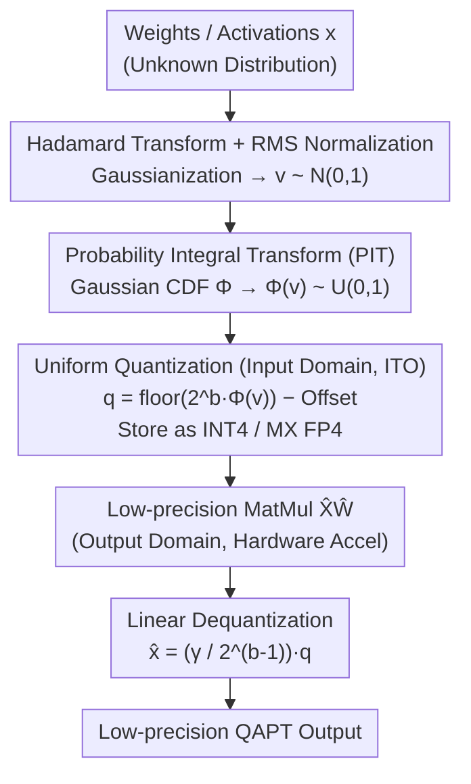

# Boosting Entropy with Bell Box Quantization

**Conference**: ICLR 2026  
**arXiv**: [2603.01599](https://arxiv.org/abs/2603.01599)  
**Code**: [https://github.com/1733116199/bbq](https://github.com/1733116199/bbq)  
**Area**: Model Compression / Quantization  
**Keywords**: Quantization-Aware Pre-training, Information-Theoretic Optimal Quantization, Compute-Efficient Data Types, Entropy Maximization, Low-Precision Inference

## TL;DR
This paper proposes Bell Box Quantization (BBQ), the first quantization method to simultaneously satisfy "Information-Theoretic Optimality" (ITO) and "compute-efficiency." The core insight is that learning is domain-agnostic—the output domain of a quantizer does not need to match the input domain. Consequently, ITO quantization is performed in the input domain to maximize entropy, while mapping to hardware-accelerated data types in the output domain. BBQ consistently outperforms QuEST and LSQ in 1-4 bit QAPT scenarios.

## Background & Motivation

**Background**: Quantization is a critical technology for deploying DNNs to edge devices. Quantization-Aware Pre-training (QAPT) trains models in low precision from scratch, avoiding the additional overhead of full-precision pre-training followed by PTQ/QAFT. However, the information capacity of low-precision models is limited, making it difficult to fit large-scale data.

**Limitations of Prior Work**: Existing QAPT methods (e.g., QuEST, LSQ) utilize compute-efficient data types (e.g., INT4), but these data types are **not information-theoretically optimal (ITO)**—the utilization frequency of different quantization values is non-uniform, thereby wasting limited learning capacity. Conversely, existing ITO methods (e.g., NF4/NormalFloat) can maximize entropy but require dequantization to full precision before computation, which is unavailable on energy-constrained edge engines.

**Key Challenge**: A trade-off exists between ITO and compute-efficiency—ITO quantization values are not within hardware-supported data types, precluding the use of low-precision matrix multiplication; compute-efficient integer/floating-point types are not ITO for Gaussian-distributed weights.

**Goal**: Can ITO quantization be achieved without sacrificing computational efficiency, allowing the model to maximize the utilization of limited learning capacity?

**Key Insight**: **Learning is domain-agnostic**—DNNs can learn from rotated images, frequency domain data, or latent embeddings. As long as information is preserved, projecting data into different domains does not affect learning.

**Core Idea**: The quantizer performs ITO quantization in the input domain to retain maximum information and maps to a different compute-efficient domain, enabling the direct use of low-precision matrix multiplication.

## Method

### Overall Architecture
BBQ aims to capture two previously mutually exclusive benefits: quantization should be information-theoretically optimal (ITO, where quantization values are used with equal probability and entropy is maximized) and compatible with hardware-accelerated low-precision integers. The breakthrough lies in the "domain-agnostic learning" insight—since quantization (information preservation) and matrix multiplication (numerical acceleration) can occur in different domains, quantization is performed to pursue ITO in the input domain, while matrix multiplication runs on hardware-friendly integer types in the output domain.

The workflow consists of three steps and one dequantization: first, Hadamard Transform and RMS normalization are used to "Gaussianize" weights/activations of any unknown distribution into a standard normal $v\sim N(0,1)$; second, a Probability Integral Transform (PIT) flattens the normal distribution into a uniform distribution $\Phi(v)\sim U(0,1)$; third, applying uniform quantization to the uniform data naturally yields ITO quantization, resulting in integers $q$ that can be stored as INT4 / MX FP4. Matrix multiplication is executed directly on these low-precision integers, and finally multiplied by a linear scaling factor for dequantization. The core equations are:

$$q = \lfloor 2^b \Phi(v) \rfloor - 2^{b-1} - z,\quad v = \text{HT}(x)/\sigma \qquad\qquad \hat{x} = \frac{\gamma}{2^{b-1}}\, q$$

### Key Designs

**1. Hadamard Transform + RMS Normalization: "Gaussianize" weight/activation distributions**

The prerequisite for ITO quantization is a known distribution, yet the actual distributions of weights and activations are varied, making it impossible to directly apply fixed optimal bins. BBQ first applies a Hadamard Transform—an orthogonal transform known to make data tend toward Gaussian—along the channel dimension for every $H$ elements, then divides by the RMS $\sigma$ to normalize variance, obtaining a standard normal $v \sim N(0,1)$. Once this deterministic Gaussian distribution is established, the subsequent Probability Integral Transform can apply an accurate CDF, grounding the entire ITO pipeline.

**2. Probability Integral Transform (PIT): Utilizing Gaussian CDF to flatten distributions**

This is the core step addressing the issue of non-uniform utilization of quantization values. QuEST/LSQ use piecewise linear clipping followed by uniform quantization, but clipping for Gaussian data does not distribute quantization bins uniformly, leaving entropy below empirical limits (e.g., ~1.93 for 2-bit). BBQ replaces clipping with the standard Gaussian CDF $\Phi$: applying $\Phi$ to $v \sim N(0,1)$ results in $\Phi(v) \sim U(0,1)$. The normal distribution is precisely flattened into a uniform distribution, and uniform quantization then ensures all values appear with equal probability, achieving ITO (approaching the theoretical limit of 2.0 for 2-bit). Compared to clipping, $\Phi$ is infinitely differentiable and smoother. During inference, calculating $\Phi$ is unnecessary: by precomputing $\Phi^{-1}(i/2^b)$ as quantization boundaries, the value can be located using binary search with $b$ floating-point comparisons, incurring negligible overhead.

**3. Domain-Agnostic Quantization: ITO in the input domain, hardware-friendly integers in the output domain**

This step implements the "domain-agnostic" insight, resolving the conflict where ITO values are not hardware-compatible. Uniformly quantizing $\Phi(v) \sim U(0,1)$ into $\lfloor 2^b \Phi(v) \rfloor$ and subtracting an offset yields a signed integer $q$, which can be stored as INT4 or MX FP4. Crucially, as dequantization is a simple linear scale $\hat{x} = \frac{\gamma}{2^{b-1}} q$, the matrix multiplication $\hat{X}\hat{W}$ can be completed in the low-precision integer domain before being scaled back. In other words, quantization (input domain) pursues information optimality, while matrix multiplication (output domain) runs on hardware-accelerated integer types. The compromise is that $x$ and $\hat{x}$ are not in the same domain and the quantization error is unbounded, making this scheme suitable only for QAPT from scratch.

**4. Learnable Scaling Factor $\gamma$ and Initialization: Stabilizing training**

Simply replacing clipping with $\Phi$ fails if the scaling factor is improperly initialized, as the magnitude of $\hat{x}$ will not match $x$ in the first iteration, leading to gradient explosion or vanishing. BBQ decouples the scaling factor as $s = \gamma / 2^{b-1}$, making $\gamma$ independent of precision $b$, and initializes it to $\zeta^* \sigma_0$ (where $\zeta^*$ is the analytical solution minimizing expected quantization error). This ensures the magnitude of $\hat{x}$ aligns with $x$ from the start, stabilizing training and allowing $\gamma$ to be fine-tuned. This step successfully translates the theoretical gains of PIT into practical trainability.

### Loss & Training
- Straight-Through Estimator (STE) is used for the floor operation, while other operations remain differentiable. Gradient scaling (divided by $\sqrt{d}$) is applied to $\gamma$, and weight decay is not used for $\gamma$. Weights use channel-wise quantization, while activations use per-tensor quantization.
- **BBQ-Fast Inference Variant**: Calculating the RMS $1/\sigma$ of activations in real-time requires cross-thread communication, creating overhead. BBQ-Fast replaces real-time $1/\sigma$ with an Exponential Moving Average $E_{1/\sigma}$, which preserves perplexity while eliminating communication overhead for faster inference.

## Key Experimental Results

### Main Results
QAPT was performed on LLaMA architectures using the C4 dataset, comparing BBQ, QuEST, and LSQ:

| Parameters | Tokens | Precision (bit) | BBQ Entropy/PPL | QuEST Entropy/PPL | LSQ Entropy/PPL |
|----------|-----------|-----------|------------|-------------|------------|
| 95M | 3B | 4-bit | 3.93 / 25.51 | 3.61 / 26.37 | 3.59 / 27.46 |
| 95M | 3B | 3-bit | 2.96 / 26.55 | 2.78 / 29.04 | 2.74 / 30.27 |
| 95M | 3B | 2-bit | 1.97 / 31.34 | 1.92 / 35.58 | 1.69 / 36.58 |
| 95M | 3B | 1-bit | 1.00 / 49.22 | 1.00 / 67.78 | - |
| 200M | 10B | 4-bit | 3.93 / 18.79 | 3.61 / 19.06 | 2.73 / 1778 |
| 200M | 10B | 2-bit | 1.98 / 23.08 | 1.93 / 25.46 | 1.63 / 78.19 |
| 300M | 20B | 4-bit | 3.93 / 16.10 | 3.61 / 16.26 | - |
| 300M | 20B | 2-bit | 1.98 / 19.75 | 1.93 / 21.53 | - |

BBQ consistently achieves higher entropy and lower perplexity across all precisions. The advantage of BBQ increases as precision decreases (reducing PPL by over 4 points at 2-bit and over 18 points at 1-bit). LSQ training diverged on larger models.

### Ablation Study
Ablations on 2-bit LLaMA-95M (3B tokens):

| Config | PPL | Entropy | Description |
|------|-----|-----|------|
| BBQ Full | 31.34 | 1.97 | Optimal |
| w/o HT | 35.79 | 1.98 | PPL increase 4.45 |
| w/o RMS | 35.93 | 1.98 | PPL increase 4.59 |
| QuEST (w/o PIT) | 35.58 | 1.92 | Baseline |
| PIT w/o $\gamma$ Init | 138.3 | 1.92 | Diverged! |
| PIT + $\gamma$ Init | 31.46 | 1.98 | PPL decrease 4.12 |
| Learnable $\gamma$ | 31.34 | 1.97 | Further decrease 0.12 |

### Key Findings
- Replacing clip with PIT ($\Phi$) is the most critical improvement, but it must be paired with proper $\gamma$ initialization.
- BBQ achieves theoretical maximum entropy (e.g., 1.97/2.0 for 2-bit), whereas QuEST is limited by an empirical ceiling (approx. 1.93).
- Inference Speed: On RTX 5090, BBQ is 40% faster than FP16 and 48% faster than NF4 (NF4 is slower than FP16 during the prefill stage).
- The overhead of the BBQ quantization kernel is only 1/10 of the time saved by matrix multiplication.

## Highlights & Insights
- **Domain-Agnostic Insight**: This is the "Aha!" moment of the paper—the quantizer does not need to perform quantization and dequantization within the same domain. This observation breaks the deadlock between ITO and compute-efficiency.
- **Replacing Clip with $\Phi$**: The Gaussian CDF serves doubly as a smooth activation function (similar to the relationship between GELU and ReLU) and an information-optimal binning function.
- **Elegant Inference Implementation**: During inference, the $\Phi$ + floor combination is implemented as a binary search with precomputed boundaries, requiring only $b$ comparisons, adding almost no latency to the quantization kernel.
- **Transferable Trick**: As long as the optimization objective of a task is domain-agnostic (like neural network training), one can consider performing transformations in a domain that is optimal for information preservation while computing in a hardware-efficient domain.

## Limitations & Future Work
- **Applicable to QAPT Only**: Since $x$ and $\hat{x}$ are in different domains, BBQ cannot guarantee a bounded quantization error $\|x - \hat{x}\|$, making it unsuitable for PTQ and short-duration QAFT.
- **Reliance on HT Gaussianization**: While $HT(x)$ tends toward Gaussian in early training, it may deviate later, causing PIT to not be perfectly ITO. The authors suggest using a smoother empirical CDF as a potential replacement for $\Phi$.
- **Validation Limited to LLMs**: Experiments on vision models (ViT, ConvNet) and multi-modal models are currently missing.
- **Potential Improvement**: Extending the domain transformation idea to QAFT, perhaps through a short "domain adaptation" phase.

## Related Work & Insights
- **vs QuEST**: QuEST also uses HT for Gaussianization but employs clip + uniform quantization (non-ITO for Gaussian data), resulting in an empirical entropy limit; BBQ removes this bottleneck via PIT.
- **vs NF4/NormalFloat**: NF4 is ITO but requires dequantization to full precision, making prefill slower than FP16; BBQ is the first method to be both ITO and compute-efficient.
- **vs N2UQ**: N2UQ also performs domain transformation but assumes weights are uniformly distributed and only applies it to weights; BBQ applies ITO to both weights and activations without assuming distribution shapes.

## Rating
- Novelty: ⭐⭐⭐⭐⭐ The domain-agnostic insight is simple yet profound; combining ITO with compute-efficiency is a first.
- Experimental Thoroughness: ⭐⭐⭐⭐ Comprehensive comparison across models and precisions with inference profiling, though vision models are missing.
- Writing Quality: ⭐⭐⭐⭐⭐ Clear motivational derivation, seamlessly connecting information theory to implementation.
- Value: ⭐⭐⭐⭐ Directly advances low-bit QAPT, with particularly meaningful exploration of 1-bit models.

<!-- RELATED:START -->

## Related Papers

- [\[ICLR 2026\] FlexLoRA: Entropy-Guided Flexible Low-Rank Adaptation](flexlora_entropy-guided_flexible_low-rank_adaptation.md)
- [\[ICLR 2026\] Entropy-Monitored Kernelized Token Distillation for Audio-Visual Compression](entropy-monitored_kernelized_token_distillation_for_audio-visual_compression.md)
- [\[ICLR 2026\] Rejuvenating Cross-Entropy Loss in Knowledge Distillation for Recommender Systems](rejuvenating_cross-entropy_loss_in_knowledge_distillation_for_recommender_system.md)
- [\[ICML 2026\] LFQ: Logit-aware Final-block Quantization for Boosting the Generation Quality of Low-Bit Quantized LLMs](../../ICML2026/model_compression/lfq_logit-aware_final-block_quantization_for_boosting_the_generation_quality_of_.md)
- [\[CVPR 2026\] Rank-Guided Pseudo-Bias Learning for Robust Black-Box Adaptation](../../CVPR2026/model_compression/rank-guided_pseudo-bias_learning_for_robust_black-box_adaptation.md)

<!-- RELATED:END -->
