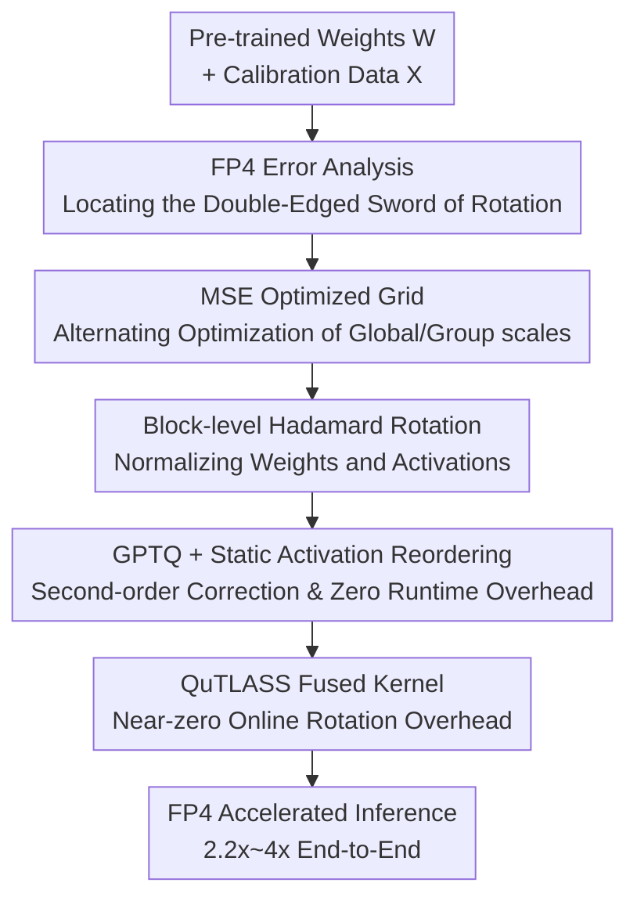

# Bridging the Gap Between Promise and Performance for Microscaling FP4 Quantization

**Conference**: ICLR2026  
**OpenReview**: [https://openreview.net/forum?id=zCBGe9AqJZ](https://openreview.net/forum?id=zCBGe9AqJZ)  
**Code**: QuTLASS v1.0 (Open-source library accompanying the paper, based on NVIDIA CUTLASS)  
**Area**: Model Compression / Post-Training Quantization  
**Keywords**: FP4 Quantization, MXFP4, NVFP4, GPTQ, Hadamard Transform

## TL;DR
This paper systematically deconstructs the promise of "free speedup and preserved accuracy" offered by hardware-native 4-bit floating-point formats (MXFP4/NVFP4). Through theoretical proof of quantization errors, it identifies why existing quantization techniques fail on these formats. The authors propose MR-GPTQ, a tailored algorithm for FP4 characteristics, and the QuTLASS GPU kernel, achieving 2.2x~4x end-to-end acceleration on B200/RTX5090 while recovering MXFP4 accuracy from a 10% drop to near-NVFP4 levels.

## Background & Motivation

**Background**: Post-training quantization (PTQ) is the primary method to compress large models for speed without significant accuracy loss. Methods like GPTQ, AWQ, SmoothQuant, and QuaRot/SpinQuant have pushed INT4/INT8 to near-lossless levels. Recently, NVIDIA Blackwell and AMD GPUs introduced hardware support for microscaling 4-bit floating-point formats—MXFP4 and NVFP4. These formats group elements to share a scaling factor, claiming to be more accurate than INT4 with hardware acceleration, and were expected to "revolutionize LLM inference."

**Limitations of Prior Work**: The "promises" of these formats have rarely been strictly verified on real models. Directly applying SOTA quantization methods to FP4 often yields worse results than simple round-to-nearest (RTN) quantization. Techniques designed for rotations or outliers do not improve performance and sometimes cause degradation. Specifically, MXFP4 accuracy drops by approximately 10% in W4A4 settings, indicating it is not an "automatic upgrade."

**Key Challenge**: The root cause lies in two unique structural features of FP4. First, NVFP4 uses very small groups (16 elements), where shared scaling factors naturally suppress outliers, making outlier-migration techniques (e.g., QuaRot/SmoothQuant) redundant or harmful. Second, MXFP4's group scales are quantized to powers of two (E8M0, exponent only), and this coarse rounding injects significant error, dragging down accuracy. In short: the "large group + uniform grid" assumption of existing methods is broken by FP4's "small group + non-uniform grid + power-of-two scaling."

**Goal**: (1) Provide provable error analysis to distinguish the differences and suitable operations for NVFP4 and MXFP4; (2) Design a quantization algorithm friendly to both formats; (3) Ensure the extra overhead (online rotation) is near-zero on real GPUs.

**Key Insight**: Starting from analytical modeling of quantization errors, the authors model original weights/activations as Laplace heavy-tailed distributions and post-Hadamard transform tensors as normal distributions. They derive the evolution of mean element MSE and outlier MSE relative to group size $G$. This captures the value of predicting whether "rotation is beneficial or harmful" before empirical testing.

**Core Idea**: Instead of inventing new formats, this work adapts classic GPTQ into an "FP4-aware" version—using block-level fused Hadamard rotations to normalize distributions, MSE-optimized grids to select scaling factors, and static activation reordering to eliminate runtime overhead. This is paired with the QuTLASS kernel to fuse rotations into GEMM, achieving theoretical optimality with zero hardware overhead.

## Method

### Overall Architecture

The work is split into two halves: **Diagnosis** (FP4 error analysis) and **Prescription** (MR-GPTQ algorithm + QuTLASS kernel). The diagnosis proves a counter-intuitive conclusion—Hadamard rotation spreads "outlier errors perfectly preserved by absmax scaling" across the whole group. Thus, rotation is a double-edged sword: beneficial for larger MXFP4 groups ($G=32$) but harmful for smaller NVFP4 groups ($G=16$). The prescription integrates this into GPTQ: using alternating optimization for an MSE-optimal initial grid, block-level Hadamard rotation for normalization, GPTQ with static activation reordering for second-order error correction, and the QuTLASS kernel for fused online rotation.

### Key Designs

**1. FP4 Error Analysis: Proving Opposite Effects for MXFP4 and NVFP4**

This theoretical foundation explains why existing methods fail. The authors decompose quantization error into mean element MSE and outlier (per-group max) MSE. A key lemma (Lemma 1) states that for normal-distributed vectors, Hadamard rotation followed by quantization spreads error **uniformly across coordinates**, causing outlier MSE to degenerate into mean MSE: $\mathrm{MSE}_{\mathrm{top}}(G)=\frac{1}{G}\mathbb{E}\|\varepsilon_y\|_2^2=\mathrm{MSE}(G)$. Without rotation, using absmax scaling, the maximum element is perfectly scaled to the boundary ($\pm 1$), resulting in $\mathrm{MSE}_{\mathrm{top}}(G)=0$. Thus, rotation destroys this natural protection.

Rate analysis shows a "crossover phenomenon": defining "retained quality" $R(G)=1-\mathrm{MSE}(G)$ outside the "dead-zone" (half of the first positive level $\delta=q_{\min}/2$). For Laplace, $R_L(G)=\Theta\big(\log G^2 G^{-\delta}\big)$; for Normal, $R_N(G)=\Theta\big(\sqrt{\log G}\,G^{-\delta^2}\big)$. Since $0<\delta^2<\delta<1$, raw Laplace error is lower for small $G$, while rotation-induced Normal distribution performs better for large $G$. Conclusion: **Rotation is harmful for small groups and beneficial for large groups.** This explains why Hadamard works for MXFP4 ($G=32$) but fails for NVFP4 ($G=16$).

**2. MSE Optimized Grid: Selecting Scales via Alternating Optimization**

Original GPTQ uses absmax for scales, which is sub-optimal for FP4. The authors formulate scale selection as an optimization problem: NVFP4 uses global scale $s_T$ and group scale $s_G$, where $\hat{X}_i=s_T\cdot s_G\cdot Q\big(X_i/(s_T\cdot s_G)\big)$. They minimize $\min_{s_T,s_{G_1},\dots,s_{G_k}}\sum_i\|\hat{X}_i-X_i\|_2^2$ via **alternating optimization**, iterating between global and group scales. This grid provides a better "starting line" for GPTQ than absmax.

**3. Static Activation Reordering: Preserving Act-order Gains with Zero Overhead**

GPTQ typically uses "dynamic act-order"—sorting weight columns by Hessian diagonals to quantize important columns first. However, this requires **dynamic reordering during inference**, causing 10–20% slowdown. This work observes that reordering can be done after grids/scales are computed. By shuffling columns, running GPTQ, and then deshuffling, the original microscale group structure is preserved. This gains act-order accuracy without any runtime footprint.

**4. Block-level Fused Hadamard Rotation: "Normalizing" for Fused GEMM**

MR-GPTQ uses block-diagonal Hadamard transforms $H_k$ ($k$ is a power of 2) to rotate weights and activations. The operation becomes $Q(WH_k)\,Q(XH_k)^\top$. $WH_k$ is **pre-fused offline**. $XH_k$ must be online, but when $k<256$, these dense transforms are memory-bound. This makes rotations "at almost the same price" as standard loading.

**5. QuTLASS Kernel: Making Online Rotation + FP4 GEMM "Nearly Free"**

Based on NVIDIA CUTLASS, QuTLASS v1.0 targets SM100/SM120 on Blackwell. It uses two kernel types: 1) Quantization kernels that provide lightweight fused implementation for online activation rotation ($k\in\{16,32,64,128\}$), where quantization and scale calculation are fused into the epilogue. 2) Narrow-precision GEMM kernels handling FP4-specific scale reordering. The MXFP4 kernel throughput exceeds "ideal NVFP4 GEMM," approaching theoretical limits (3.6x on B200, 6x on RTX5090).

### Loss & Training

MR-GPTQ is a PTQ method requiring no primary training. It uses second-order Hessian information (standard damping $\lambda=10^{-2}$) for column-wise correction with 1024 FineWeb sequences. The authors also report Quantization-Aware Training (QAT) results using a "balanced generalized Jensen-Shannon divergence" loss on a 10% subset of Tülu 3, showing QAT benefits MXFP4 more than NVFP4.

## Key Experimental Results

### Main Results

W4A4 simulation results on Llama-3.1-8B-Instruct (MMLU-CoT / GSM8k / HellaSwag / WinoGrande), FP16 baseline average 78.93.

| Format | Method | Avg Score | Recovery % |
|------|------|--------|----------|
| FP16 | Baseline | 78.93 | 100 |
| NVFP4 | RTN | 74.73 | 94.67 |
| NVFP4 | QuaRot | 74.10 | 93.80 |
| NVFP4 | GPTQ | 75.72 | 95.92 |
| NVFP4 | **MR-GPTQ** | **75.84** | **96.08** |
| MXFP4 | RTN | 69.32 | 87.83 |
| MXFP4 | QuaRot | 62.90 | 79.70 |
| MXFP4 | GPTQ | 70.62 | 89.47 |
| MXFP4 | **MR-GPTQ** | **73.65** | **93.31** |

Key observations: (1) SOTA rotation methods like QuaRot dropped to 79.70% recovery on MXFP4 (worse than RTN), confirming rotation's double-edged nature. (2) MR-GPTQ boosted MXFP4 from 87.83% to 93.31%, closing the gap with NVFP4 using only 4.25 bits/element (vs 4.5).

### Ablation Study

Breakdown of MR-GPTQ components based on Table 1:

| Config | NVFP4 Recovery | MXFP4 Recovery | Remark |
|------|--------------|--------------|------|
| RTN (Baseline) | 94.67 | 87.83 | Naive rounding |
| RTN + HT (Rot. only) | 93.82 | 89.26 | Rot. helps MXFP4, hurts NVFP4 |
| GPTQ (Second-order) | 95.92 | 89.47 | Consistent gains for both |
| MR-GPTQ (Combined) | 96.08 | 93.31 | Significant MXFP4 boost |

Performance: QuTLASS single-layer speedups reached 3.6x (B200) and 6x (RTX5090). End-to-end vLLM speedups were 2.2x and 4x respectively.

### Key Findings

- **No format is lossless**: NVFP4, MXFP4, and INT4 all show significant drops in W4A4; microscaling is not a "silver bullet."
- **Format Rank: NVFP4 > INT4 > MXFP4**: NVFP4 and INT4 are close, while MXFP4 is a distant third but benefits most from MR-GPTQ.
- **Rotation effectiveness depends on group size**: HT helps $G=32$ (INT4/MXFP4) but hurts $G=16$ (NVFP4) during RTN—aligning with theoretical crossover.
- **Scale Matters**: Large models preserve accuracy better (98-99% recovery). Qwen3 series on NVFP4 exceeded 99%, while Llama and sub-8B models struggle more.

## Highlights & Insights

- **Theoretical Guidance**: Using Laplace/Normal modeling + MSE rate analysis to predict rotation outcomes before testing provides a robust paradigm for format-specific optimization.
- **Static Reordering Trick**: Decoupling accuracy gains from runtime overhead via two-way shuffling is a transferable trick for other PTQ methods to eliminate 10-20% inference latency.
- **"Memory-bound = Free Rotation"**: Leveraging the fact that block-diagonal transforms are memory-bound for $k<256$ is a clever hardware-aware design.
- **Outperforming Ideal Baselines**: MXFP4 kernel throughput exceeding "ideal NVFP4 GEMM" redefines the Pareto front of precision-performance for FP4.

## Limitations & Future Work

- **Blackwell Bias**: "Zero-overhead rotation" relies on SM100/SM120 features and may not hold for other architectures or larger block sizes ($k\geq 256$).
- **W4A4 Accuracy Gap**: MR-GPTQ still leaves a 1-6% gap; precision-sensitive deployments should remain cautious.
- **QAT Cost-Benefit**: High compute cost for QAT yields limited gains on NVFP4, though helpful for MXFP4.
- **Distribution Assumptions**: While supported by metrics, actual layer-wise distribution variance or extreme outliers might deviate from the Laplace/Normal theoretical rates.

## Related Work & Insights

- **vs GPTQ**: Adds MSE grid, static reordering, and fused rotations; significantly outperforms standard GPTQ on MXFP4 (93.31% vs 89.47% recovery).
- **vs QuaRot / SpinQuant**: These SOTA INT4 methods use global rotations. This paper proves rotations degrade performance on small-group NVFP4, explaining why QuaRot fails on MXFP4 (79.70% recovery).
- **vs SmoothQuant**: SmoothQuant migration is effective but modest on FP4 compared to MR-GPTQ's MXFP4 gains.
- **vs QuIP/QuIP#**: These extreme compression rotations are "not necessarily helpful" for FP4 microscaling and must be applied selectively based on group size.

## Rating
- Novelty: ⭐⭐⭐⭐⭐ First systematic FP4 error analysis + format-tailored algorithm + kernel implementation.
- Experimental Thoroughness: ⭐⭐⭐⭐⭐ Covers Llama/Qwen, multiple formats (FP/INT), and both simulated accuracy and real kernel speed.
- Writing Quality: ⭐⭐⭐⭐ Rigorous analysis and clear insights, though high notation density in the theoretical section.
- Value: ⭐⭐⭐⭐⭐ Provides a data-driven answer to FP4 utility and open-source kernels directly impacting LLM deployment.

<!-- RELATED:START -->

## Related Papers

- [\[ICLR 2026\] Alignment through Meta-Weighted Online Sampling: Bridging the Gap between Data Generation and Preference Optimization](alignment_through_meta-weighted_online_sampling_bridging_the_gap_between_data_ge.md)
- [\[ICLR 2026\] Metis: Training LLMs with FP4 Quantization](metis_training_llms_with_fp4_quantization.md)
- [\[ICLR 2026\] Gradient Intrinsic Dimensionality Alignment：Narrowing The Gap Between Low-Rank Adaptation and Full Fine-Tuning](gradient_intrinsic_dimensionalityalignmentnarrowing_the_gap_between_low-rank_ad.md)
- [\[ICLR 2026\] MicroMix: Efficient Mixed-Precision Quantization with Microscaling Formats for Large Language Models](micromix_efficient_mixed-precision_quantization_with_microscaling_formats_for_la.md)
- [\[ICLR 2026\] ARMOR: High-Performance Semi-Structured Pruning via Adaptive Matrix Factorization](armor_high-performance_semi-structured_pruning_via_adaptive_matrix_factorization.md)

<!-- RELATED:END -->
