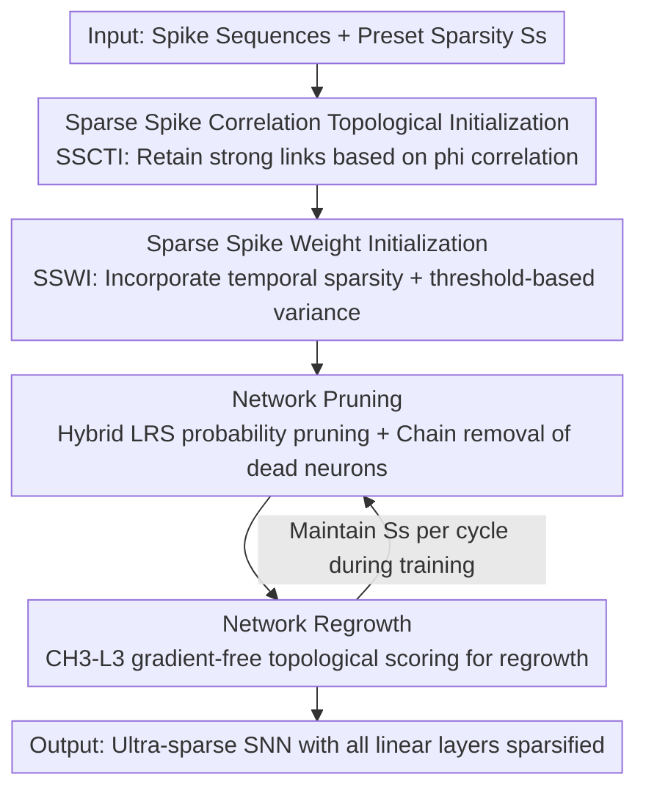

# Cannistraci-Hebb Training on Ultra-Sparse Spiking Neural Networks

**Conference**: ICLR2026  
**OpenReview**: [https://openreview.net/forum?id=qDLVgr8ESB](https://openreview.net/forum?id=qDLVgr8ESB)  
**Code**: https://github.com/HuaGuaiGuai/CH-SNN  
**Area**: Model Compression / Sparse Training / Spiking Neural Networks  
**Keywords**: Dynamic Sparse Training, Spiking Neural Networks, Cannistraci-Hebb Theory, Structural Connectivity Sparsity, Neuromorphic Computing

## TL;DR
CH-SNN integrates the Cannistraci-Hebb link prediction theory from brain science into the sparse training of Spiking Neural Networks (SNNs). Utilizing a four-stage pipeline—"Correlation-based Topological Initialization + Spike-aware Weight Initialization + Hybrid Scoring Pruning + CH3-L3 Topological Regrowth"—it achieves 97.75% structural sparsity across all linear layers while outperforming fully connected networks by 0.16% in accuracy. When deployed on edge neuromorphic chips, it reaches 98.84% sparsity, reduces synaptic operations by 97.5$\times$, and lowers average energy consumption by 55$\times$.

## Background & Motivation

**Background**: SNNs transmit information via sparse spikes rather than continuous activations, possessing inherent "temporal activation sparsity"—neurons fire only when the membrane potential exceeds a threshold, remaining quiescent most of the time. This avoids Multiply-Accumulate (MAC) operations and is energy-efficient, making SNNs a popular choice for low-power edge AI. However, "structural connectivity sparsity" (pruning edges and neurons) in SNNs has remained underdeveloped.

**Limitations of Prior Work**: Mature sparse training methods from ANNs (Deep R, RigL, Grad R, etc.) mostly rely on gradient information to decide which connections to prune or regrow. However, SNN spike activation functions are non-differentiable, and gradients at threshold points are undefined. Gradient signals are approximated using surrogate gradients, making the direct application of ANN sparse training methods ineffective. Consequently, existing SNN sparse methods either fail to reach high sparsity (SD-SNN achieves +1.45% accuracy on DVS-Gesture but only 61.10% sparsity; Shen et al.'s two-stage method averages ~70%) or suffer significant accuracy drops when pushing towards 90% sparsity (Gradient Rewiring at 90% sparsity drops 3.55% compared to fully connected versions).

**Key Challenge**: A horizontal trade-off exists between high structural sparsity and maintaining accuracy comparable to fully connected models. The root cause is the reliance on unreliable SNN gradients for pruning/regrowth decisions; as sparsity increases, the noise in gradients grows, leading to the accidental removal of critical connections or incorrect regrowth.

**Goal**: To develop a universal dynamic sparse training framework capable of sparsifying **all linear layers** in an SNN, pushing structural sparsity to the 97%–99% range while maintaining or even improving accuracy.

**Key Insight**: The authors leverage Cannistraci-Hebb (CH) theory—a link prediction framework derived from brain connectomics and protein interaction network science. It predicts link formation based solely on network topology, **requiring no gradients**. Since SNN gradients are unreliable, the link regrowth step is shifted from gradient-based to topology-based.

**Core Idea**: Use the robust CH3-L3 network automata from CH theory for gradient-free link regrowth. This is paired with sparse topological and weight initializations specifically designed for spike signals, forming a four-stage "Initialization → Pruning → Regrowth" cycle that enables SNNs to train effectively under ultra-sparse conditions.

## Method

### Overall Architecture

CH-SNN (Cannistraci-Hebb Spiking Neural Network) is a four-stage dynamic sparse training framework designed to train every linear layer of an SNN into an ultra-sparse structure. The workflow is: **Initialize the network as an ultra-sparse topological graph stage based on input correlations (rather than pruning from a fully connected state), initialize weights in a spike-aware manner, then iteratively "prune redundant links via hybrid scoring probabilities + remove dead neurons becoming isolated → regrow an equal number of edges using CH3-L3 topological scores" during training to maintain the target sparsity.** Crucially, neither pruning nor regrowth uses hard gradient-based thresholds; instead, they rely on score-based sampling to maintain stochasticity while following topological patterns.

The underlying neurons use the standard LIF (leaky integrate-and-fire) model: membrane potential $v_j(t+1) = (1-z_j(t))\alpha v_j(t) + \sum_i W_{ij} x_i(t+1)$, firing $z_j(t)=U(v_j(t)-\theta)$ when the threshold $\theta$ is reached. Since $U$ is non-differentiable, surrogate gradients are used for weight updates. The framework can also be integrated with the hardware-friendly S-TP (Sparse Target Propagation) algorithm for deployment on neuromorphic chips.

### Key Designs

**1. SSCTI (Sparse Spike Correlation Topological Initialization): Building an ultra-sparse skeleton from the start instead of pruning from full connectivity**

Traditional pruning starts with a fully connected network and removes edges, which is memory-intensive and prone to errors at ultra-high sparsity. CH-SNN does the opposite—it initializes an ultra-sparse graph. This is based on the principle that "network topology should reflect the relationships of node features in a latent geometric space." Highly correlated nodes should be connected. Since SNN inputs are discrete binary spikes, the authors use the **Pearson phi coefficient** to measure correlation between input nodes: treating each input dimension $x_i$ as a variable and each timestep $t$ as a sample (total samples $N\times T$), they calculate $\phi_{ij}=\sqrt{\chi^2_{ij}/(2NT)}$ to obtain a correlation matrix $\Phi\in\mathbb{R}^{M\times M}$. Only the top $(1-S_s)$ fraction of links are retained, forming the ultra-sparse skeleton. The hidden layer dimension is controlled by an expansion factor $\beta\ge 1$. Note: For intermediate linear layers where input distributions are shuffled by previous layers, this reverts to "uniform random initialization."

**2. SSWI (Sparse Spike Weight Initialization): Embedding temporal sparsity and thresholds into weight variance to enable ultra-sparse training**

Standard Kaiming or SWI initializations assume zero-mean Gaussian weights and define variance based on layer-wise consistency. However, they ignore SNN temporal activation sparsity and the unique LIF threshold mechanism. Direct application leads to training divergence or slow convergence in ultra-sparse SNNs. SSWI incorporates three elements—temporal activation sparsity $S_t$, structural connectivity sparsity $S_s$, and the neuron threshold $\theta$—into the initialization variance:

$$\text{SSWI}(W^{(l)}_{ij})\sim\mathcal{N}(0,\sigma^2),\quad \sigma^2=\begin{cases}\dfrac{S_t}{n(1-S_s)}, & l=1\\[2mm]\dfrac{\theta^2\sqrt{\pi}}{\sqrt{2}e^{-1/2}\,n(1-S_s)}, & 1<l<L\\[2mm]\dfrac{\theta^2\sqrt{\pi}}{\sqrt{2}e^{-1/2}\,n}, & l=L\end{cases}$$

Where $n$ is the input dimension and $L$ is the total layers. The first layer is scaled by $S_t$, while intermediate layers include $\theta$ and are compensated by $(1-S_s)$ to account for variance shrinkage due to sparsity. This accelerates early convergence and optimizes the CH3-L3 link predictor.

**3. Hybrid LRS Pruning + Chain Removal: Considering both magnitude and relative importance while cleaning "dead" nodes**

Pruning based solely on absolute weight values can remove small but critical connections and leave neurons idle. CH-SNN introduces a **Hybrid Link Removal Score (LRS)** combining "Relative Importance (RI)" and "Weight Magnitude (WM)":

$$\text{LRS}^{(l)}_{ij}=\frac{|W^{(l)}_{ij}|}{1+\sum_i|W^{(l)}_{ij}|}+\frac{|W^{(l)}_{ij}|}{1+\sum_j|W^{(l)}_{ij}|}$$

These terms normalize the edge strength against the total incoming/outgoing weights of neurons $i$ and $j$. Instead of a hard threshold, pruning is based on **sampling from a multinomial distribution** of LRS values to maintain diversity. Following link pruning, **chain removal** is performed: neurons with no incoming or outgoing edges are identified as "dead" and permanently removed, leading to additional **node sparsity**.

**4. CH3-L3 Gradient-Free Topological Regrowth: Predicting links via local community structures to bypass unreliable SNN gradients**

This is the core brain-inspired step. Pruned links must be replaced to maintain sparsity. Due to unreliable gradients, the authors use the **CH3-L3 network automata** from Cannistraci-Hebb theory to score potential links. For a node pair $(u,v)$, it accumulates contributions along paths of length 3 (common neighbors $z_1, z_2$):

$$\text{CH3-L3}(u,v)=\sum_{z_1,z_2\in l3(u,v)}\frac{1}{\sqrt{(1+d^e_{z_1})\times(1+d^e_{z_2})}}$$

Where $d^e_{z_1}, d^e_{z_2}$ are the external local community degrees. The intuition is that nodes with many common neighbors that are tightly clustered in a local community are more likely to be connected. Scores are purely topological. Regrowth uses **binomial distribution sampling** to avoid "epitopological local minima" caused by topological noise early in training. This also triggers node percolation, reducing the active network size to approximately 30% of its initial scale.

## Key Experimental Results

### Main Results

Tested across six datasets (CIFAR-10/100, MNIST, N-MNIST, CIFAR10-DVS, DVS-Gesture) with various architectures (Spiking CNN, Spikformer, etc.), comparing against Grad R, SD-SNN, and DPAP. The table below highlights results for the 6Conv2FC / 2FC architectures (gain relative to the fully connected (FC) network):

| Dataset | Method | Structural Sparsity | Accuracy | Gain vs FC |
|--------|------|-----------|------|-----------|
| MNIST (2FC) | DPAP | 77.36% | 98.74% | −0.07% |
| MNIST (2FC) | SD-SNN | 45.86% | 98.90% | +0.09% |
| MNIST (2FC) | **CH-SNN** | **97.75%** | 98.97% | **+0.16%** |
| CIFAR-10 (6Conv2FC) | SD-SNN | 35.57% | 94.59% | −0.15% |
| CIFAR-10 (6Conv2FC) | **CH-SNN** | **74.62%** | 94.60% | −0.14% |
| CIFAR-100 (6Conv2FC) | SD-SNN | 36.94% | 75.33% | +3.27% |
| CIFAR-100 (6Conv2FC) | **CH-SNN** | **74.45%** | 75.22% | +3.16% |
| N-MNIST (2Conv2FC) | **CH-SNN** | **94.73%** | 99.15% | +0.08% |

CH-SNN achieves the **highest sparsity** across nearly all datasets while maintaining or exceeding FC accuracy. On MNIST, it reaches 97.75% sparsity with a +0.16% gain. On CIFAR-100, it surpasses SD-SNN's sparsity by nearly 38 percentage points with only a 0.11% accuracy difference. It also performs well on Spikformer (e.g., 82.11% sparsity with +0.75% gain on CIFAR-100).

### Edge Chip Experiment (S-TP on ANP-I)

Deployed with the hardware-friendly S-TP onboard the low-power neuromorphic chip ANP-I (1.5 pJ/SOP), using a 3FC architecture:

| Dataset | Link Sparsity | Node Sparsity | Accuracy | Energy |
|--------|-----------|-----------|------|------|
| MNIST (FC) | 0% | 0% | 97.29% | 948 mJ |
| MNIST (CH-SNN) | 94.59% | 23.47% | 97.56% | 48 mJ |
| DVS-Gesture (FC) | 0% | 0% | 89.02% | 78 mJ |
| DVS-Gesture (CH-SNN) | **98.84%** | 12.30% | 91.29% | **0.8 mJ** |
| N-MNIST (CH-SNN) | 98.46% | 41.90% | 96.20% | 4.4 mJ |

On DVS-Gesture, the sparse network achieves **+2.27% accuracy with only 1/97.5 the energy** of the FC version. Across four datasets, energy consumption decreased by an average of 55$\times$ and firing rates by 10.77$\times$. On N-MNIST, nearly half of the nodes (41.90%) were pruned with only a 0.18% accuracy drop.

### Key Findings
- **Topology-based regrowth is key to high performance**: Under ultra-sparsity where gradients are unreliable, CH3-L3's reliance on local community topology allows stable training beyond 97% sparsity—a fundamental departure from gradient-based methods like Grad R.
- **Chain removal enables additional node sparsity**: Deleting isolated dead neurons provides 12%–42% node sparsity in edge experiments, leading to an order-of-magnitude reduction in SOPs.
- **Sampling is more robust than hard thresholds**: Using multinomial and binomial sampling for pruning and regrowth prevents the model from getting stuck in "epitopological local minima" caused by early-stage topological noise.
- **Trade-off positioning**: While CH-SNN provides substantial sparsity, its accuracy gains on certain datasets (e.g., DVS-Gesture +0.38%) may be lower than methods like Grad R (+7.83%), illustrating its focus on "extreme sparsity with parity" rather than pure accuracy maximization.

## Highlights & Insights
- **Elegant Cross-disciplinary Transfer**: Successfully adapting link prediction theory (CH3-L3) from network science/brain connectomics to deep network sparse training provides a completely gradient-free path for connectivity decisions.
- **"Sparse First" over "Pruning from Full"**: SSCTI uses Pearson phi correlation to build an ultra-sparse skeleton immediately, avoiding the memory overhead of fully connected layers—essential for training sparse models from scratch on the edge.
- **Domain-Specific Priors in Initialization**: Incorporating $S_t$, $S_s$, and $\theta$ into SSWI provides a reusable template for adapting initializations to sparse spiking contexts.
- **End-to-End Chip Validation**: Beyond dataset benchmarks, the deployment on the ANP-I chip with metrics for SOPs, firing rates, and energy (mJ) demonstrates valid use cases for ultra-sparse SNNs in edge computing.

## Limitations & Future Work
- **SSCTI Limitation in Middle Layers**: Shuffled input distributions in deep layers render phi correlation ineffective, necessitating a fallback to random initialization and losing the "correlation-based" advantage for non-first layers.
- **Accuracy Gains vs. Sparsity**: The method prioritizes ultra-high sparsity, which may limit the accuracy ceiling on certain specific tasks compared to less sparse alternatives.
- **Reliance on Surrogate Gradients**: While regrowth is gradient-free, weight updates still depend on surrogate gradients, meaning approximation errors in SNN training are not fully bypassed.
- **CH3-L3 Computational Cost**: Enumerating common neighbors along length-3 paths can be expensive for large-scale layers. While hardware energy on the edge is low, the training-time overhead of regrowth requires further optimization or caching.

## Related Work & Insights
- **vs. SD-SNN / DPAP (Biological Plasticity)**: These methods use synapse elimination and regrowth based on brain development; they often achieve higher accuracy gains but struggle to push sparsity beyond 60%–70%. CH-SNN pushes this to 94%–99%.
- **vs. Grad R / Deep R (Gradient-based Sparse Training)**: These rely on weight signs or adjusted gradients for regrowth. CH-SNN's topology-based regrowth is more robust under ultra-sparse conditions where SNN gradient noise is extreme.
- **vs. CHT / CHTs (Cannistraci-Hebb for ANNs)**: CHT used CH3-L3 on ANNs to outperform FC models with 1% connectivity. This work represents the first systematic adaptation to SNNs, introducing SSCTI, SSWI, and hybrid LRS to handle SNN-specific temporal sparsity and LIF thresholding.

## Rating
- Novelty: ⭐⭐⭐⭐⭐ First systematic adaptation of gradient-free CH theory to SNN sparse training.
- Experimental Thoroughness: ⭐⭐⭐⭐ Solid multi-dataset and chip-based evaluation, though some ablation studies are relegated to the appendix.
- Writing Quality: ⭐⭐⭐⭐ Clearly explains the four-stage framework and math; concepts like CH3-L3 are well-defined.
- Value: ⭐⭐⭐⭐⭐ High-impact for edge neuromorphic AI, providing significant energy savings without accuracy loss.

<!-- RELATED:START -->

## Related Papers

- [\[ICLR 2026\] A Recovery Guarantee for Sparse Neural Networks](a_recovery_guarantee_for_sparse_neural_networks.md)
- [\[ICLR 2026\] Towards Lossless Memory-efficient Training of Spiking Neural Networks via Gradient Checkpointing and Spike Compression](towards_lossless_memory-efficient_training_of_spiking_neural_networks_via_gradie.md)
- [\[NeurIPS 2025\] Spiking Brain Compression: Post-Training Second-Order Compression for Spiking Neural Networks](../../NeurIPS2025/model_compression/spiking_brain_compression_post-training_second-order_compression_for_spiking_neu.md)
- [\[ICLR 2026\] Robust Selective Activation with Randomized Temporal K-Winner-Take-All in Spiking Neural Networks for Continual Learning](robust_selective_activation_with_randomized_temporal_k-winner-take-all_in_spikin.md)
- [\[ICLR 2026\] SAFA-SNN: Sparse-aware Fast Adaptive Spiking Neural Network for On-device Few-Shot Class-Incremental Learning](safa-snn_sparsity-aware_on-device_few-shot_class-incremental_learning_with_fast-.md)

<!-- RELATED:END -->
