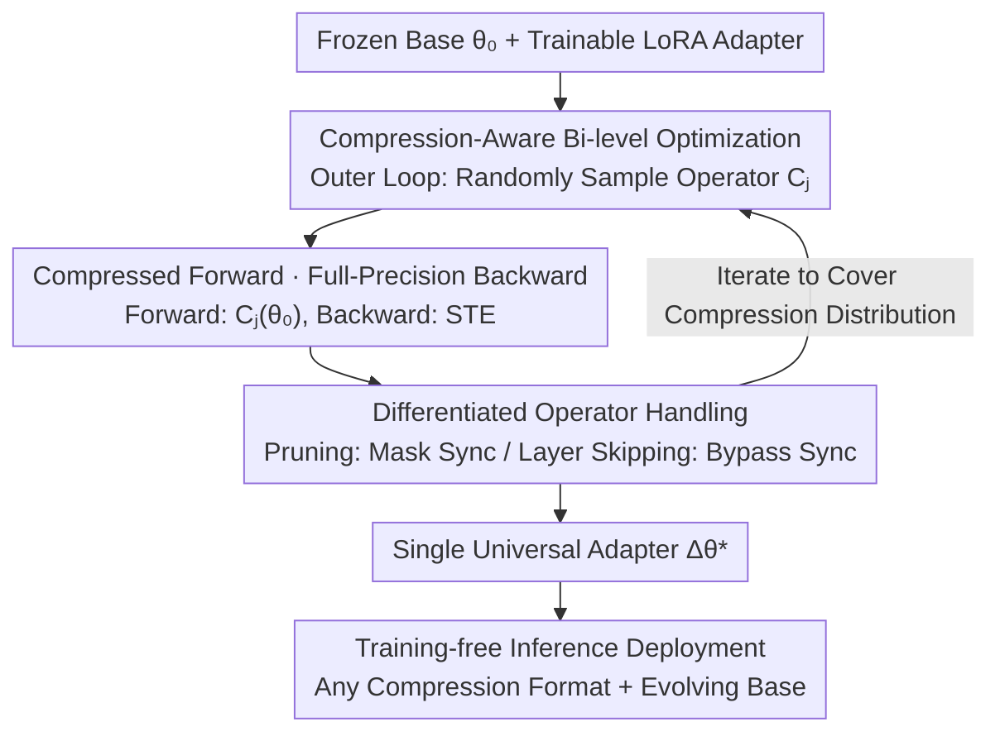

# CAR-LoRA: Training Compression-Aware and Robust LoRA Adapters for Evolving LLMs

**Conference**: ICLR 2026  
**OpenReview**: [https://openreview.net/forum?id=5GimteSrgW](https://openreview.net/forum?id=5GimteSrgW)  
**Code**: None  
**Area**: Model Compression  
**Keywords**: LoRA, Quantization-Aware Training, Edge Deployment, Model Evolution, Universal Adapter

## TL;DR
CAR-LoRA trains a "compression-aware and temporally robust" universal LoRA adapter by injecting random variations such as quantization, pruning, and layer skipping during training (using compressed weights for the forward pass and full-precision gradients for the backward pass). This allows a single adapter to be deployed directly to edge devices with various compression formats and future evolved base models without retraining, achieving performance close to QLoRA models that are specifically retrained for each configuration.

## Background & Motivation
**Background**: Deploying Large Language Models (LLMs) to edge devices like smartphones, automotive systems, and IoT sensors requires two coordinated efforts: parameter-efficient fine-tuning (PEFT) using methods like LoRA for personalization with minimal low-rank parameters, and model compression via quantization or pruning to fit restricted hardware. Conceptually, training LoRA in the cloud and running compressed models on devices seems decoupled.

**Limitations of Prior Work**: However, LoRA adapters are highly "fragile." A LoRA trained on a full-precision (BF16) base collapses when applied directly to an INT4 quantized model; researchers observed GSM8K performance on Llama-3.1-8B plummeting from 38.9% to 16.3% (Naive INT4). This occurs because quantization shifts the weight distribution such that $\theta_0 \notin C_\text{quant}(\theta_0)$, causing the high-precision delta $\Delta\theta^*$ fine-tuned for $\theta_0$ to mismatch the compressed weight space. Consequently, separate adapters must be retrained for every hardware format (INT8, FP4, NF4, pruning).

**Key Challenge**: Beyond hardware heterogeneity, there is a second axis—**model evolution**. Base models are periodically updated with new data, causing parameters to drift over time (temporal drift). Adapters trained on earlier checkpoints degrade on newer versions. The intersection of these axes means retraining is required for "every new hardware × every new model version," leading to maintenance costs that explode linearly with the number of devices and versions, negating LoRA’s efficiency advantages.

**Goal**: To train a **single, universal, and portable** adapter that is both (i) compression-aware (applicable to multiple compression formats) and (ii) temporally robust (usable with future evolved base models).

**Key Insight**: The authors observe that temporal robustness is an **emergent property** of LoRA (as PortLLM demonstrated stability under minor drift); thus, it does not require specialized handling. Only **compression robustness** needs intentional induction. Since the cause of Naive compression failure is that the adapter only sees one weight distribution during training, the adapter should instead be exposed to an **entire distribution of compression perturbations**.

**Core Idea**: Shift the training objective from "minimizing task loss on a fixed base" to "minimizing expected task loss over a distribution of compression operators." By randomly sampling different compression methods for the forward pass during single training runs, the adapter is forced to learn generalized features immune to compression artifacts.

## Method

### Overall Architecture
CAR-LoRA addresses the challenge of one LoRA adapter resisting multiple compression formats and base model drift. The core mechanism replaces the "static base" of standard LoRA training with a "dynamically sampled compressed base." In each training iteration, a random compression operator is sampled and applied to the frozen base; the adapter is then fine-tuned on this compressed base. The forward pass uses compressed weights to force robustness, while the backward pass uses a Straight-Through Estimator (STE) to ensure gradient stability. The resulting single adapter can be merged with any compressed or evolved base version in a training-free manner during inference.

The workflow consists of "Outer sampling of compression → Inner fine-tuning of the adapter (with differentiated processing for three compression types) → Training-free inference deployment":

### Key Designs

**1. Compression-Aware Bi-level Optimization: Replacing a Single Base with an Operator Distribution**

Standard LoRA is trained only on a fixed base $\theta_0$. CAR-LoRA reformulates the objective to minimize the expected task loss across a distribution $p(C)$ of compression operators $C=\{C_1,\dots,C_k\}$ (various bit-widths, pruning masks, etc.):

$$\Delta\theta^* = \arg\min_{\Delta\theta} \; \mathbb{E}_{C_j \sim p(C)}\big[\mathcal{L}_\text{task}(C_j(\theta_0) + \Delta\theta)\big]$$

This is implemented as a bi-level loop: the **outer loop** randomly samples an operator $C_j$ from available techniques; the **inner loop** compresses the base to $\theta_0^c = C_j(\theta_0)$, freezes it, and performs standard fine-tuning steps on the LoRA parameters $A$ and $B$. By being repeatedly exposed to different perturbed weight spaces, the adapter learns universal correction directions rather than overfitting to a specific distribution.

**2. Compressed Forward · Full-Precision Backward: Using STE to Bypass Non-differentiability**

Compression operators like quantization involve non-differentiable functions (e.g., round, clip). CAR-LoRA employs "compression-forward, full-precision-backward." The **forward pass** calculates loss using compressed weights $\theta_0^c$. The **backward pass** utilizes a Straight-Through Estimator (STE), approximating the Jacobian of the compression operator as an identity matrix, i.e., $\frac{\partial C_j(\theta_0)}{\partial \theta_0}\approx I$. This provides stable, informative gradients to $A$ and $B$, maintaining robustness while avoiding vanishing gradients.

**3. Differentiated Operator Handling: Synchronized Masking and Bypassing**

Different compression methods impact LoRA structure differently. For **Quantization**, compressed weights are used directly in the forward pass. For **Structured Pruning**, which removes entire rows or columns, LoRA dimensions must align. Diagonal masks $M_\text{row}$ and $M_\text{col}$ are applied to both the base and the adapter:

$$h = (M_\text{row} W_0 M_\text{col})x + (M_\text{row} B A M_\text{col})x$$

For **Layer Skipping**, specific LoRA layers are deactivated during the forward pass when their corresponding base layers are skipped, forcing the remaining active adapters to compensate for the missing layers.

### Loss & Training
The objective is the expected task loss described in Equation 3, approximated via bi-level loops. Key hyperparameters: rank $r=8$, $\alpha=16$ for downstream tasks; $r=64$, $\alpha=128$, learning rate 0.0001, and 4 epochs for simulated temporal drift continued pre-training. Baselines are trained for 5 epochs, while CAR-LoRA is trained for 20 epochs (higher single-run cost, but only trained once). The compression set includes 5 types: INT8, FP4, NF4 quantization, structured pruning, and layer skipping. The paper provides an error bound for portability (Informal Theorem 1): the loss gap between the universal adapter and an oracle adapter retrained for each configuration is bounded by $\epsilon_\text{drift}+\epsilon_\text{comp}+\epsilon_\text{gen}$, where $\epsilon_\text{gen}$ is explicitly minimized by compression-aware training.

## Key Experimental Results

### Main Results
Across 6 inference benchmarks on Llama-3.1-8B, a single CAR-LoRA adapter approaches the performance of QLoRA (the upper bound) retrained for each specific quantization format:

| Method | SQA | MATH | GSM8K | ANLI | CSQA | ARC |
|------|-----|------|-------|------|------|-----|
| Zero-Shot | 57.6 | 9.3 | 19.6 | 33.8 | 43.1 | 48.5 |
| LoRA [BF16] | 68.7 | 16.5 | 38.9 | 39.9 | 65.4 | 60.4 |
| qLoRA [INT8] | 68.8 | 16.5 | 38.5 | 39.5 | 65.1 | 60.5 |
| qLoRA [FP4] | 68.7 | 16.1 | 38.5 | 39.9 | 65.1 | 60.4 |
| **CAR-LoRA [INT8]** | 68.4 | 16.1 | 38.4 | 39.7 | 65.4 | 60.5 |
| **CAR-LoRA [FP4]** | 68.4 | **16.7** | 38.5 | 39.8 | 65.1 | 60.4 |
| **CAR-LoRA [NF4]** | 68.5 | 16.4 | 38.1 | 39.4 | 65.1 | 60.3 |
| CAR-LoRA [LS] | 64.4 | 13.0 | 31.1 | 33.6 | 61.9 | 58.3 |
| CAR-LoRA [SP] | 67.6 | 16.0 | 37.5 | 39.5 | 65.1 | 60.5 |

CAR-LoRA is nearly identical to specialized QLoRA under quantization (gap < 0.5%) and slightly outperforms it on MATH in FP4 (16.7% vs 16.1%). The primary weakness is Layer Skipping (LS), where GSM8K drops from 38.9% to 31.1%, indicating that architectural perturbations are more difficult to withstand than bit-width changes.

### Key Findings
- **Quantization Stability vs. Layer Skipping Weakness**: CAR-LoRA generalizes exceptionally well to bit-width quantization (INT8/FP4/NF4) but struggles with layer skipping, which alters network depth. 
- **Generalization from Structural Priors**: Even when FP4 is excluded from training, CAR-LoRA lags specialized QLoRA by only ~1%, suggesting it learns cross-quantization structural priors rather than memorizing formats.
- **Temporal Robustness is "Free"**: Without explicit design for temporal drift, the smoothed solutions from compression sampling naturally resist parameter drift, supporting the emergent property observation.
- **TCO Efficiency**: While a single 20-epoch training run is more expensive than the 5-epoch baseline, the total cost of ownership (TCO) is lower in scenarios with many devices ($N$) and frequent model updates ($T$), as CAR-LoRA is $O(1)$ compared to the traditional $O(N \times T)$ paradigm.

## Highlights & Insights
- **Compression as Data Augmentation**: Treating quantization/pruning as training-time random perturbations rather than deployment-time damage effectively provides adversarial/augmentation training for the adapter.
- **STE on Frozen Base**: Unlike traditional Quantization-Aware Training (QAT) that quantizes the trained weights, CAR-LoRA quantizes the frozen base; STE is used specifically to pass gradients through the frozen base to the adapter.
- **Amortized Efficiency**: By reducing maintenance from "one adapter per device" to "one adapter for all," the maintenance cost shifts from multiplicative to constant.

## Limitations & Future Work
- **Significant Drop in Layer Skipping**: Performance on MATH/GSM8K drops noticeably under LS, showing architectural perturbations are not yet fully resolved.
- **Informal Theory**: Theorem 1 provides an upper bound for error, but the $\epsilon$ terms lack computable tight bounds, limiting practical guidance.
- **Upfront Training Cost**: The 20-epoch requirement is only beneficial in "amortized" scenarios with heterogeneous devices; for single-device deployment, standard QLoRA remains more efficient.
- **Fixed Compression Set**: The set of operators must be predefined; while it generalizes across quantization families, resilience to entirely new paradigms (e.g., hybrid precision) is unverified.

## Related Work & Insights
- **vs QLoRA**: QLoRA is "train-for-the-target," requiring retraining for each base. CAR-LoRA achieves nearly the same performance while gaining portability.
- **vs PortLLM**: While PortLLM handles temporal drift, it ignores hardware heterogeneity. CAR-LoRA unifies both into a single framework.
- **vs Naive Compression**: Direct application of BF16 LoRA to quantized bases leads to collapse, proving that compression-aware training is a necessity for cross-format deployment.

## Rating
- Novelty: ⭐⭐⭐⭐ 
- Experimental Thoroughness: ⭐⭐⭐⭐ 
- Writing Quality: ⭐⭐⭐⭐ 
- Value: ⭐⭐⭐⭐

<!-- RELATED:START -->

## Related Papers

- [\[ICLR 2026\] IGU-LoRA: Adaptive Rank Allocation via Integrated Gradients and Uncertainty-Aware Scoring](igu-lora_adaptive_rank_allocation_via_integrated_gradients_and_uncertainty-aware.md)
- [\[ICLR 2026\] Towards Quantization-Aware Training for Ultra-Low-Bit Reasoning LLMs](towards_quantization-aware_training_for_ultra-low-bit_reasoning_llms.md)
- [\[ICLR 2026\] LoRA-Mixer: Coordinate Modular LoRA Experts Through Serial Attention Routing](lora-mixer_coordinate_modular_lora_experts_through_serial_attention_routing.md)
- [\[ICLR 2026\] Gradient Intrinsic Dimensionality Alignment: 弥合 LoRA 与全量微调之间的鸿沟](gradient_intrinsic_dimensionalityalignmentnarrowing_the_gap_between_low-rank_ad.md)
- [\[NeurIPS 2025\] Robust Federated Finetuning of LLMs via Alternating Optimization of LoRA](../../NeurIPS2025/model_compression/robust_federated_finetuning_of_llms_via_alternating_optimization_of_lora.md)

<!-- RELATED:END -->
