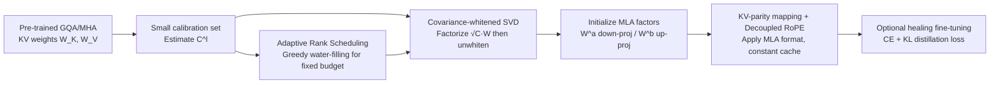

# CARE: Covariance-Aware and Rank-Enhanced Decomposition for Enabling Multi-Head Latent Attention

**Conference**: ICLR 2026  
**arXiv**: [2603.17946](https://arxiv.org/abs/2603.17946)  
**Code**: [FutureMLS-Lab/CARE](https://github.com/FutureMLS-Lab/CARE)  
**Area**: model_compression  
**Keywords**: KV-cache compression, Multi-Head Latent Attention, Low-rank decomposition, activation-aware SVD, attention conversion  

## TL;DR
CARE utilizes "activation covariance-weighted SVD + layer-wise adaptive rank allocation" to convert pre-trained GQA/MHA into MLA with an equivalent KV budget in a one-shot manner. By shifting the error minimization target from "weight space" to "activation space," it reduces one-shot perplexity by up to 215× and improves average accuracy by up to 1.70×.

## Background & Motivation
- **Background**: KV-cache has become a memory and bandwidth bottleneck for LLM inference. MQA/GQA reduce cache by sharing K/V but sacrifice expressiveness. Multi-Head Latent Attention (MLA) compresses K/V into low-dimensional latent caches and restores them using lightweight up-projections during inference, maintaining or even improving accuracy while compressing the cache. However, pre-trained MHA/GQA checkpoints dominate the ecosystem, and training MLA from scratch is prohibitively expensive.
- **Limitations of Prior Work**: Mainstream conversion schemes (TransMLA, MHA2MLA, X-EcoMLA, etc.) rely on **pure weight-based low-rank approximation** (SVD-style initialization) and **uniform rank per layer**. They minimize $\|W-\hat{W}\|_F$, focusing only on weight matrix differences while ignoring how weights act on real input activations and the covariance structure of those activations.
- **Key Challenge**: Accurate weight approximation does not imply accurate activation approximation. The paper highlights two observations: (1) When halving the rank per layer on DeepSeek-V2-Lite, sensitivity varies significantly across layers; uniform rank either over-compresses fragile layers or wastes budget on robust ones. (2) Using singular values directly as importance scores (truncating small ones) for vanilla ablation shows a **non-monotonic** relationship between singular value size and downstream accuracy, because vanilla SVD optimizes weight error rather than activation error $\|XW-X\hat{W}\|$ under anisotropic input distributions.
- **Goal**: Post-hoc conversion of pre-trained MHA/GQA to MLA under **fixed KV width (KV-parity)** with minimal performance loss and minimal healing fine-tuning.
- **Key Insight**: **Activation-aware + Rank-adaptive** — perform SVD after whitening with the activation covariance $C$ (aligning with real activations instead of weights) and non-uniformly distribute the fixed KV budget based on the singular spectrum difficulty of each layer and matrix.

## Method

### Overall Architecture
CARE is a post-hoc conversion pipeline: First, estimate the input activation covariance $C^{(l)}$ for each layer on a small calibration set; use its singular spectrum for global **adaptive rank scheduling** to determine the K/V rank for each layer; perform **covariance-whitened SVD** on each weight (factorize $\sqrt{C}W$, then unwhiten) to obtain the MLA down-projection $W^a$ and up-projection $W^b$; finally, use **KV-parity mapping** and decoupled RoPE to fit the converted K/V into the MLA format while maintaining a constant cache size. An optional brief distillation-based healing fine-tuning can be used to recover residuals.

### Key Designs

**1. Activation-aware Whitened Decomposition: Shifting the error target from weight space to activation space.** CARE no longer minimizes $\|W-\hat{W}\|_F$, but instead minimizes the activation error $\frac{1}{N}\sum_b \|X_b W - X_b \hat{W}\|_F^2$ under the real input distribution. The paper proves this objective is exactly equal to $\|\sqrt{C}(W-\hat{W})\|_F^2$, where $C^{(l)}=\frac{1}{N}\sum_b (X_b^{(l)})^\top X_b^{(l)}$ is the uncentered activation covariance. Thus, the SVD on $W$ is replaced by SVD on the **whitening operator** $\sqrt{C}W = U\Sigma V^\top$. After truncation, it is unwhitened to obtain $\hat{W}=\sqrt{C}^{-1}U_r\Sigma_r V_r^\top$. This preserves the **dominant activation directions** rather than dominant weight directions, significantly reducing attention logit drift before any fine-tuning. To ensure invertibility of $C$, shrinkage $\sqrt{C}_\lambda=(1-\alpha)\sqrt{C}+\alpha\lambda I$ is used in practice.

**2. Adaptive Rank Scheduling: Allocating fixed KV budget by singular spectrum difficulty.** Since layer sensitivity is heterogeneous, uniform rank is inherently suboptimal. For each K/V matrix in every layer, CARE uses the whitened singular values $\sigma^{(l)}_{K,m}$ (from $\sqrt{C^{(l)}}\tilde{W}^{(l)}_K$) to define a "rank-plus-one" marginal gain priority $s^{(l)}_K(r)=\frac{(\sigma^{(l)}_{K,r+1})^2}{\sum_{m>r}(\sigma^{(l)}_{K,m})^2}$, representing the normalized tail energy residual reduction. The paper proves that the Frobenius residual after rank-$r$ truncation equals the squared tail energy; residual normalization makes layers with different spectral scales comparable. Given a total budget $R^{(K)}_{tot}$, a **greedy water-filling** approach is used from a constant starting point: one rank is assigned to the layer with the current $\arg\max_l s^{(l)}_K(r^{(l)}_K)$ until the budget is exhausted. V is handled similarly with an independent budget. Layers with fast spectral decay receive less rank, while those with complex spectra receive more, maximizing fidelity under KV constraints.

**3. KV-parity Mapping and Decoupled RoPE: Fitting into MLA format with zero cache growth.** SVD factors are mapped to MLA trainable parameters $W^a\leftarrow \sqrt{C}^{-1}U_r\Sigma_r$ and $W^b\leftarrow V_r^\top$, such that $W^aW^b=\hat{W}$. The cached latent $XW^a\in\mathbb{R}^{T\times r}$ spans the primary activation subspace. Positional information follows the DeepSeek decoupled RoPE design, introducing additional small-width $d_r$ RoPE channels $W^R_Q, W^R_K$; only KV latents and shared RoPE keys are cached, while Queries are computed in real-time. K/V can be written in a compact join form $\text{Concat}(K_C,V_C)=\text{Concat}(XW^a_K, XW^a_V)W_{join}$, where $W_{join}=\text{blkdiag}(W^b_K,W^b_V)$.

**4. Healing Fine-tuning: Full MLA recovery with minimal data.** To fully restore the original model accuracy after conversion, a brief fine-tuning stage uses cross-entropy loss $L_{CE}$ plus KL distillation $L_{KD}$ at temperature $\tau$: $L=L_{CE}+\beta\tau^2 L_{KD}$, using the original model as a teacher to guide the converted student. Because the CARE initialization is already very close to the target, far less data is required compared to a naive SVD baseline.

## Key Experimental Results

### Main Results (One-shot, Llama-3.1-8B-Instruct, Rank=64, KV Save 93.75%, Alpaca calibration)

| Method | PPL (↓) | AVG ACC (↑) |
|------|---------|-------------|
| GQA (Original) | 7.21 | 58.24 |
| Palu (SVD) | 2260.60 | 31.87 |
| MHA2MLA | 284863.91 | 31.64 |
| ASVD | 2525.33 | 31.50 |
| SVD-LLM V2 | 967.04 | — |
| CARE-U (Ours) | 983.55 | 31.89 |
| **CARE-E (Ours)** | **983.03** | **32.37** |

> Under matched KV budgets, CARE-E achieves the lowest PPL and highest average accuracy. Compared to the weakest baseline (MHA2MLA with 280k PPL), the one-shot perplexity is reduced by approximately 215×, and average accuracy is improved by up to 1.70×.

### Ablation Study
- **CARE-U vs CARE-E**: Under the same covariance-whitened decomposition, adaptive rank (E) further improves AVG ACC compared to uniform rank (U) (e.g., 31.89 → 32.37), validating the incremental contribution of layer-wise rank allocation.
- **Covariance Whitening vs Pure Weight SVD**: Removing activation covariance (degrading to ASVD/SVD-LLM style) significantly worsens PPL and accuracy, indicating that the activation-space objective is the primary source of gain.

### Key Findings
- Evaluations cover Qwen3-4B / 30B-A3B-Instruct-2507 and Llama-3.1-8B / 70B-Instruct, with consistent benefits across models.
- One-shot (no fine-tuning) performance significantly outperforms uniform-rank SVD baselines; a brief post-SVD healing fine-tuning can **fully recover** the original model accuracy.
- Long-context retrieval (NiH) and system efficiency results are reported, showing that the converted model maintains the cache efficiency advantages of MLA.

## Highlights & Insights
- **The "minor shift" in objective function brings orders of magnitude difference**: Changing $\|W-\hat{W}\|$ to $\|XW-X\hat{W}\|$ and proving its equivalence to $\|\sqrt{C}(W-\hat{W})\|$ allows classic SVD tools to be reused while aligning with what actually happens during inference.
- **Two counter-intuitive observations drive the design**: Heterogeneous layer sensitivity and non-monotonic singular value-accuracy correspondence directly motivate the "adaptive rank" and "activation-aware" branches.
- **KV-parity is a hard constraint, not a relaxation**: All gains are achieved under the premise of zero cache growth, making it plug-and-play for engineering without compromising MLA inference benefits.

## Limitations & Future Work
- Covariance $C$ integration depends on the calibration set (the paper uses 256 samples / 2048 length / Alpaca); domain shift in calibration data may affect the representativeness of whitening directions.
- Hyperparameters such as shrinkage coefficients $\alpha, \lambda$ and the rank budget starting constant $C$ require tuning; cross-model transfer robustness needs more systematic verification.
- "Full accuracy recovery" still requires healing fine-tuning; a gap remains between pure one-shot and the original model (PPL 983 vs 7.21), which is noticeable in true zero-cost deployment scenarios.
- Greedy water-filling is a heuristic allocation and may not be globally optimal; comparisons with end-to-end learnable rank allocation could be further explored.

## Related Work & Insights
- **MLA Conversion Pipeline**: TransMLA (GQA↔MLA equivalent parameterization + light fine-tuning), MHA2MLA (handling partial RoPE mismatch + joint SVD initialization), X-EcoMLA (structured SVD + cross-layer distillation for parameter recovery). CARE differs by upgrading initialization from weight space to activation space and adding adaptive rank.
- **Activation-aware Compression**: ASVD and SVD-LLM V2 have attempted to use activation information to improve truncation directions; CARE provides a closed-form "whitening-unwhitening" mapping connected to MLA factors.
- **Budgeted Importance Allocation**: Consistent with the spirit of AdaLoRA and DyLoRA's "assigning adapter rank by importance," but migrated to attention conversion under KV budget constraints.
- **Insight**: The "correct objective" for low-rank compression should be the behavior of downstream operators on real distributions rather than the parameters themselves; when resources are at a hard budget, non-uniform allocation is almost always superior to uniform allocation.

## Rating
- **Novelty**: ⭐⭐⭐⭐ Integrates activation covariance-whitened SVD and adaptive rank scheduling into MLA conversion. The theory (activation error = whitened Frobenius residual) and practice form a clear loop; while individual components have precedents, the combination and positioning are novel.
- **Experimental Thoroughness**: ⭐⭐⭐⭐ Covers 4 scales / 2 model families, multiple LM Harness tasks, ablations for U/E and covariance contributions, and includes long-context and system efficiency. Both one-shot and healing settings are addressed.
- **Writing Quality**: ⭐⭐⭐⭐ Two observations disprove naive SVD before introducing the method, providing smooth logic. Formulas and illustrations (Fig.1/Fig.2) are well-coordinated.
- **Value**: ⭐⭐⭐⭐ Directly addresses the real-world need to migrate massive pre-trained GQA/MHA checkpoints to MLA at low cost. Plug-and-play under fixed KV budgets, offering high engineering deployment value.

<!-- RELATED:START -->

## Related Papers

- [\[ICLR 2026\] TurboBoA: Faster and Exact Attention-aware Quantization without Backpropagation](turboboa_faster_and_exact_attention-aware_quantization_without_backpropagation.md)
- [\[ICLR 2026\] AdaRank: Adaptive Rank Pruning for Enhanced Model Merging](adarank_adaptive_rank_pruning_for_enhanced_model_merging.md)
- [\[ACL 2026\] Enabling Agents to Communicate Entirely in Latent Space](../../ACL2026/model_compression/enabling_agents_to_communicate_entirely_in_latent_space.md)
- [\[ICLR 2026\] FASA: Frequency-Aware Sparse Attention](fasa_frequency-aware_sparse_attention.md)
- [\[ICLR 2026\] Token Distillation: Attention-Aware Input Embeddings for New Tokens](token_distillation_attention-aware_input_embeddings_for_new_tokens.md)

<!-- RELATED:END -->
