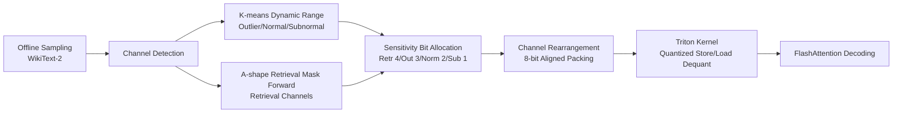

# Channel-Aware Mixed-Precision Quantization for Efficient Long-Context Inference

**Conference**: ICLR 2026  
**OpenReview**: [https://openreview.net/forum?id=yjr2jX41qO](https://openreview.net/forum?id=yjr2jX41qO)  
**Code**: [https://github.com/cxiliao/ChanMix](https://github.com/cxiliao/ChanMix)  
**Area**: Model Compression / KV Cache Quantization / Long-Context Inference  
**Keywords**: KV Cache Compression, Mixed-Precision Quantization, Channel Sensitivity, Retrieval Channels, Long Context, Triton Kernel  

## TL;DR
ChanMix identifies significant differences in quantization sensitivity across different **channels** of the KV cache—retrieval and outlier channels are fragile, while subnormal channels are robust. Based on this, it non-uniformly allocates bits by channel sensitivity (4-bit retrieval / 3-bit outlier / 2-bit normal / 1-bit subnormal) and implements 8-bit aligned packing using custom Triton kernels, significantly mitigating precision collapse in long-context retrieval under a 2-bit average budget.

## Background & Motivation
**Background**: KV cache grows linearly with sequence length, becoming a memory bottleneck in long-context scenarios (Llama-3.1 requires 125GB per million tokens). Quantization is a primary compression route, with industry practice typically applying channel-wise quantization for key caches and token-wise quantization for value caches (e.g., KIVI, KVQuant).

**Limitations of Prior Work**: Existing quantization methods **allocate the same bit-width to all channels uniformly** (uniform bit allocation). While quantization loss is acceptable for general tasks at low bit-widths, severe precision collapse occurs in long-context retrieval tasks (e.g., RULER, NIAH) under 2-bit settings, and the underlying reason remains under-explained.

**Key Challenge**: Uniform bit allocation assumes all channels are equally important, which contradicts the actual statistical properties of KV cache channels. Some channels are outliers (large dynamic range, high quantization error), some have small magnitudes and are robust, and a specific class of "retrieval channels" responsible for long-context retrieval is extremely sensitive to quantization. Evenly distributing bits wastes resources on robust channels while starving sensitive ones.

**Goal**: Restore long-context retrieval precision to near full-precision levels while maintaining a ~20% KV budget (equivalent to 2-bit average), enabling real memory benefits (larger batches, longer contexts).

**Core Idea**: **[Channel-level Sensitivity-aware Non-uniform Bit Allocation]** The paper reveals a three-way asymmetry: retrieval and outlier channels require high precision, whereas subnormal (small magnitude) channels can be aggressively compressed. Based on this, 1/2/3/4 bits are allocated to each channel according to sensitivity, and channels are rearranged to maintain 8-bit aligned efficient storage.

## Method

### Overall Architecture
ChanMix is a channel-level mixed-precision quantization framework for KV cache. During an offline stage, two types of channel detection are performed using a few samples (WikiText-2): K-means clustering on the dynamic range of key caches to identify outlier/normal/subnormal channels, and an "A-shape retrieval mask" used in a single forward pass to identify retrieval channels. During the online stage, it follows KIVI’s key channel-wise / value token-wise quantization but assigns different bits (1/2/3/4 bit) to different channels. Groups of channels are rearranged into 8-bit aligned blocks and quantized/stored using custom Triton kernels; they are then read and dequantized back to full precision during decoding for attention computation.

### Key Designs

**1. Outlier/Subnormal Channel Detection: Tri-partitioning via Dynamic Range** The root of quantization error is the scale factor $S=(C_{\max}-C_{\min})/(2^b-1)$ within a group, with maximum error $E_{\max}=S/2$. Thus, the **dynamic range** of a channel directly determines its sensitivity to low bit-widths. Ours calculates the range $R_c=\max_i K_{i,c}-\min_i K_{i,c}$ for each key channel $c$, then uses K-means ($k=3$) with initial centroids at $R_{\min}, R_{\text{medium}}, R_{\max}$ to cluster channels into outlier ($C_{\text{high}}$), normal, and subnormal ($C_{\text{low}}$) categories. Statistically, outlier channels are much rarer than subnormal ones, and PPL experiments confirm outlier channels degrade sharply as bits decrease while subnormal channels remain stable—providing the basis for non-uniform allocation.

**2. Retrieval Channel Detection: A-shape Mask for Single-pass Localization** Long-context retrieval capability is carried by specific "retrieval heads," and channels within these heads are the most fragile to quantization. Instead of expensive prior retrieval head identification routes, the paper assumes retrieval relies on capturing copy-paste relationships between identical tokens in the input. It constructs a probe prompt by repeating a semantically neutral sentence (~$n=100$ tokens) $t \approx 30$ times, then uses an A-shape retrieval mask $M \in \{0, 1\}^{l \times l}$ to zero out noise scores from attention sinks and local tokens, retaining only cross-sentence retrieval dependencies. Retrieval scores are calculated for each head as $S = \sum_i \sum_j A_{ij} \circ M_{ij}$. High-scoring heads are retrieval heads. Crucially, the process **requires only one forward pass** and completes in under 10 minutes offline.

**3. Sensitivity-Aware Bit Allocation + Channel Rearrangement Alignment** Combining both sensitivity analyses, ChanMix allocates 4 bits to retrieval channels, 3 bits to outlier channels, 2 bits to normal channels, and 1 bit to subnormal channels. Since subnormals always outnumber outliers, to maintain **8-bit aligned storage**, only the **same number** of subnormal channels as outliers are reduced to 1 bit, ensuring the sum of bits in an aligned block exactly totals 8. Quantization parameters are stored in float8 e4m3fnuz format. One Triton kernel handles scale/zero-point calculation and integer conversion, while another fuses "rearrangement + 8-bit aligned memory write." The read side fuses "load + dequantization" to minimize memory copy overhead. This implementation is fully compatible with FlashAttention as a plug-and-play solution.

**4. Orthogonality with Existing Methods** Since ChanMix only modifies the bit allocation of the KV cache, it is orthogonal to and can be combined with weight compression (GPTQ/AWQ/SVD), token pruning (DuoAttention), and quantization error compensation methods (e.g., Kang et al.). It serves as a general foundation for long-context KV compression rather than a replacement.

## Key Experimental Results

### Main Results (RULER, KV ≈ 20%)

| Model | Method | KV Size | 4K | 16K | 32K | 64K | 128K | Avg |
|------|------|---------|----|-----|-----|-----|------|------|
| Llama-2 (32K) | Vanilla | 100% | 80.36 | 61.42 | 53.82 | - | - | 67.87 |
| Llama-2 | KIVI | 19.1% | 68.34 | 53.31 | 41.31 | - | - | 57.00 |
| Llama-2 | KVQuant | 19.8% | 70.84 | 59.43 | 49.60 | - | - | 61.54 |
| Llama-2 | **ChanMix** | 18.3% | 80.35 | 63.82 | 53.20 | - | - | **67.85** |
| Llama-3.1 (128K) | Vanilla | 100% | 93.90 | 86.21 | 84.66 | 82.26 | 74.59 | 84.47 |
| Llama-3.1 | KIVI | 18.9% | 85.42 | 76.07 | 72.58 | 68.36 | OOM | 76.51 |
| Llama-3.1 | OTT | 19.0% | 90.77 | 52.44 | 2.73 | 0.00 | OOM | 46.03 |
| Llama-3.1 | **ChanMix** | 19.5% | 90.64 | 83.66 | 82.68 | 80.55 | 69.41 | **82.16** |

ChanMix outperforms all baselines on RULER by at least **5 absolute percentage points**, achieving nearly zero loss on Llama-2 (67.85 vs 67.87). Token importance methods like OTT collapse to single digits in 32K+ contexts. On InfiniteBench, ChanMix is competitive or superior to all baselines.

### Ablation Study (RULER, Sensitivity Channel Components)

| Method | KV Size (Mistral) | Mistral | KV Size (Llama-3.1) | Llama-3.1 |
|------|------|---------|------|-----------|
| Vanilla | 100% | 86.99 | 100% | 84.47 |
| ChanMix2 (Pure 2-bit) | 16.1% | 72.13 | 15.8% | 75.40 |
| ChanMix2 + R (Retrieval) | 19.6% | 86.12 | 19.5% | 81.50 |
| ChanMix2 + O (Outlier) | 16.1% | 84.17 | 15.8% | 81.13 |
| ChanMix2 + R + O (Full) | 19.6% | **86.35** | 19.5% | **82.16** |

Pure 2-bit quantization achieves only 75.40 on Llama-3.1. Adding retrieval channels (+R) or outlier channels (+O) individually provides significant recovery, and combining both is optimal—validating that both "legs" of the three-way asymmetric sensitivity hypothesis are effective.

### Key Findings
- **Efficiency Gains**: Fused Triton kernels allow ChanMix to support **2.3× batch size** and **1.5× longer context** at the same memory budget, outperforming KIVI in throughput and VRAM efficiency.
- **No Degradation in Short Context**: On MMLU/MBPP/GSM8K, ChanMix consistently outperforms KIVI and approaches full-precision performance (e.g., Llama-3.1 MBPP 47.2 vs vanilla 47.4, while KIVI is 44.2).
- **Long Generation Challenges**: On AIME24/25, all quantization methods (including ChanMix) show significant drops (ChanMix 26.67/20 vs vanilla 43.33/23.33), indicating that low-bit KV remains an open challenge for sustained reasoning.

## Highlights & Insights
- **Thorough Characterization of Channel Sensitivity**: Systematically describes the three-way asymmetry of KV cache—outliers (high quantization error), retrieval channels (critical and fragile for long context), and subnormal channels (robust and compressible). Evidence from PPL and retrieval accuracy curves explains why uniform quantization collapses in long-context settings.
- **Fast Retrieval Channel Detection**: A-shape mask + repeated sentence probes allow for single-pass, 10-minute offline detection, which is much cheaper than prior retrieval head identification.
- **Complete Engineering Loop**: Channel rearrangement for 8-bit alignment + fused Triton kernels + FlashAttention compatibility turns a mixed-precision scheme into end-to-end performance gains rather than just theoretical memory savings.

## Limitations & Future Work
- **Performance Drop in Long Generation**: Significant degradation on AIME suggests KV quantization needs specialized handling for "short input, long output" sustained reasoning tasks.
- **Dependence on Offline Profiling**: Channel classification and retrieval channels are derived from fixed samples. Robustness to distribution shifts or new model families without recalibration remains to be fully explored.
- **Fixed Bit Scheme**: The 1/2/3/4 bit allocation and the "equal quantity reduction" for subnormal channels are manual alignment constraints. Whether per-head/layer adaptation or joint optimization with layer sensitivity (e.g., KVTuner) is superior warrants further research.

## Related Work & Insights
- **KV Quantization Baselines**: KIVI, KVQuant, and ZeroQuant employ uniform key channel-wise / value token-wise quantization. ChanMix introduces channel-level non-uniform bits on top of these frameworks.
- **Mixed-Precision Quantization**: Weight-side works include LLM-MQ, SliM-LLM, and CMPQ. KV-side works include MiKV, ZipCache, OTT (token saliency), KVTuner (layer sensitivity), and QAQ (outliers/attention sensitivity). ChanMix is unique in **specifically targeting channel sensitivity**.
- **Retrieval Head Research**: Builds on observations of copy-paste retrieval heads (Wu et al. 2025) and DuoAttention, pushing importance from "which heads" down to "which channels." For KV compression, differentiating budgets across structural dimensions (channels/heads/layers) appears more robust than token-based scoring.

## Rating
- **Novelty**: ⭐⭐⭐⭐ The three-way sensitivity characterization and single-pass retrieval channel detection are clear and previously unaddressed entry points, though mixed-precision allocation has precedents in weight/KV quantization.
- **Experimental Thoroughness**: ⭐⭐⭐⭐ Covers various model families (MHA/GQA), benchmarks (NIAH/RULER/InfiniteBench/Short-tasks), efficiency, and ablations. Negative results on AIME are transparently reported.
- **Writing Quality**: ⭐⭐⭐⭐ Logical flow from motivation to analysis, method, and experiments. Sensitivity plots and bit allocation diagrams are clear; engineering details (Triton kernels) are well-documented.
- **Value**: ⭐⭐⭐⭐ Long-context KV compression is a practical deployment pain point. The method is orthogonal, provides real VRAM/throughput gains, and is open-source.

<!-- RELATED:START -->

## Related Papers

- [\[ICLR 2026\] MicroMix: Efficient Mixed-Precision Quantization with Microscaling Formats for Large Language Models](micromix_efficient_mixed-precision_quantization_with_microscaling_formats_for_la.md)
- [\[ICLR 2026\] PM-KVQ: Progressive Mixed-Precision KV Cache Quantization for Long-CoT LLMs](pm-kvq_progressive_mixed-precision_kv_cache_quantization_for_long-cot_llms.md)
- [\[ICLR 2026\] STaMP: Sequence Transformation and Mixed Precision for Low-Precision Activation Quantization](stamp_sequence_transformation_and_mixed_precision_for_low-precision_activation_q.md)
- [\[ACL 2025\] MoQAE: Mixed-Precision Quantization for Long-Context LLM Inference via Mixture of Quantization-Aware Experts](../../ACL2025/model_compression/moqae_mixed_precision_kv_cache.md)
- [\[ICLR 2026\] AnyBCQ: Hardware Efficient Flexible Binary-Coded Quantization for Multi-Precision LLMs](anybcq_hardware_efficient_flexible_binary-coded_quantization_for_multi-precision.md)

<!-- RELATED:END -->
