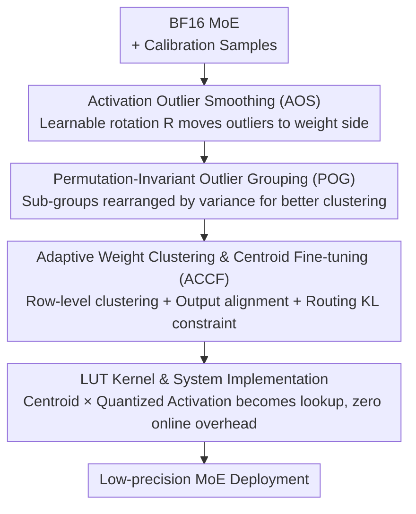

# CodeQuant: Unified Clustering and Quantization for Enhanced Outlier Smoothing in Low-Precision Mixture-of-Experts

**Conference**: ICLR2026  
**OpenReview**: [https://openreview.net/forum?id=ATpchFiBQi](https://openreview.net/forum?id=ATpchFiBQi)  
**Code**: https://github.com/SAI-Lab-NYU/CodeQuant  
**Area**: Model Compression / Quantization  
**Keywords**: MoE Quantization, Outlier Smoothing, Weight Clustering, Learnable Rotation, LUT Kernel

## TL;DR
CodeQuant unifies "learnable rotation to move activation outliers to the weight side" and "using clustering centroids to absorb weight outliers" into a post-training quantization (PTQ) framework designed specifically for MoE. Accompanied by a Look-Up Table (LUT) kernel for implementation, it improves the average accuracy of Qwen3-30B-A3B by 11.3% compared to QuaRot under A4W4 settings and achieves up to a 4.15× inference speedup.

## Background & Motivation

**Background**: Mixture-of-Experts (MoE) has become a mainstream paradigm for scaling large models—each token activates only a small subset of experts, trading conditional computation for capacity. However, the total parameter count of MoE is enormous, leading to heavy memory and communication overhead. Consequently, low-bit post-training quantization (PTQ, especially 4-bit) has become a necessity for deployment, a trend further pushed by new-generation hardware (Hopper/Ada supporting FP8, Blackwell supporting FP4).

**Limitations of Prior Work**: The primary obstacle in quantizing MoE is **outliers**. Large-magnitude activations expand the dynamic range, causing catastrophic quantization errors at low bit-widths—baselines like RTN and SmoothQuant see perplexity explode into the thousands or tens of thousands under A4W4. Recent rotation-based smoothing methods (QuaRot, SpinQuant) reduce errors by redistributing outlier magnitudes via orthogonal transformations, but **residual errors persist**, continuing to hinder the reliability of low-precision deployment.

**Key Challenge**: Rotation methods address activation-side outliers but leave the weight side to **uniform quantization** (similar to GPTQ/AWQ). The issue is that real weight distributions are far from uniform, and uniform quantization grids are powerless against weight-side outliers—this is the root of residual errors. Another line of work (clustering/codebook quantization, such as SqueezeLLM) can "absorb" extreme weights into centroids and is naturally resistant to outliers, with LUT implementations being hardware-friendly. however, it has not been unified with activation-side rotation smoothing, nor has it specifically handled the routing structure of MoE.

**Goal**: To unify "activation-side rotation smoothing" and "weight-side clustering absorption" for MoE, ensuring both sides of outliers are handled while maintaining hardware efficiency (LUT kernel, zero online overhead).

**Key Insight**: The authors' key observation is that once weight quantization is replaced by clustering, **activation quantization becomes the dominant bottleneck** (because clustering already significantly minimizes weight-side error). Therefore, the rotation matrix should focus exclusively on minimizing the quantization error of the "rotated activations," shifting the remaining variance to the weights, which are then handled by clustering to absorb those weight outliers.

**Core Idea**: Use **learnable rotation** to shift outliers from the activation side to the weight side (AOS), followed by **adaptive clustering with centroid fine-tuning** to fit weight outliers into codebook centroids (ACCF), supplemented by **permutations to make weights more cluster-friendly** (POG). Finally, a **LUT kernel** converts clustering multiplication into table lookups (Stage 4)—forming a unified "Rotation + Clustering + Lookup" pipeline.

## Method

### Overall Architecture
CodeQuant is a four-stage **offline calibration + deployment** pipeline acting on the Self-Attention (SA) blocks and FFNs (including routers and multiple experts) of the MoE. The input is a pre-trained BF16 MoE model and a small set of WikiText2 calibration samples; the output is a low-precision MoE with clustered weights and 4-bit quantized activations inferred using a LUT kernel. The four stages are: Stage 1 (AOS) trains an orthogonal rotation matrix $R$ to smooth activation outliers and move them into the weight space; Stage 2 (POG, optional) performs sub-group permutations on weight columns to make the weight distribution more "clusterable"; Stage 3 (ACCF) performs row-level clustering on rotated weights and fine-tunes centroids to minimize changes in layer output, specifically adding a routing preservation term for FFNs; Stage 4 uses a LUT-based GEMM kernel to transform "centroid × quantized activation" multiplication into table lookups for hardware acceleration.

Crucially, both $R$ and the permutation matrix $P$ are **orthogonal** and can be "folded" into the linear layers of the MoE (due to rotation/permutation invariance), so there is no additional online computation during inference—all heavy lifting is completed during the offline calibration phase.

### Key Designs

**1. AOS: Moving Activation Outliers to Weight Space via Learnable Rotation**

Activation outliers expand the dynamic range and are the primary source of low-bit quantization error. CodeQuant inserts a rotation matrix $R \in \mathbb{R}^{d_{in}\times d_{in}}$ into the activations $X$ of SA and FFN. Since the router is a linear layer and each expert is structurally equivalent to a standard FFN, the entire MoE module remains **invariant** under orthogonal transformation—by sharing the same $R$ across the router and all experts, output consistency is maintained without introducing online computation. For a single expert, this rotation invariance is expressed as:

$$(\phi(X_t R R^\top W_{gate}) \odot X_t R R^\top W_{up})W_{down} = (\phi(X W_{gate}) \odot X W_{up})W_{down}$$

where $\phi(\cdot)$ is a non-linearity (e.g., SiLU) and $X_t$ is the subset of tokens assigned to that expert. Simply using random rotations is insufficient—once the weight side is switched to clustering, activation quantization becomes the main bottleneck. Thus, $R$ is not a random orthogonal matrix but is **learned**. To maintain orthogonality while being differentiable, the authors use the Cayley transform to construct $R$ from a learnable parameter matrix $M$: first, the anti-symmetric component $S=\tfrac{1}{2}(M-M^\top)$ is taken, then $R=(I-S)(I+S)^{-1}$. The optimization objective is to minimize the quantization error of the rotated activations: $\arg\min_R \|XR - Q(XR)\|^2$ (where $Q(\cdot)$ is integer quantization). In this way, rotation explicitly suppresses the impact of outliers on the activation side, leaving the "variance" to the weights—paving the way for clustering to absorb these outliers later. Ablations (Table 4) show that learned rotation achieves 1.4% higher accuracy on DeepSeek-V2-Lite than random rotation.

**2. ACCF: Adaptive Weight Clustering + Centroid Fine-tuning with MoE Routing Objectives**

After AOS moves outliers to the weight side, uniform quantization can no longer suffice; clustering must be used to "absorb" extreme values into centroids. ACCF performs **row-level** clustering on rotated weights $W_R = R^\top W$: the centroid matrix $C \in \mathbb{R}^{d_{out}\times K}$ has its $i$-th row as the codebook for the $i$-th row of weights, and a binary assignment tensor $A\in\{0,1\}^{d_{out}\times d_{in}\times K}$ ensures each weight selects exactly one centroid. The reconstructed weight is $W_{c;ij}=\sum_{k} C_{i,k}A_{i,j,k}$. The optimization objective is not to fit the weights themselves, but to **align layer outputs**: $\arg\min_{C,A}\|X_R W_R - \tilde X_R W_c\|^2$.

However, MoE FFNs cannot simply use this objective—direct clustering changes the token-to-expert assignment of the router, causing routing mismatch and performance drops. Thus, ACCF designs an **MoE-specific objective**: SA layers (Q/K/V) use the output alignment loss mentioned above, while FFN gate/up weights are optimized using "weighted sum alignment + routing KL constraint":

$$L = \|Y - \sum_{i=1}^{E}\tilde\Pi_i \tilde X_R W_c\|^2 + \lambda D_{KL}(\tilde\Pi, \Pi)$$

where $Y$ is the MoE weighted sum produced by non-clustered weights, and $\tilde\Pi, \Pi$ are the router outputs after and before clustering, respectively. The KL term pulls the routing distribution back to its original state ($\lambda=1.0$). Optimization uses **alternating iterations**: fix assignment $A$ and perform gradient descent to fine-tune centroids $C$; then fix $C$ and update $A$. A key detail—standard K-means nearest-neighbor assignment does not align with the output objective, so the authors derived an **analytical, gradient-based assignment criterion**. Given the gradient of clustered weights $\nabla W_c = 2\tilde X_R^\top \tilde X_R W_c - 2\tilde X_R^\top X_R W_R$, and for efficiency keeping only diagonal terms $D_1=\mathrm{Diag}(\tilde X_R^\top \tilde X_R)$ and $D_2=\mathrm{Diag}(\tilde X_R^\top X_R)$, the error for assigning $W_{R,ij}$ to the $k$-th centroid is $\psi(W_{R,ij},C_{i,k})=\|D_{1,jj}C_{i,k}-D_{2,jj}W_{R,ij}\|^2$, with optimal assignment $k^*=\arg\min_k \psi(\cdot)$. This criterion incorporates input second-order statistics, making it better than pure K-means at matching the output objective. Ablations (Table 5) show that adding the KL term stabilizes router behavior and improves accuracy.

**3. POG: Sub-group Permutation to Make Rotated Weights "Cluster-Friendly"**

The effectiveness of ACCF strongly depends on whether the initialization of $W_R$ is "clusterable." Since AOS only minimizes activation quantization error and leaves all remaining variance to the weights, some weight groups may exhibit extreme variance that clustering cannot easily compress. In the paper's example, a weight vector divided into clustering groups of size $g=4$ with a budget of $k=2$ centroids per group still has an optimal clustering error of 17 because Group 1 has excessive internal variance. POG's approach is: first, split the weight vector into smaller **sub-groups** (e.g., size 2), calculate the variance of each sub-group, and treat the sub-groups as **indivisible units** to be rearranged by variance. This distributes high-variance and low-variance sub-groups more evenly across larger clustering groups—reducing intra-group variance and overall clustering error (e.g., from 17 down to 7.5).

The intuition is: in the original $W_R$, Group 1 would need more than 2 centroids to suppress error, while Group 2 is easy to cluster; by permuting at the sub-group level, "difficult-to-cluster" elements are spread out, providing a more cluster-friendly $W_R^p$ for ACCF initialization. Note this differs from permutations for quantization (e.g., DuQuant)—the rearranged $W_R^p$ is not necessarily beneficial for uniform quantization, only for clustering. In implementation, permutation is represented as an orthogonal **permutation matrix** $P$, folded into SA and FFN blocks (inserted at $W_v P$ and $P^\top W_{out}$ in SA; $W_{up}P$ and $P^\top W_{down}$ in FFN) to ensure output invariance. POG is only used in Block-wise settings; it is disabled in Embedding-wise settings as it has no impact on final performance.

**4. LUT Kernel: Converting "Centroid × Quantized Activation" to Table Lookups**

The cost of clustering is that if centroids are stored as floats and loaded for multiplication during inference, the overhead is significant, nullifying the hardware advantage. CodeQuant designs a LUT-based GEMM kernel to realize the efficiency potential of clustering. The core idea: partition inputs and weights into blocks based on weight group size; for each weight group, **pre-compute** a look-up table consisting of 16 centroid values multiplied by 16 possible 4-bit integer activation values (16 sub-tables, each representing the product of one centroid across 16 activation values). During inference, a **two-level MUX** selects the result directly based on the weight index and activation index, bypassing dequantization and actual multiplication. The LUT resides in SM shared memory, occupying only a small fraction of modern GPU shared memory; pairing activation and weight access also reduces shared memory bank conflicts. The authors simulated kernel performance on A100 using the Accel-Sim framework (optimizing sub-tile shapes and multi-bank access for Tensor Cores) and verified trends on real CPUs using the T-MAC kernel.

### Loss & Training
Two-stage offline calibration: AOS uses 1024 WikiText2 samples with 128 iterations to optimize the rotation $R$ via Cayley transform; ACCF uses 512 WikiText2 samples with 64 iterations to optimize centroids, with KL coefficient $\lambda=1.0$. Pre-processing time (H100): AOS takes approx. 15/20/30/50 minutes and ACCF takes approx. 30/40/110/240 minutes for Phi-mini-MoE / DeepSeek-V2-Lite / Qwen3-30B-A3B / Mixtral 8×7B, respectively. The entire process is **completely offline**; weights are fixed during inference, identical to standard MoE, with no online overhead.

## Key Experimental Results

Models evaluated include Phi-mini-MoE-Instruct, Qwen3-30B-A3B, DeepSeek-V2-Lite, and Mixtral 8×7B. Evaluation includes language modeling (WikiText2/C4 perplexity), zero-shot QA (ARC, HellaSwag, MMLU, PIQA, WinoGrande), and mathematical reasoning (GSM8K 8-shot, MATH500 4-shot). Two configurations are tested: Embedding-wise (quantization across the entire embedding dimension) and Block-wise ($g=1024$ blocks). In CodeQuant, "A4W4" refers to 4-bit linear quantization for activations and 4-bit clustering (16 centroids) for weights.

### Main Results (A4W4, Embedding-wise)

| Model | Method | Wiki2 ↓ | C4 ↓ | Avg Accuracy ↑ |
|------|------|---------|------|-----------|
| Qwen3-30B-A3B | BF16 | 9.04 | 14.05 | 0.735 |
| Qwen3-30B-A3B | QuaRot | 16.04 | 24.27 | 0.581 |
| Qwen3-30B-A3B | **CodeQuant** | **10.31** | **15.75** | **0.694** |
| DeepSeek-V2-Lite | QuaRot | 7.75 | 10.75 | 0.640 |
| DeepSeek-V2-Lite | **CodeQuant** | **7.08** | **9.85** | **0.664** |
| Mixtral-8×7B | QuaRot | 16.79 | 24.29 | 0.497 |
| Mixtral-8×7B | **CodeQuant** | **4.65** | **8.06** | **0.725** |

On Qwen3-30B-A3B, CodeQuant outperforms QuaRot by 11.3% in average accuracy and reduces Wiki2 perplexity by 5.73. On Mixtral, the improvement is more dramatic: average accuracy is 22.8% higher, and Wiki2 perplexity drops from 16.79 to 4.65 (very close to the BF16 score of 4.01). Baselines like RTN, SmoothQuant, and SqueezeLLM generally collapse under A4W4 (perplexity in thousands). On mathematical reasoning (Table 3), Qwen3-30B-A3B scores 35.9% higher on GSM8K and 11.3% higher on MATH500 compared to QuaRot. Compared to strong rotation baselines (Table 2, CodeQuant$_{had}$ with online Hadamard), average accuracy on Qwen3 is 0.653 > DuQuant 0.637 > SpinQuant 0.590.

### Ablation Study

| Configuration | Key Metric (DeepSeek-V2-Lite, A4W4) | Description |
|------|-----------------------------------|------|
| AOS: Random → Learned | Acc 0.652 → 0.667; Wiki2 7.29 → 7.06 | Learning rotation provides 1.4% gain (Table 4) |
| ACCF: w/o KL → w/ KL | Acc 0.658 → 0.667 (DS); 0.694 → 0.700 (Phi) | KL term stabilizes router & gains acc (Table 5) |
| Bit Budget A4W2 vs A4W4 (CodeQuant) | Acc 0.568 vs 0.667 | Drops only 9.9% under extreme compression (Table 6) |
| Bit Budget A4W2 vs A4W4 (SqueezeLLM) | Acc 0.496 vs 0.652 | Drops 15.6%; CodeQuant is more robust |

### Key Findings
- **After switching to clustering for weights, activations become the primary bottleneck.** This is the fundamental motivation for using "learned" rather than random rotation in AOS, which is confirmed by ablations.
- **The MoE routing KL term is necessary**: Direct clustering disrupts token-expert assignment, leading to routing mismatch. Adding the KL term both restores accuracy and stabilizes router behavior.
- **Superiority increases with compression intensity**: As the bit budget tightens from A4W4 to A4W2, CodeQuant's lead over SqueezeLLM widens from 1.5% to 7.2%, proving that clustering-based outlier absorption is more valuable under extreme compression.
- **POG is only effective for Block-wise settings**: In Embedding-wise settings, permutation has no impact on final performance. For A8W4 on DeepSeek, POG even saw a slight 0.3% decrease, suggesting it is mostly beneficial for "extreme compression" scenarios.
- Regarding acceleration: CodeQuant achieves an average 2.63× speedup relative to BF16 (GPU simulation) and up to 4.15× on real CPU hardware (T-MAC kernel), due to the substitution of repeated multiply-adds with LUT lookups.

## Highlights & Insights
- **Clean "Division of Labor"**: Rotation handles activation outliers, clustering handles weight outliers, permutation ensures clustering ease, and LUT handles execution—four distinct tasks that are perfectly integrated. This is more structured than simply stacking a stronger rotation or a finer quantization grid.
- **Insightful Design Starting Point**: Recognizing that "activations become the main bottleneck" is powerful. While many rotation methods smooth activations and weights together, CodeQuant correctly identifies that once weights are clustered, the conflict shifts to the activations, leading to a learnable, differentiable rotation (Cayley transform) focused on activation error.
- **Gradient/Output-aligned Assignment**: Using the diagonal approximation of input second-order statistics for weighting is more aligned with the true quantization objective than naive K-means nearest-neighbor. This trick is transferable to other "clustering-as-quantization" scenarios.
- **MoE-Specific Routing Constraint**: The work highlights an easily overlooked issue: quantizing MoE is not just about weights but also about perturbing discrete routing decisions. Explicitly incorporating "routing preservation" into the loss is a key distinction between MoE quantization and dense model quantization.

## Limitations & Future Work
- **High Pre-processing Cost**: ACCF for Mixtral 8×7B takes 240 minutes on an H100. Offline calibration overhead scales rapidly with model size, which, while a one-time cost, limits rapid iteration.
- **Simulation-based Hardware Conclusions**: GPU acceleration is primarily based on Accel-Sim simulations requiring architectural modifications (tensor core sub-tile shapes, multi-bank shared memory). These are not real-world numbers from an off-the-shelf A100. Real hardware gains depend on LUT-friendly accelerators (though the paper notes chips like Apple Neural Engine and Cerebras already utilize LUT designs). The 4.15× speedup on CPU (T-MAC) is more reliable.
- **Narrow Usage for POG**: Effective only in Block-wise + extreme compression settings. It is ineffective for Embedding-wise and even showed slight decreases in models already close to BF16 performance, suggesting it is not a universal gain.
- **Future Directions**: Tighter joint optimization of centroid search/fine-tuning with the router, or end-to-end joint training of AOS "learned rotation" and ACCF "centroid fine-tuning" could further reduce residual error; validating simulated GPU results on real LUT-capable hardware.

## Related Work & Insights
- **vs QuaRot/SpinQuant (Rotation Smoothing)**: These use orthogonal rotation to redistribute outliers but still apply uniform quantization to weights, leaving residual errors. CodeQuant keeps rotation for activations but uses clustering to absorb weight outliers and upgrades rotation to be "learnable" and focused on activation error, leading to an 11.3% lead on Qwen3 at A4W4.
- **vs SqueezeLLM (K-means Clustering Quantization)**: SqueezeLLM proves non-uniform clustering is better for weight distributions but lacks activation rotation and MoE-specific handling. CodeQuant adds AOS, analytical assignment criteria, POG, and routing KL, outperforming SqueezeLLM across all budgets, with the gap widening as compression increases.
- **vs DuQuant (Permutation + Rotation)**: DuQuant's permutation aims to benefit **quantization**, whereas CodeQuant's POG is for **clustering** (rearranged matrices may not suit uniform quantization), differing in objective functions. CodeQuant$_{had}$ shows higher accuracy in fair comparisons.
- **vs MoEQuant (MoE-Specific Quantization)**: Both emphasize token-expert affinity. CodeQuant explicitly incorporates this into the ACCF loss via KL divergence on router logits and provides a LUT kernel for an end-to-end accuracy-efficiency trade-off.

## Rating
- Novelty: ⭐⭐⭐⭐ Unifying rotation, clustering, permutation, and LUT specifically for MoE is novel, particularly the "activation as bottleneck" insight and routing KL constraint.
- Experimental Thoroughness: ⭐⭐⭐⭐ Covers four real MoE models, multiple tasks, diverse bit budgets, and complete ablations (AOS/KL/POG), though GPU speedup relies on simulation.
- Writing Quality: ⭐⭐⭐⭐ Clear framework diagrams and complete formulas; one mention of "three stages" in text vs four in the diagram is slightly inconsistent but understandable via the figure.
- Value: ⭐⭐⭐⭐ Directly addresses the outlier pain point in low-precision MoE deployment, approaching BF16 performance at A4W4. Open-source code increases deployment value.

<!-- RELATED:START -->

## Related Papers

- [\[ICLR 2026\] Efficient Quantization of Mixture-of-Experts with Theoretical Generalization Guarantees](efficient_quantization_of_mixture-of-experts_with_theoretical_generalization_gua.md)
- [\[ICLR 2026\] STaMP: Sequence Transformation and Mixed Precision for Low-Precision Activation Quantization](stamp_sequence_transformation_and_mixed_precision_for_low-precision_activation_q.md)
- [\[ICLR 2026\] Coupling Experts and Routers in Mixture-of-Experts via an Auxiliary Loss](coupling_experts_and_routers_in_mixture-of-experts_via_an_auxiliary_loss.md)
- [\[ICLR 2026\] UniQL: Unified Quantization and Low-Rank Compression for Adaptive Edge LLMs](uniql_unified_quantization_and_low-rank_compression_for_adaptive_edge_llms.md)
- [\[ICLR 2026\] Unveiling Super Experts in Mixture-of-Experts Large Language Models](unveiling_super_experts_in_mixture-of-experts_large_language_models.md)

<!-- RELATED:END -->
