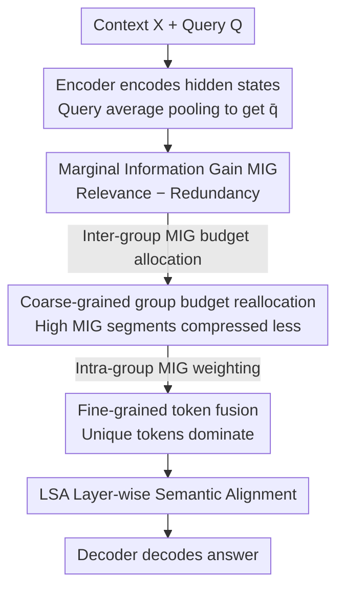

# COMI: Coarse-to-fine Context Compression via Marginal Information Gain

**Conference**: ICLR2026  
**arXiv**: [2602.01719](https://arxiv.org/abs/2602.01719)  
**Code**: [https://github.com/Twilightaaa/COMI](https://github.com/Twilightaaa/COMI)  
**Area**: Model Compression  
**Keywords**: context compression, token merging, long context, marginal information gain, RAG

## TL;DR
This paper proposes COMI, a coarse-to-fine adaptive context compression framework based on Marginal Information Gain (MIG = query relevance - semantic redundancy). At a 32x compression ratio, it improves the NaturalQuestions EM score by approximately 25 points compared to the second-best method. The core contribution lies in the simultaneous optimization of information relevance and diversity.

## Background & Motivation

**Background**: Technologies such as RAG have increased LLM input lengths, leading to high computational costs and information redundancy. Context compression methods are categorized into task-agnostic (global compression ignoring the query) and task-aware (retaining relevant content based on the query).

**Limitations of Prior Work**: (a) Task-agnostic methods ignore the query, leading to the inevitable loss of relevant information under high compression; (b) Task-aware methods use only "relevance" as the compression criterion—resulting in highly similar (redundant) retained tokens; empirical studies show that only 0.75% of tokens account for 99% of attention weights, and the cosine similarity between these tokens exceeds 0.6; (c) High redundancy may mislead LLMs into generating incorrect outputs ("relevance does not equal correctness").

**Key Challenge**: Retaining tokens solely by relevance leads to the preservation of many "relevant but redundant" contents, causing insufficient information diversity after compression. Existing dynamic compression rate allocation methods use either fixed linear rules or are based solely on relevance, neglecting semantic redundancy.

**Goal**: To simultaneously optimize relevance and diversity under high compression ratios—retaining information that is relevant to the query and mutually non-redundant.

**Key Insight**: Define Marginal Information Gain (MIG) = Relevance - Redundancy, as a unified metric to guide coarse-grained group budget allocation and fine-grained token fusion.

**Core Idea**: Use MIG (query cosine similarity minus the maximum similarity with other tokens) to guide two-stage compression—dynamic allocation of compression rates between groups and weighted token fusion within groups.

## Method

### Overall Architecture
COMI addresses the contradiction between maintaining relevant information and avoiding redundancy under high compression. It utilizes an Encoder-Decoder architecture: given context $X$ and query $Q$, the Encoder first encodes them into hidden states, and the query tokens are average-pooled into a query vector $\bar{q}$ as a reference for relevance. Then, a two-stage coarse-to-fine compression is performed: macroscopically, the context is partitioned into equal-length segments, and compression budgets are dynamically allocated based on the informational value of each segment (segments with high MIG receive higher budgets); microscopically, tokens within each segment are weighted-fused into compressed tokens. Both stages are driven by the Marginal Information Gain (MIG). The compressed representations are aligned via Layer-wise Semantic Alignment (LSA) and sent to the Decoder to generate the answer.

### Key Designs

**1. Marginal Information Gain MIG: Modeling "Relevance" and "Non-redundancy" in a Single Formula**

A common failure in task-aware compression is focusing solely on relevance, which results in highly similar retained tokens. COMI replaces the selection criterion with Marginal Information Gain:

$$G(x_i, q, X) = \frac{x_i^\top q}{\|x_i\|\|q\|} - \max_{j \neq i} \frac{x_i^\top x_j}{\|x_i\|\|x_j\|}$$

The first term is the cosine similarity between the token and the query (relevance); the second term is the maximum cosine similarity between the token and others in the context (redundancy). A high MIG implies the token is both relevant to the query and unique in content. The paper theoretically proves that selecting tokens based on MIG yields better expected performance than using relevance alone.

**2. Coarse-grained group budget reallocation: Differential allocation for non-uniform information distribution**

Information is distributed non-uniformly across long contexts. COMI segments the context into equal-length blocks, uses a representative vector (the token with the highest query similarity in the segment) to calculate the segment's MIG $G_i$, and applies an inverse softmax to allocate the compression budget:

$$P_i = \frac{e^{-G_i}}{\sum_j e^{-G_j}}$$

Using $-G_i$ in the exponent creates an inverse ranking: segments with higher MIG receive more retention budget (lower actual compression rate). This ensures segments that are relevant and unique retain more tokens.

**3. Fine-grained token fusion: Unique tokens dominate fusion within groups**

Instead of uniform averaging, which dilutes critical information, COMI uses MIG-weighted fusion. With the pooled query vector $\bar{q}$ as a reference, tokens are weighted by their MIG via softmax:

$$\tilde{h}_i = \sum_{h_k \in S_i} \frac{e^{G(h_k, \bar{q}, S_i)}}{\sum_{h_l \in S_i} e^{G(h_l, \bar{q}, S_i)}} \cdot h_k$$

Tokens with higher MIG contribute more to the fused result, ensuring that unique and relevant semantics dominate the compressed tokens.

### Loss & Training
The model uses an Encoder-Decoder architecture. The Encoder and LSA are fully fine-tuned, while only the attention projection matrices $W_Q, W_K, W_V, W_O$ are fine-tuned in the Decoder. The training objective is standard cross-entropy $\mathcal{L}_{nll}$, predicting the correct answer based on the compressed representations.

## Key Experimental Results

### Main Results (32x compression, Qwen2-7B)

| Method | NQ EM | 2WikiMQA EM | HotpotQA EM | NarrativeQA EM | MultiNews F1 |
|------|-------|-------------|-------------|----------------|-------------|
| Original Prompt | 72.35 | 59.78 | 64.17 | 24.53 | 31.42 |
| SnapKV | 6.06 | 8.09 | 13.61 | 0.00 | 25.56 |
| Activation Beacon | 11.67 | 36.53 | 39.73 | 6.63 | 33.60 |
| LongLLMLingua | 15.07 | 21.80 | 21.58 | 1.03 | - |
| **Ours (COMI)** | **~40** | **~45** | **~42** | **~10** | **~30** |

### Ablation Study (NQ, LLaMA-2-7B, 16x)

| Configuration | EM | Description |
|------|-----|------|
| COMI (full) | 22.75 | Full method |
| w/o MIG (Relevance only) | ↓Significant | Redundancy accumulation |
| w/o Coarse reallocation | ↓Moderate | Fixed compression rate |
| w/o Fine MIG weighting | ↓Moderate | Uniform fusion |

### Key Findings
- **COMI outperforms the second-best method by ~25 EM points at 32x compression** (NQ + Qwen2): The advantage is extremely significant at high compression ratios, where information diversity becomes critical.
- **COMI approaches original prompt performance at 16x compression**: On LLaMA-2-7B, COMI achieves 22.75 EM vs. the original 15.04 EM—the compressed input actually outperforms the original by removing redundant noise.
- **MIG's redundancy penalty is the key contribution**: Removing it leads to significant degradation, confirming that "relevance without diversity" is the core issue at high compression.
- **Consistent effectiveness across backbones**: Significant leads on both LLaMA-2-7B and Qwen2-7B.

## Highlights & Insights
- **MIG = Relevance - Redundancy is a clean and powerful metric**: It unifies two core dimensions of information selection in a single formula. This design can be transferred to other scenarios like RAG retrieval or KV-cache management.
- **Hierarchical design of the two-stage strategy**: Budgets are allocated at the segment level (macro decision) and tokens are fused at the local level (micro decision), ensuring optimality at both scales.
- **Counter-intuitive finding of "exceeding original performance"**: This suggests that a large amount of redundancy in long texts acts as noise; effective compression serves as denoising.

## Limitations & Future Work
- **Requirement for Encoder-Decoder architecture**: It cannot be directly applied to KV-cache compression in Decoder-only models. Incorporating MIG into KV-cache management is a future research direction.
- **MIG uses maximum single-token similarity as a redundancy metric**: This may be insufficient for groups of moderately similar tokens. Using DPP or MMR for diversity might be more accurate.
- **Training cost**: It requires fine-tuning the Encoder and parts of the Decoder, unlike training-free methods like LLMLingua.
- **Ultra-long text validation**: Experiments were limited to 4-8K tokens; performance in truly long-context scenarios (100K+) remains unknown.

## Related Work & Insights
- **vs. LLMLingua/LongLLMLingua**: These use perplexity/entropy for token removal but do not consider redundancy among retained tokens. COMI's MIG balances relevance and uniqueness.
- **vs. GMSA**: GMSA addresses cross-layer semantic alignment; COMI adopts the LSA solution while innovating at the compression strategy level.
- **vs. Activation Beacon/StreamLLM**: These are model-specific KV-cache compression methods. COMI is prompt-level compression and thus more model-agnostic.

## Rating
- Novelty: ⭐⭐⭐⭐ MIG is simple and intuitively correct; the coarse-to-fine framework is well-designed.
- Experimental Thoroughness: ⭐⭐⭐⭐ Evaluation across 4 QA tasks, 1 summarization task, 2 backbones, and multiple compression ratios.
- Writing Quality: ⭐⭐⭐⭐ Motivation is clear, supported by strong empirical observations (0.75% tokens/99% attention).
- Value: ⭐⭐⭐⭐ Provides an effective solution for high compression ratios with transferable design principles.

<!-- RELATED:START -->

## Related Papers

- [\[ACL 2025\] CFSP: An Efficient Structured Pruning Framework for LLMs with Coarse-to-Fine Activation Information](../../ACL2025/model_compression/cfsp_an_efficient_structured_pruning_framework_for_llms_with_coarse-to-fine_acti.md)
- [\[ICLR 2026\] InfoTok: Adaptive Discrete Video Tokenizer via Information-Theoretic Compression](infotok_adaptive_discrete_video_tokenizer_via_information-theoretic_compression.md)
- [\[CVPR 2026\] HierAmp: Coarse-to-Fine Autoregressive Amplification for Generative Dataset Distillation](../../CVPR2026/model_compression/hieramp_coarse-to-fine_autoregressive_amplification_for_generative_dataset_disti.md)
- [\[ICLR 2026\] FreqKV: Key-Value Compression in Frequency Domain for Context Window Extension](freqkv_key-value_compression_in_frequency_domain_for_context_window_extension.md)
- [\[ICCV 2025\] Gain-MLP: Improving HDR Gain Map Encoding via a Lightweight MLP](../../ICCV2025/model_compression/gain-mlp_improving_hdr_gain_map_encoding_via_a_lightweight_mlp.md)

<!-- RELATED:END -->
