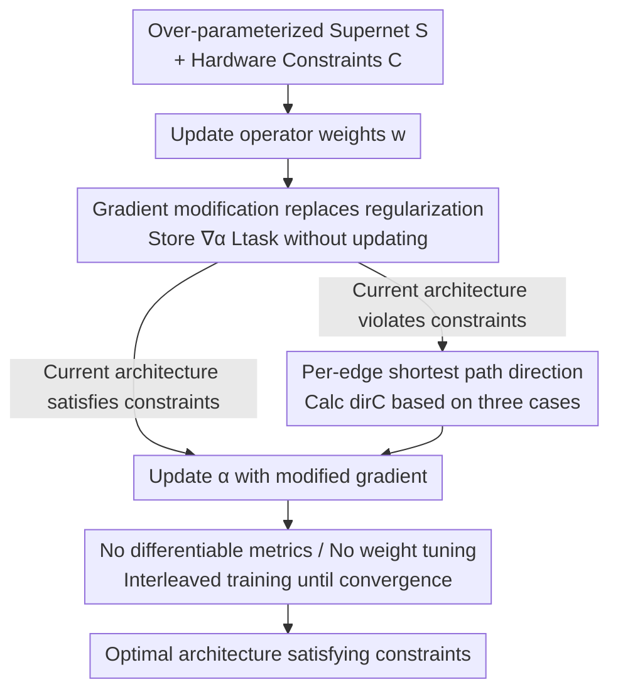

# Constraint-guided Hardware-aware NAS through Gradient Modification

**Conference**: ICLR 2026  
**OpenReview**: [https://openreview.net/forum?id=fcKMFIiNFQ](https://openreview.net/forum?id=fcKMFIiNFQ)  
**Code**: https://gitlab.kuleuven.be/m-group-campus-brugge/distrinet_public/connas  
**Area**: Model Compression / Neural Architecture Search / Hardware-aware / Edge Deployment  
**Keywords**: Hardware-aware NAS, Gradient Modification, Constrained Optimization, Feasible Region, Edge ML

## TL;DR
CONNAS replaces hardware constraints from "regularization terms in the loss" to "direct gradient direction modification of architecture weights." This allows the gradient search process to automatically avoid infeasible architectures, eliminating the need for differentiable hardware metrics and regularization weight tuning. On NATS-Bench, the gap between the discovered architectures and the optimal feasible solutions is as small as 0.14%.

## Background & Motivation
**Background**: In Edge Machine Learning (EdgeML), models must be deployed on devices with tight compute, memory, and energy budgets—such as mobile phones, embedded boards, and MCUs. Therefore, architectures must be both accurate and resource-efficient. Gradient-based methods in Neural Architecture Search (NAS), represented by DARTS, have become mainstream due to their efficiency in searching large spaces. These methods embed all candidate architectures into an over-parameterized supernet, assigning a continuous architecture weight $\alpha$ to each candidate edge, and simultaneously optimize operator weights $w$ and architecture weights $\alpha$ via gradient descent.

**Limitations of Prior Work**: To incorporate hardware metrics into gradient search, the mainstream approach involves adding hardware metrics like latency, parameter count, or FLOPs as regularization terms to the loss function, balanced by a weight $\lambda_{\text{hardware}}$. This approach has two chronic issues: first, hardware metrics are discrete and non-differentiable regarding the architecture. To enable differentiation, they must be "factorized" into weighted sums of candidate operator contributions, which becomes computationally infeasible in large search spaces, necessitating Monte Carlo approximations that may be inaccurate if the sampling distribution is poorly calibrated. Second, the weight $\lambda$ is extremely difficult to tune—if it is too small, it fails to constrain the search, resulting in undeployable architectures that exceed the budget; if it is too large, it over-penalizes the search, forcing it toward simple models with weak representational capacity.

**Key Challenge**: The regularization mechanism is essentially "guidance without enforcement"—it pushes the search toward hardware-friendly directions but **does not guarantee** that the final architecture truly satisfies the constraints. Consequently, finding an architecture that is both compliant and accurate often requires multiple search runs with different $\lambda$ values, which is tedious and time-consuming.

**Goal**: (1) **Directly enforce** hardware constraints $c_k(A)\le b_k$ during the search process rather than providing soft guidance; (2) Eliminate dependency on differentiable hardware metrics; (3) Remove regularization weights that require iterative tuning.

**Key Insight**: The authors draw inspiration from "Constraint-Guided Gradient Descent" (CGGD, Van Baelen & Karsmakers 2023). CGGD was originally designed to enforce inequality constraints during standard network weight training through gradient modification (rather than penalty terms), proving that optimization converges to the feasible region if the correction direction is correct and the intensity is sufficient. The authors observe that since this can be applied to model weights, it can also be applied to **architecture weights $\alpha$**.

**Core Idea**: Instead of including hardware constraints in the loss, a "correction term pointing toward the feasible region" is added to the gradient when updating architecture weights $\alpha$. This steers the search direction away from infeasible architectures, replacing regularization terms with gradient modification.

## Method

### Overall Architecture
CONNAS follows the DARTS-style over-parameterized supernet: the supernet is a directed acyclic graph (DAG) where each edge $e_l$ holds a set of candidate operators $O_l=\{o_{l,1},\dots,o_{l,N}\}$, each with an associated architecture weight $\alpha_{l,j}$. The final architecture $A$ is selected by taking $\arg\max_k \alpha_{l,k}$ for each edge. Given a set of hardware constraints $C=\{(c_1,b_1),\dots,(c_M,b_M)\}$ (where each constraint $c_k$ must not exceed a bound $b_k$), the goal is to find the architecture with the minimum task loss within the feasible region $\mathrm{FR}$.

The only difference from standard gradient NAS lies in the "how to update $\alpha$" step: in each batch, operator weights $w$ are updated normally, and then the task gradient for $\alpha$ is computed but **stored without updating**. The current architecture $A$ is then checked for constraint violations. If a violation occurs, a unit direction $\mathrm{dir}_C(\alpha)$ pointing toward the feasible region is calculated per edge, superimposed onto the stored gradient with a specific intensity, and used to update $\alpha$. The pipeline is as follows:

### Key Designs

**1. Gradient modification replaces regularization: Embedding "constraints" into the update direction of $\alpha$**

To address the issue that regularization terms only guide without enforcing and require weight tuning, CONNAS ignores the loss and instead inserts a correction term during the update of each architecture weight $\alpha_{l,j}$:

$$\alpha_{l,j} \leftarrow \alpha_{l,j} - \eta_\alpha\cdot\Big(\nabla_{\alpha_{l,j}}\mathcal{L}_{\text{task}}(w,\alpha) + R\cdot \mathrm{dir}_C(\alpha_{l,j})\cdot \max\big(\lVert\nabla_{\alpha_{l,j}}\mathcal{L}_{\text{task}}(w,\alpha)\rVert,\ \epsilon\big)\Big)$$

Here, $\nabla_{\alpha}\mathcal{L}_{\text{task}}$ is the original task gradient. The second term is the novelty: $\mathrm{dir}_C$ is the unit direction toward the feasible region, $R>1$ is a "rescaling factor" controlling the enforcement strength, and $\max(\lVert\cdot\rVert,\epsilon)$ ensures the correction magnitude scales with the task gradient while providing a push even when the task gradient is zero via a tiny constant $\epsilon$. The beauty of this design is that constraints are no longer "competing terms" vying for weights against the task loss; they directly act on the search direction. CGGD has proven that as long as $R>1$ and the direction is correct, the iteration will converge into the feasible region. In other words, constraint satisfaction changes from a "soft optimization goal" to a "near-hard directional guarantee."

**2. Per-edge shortest path direction heuristic: Calculating $\mathrm{dir}_C$ via three cases**

The selection of the direction $\mathrm{dir}_C$ in Design 1 is critical. CGGD's convergence guarantee requires taking the "shortest Euclidean path to the feasible region," but calculating the exact global shortest path requires enumerating hardware metrics for all architectures in the search space, which is computationally impossible for large spaces. CONNAS adopts a **heuristic approximation**: it approximates the global shortest path as "independent per-edge shortest path calculation." By fixing other edges and only replacing the current operator on edge $e_l$ with each candidate $o_{l,j}$, a set of candidate architectures $A_{l,j}$ is obtained. After evaluating their hardware metrics, the direction for that edge is determined via three cases:

- **All candidates satisfy constraints**: No correction is needed for this edge; the direction is set to 0.
- **Some candidates violate constraints**: The set of satisfying candidates $F$ is identified. For each pair of "satisfying $j$ and violating $m$," a unit vector $u_{j,m}$ pointing from $m$ to $j$ is constructed (with $+1$ at index $j$ and $-1$ at index $m$, normalized by $\sqrt 2$). All such vectors are summed and normalized to obtain the edge direction. The intuition is to "elevate satisfying candidates and suppress violating ones."
- **All candidates violate constraints**: Since there are no "satisfying" candidates to point to, candidates are sorted by their hardware metric values. Unit vectors are constructed from higher-resource candidates toward lower-resource ones and aggregated. This drags the entire edge toward resource-efficient directions by suppressing the most resource-heavy operators.

The directions calculated for each violated constraint are aggregated and normalized into a single unit vector $\mathrm{dir}_C(\alpha)$. The authors admit that this per-edge approximation breaks the strict convergence guarantees of CGGD, but experiments show the heuristic is effective in practice.

**3. No differentiable hardware metrics + Explicit constraints, no weight tuning**

This is a direct benefit of the first two designs and a key differentiator of CONNAS from common baselines. Because direction calculation only requires **evaluating** the numeric value of $c_k(A_{l,j})$ and comparing the relative order of candidates, the hardware metric $c_k$ can be a discrete value from a look-up table or a regressor. **It does not need to be differentiable with respect to $\alpha$**, bypassing the complexities of factorization or Monte Carlo approximations. Furthermore, constraints are **explicitly defined** as $c_k(A)\le b_k$, allowing users to specify upper bounds directly without tuning $\lambda_{\text{hardware}}$, which lacks direct physical meaning. Moreover, CGGD proves performance is insensitive to the exact value of $R$ (as long as $R>1$; the paper uses $R=1.2$), eliminating the need to tune this single hyperparameter—unlike regularization baselines which are highly sensitive to weights across different constraint sets.

**4. Interleaved training (Algorithm 1)**

The process is integrated into an executable training loop: within each batch, $w$ and $\alpha$ are updated alternately (following DARTS traditions). Specifically, operator weights $w$ are updated using the task gradient first. Then, $\nabla_\alpha\mathcal{L}_{\text{task}}$ is computed and **stored**. Each hardware constraint $(c_k,b_k)$ is traversed; only when the current architecture $A$ violates the constraint ($c_k(A)>b_k$) is a direction $\mathrm{dir}_c^k$ computed. All violating directions are summed and normalized to $\mathrm{dir}_C(\alpha)$. Finally, the stored gradient is modified and used to update $\alpha$. It is crucial that "directions are only calculated for violated constraints"—if constraints are satisfied, no force is applied, allowing the search to explore more complex yet compliant architectures near the feasible boundary rather than being forced into the simplest models.

### Loss & Training
The task remains focused on standard cross-entropy $\mathcal{L}_{\text{task}}$ for classification, with no hardware regularization terms. The discrete distribution of candidate operators uses Gumbel-Softmax relaxation (CONNAS is agnostic to the relaxation method; DARTS/ProxylessNAS relaxations also work). The temperature $\tau$ is linearly annealed from 10 to 0.1 over the first 100 epochs (high temperature for exploration, low temperature to approach argmax for exploitation), with 150 total epochs. The rescaling factor $R=1.2$. In the final 50 epochs, the architecture that satisfies constraints and has the lowest validation loss is selected as the search result.

## Key Experimental Results

### Main Results
Evaluated on NATS-Bench (topology space: 15,625 architectures; size space: 32,768 architectures), with constraints set such that approximately 50% of architectures are feasible. Real latency/energy on Jetson TX2 were used for the topology space, while proxy metrics like parameter count, FLOPs, and peak memory were used for the size space. Each experiment was repeated 5 times; numbers in parentheses represent relative error to the optimal feasible architecture.

| Search Space / Constraint | Dataset | CONNAS Top-1 (%) | Satisfied Constr. | Remarks |
|--------|------|------|----------|------|
| topology · Latency ≤ 5.31ms | CIFAR-10 | 93.18 ± 0.09 (-1.08) | 5/5 | 1.08% gap from optimal |
| topology · Energy ≤ 23.95mJ | CIFAR-100 | 69.51 ± 1.48 (-2.43) | 5/5 | — |
| topology · Latency ∧ Energy | ImageNet16-120 | 41.45 ± 1.01 (-5.08) | 5/5 | — |
| size · Peak Mem ≤ 655kB | CIFAR-10 | 93.28 ± 0.15 (**-0.14**) | 5/5 | Smallest gap: 0.14% |
| size · Params ≤ 261,650 | CIFAR-100 | 66.22 ± 0.47 (-2.70) | 5/5 | — |

CONNAS achieved **5/5 constraint satisfaction** across all configurations, with relative errors from the optimal feasible solution being $-1.18\%$, $-4.10\%$, and $-6.45\%$ on CIFAR-10/100/ImageNet16-120, respectively. Comparison with baselines: ProxylessNAS and HDX performed significantly worse (HDX showed high variance under topology/latency, e.g., 75.83 ± 36.80). TAS and FBNet **failed to consistently produce compliant architectures** (TAS was 0/5 for all topology constraints; high precision results were invalid due to being over budget). CONNAS was roughly comparable to TF-NAS but without the need for per-constraint weight tuning.

### Deployment Use-case
In an edge monitoring task for induction motor eccentricity (based on 1D CNN, 8 layers, ~1.94 billion architectures), using the resource requirements of 6 manual architectures as constraints, CONNAS found architectures with up to **1.55% higher accuracy** than the best manual architecture under strict budgets (Model ≤ 64kB, Memory ≤ 18kB).

### Ablation Study

| Configuration | Phenomenon | Explanation |
|------|---------|------|
| Rescaling factor $R$ scan (Appendix B) | Performance insensitive to $R$ | Fine-tuning unnecessary if $R > 1$ |
| Baseline tuning for $\lambda_{\text{hardware}}$ (Appendix D) | Baselines highly sensitive | Weight needs retuning for every constraint set |
| Stricter constraints (Appendix C) | CONNAS still finds compliant models | Outperforms all baselines in most cases |

### Key Findings
- **Constraint satisfaction is more critical than minor accuracy gains**: Some baselines show higher accuracy but fail to meet constraints (indicated in gray/0-5 satisfaction), rendering them undeployable. The core value of CONNAS is **consistently producing compliant architectures**.
- **Tuning-free operation is a genuine labor saver**: Regularization methods are sensitive to $\lambda$ and require multiple runs when constraints change; the only hyperparameter $R$ in CONNAS is insensitive, requiring only one run.
- **Per-edge heuristic is sufficient**: While strict CGGD convergence is sacrificed, experiments show it consistently converges to the feasible region in practice.

## Highlights & Insights
- **Moving constraints from objective to gradient direction**: This is the "aha" moment—while still using hardware information, regularization forces it to compete for weights against task loss, whereas CONNAS lets hardware info dictate "where to push" without interfering with "how much to push" (which is determined by task gradient magnitude). This makes constraint satisfaction nearly mandatory and eliminates the tuning burden.
- **Generalizable transfer logic**: Enforcing inequality constraints via gradient modification is inherently task-agnostic. Any discrete selection search with feasible/infeasible determination (e.g., feature selection with budgets, operator scheduling with latency bounds) can potentially adopt this—provided it can **evaluate** constraint values and define a direction toward the feasible set, requiring no differentiability.
- **Engineering friendliness of look-up tables**: Permitting discrete values from look-up tables or regressors means real-world latency/energy measurements can be directly incorporated without needing differentiable approximations, making it more practical for real edge deployment.

## Limitations & Future Work
- **Author Acknowledgement**: The per-edge independent shortest path calculation is only a heuristic approximation of the global shortest path. Strict CGGD convergence guarantees no longer hold, and utility is proven empirically.
- **Direction Calculation Overhead**: For every edge and constraint, candidate operators must be enumerated and hardware metrics evaluated to construct the direction. This evaluation cost increases with the number of edges, candidates, and constraints (though it requires no training, only look-up/regression).
- **Personal Observations**: Experiments were primarily validated on NATS-Bench (CNN classification) and one edge signal use-case. It remains to be seen if the per-edge heuristic is robust for larger, more heterogeneous spaces like Transformers, detection, or segmentation. In the "all candidates violate" case, applying force purely by metric ranking might conflict with task accuracy; this influence is not deeply analyzed.
- **Improvement Ideas**: Explore direction aggregation with confidence (more robust to evaluation noise) or upgrade the per-edge heuristic to grouped/global approximate shortest paths to regain part of the convergence guarantee.

## Related Work & Insights
- **vs. Regularization-based Hardware NAS (ProxylessNAS / FBNet / TF-NAS)**: These treat hardware as (differentiable) regularization terms in the loss, balanced by weights. CONNAS modifies the gradient direction of architecture weights instead. The former is "soft guidance, requires differentiability, needs tuning, no satisfaction guarantee," while CONNAS is "near-mandatory, tuning-free, derivative-free, stable satisfaction."
- **vs. HDX (Hong et al. 2022)**: HDX also modifies gradients but **retains the regularization term** and relies on **differentiating hardware metrics**. CONNAS requires neither regularization nor differentiable metrics; direction is determined solely by comparing candidate metric values.
- **vs. CGGD (Van Baelen & Karsmakers 2023)**: CGGD enforces inequality constraints on **model weights** during training, not NAS. This paper transfers the gradient modification mechanism to **architecture weights $\alpha$** and proposes a per-edge heuristic for large search spaces.
- **vs. Selection-based/Frank-Wolfe (HardCoreNAS, etc.)**: These often prune subnets from pre-trained one-shot models or use hard-constraint optimizers. CONNAS is an end-to-end gradient search that incorporates constraints into the direction directly during search, requiring no pre-training.

## Rating
- Novelty: ⭐⭐⭐⭐ Transferring CGGD's "gradient modification for constraints" to architecture weights and proposing a per-edge heuristic is novel and clear.
- Experimental Thoroughness: ⭐⭐⭐⭐ Covered NATS-Bench (2 spaces x 3 datasets x multiple constraints) plus a real edge use-case with 5 baseline comparisons; however, the search space is limited to CNN classification.
- Writing Quality: ⭐⭐⭐⭐ Problem motivation and method derivation are very clear; the three direction cases and algorithm flow are complete.
- Value: ⭐⭐⭐⭐ High practical value for edge deployment due to no differentiable metrics, no weight tuning, and stable constraint satisfaction.

<!-- RELATED:START -->

## Related Papers

- [\[ICLR 2026\] GAPrune: Gradient-Alignment Pruning for Domain-Aware Embeddings](gaprune_gradient-alignment_pruning_for_domain-aware_embeddings.md)
- [\[ICLR 2026\] GradPruner: Gradient-guided Layer Pruning Enabling Efficient Fine-Tuning and Inference for LLMs](gradpruner_gradient-guided_layer_pruning_enabling_efficient_fine-tuning_and_infe.md)
- [\[CVPR 2026\] Gradient Knows Best: Mixed-Precision Quantization via Gradient-Guided Bit Allocation for Super-Resolution](../../CVPR2026/model_compression/gradient_knows_best_mixed-precision_quantization_via_gradient-guided_bit_allocat.md)
- [\[ICLR 2026\] Towards Efficient Constraint Handling in Neural Solvers for Routing Problems](towards_efficient_constraint_handling_in_neural_solvers_for_routing_problems.md)
- [\[ICLR 2026\] AnyBCQ: Hardware Efficient Flexible Binary-Coded Quantization for Multi-Precision LLMs](anybcq_hardware_efficient_flexible_binary-coded_quantization_for_multi-precision.md)

<!-- RELATED:END -->
