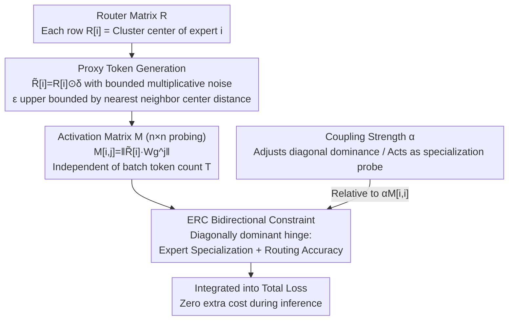

# Coupling Experts and Routers in Mixture-of-Experts via an Auxiliary Loss

**Conference**: ICLR 2026 Oral  
**arXiv**: [2512.23447](https://arxiv.org/abs/2512.23447)  
**Code**: None  
**Area**: Model Architecture / MoE  
**Keywords**: Mixture-of-Experts, Router-Expert Coupling, Auxiliary Loss, Expert Specialization, Large Language Models

## TL;DR

Proposes Expert-Router Coupling (ERC) Loss, a lightweight auxiliary loss function that achieves tight coupling between router decisions and expert capabilities by treating router parameters as proxy tokens for cluster centers and constraining expert activation norms on them, significantly improving MoE-LLM performance with only $n^2$ activation computations.

## Background & Motivation

Mixture-of-Experts (MoE) is the core architecture of modern large language models, employing a router to select top-K experts for each token to achieve efficient parameter scaling through sparse activation. However, traditional MoE faces a fundamental issue: **a lack of explicit constraints ensures routing decisions align with actual expert capabilities**.

Specifically:
- The router is a linear classifier $\mathbf{R} \in \mathbb{R}^{n \times d}$, determining token distribution via inner product $\text{softmax}(\mathbf{x}\mathbf{R}^\top)$.
- Experts are independent FFN modules with their own parameters $\mathbf{W}_g, \mathbf{W}_p, \mathbf{W}_o$.
- The router lacks direct access to expert parameters (and thus their true capabilities), learning routing strategies through trial and error.
- This often leads to "mis-routing"—tokens being sent to experts ill-equipped to handle them, generating gradients that interfere with expert specialization.

The prior solution, Autonomy-of-Experts (AoE), acquires routing signals by having all experts partially process every token. However, this incurs substantial computational and memory overhead (1.6x training time, 1.3x memory) that scales linearly with the number of tokens.

## Method

### Overall Architecture

ERC Loss is built upon a concise observation: each row $\mathbf{R}[i]$ of the router matrix $\mathbf{R}$ acts as a **cluster center** for the set of tokens $\mathcal{X}_i$ assigned to expert $i$. Since softmax linear routing essentially partitions tokens based on proximity to these centers via inner products, $\mathbf{R}[i]$ summarizes the "average form" of $\mathcal{X}_i$. Consequently, it can serve as a proxy token to probe expert responses without the need to pass all tokens through all experts as in AoE. The method adds an auxiliary loss only during training: noisy proxy tokens are generated from cluster centers, used to probe an $n \times n$ expert activation matrix, and finally a bidirectional constraint is applied to align "whom the router selects" with "what the expert excels at," using a coupling strength $\alpha$ to adjust the constraint. This mechanism is absent during inference, incurring zero extra cost.

### Key Designs

**1. Proxy Token Generation: Representing Intra-cluster Variance**

Using $\mathbf{R}[i]$ directly as a proxy risks overfitting the loss to the mean point rather than the entire cluster it represents. Thus, bounded multiplicative noise is applied: $\tilde{\mathbf{R}}[i] = \mathbf{R}[i] \odot \boldsymbol{\delta}_i$, where $\boldsymbol{\delta}_i \sim \mathcal{U}(1-\epsilon_i, 1+\epsilon_i)^d$. The noise magnitude is constrained by $\epsilon_i \leq \frac{\|\mathbf{R}[i] - \mathbf{R}[j]\|}{2\|\mathbf{R}[i]\|}$ ($j$ being the nearest neighbor center), ensuring the perturbed proxy remains within its cluster boundary. $\epsilon_i$ is dynamically recalculated at each layer and step, following the drift of clusters during training. Crucially, perturbed $\tilde{\mathbf{R}}$ is only used for loss calculation; actual routing decisions use the original $\mathbf{R}$, preventing forward pass contamination. Ablations confirm that removing noise leads to overfitting on $\mathbf{R}$ and significant performance degradation.

**2. Activation Matrix: $n \times n$ Probing of Responses**

The proxies $\tilde{\mathbf{R}}[i]$ are fed into the gating parameters $\mathbf{W}_g$ of all $n$ experts to construct the activation matrix $\mathbf{M}[i,j] = \|\tilde{\mathbf{R}}[i] \cdot \mathbf{W}_g^j\|$. This measures the response of expert $j$ to tokens belonging to expert $i$. The diagonal $\mathbf{M}[i,i]$ represents the expert's response to its assigned tokens, while off-diagonal elements indicate potential "interception" by others. Probing the intermediate activation norm of $\mathbf{W}_g$ was found to provide the cleanest signal. The computational cost depends only on the number of experts $n$, not the token count $T$.

**3. ERC Bidirectional Constraint: Managing Specialization and Accuracy**

The core loss enforces diagonal dominance in the activation matrix:

$$\mathcal{L}_{\text{ERC}} = \frac{1}{n^2} \sum_{i=1}^{n} \sum_{j \neq i}^{n} \left(\max(\mathbf{M}[i,j] - \alpha \mathbf{M}[i,i], 0) + \max(\mathbf{M}[j,i] - \alpha \mathbf{M}[i,i], 0)\right)$$

This combined hinge loss uses $\mathbf{M}[i,i]$ as a reference. The first term, $\mathbf{M}[i,j] < \alpha \mathbf{M}[i,i]$, governs **Expert Specialization**: the activation of proxy $\tilde{\mathbf{R}}[i]$ on its own expert $i$ must be significantly stronger than on others. The second term, $\mathbf{M}[j,i] < \alpha \mathbf{M}[i,i]$, governs **Routing Accuracy**: expert $i$ should respond more strongly to its own proxy than to others. This aligns router intentions with expert capabilities, suppressing interference from mis-routing. The overhead is minimal, adding approximately $2n^2 D d$ FLOPs. Since it is independent of $T$, it adds only 0.18% for a 3B model ($n=64$) and 0.82% for a 15B model ($n=256$), whereas AoE adds $2T(n-K)dr$ FLOPs.

**4. Coupling Strength $\alpha$: The Training and Probing Knob**

$\alpha \in [0,1]$ controls the required strength of diagonal dominance. As $\alpha \to 0$, the constraint is strictest, requiring $\mathbf{R}[i]$ to be near-orthogonal to other experts, pushing specialization to the extreme. As $\alpha \to 1$, the constraint relaxes, allowing expertise overlap. Beyond a hyperparameter, $\alpha$ serves as a scale for measuring specialization. Experiments show that more specialization is not always better: the 3B model ($n=64$) performs best at $\alpha=1$, while the larger 15B model ($n=256$) peaks at $\alpha=0.5$, suggesting that models with more experts benefit more from higher specialization.

## Key Experimental Results

### Main Results (3B Parameter Model)

- 64 experts, $K=8$, trained on 500B tokens.
- ERC Loss significantly outperforms vanilla MoE, closing the gap with AoE.
- AoE requires ~1.6x training time and ~1.3x memory.

### 15B Parameter Model Expansion

| Benchmark | MoE | MoE + ERC | Gain |
|-----------|-----|-----------|------|
| ARC-C     | 63.2| 64.6      | +1.4 |
| HellaSwag | 67.5| 69.0      | +1.5 |
| MMLU      | 31.0| 31.9      | +0.9 |
| MMLU-Pro  | 42.0| 44.2      | +2.2 |
| BBH       | 44.3| 45.6      | +1.3 |
| MATH      | 25.7| 26.1      | +0.4 |
| GSM8K     | 45.2| 45.8      | +0.6 |
| Average   | 47.2| 49.1      | **+1.9** |

AoE was infeasible to train at the 15B scale due to excessive costs.

### Ablation Study

| Configuration | Key Finding |
|---------------|-------------|
| Different $\alpha$ values | $\alpha=1$ optimal for 3B ($n=64$); $\alpha=0.5$ optimal for 15B ($n=256$) |
| Removing noise $\boldsymbol{\delta}$ | Performance drops significantly; coupling overfits to $\mathbf{R}$ |
| Router Orthogonalization only | Limited gains; baseline routers are already nearly orthogonal (cos sim 0.15) |
| $\alpha > 1$ | $\alpha=2$ shows limited gain, $\alpha=3$ shows almost no effect |
| Activation Selection | $\tilde{\mathbf{R}} \mathbf{W}_g$ yielded best results |

### Key Findings

- **Specialization-Collaboration Trade-off**: Extreme specialization is not ideal; an optimal degree exists. Smaller $n$ favors generalist experts, while larger $n$ supports higher specialization.
- **Noise Bound $\epsilon$ as a Specialization Metric**: $\epsilon$ correlates strongly with $\alpha$ and can be used to track specialization during training.
- **t-SNE Visualization**: Vanilla MoE experts lack meaningful clustering, whereas ERC Loss produces distinct clusters.
- **Parameter Norm Analysis**: The model reduces ERC Loss by learning meaningful coupling rather than simply manipulating parameter norms.

## Highlights & Insights

1. **Elegant Design via Clustering Perspective**: Treating router parameters as cluster centers and using them as proxies to probe expert capabilities is a simple yet powerful observation that avoids the high cost of passing all tokens through all experts.
2. **Fixed vs. Variable Cost**: $O(n^2)$ complexity is independent of batch size. In pre-training scenarios with millions of tokens per batch, this fixed cost is negligible.
3. **Controllable Exploration of Specialization**: $\alpha$ acts as both a training parameter and an exploratory tool, while $\epsilon$ provides a quantitative metric, offering new perspectives on MoE behavior.
4. **Challenging Conventional Wisdom**: Experiments prove that "more specialization is not always better," and excessive specialization can be detrimental in smaller MoE scales.

## Limitations & Future Work

1. **Manual $\alpha$ Tuning**: Optimal $\alpha$ varies with model configurations ($n$, $K$, depth), and an automatic determination method is currently missing.
2. **Linear Router Assumption**: The cluster center interpretation relies on softmax linear routers; applicability to non-linear routing mechanisms is unexplored.
3. **Combination with Shared Experts**: Mechanisms like those used in DeepSeek-MoE may change the optimal specialization degree.
4. **Validation Limited to Pre-training**: Effectiveness in fine-tuning or continual learning scenarios is unknown.
5. **Comparison with More MoE Variants**: Lacks direct comparison with models like Megablocks or Switch Transformer beyond basic baselines.

## Related Work & Insights

- **Autonomy-of-Experts (AoE)** (Lv et al., 2025): Encodes routing into expert parameters using activation norms for selection; effective but expensive. ERC serves as a lightweight alternative.
- **Switch Transformer** (Fedus et al., 2022): Introduced load balancing loss; ERC Loss is compatible with it.
- **OLMoE**: The framework upon which this work is implemented.
- **DeepSeek-MoE**: Uses shared experts to promote specialization, which is complementary to ERC Loss.

## Rating

- Novelty: ⭐⭐⭐⭐⭐ — The clustering perspective combined with proxy token probing is a clever design with high utility.
- Experimental Thoroughness: ⭐⭐⭐⭐⭐ — Extensive ablations and analysis across 3B and 15B scales.
- Writing Quality: ⭐⭐⭐⭐⭐ — Clear logic, intuitive framework, and detailed appendices.
- Value: ⭐⭐⭐⭐⭐ — Practical, efficient, and generalizable; directly improves MoE pre-training with simple implementation.

<!-- RELATED:START -->

## Related Papers

- [\[ICLR 2026\] Unveiling Super Experts in Mixture-of-Experts Large Language Models](unveiling_super_experts_in_mixture-of-experts_large_language_models.md)
- [\[ICLR 2026\] MoBE: Mixture-of-Basis-Experts for Compressing MoE-based LLMs](mobe_mixture-of-basis-experts_for_compressing_moe-based_llms.md)
- [\[ICLR 2026\] Efficient Quantization of Mixture-of-Experts with Theoretical Generalization Guarantees](efficient_quantization_of_mixture-of-experts_with_theoretical_generalization_gua.md)
- [\[ICLR 2026\] LD-MoLE: Learnable Dynamic Routing for Mixture of LoRA Experts](ld-mole_learnable_dynamic_routing_for_mixture_of_lora_experts.md)
- [\[ICML 2026\] DAG-MoE: From Simple Mixture to Structural Aggregation in Mixture-of-Experts](../../ICML2026/model_compression/dag-moe_from_simple_mixture_to_structural_aggregation_in_mixture-of-experts.md)

<!-- RELATED:END -->
