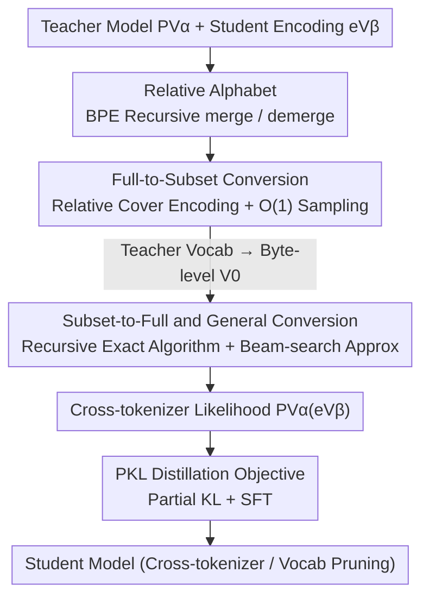

# Cross-Tokenizer Likelihood Scoring Algorithms for Language Model Distillation

**Conference**: ICLR2026  
**OpenReview**: [https://openreview.net/forum?id=hD69qj15Os](https://openreview.net/forum?id=hD69qj15Os)  
**Code**: https://github.com/truongbuu/cross-tokenizer-scoring  
**Area**: Model Compression / Knowledge Distillation  
**Keywords**: Cross-tokenizer distillation, BPE, Likelihood scoring, Vocabulary pruning, Relative alphabet

## TL;DR
This paper explores the recursive merge structure of BPE tokenization and proposes a "relative alphabet" framework. This allows teacher models to calculate exact sequence likelihoods on student vocabularies that differ from their own, enabling the direct application of classic KL distillation to cross-tokenizer scenarios. It achieves a 2%+ improvement over SOTA on GSM8K distillation and saves 12% VRAM during vocabulary pruning while simultaneously improving performance.

## Background & Motivation
**Background**: Advanced training paradigms such as distillation, RLHF, and preference optimization rely on calculating the "next-token likelihood ratio between two models." The classic approach (Hinton distillation) aligns student models with the teacher's next-token distribution, providing richer and more sample-efficient training signals compared to SFT using hard labels.

**Limitations of Prior Work**: Calculating likelihood ratios requires two models to share the same probability space, i.e., the same vocabulary. In practice, teachers and students often use different tokenizers—a typical scenario is edge deployment where vocabularies are reduced to save memory, leading the student to use a smaller or even byte-level vocabulary. Once vocabularies are misaligned, the target for minimizing divergence between next-token distributions becomes unclear.

**Key Challenge**: Misalignment occurs not only in the output space but is also hidden in the input space—this is **tokenization bias**. For example, using Llama3 as a teacher, the input `111+11=12` is segmented into `[111,+,11,=,12]`. Since `122` is a single token in Llama3, the sequence `[12,2]` can never appear under valid encoding; the teacher will thus never treat `2` as a valid next token. However, if the student uses a byte-level tokenizer, it may assume `2` is a valid continuation, resulting in incorrect training signals and degraded performance. In other words, naively multiplying teacher token probabilities over student encodings results in non-zero probabilities for encodings that are actually non-canonical (invalid), whereas the true probability should be 0.

**Deficits of Existing Solutions**: Current cross-tokenizer distillation either adds auxiliary losses like Wasserstein or Optimal Transport to the logit space (ULD, DSKD) or relies on sequence alignment to approximate marginal probabilities (ALM). These components introduce extra hyperparameters, deviate from the simplicity of KL minimization, and rely on either strong assumptions about logit representations or heuristic approximations.

**Goal**: To "re-align" the teacher scoring model to the student vocabulary without adding auxiliary components or modifying the KL framework, restoring the classic next-token divergence minimization/likelihood ratio problem. The authors refer to this process as **cross-tokenizer scoring (conversion)**.

**Key Insight**: Re-examine BPE from a stochastic analysis perspective. The authors discovered an implicit recursive structure hidden within the widely deployed BPE algorithm—any "subset vocabulary" can be treated as an intermediate alphabet (**relative alphabet**) of the full vocabulary. Following this structure, merge/demerge operations make "converting likelihoods between different vocabularies" computable.

**Core Idea**: Use the BPE merge/demerge recursive structure to decompose "scoring for teacher $P_{V_\alpha}$ on vocabulary $V_\beta$" into two steps: first, converting the teacher into a byte-level model (Full-to-Subset), and then recursively constructing from the byte-level to the target vocabulary (Subset-to-Full). This allows for the calculation of lossless likelihoods for any pair of BPE vocabularies sharing a UTF-8 alphabet.

## Method

### Overall Architecture
The core problem the method solves is: given a language model $P_{V_\alpha}$ trained on a fixed vocabulary $V_\alpha$, and a sequence $\vec{e}_{V_\beta}$ encoded with another vocabulary $V_\beta$, how to calculate $P_{V_\alpha}(\vec{e}_{V_\beta})$, representing the probability the model assigns to this heterogeneous encoding prefix. Formally: auto-regressively sample from $P_{V_\alpha}$ until EOS to get a token sequence, decode it into a byte string $\vec{x}$, re-encode it with $V_\beta$, and determine the probability of it having $\vec{e}_{V_\beta}$ as a prefix.

The overall conversion is split into two directions and combined for the general case: ① **Full-to-Subset**—converting a model trained on a full vocabulary $V_M$ to an equivalent model on a subset vocabulary $V_{M'}$ (specifically byte-level $V_0$); ② **Subset-to-Full**—recursively constructing the byte-level model up to the target vocabulary $V_\beta$. Their composition ($V_\alpha \to V_0 \to V_\beta$) allows conversion between any two BPE vocabularies sharing a base alphabet. Once likelihoods are calculated, a Partial KL (PKL) distillation objective is applied to use these cross-tokenizer scores for training the student.

### Key Designs

**1. Relative Alphabet: Treating "Subset Vocabularies" as Intermediate Alphabets of the Full Vocab**

To convert likelihoods between different vocabularies, the first step is a language that can "traverse between vocabularies." A BPE vocabulary $V_M = \{a_0,\dots,a_{|A|}, t_1,\dots,t_M\}$ is constructed from a base alphabet $A$ by gradually adding merged tokens. Every $t_i = t_i^{\text{left}} \cdot t_i^{\text{right}}$ is formed by two earlier tokens. The authors observe: a truncated vocabulary $V_{M'} \prec V_M$ obtained by taking the first $M'$ merged tokens can be treated as a "relative alphabet" for $V_M$.

In this view, $\text{encode}(\cdot)$ is a sequence of merge operations, and $\text{decode}(\cdot)$ is a sequence of demerge operations. Switching from $V_{M'}$ encoding to $V_M$ encoding does not require reverting to string $s$, but rather continuing the merges: $\text{encode}_{M'\to M}(\vec{e}_{V_{M'}}) = \text{merge}_M \circ \cdots \circ \text{merge}_{M'+1}(\vec{e}_{V_{M'}})$; the reverse applies demerges. This abstraction is the foundation of the algorithms—it unifies "cross-tokenizer likelihood conversion" as "stepping forward/backward on the merge chain." Unlike previous work (Phan et al., 2025) which only converts from full vocab to byte-level $A$, this work generalizes it to any pair of subset vocabularies.

**2. Full-to-Subset Conversion: Exact Marginalization with Relative Cover Encoding, O(1) Sampling**

With the relative alphabet, the first type of conversion reduces a model $P_{V_M}$ on a full vocabulary to a subset $V_{M'}$ (bottoming at byte-level $V_0$). The difficulty is that a valid encoding $\vec{e}_{V_{M'}}$ in $V_{M'}$ might correspond to multiple "coarser" encodings in $V_M$ that "cover" it. The authors generalize prior cover encoding into **relative cover encoding** $\text{cover}_{M'\to M}(\vec{e}_{V_{M'}})$, defined as the set of all valid $V_M$ encodings whose last token exactly "covers" some point after $\vec{e}_{V_{M'}}$. Lemma 1 then provides exact marginalization:

$$P(\vec{e}_{V_{M'}}) = \sum_{\vec{e}_{V_M} \in \mathcal{C}} P(\vec{e}_{V_M}), \quad \mathcal{C} = \text{cover}_{M'\to M}(\vec{e}_{V_{M'}}).$$

This set can be enumerated in $O(|\vec{e}_{V_{M'}}|)$ linear time using the valid encoding condition $\vec{e}=\text{encode}(\text{decode}(\vec{e}))$. Crucially, since it shares the same marginalization structure as byte-level conversion, next-token sampling can be achieved with **$O(1)$ model forward passes** (rather than growing linearly with candidates). This directly serves "vocabulary pruning"—shrinking the LM head of large-vocab models to reduce VRAM while maintaining an exact distribution over the pruned vocabulary.

**3. Subset-to-Full and General Conversion: Recursive Exact Algorithm + Beam-search Approximation**

The reverse direction (subset to full, e.g., byte-level $V_0 \to$ target $V_\beta$) is more difficult: a naive approach would sum over "all infinitely long strings starting with the target prefix encoding," which lacks a prior stopping bound. The authors again utilize the sequential decoding structure to provide a **finite-time exact recursion**. The core is converting step-by-step through merges: given encoding $\vec{e}_{V_{M'+1}}$ on $V_{M'+1}$, check if its last token equals the left half of the next merged token $t_{M'+1}^{\text{left}}$:

- If $\vec{e}_{V_{M'+1}}[-1] \neq t_{M'+1}^{\text{left}}$, the cover set size is 1, thus $P_{M'}(\vec{e}_{V_{M'+1}}) = P_{M'}(\vec{e}_{V_{M'}})$ directly;
- If equal, then besides itself, $t_{M'+1}$ could also cover it, requiring a difference: $P_{M'}(\vec{e}_{V_{M'+1}}) = P_{M'}(\vec{e}_{V_{M'}}) - P_{M'}(\vec{e}_{V_{M'}} \cdot t_{M'+1}^{\text{right}})$.

Following this recursion (Algorithm 1) guarantees termination in finite steps, but the worst-case cost is $O(\exp(M-M'))$ evaluations of $P_{M'}$, which is infeasible for large vocabularies. The solution: since trained LMs concentrate probability mass on few candidates and most leaf encodings are semantically/syntactically unreasonable with near-zero probability, **beam search pruning** is used to keep only high-probability continuations, combined with pre-tokenization pattern filtering. Empirically, one next-token evaluation expands ~6 beams with an average length of 10, taking ~0.5s; the RMSE between the approximation and ground truth is only 0.015. The general case simply composes "Teacher $V_\alpha \to$ byte-level $V_0$" (Design 2, exact $O(1)$) and "$V_0 \to$ target $V_\beta$" (this design, recursive + approx).

**4. PKL Distillation Objective: Feeding Cross-Tokenizer Scores to Students via Partial KL**

How are cross-tokenizer likelihoods used for distillation? Since beam search only yields probabilities for a few (1–5) tokens (ground-truth, student top-1, plus some beam candidates), calculating a full forward KL is impossible. The authors use **Partial KL (PKL)**: aligning probabilities only on these 1–5 available tokens, then mixing with SFT terms $(1-\omega)$ using weight $\omega$, for a total loss $\omega \cdot \text{PKL} + (1-\omega)\cdot \text{SFT}$. To save training compute, teacher inference is performed offline to store soft labels. This objective **strictly generalizes ALM**: when ALM chunk size is 1 and (near) perfect de-biasing is achieved, this method reduces to ALM, but this method is stronger as it utilizes probability information from non-ground-truth tokens.

### Loss & Training
The distillation loss is $\mathcal{L} = \omega \cdot \text{PKL} + (1-\omega)\cdot \text{SFT}$. For GSM8K cross-tokenizer distillation, $\omega \in \{0.0, 0.8, 1.0\}$ (pure SFT / validation-selected mix / pure PKL), using end-to-end training (no LoRA), batch size 64, and learning rate $5\times 10^{-6}$. For vocabulary pruning, a warm-up epoch on Alpaca with Qwen2.5-7B as the teacher is followed by two epochs on GSM8K using Qwen2.5-Math-7B (task-specific teachers like Qwen2.5-Coder-7B are used for coding tasks), with $\omega=0.8$.

## Key Experimental Results

### Main Results
GSM8K Cross-tokenizer Distillation: Teacher Qwen2.5-Math-7B-Instruct, Student Gemma-2-2B-Instruct (selected for nearly non-overlapping vocabularies).

| Method | GSM8K 5-shot Acc |
|------|------|
| Gemma2-2B-Instruct (Student baseline) | 52.3 |
| Qwen2.5-Math-7B-Instruct (Teacher) | 88.4 |
| SFT | 47.9 |
| ULD | 47.1 |
| DSKD | 51.5 |
| ALM (Prev. SOTA) | 53.2 |
| ALM + SFT | 53.5 |
| **PKL (Ours)** | **54.6** |
| **SFT + PKL (Ours)** | **55.6** |

Ours (SFT+PKL) outperforms the previous SOTA ALM+SFT by 2.1 points and pure SFT by nearly 8 points.

### Ablation Study
Vocabulary Pruning (Qwen2.5-1.5B-Instruct, original vocab 151,643, truncated to first 16k/32k/64k merges). The table below shows the best configuration (Ours FKL w/ SFT):

| Vocab | GSM8K 4-shot | HumanEval | MBPP | VRAM Saved |
|-------|------|------|------|------|
| 16k | 60.4 | 46.4 | 41.4 | 13.5% |
| 32k | 63.0 | 47.6 | 41.4 | 12.0% |
| 64k | 62.8 | 51.2 | 46.4 | 9% |
| Full Vocab | 63.2 | 52.4 | 43.4 | 0% |

| Configuration | Key Finding | Description |
|------|---------|------|
| 32k FKL+SFT | GSM8K gain ~5% over original, ~9% over SFT | Pruning half the vocab actually improves performance |
| Beam-search Approx | RMSE = 0.015 | ~6 beams, avg len 10, ~0.5s/token |
| Pure SFT (ω=0) | Generally weaker than FKL | Lacks the alignment signal from teacher soft labels |

### Key Findings
- **Pruning vocabulary can improve performance**: The 32k variant saves ~12% VRAM while achieving higher GSM8K scores than the original full-vocab model—distillation allows the student to reallocate probability mass on the smaller vocab, where the alignment objective itself brings gains.
- **Strictly generalizes ALM**: Reduces to ALM under chunk size=1 but is consistently stronger by using non-ground-truth token probabilities.
- **Approximation is nearly lossless**: The RMSE of 0.015 between beam-search and exact byte-level values validates the assumption that high-probability continuations dominate.

## Highlights & Insights
- **Transformation of misalignment into a structural problem**: The authors avoid heuristics like logit alignment and derive exact likelihoods from the BPE merge/demerge structure, returning to a clean KL framework—a "first-principles" solution with fewer hyperparameters.
- **Relative alphabet as a reusable abstraction**: Formalizing "subset vocab = intermediate alphabet" allows any cross-BPE vocabulary conversion to be described through merge chains. This is naturally applicable to cross-tokenizer preference optimization and tokenization adaptation.
- **Combining exactness and approximation**: The subset case provides exact $O(1)$ sampling (ideal for pruning), while the general case offers a "theoretical lossless recursion + practical beam-search approx," addressing both rigour and usability.

## Limitations & Future Work
- **High overhead for general cases**: The Subset-to-Full exact recursion is worst-case $O(\exp(M-M'))$, requiring beam-search pruning for practicality; one next-token evaluation takes ~0.5s and only yields specific token probabilities rather than a full distribution.
- **Dependency on canonical encoding**: Assumes the LM always outputs canonical encodings and that vocabularies share the same UTF-8 base—not directly applicable to non-BPE tokenizers or different base alphabets.
- **Limited token probabilities in distillation**: Due to beam search, PKL only aligns on 1–5 tokens, which theoretically carries less information than a full forward KL.

## Related Work & Insights
- **vs. Phan et al. (2025)**: They can only convert full-vocab LMs to byte-level models ($V \to A$); this work generalizes cover encoding to relative cover encoding, supporting any subset $V_i \preceq V_M$ and arbitrary BPE pairs.
- **vs. ULD / DSKD (Optimal Transport)**: These use Wasserstein/Optimal Transport in the logit space with strong assumptions; this work bypasses logits and calculates exact sequence likelihoods.
- **vs. ALM (Sequence Alignment)**: ALM uses heuristic sequence alignment for marginal probabilities; this work derives exact likelihoods and strictly generalizes ALM in the limit.

## Rating
- Novelty: ⭐⭐⭐⭐⭐ Deriving cross-tokenizer likelihoods as a structural problem from BPE is innovative and self-consistent.
- Experimental Thoroughness: ⭐⭐⭐⭐ covers distillation and pruning across tasks, though lacks validation on larger models/more teacher-student pairs.
- Writing Quality: ⭐⭐⭐⭐ Rigorous formalism with progressive examples, though high math density may be challenging for those unfamiliar with tokenization bias.
- Value: ⭐⭐⭐⭐⭐ High practical value for VRAM reduction in edge deployment and cross-tokenizer distillation.

<!-- RELATED:START -->

## Related Papers

- [\[NeurIPS 2025\] Universal Cross-Tokenizer Distillation via Approximate Likelihood Matching](../../NeurIPS2025/model_compression/universal_cross-tokenizer_distillation_via_approximate_likelihood_matching.md)
- [\[AAAI 2026\] CTPD: Cross Tokenizer Preference Distillation](../../AAAI2026/model_compression/ctpd_cross_tokenizer_preference_distillation.md)
- [\[ICLR 2026\] Boomerang Distillation Enables Zero-Shot Model Size Interpolation](boomerang_distillation_enables_zero-shot_model_size_interpolation.md)
- [\[ICLR 2026\] UniFlow: A Unified Pixel Flow Tokenizer for Visual Understanding and Generation](uniflow_a_unified_pixel_flow_tokenizer_for_visual_understanding_and_generation.md)
- [\[ICLR 2026\] Pedagogically-Inspired Data Synthesis for Language Model Knowledge Distillation](pedagogically-inspired_data_synthesis_for_language_model_knowledge_distillation.md)

<!-- RELATED:END -->
