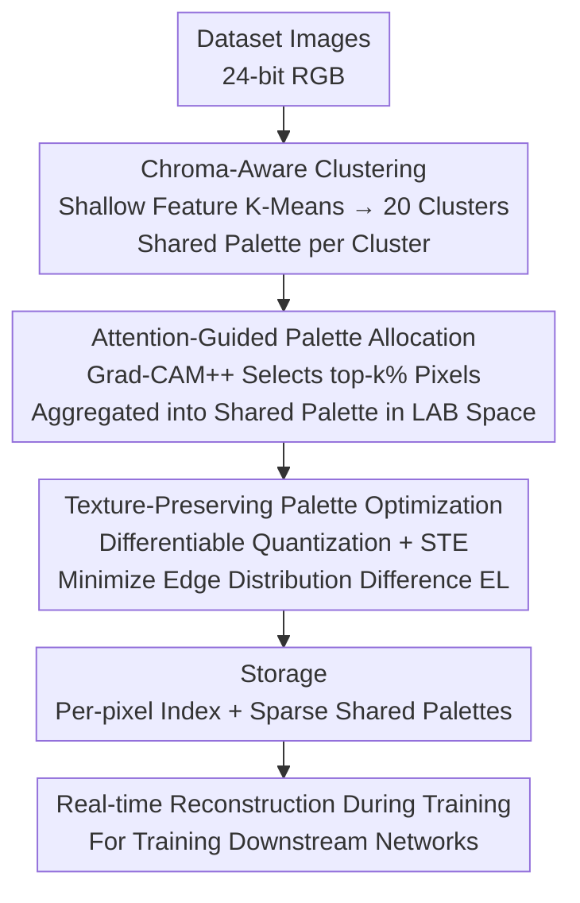

# Dataset Color Quantization: A Training-Oriented Framework for Dataset-Level Compression

**Conference**: ICLR2026  
**arXiv**: [2602.20650](https://arxiv.org/abs/2602.20650)  
**Code**: None  
**Area**: Model Compression  
**Keywords**: Dataset Compression, Color Quantization, Palette Sharing, Attention Guidance, Texture Preservation  

## TL;DR
The Dataset Color Quantization (DCQ) framework is proposed to reduce color redundancy at the dataset level through three mechanisms: chroma-aware clustering, attention-guided palette allocation, and texture-preserving optimization, achieving storage compression while maintaining training effectiveness.

## Background & Motivation

**Background & Limitations of Prior Work**: The storage requirements of large-scale image datasets challenge resource-constrained environments. Existing dataset compression methods (dataset pruning, distillation) reduce data volume by discarding samples but ignore **intra-image color redundancy**—the fact that many pixels share nearly identical colors (e.g., smooth regions like sky or walls). Existing Color Quantization (CQ) methods suffer from two major issues:

**Image-attribute based CQ** (e.g., K-Means): Lacks semantic guidance, leading to blurred semantic boundaries and uniform bit allocation for both foreground and background.

**Model-aware CQ** (e.g., ColorCNN): Maintains recognition accuracy but introduces abrupt texture/edge discontinuities. When ColorCNN quantizes CIFAR-10 to 4 colors, the pre-trained model achieves 77% inference accuracy, but training on this quantized data yields only 58%.

**Key Insight**: Existing methods are **inference-oriented** (optimizing recognition of quantized images by pre-trained models), whereas this work proposes **training-oriented** dataset color quantization for the first time.

## Method

### Overall Architecture
DCQ compresses color redundancy at the dataset level rather than per single image: it first clusters the entire dataset into several groups based on color distribution, allowing images in the same cluster to share a palette. Then, it uses attention maps to bias the limited color budget toward semantically critical regions. Finally, it uses differentiable quantization to optimize the palette to preserve texture edges. Ultimately, only the palette index per pixel and a small number of shared palettes need to be stored, with quantized images reconstructed in real-time during training. When quantizing from standard 24-bit RGB to $q$ bits, the palette size reduces to $2^q$ colors, with a compression rate $q_r = 1 - q/24$. For example, 2-bit quantization with only 4 colors achieves a 91.7% compression rate.

### Key Designs

**1. Chroma-Aware Clustering: Balancing Consistency and Fidelity via Palette Sharing**

If each image learns an individual palette, storage overhead is high and cross-image consistency is lacking; if the entire dataset shares one palette, it fails to accommodate diverse images. DCQ takes a middle ground: using shallow features $\psi_{\text{shallow}}(x)$ of a pre-trained model to perform K-Means clustering ($k=20$) on dataset images, where images in the same cluster share one palette. Shallow features are used because features become more semantic and lose visual color information as depth increases (intuition: $i \uparrow \Rightarrow \text{Sem}(\psi_i) \uparrow,\ \text{Vis}(\psi_i) \downarrow$), while color quantization focuses on color distribution patterns rather than category semantics. Ablations show that shallow feature clustering (79.90% at 1-bit) significantly outperforms label-based clustering (40.10%) or deep feature clustering (42.10%), with $k=20$ being the optimal balance point.

**2. Attention-Guided Palette Allocation: Investing the Color Budget in Foreground Critical Regions**

At extremely low bits, the number of colors is very limited. If the budget is distributed uniformly across background and foreground, critical objects may become unrecognizable. DCQ uses Grad-CAM++ to compute attention maps, retaining only the top $k_{Gra}\%$ pixels with the highest attention values for palette aggregation. This allows semantically critical regions to obtain more color representation while smooth backgrounds are coarsely quantized. Clustering is performed in the LAB color space rather than RGB, as Euclidean distance in LAB better aligns with human perceptual similarity, resulting in more visually continuous color allocation.

**3. Texture-Preserving Palette Optimization: Suppressing Quantization Artifacts via Differentiable Quantization**

Naive color quantization produces color patches in smooth areas and introduces abrupt texture discontinuities at object edges, which causes training collapse in ColorCNN. DCQ draws inspiration from style transfer, treating color quantization as a differentiable operation with Straight-Through Estimators (STE) to backpropagate gradients, enabling direct optimization of the palette to align textures. The objective is to minimize the edge distribution difference between the original and quantized images—using the Sobel operator $G(\cdot)$ to extract edges from each channel and calculating $EL = \sum_{i=1}^{3} w_i \cdot \text{MSE}\big(G(I_{\text{orig}}^i), G(I_{\text{quant}}^i)\big)$. Ablation studies show this term provides a 1–3 percentage point boost, which is key for DCQ to succeed in training scenarios compared to inference-oriented CQ.

## Key Experimental Results

### Main Results

| Dataset | Method | 2-bit (4 colors) | 1-bit (2 colors) |
|--------|------|-----------|-----------|
| CIFAR-10 | Random (Pruning) | 77.04% | 70.08% |
| CIFAR-10 | TDDS | 77.32% | 72.46% |
| CIFAR-10 | **DCQ (Ours)** | **89.15%** | **79.90%** |
| CIFAR-100 | Random | 39.71% | 36.68% |
| CIFAR-100 | **DCQ (Ours)** | **57.69%** | **38.44%** |
| ImageNet-1K | **DCQ (Ours)** | **49.69%** | **35.95%** |

- Full precision accuracy on CIFAR-10 is 95.45%; DCQ 2-bit reaches 89.15% (only 6.3 point drop), whereas ColorCNN training after quantization is only ~58%.
- Ablation: Shallow feature clustering (79.90% @ 1-bit) is significantly better than label clustering (40.10%), random clustering (28.44%), or deep features (42.10%).
- Cluster count $k=20$ is the optimal balance point.
- At 2-bit on CIFAR-100, DCQ (57.69%) outperforms the strongest pruning method TDDS (32.15%) by **25.5 percentage points**.
- On ImageNet-1K at 5-bit, DCQ (66.99%) is close to full precision (73.54%), with only a 6.5 point drop.
- Comparison with inference-oriented CQ: MedianCut and OCTree perform significantly worse than DCQ in training scenarios.
- Texture-preserving optimization contributes a 1-3 percentage point improvement (see Appendix C.1 for ablation).

## Highlights & Insights
1.  **Novel Problem Definition**: Explicitly proposes the training-oriented dataset-level color quantization problem for the first time, distinguishing it from traditional inference-oriented CQ.
2.  **Orthogonal to Dataset Pruning**: DCQ reduces storage per image while pruning reduces the number of images; the two can be used cumulatively.
3.  **Clever Shared Palette Design**: Using the same palette for images in the same cluster reduces storage (only indices needed) and improves cross-image consistency.
4.  **Significant Advantage in Aggressive Compression**: Especially at 1-2 bit extremely low color counts, DCQ far surpasses dataset pruning methods.

## Limitations & Future Work
- Dependency on pre-trained models for feature extraction and attention maps (Grad-CAM++), increasing preprocessing costs.
- Training effectiveness verified only on ResNet-18/34; adaptation to modern architectures like ViT has not been tested.
- Accuracy drop remains significant at extremely low bits (1-bit) (CIFAR-10: 79.90% vs 95.45%).
- Shared palettes might reduce quantization quality for datasets with high inter-class variance.
- Lack of fair storage-accuracy comparison with recent dataset distillation methods (e.g., D4M, RDED).
- LAB color space conversion adds computational steps; scalability for ultra-large-scale datasets requires verification.
- Selection of $k_{Gra}\%$ in attention guidance requires ablation tuning, and optimal values may vary across datasets.

## Related Work & Insights
- Compared to model-aware CQ like ColorCNN/CQFormer, DCQ is optimized for training rather than inference for the first time.
- Directly compared with dataset pruning (EL2N, Forgetting, CCS, TDDS) at the same compression rates, DCQ shows a clear advantage at high compression ratios.
- The idea of chroma-aware clustering can be extended to the quantization of other data features (e.g., frequency spectrum, texture complexity).
- DCQ is orthogonal to dataset pruning/distillation methods and can be layered: use pruning to reduce sample count, then DCQ to reduce per-sample storage.
- The effective design of using shallow features for image clustering provides a reference for other data preprocessing tasks.

## Rating
- Novelty: ⭐⭐⭐⭐ (Training-oriented dataset color quantization is a new direction)
- Experimental Thoroughness: ⭐⭐⭐⭐ (4 datasets, multiple baselines, extensive ablations)
- Writing Quality: ⭐⭐⭐⭐ (Clear motivation, detailed methodology)
- Value: ⭐⭐⭐⭐ (Opens a new dimension for dataset compression)
- Overall Recommendation: ⭐⭐⭐⭐

<!-- RELATED:START -->

## Related Papers

- [\[ICLR 2026\] Dataset Distillation as Pushforward Optimal Quantization](dataset_distillation_as_pushforward_optimal_quantization.md)
- [\[AAAI 2026\] Post Training Quantization for Efficient Dataset Condensation](../../AAAI2026/model_compression/post_training_quantization_for_efficient_dataset_condensation.md)
- [\[AAAI 2026\] Rethinking Long-tailed Dataset Distillation: A Uni-Level Framework with Unbiased Recovery and Relabeling](../../AAAI2026/model_compression/rethinking_long-tailed_dataset_distillation_a_uni-level_framework_with_unbiased_.md)
- [\[ICLR 2026\] S2R-HDR: A Large-Scale Rendered Dataset for HDR Fusion](s2r-hdr_a_large-scale_rendered_dataset_for_hdr_fusion.md)
- [\[ICLR 2026\] Understanding Dataset Distillation via Spectral Filtering](understanding_dataset_distillation_via_spectral_filtering.md)

<!-- RELATED:END -->
