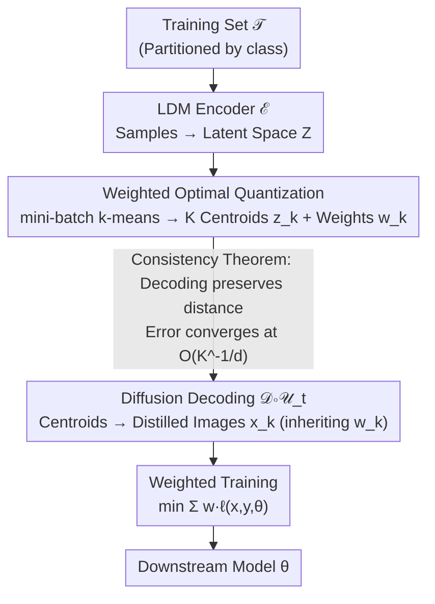

# Dataset Distillation as Pushforward Optimal Quantization

**Conference**: ICLR2026  
**arXiv**: [2501.07681](https://arxiv.org/abs/2501.07681)  
**Code**: None  
**Area**: Model Compression  
**Keywords**: Dataset Distillation, Optimal Quantization, Wasserstein distance, Diffusion models, Latent space clustering  

## TL;DR
Reformulates decoupled dataset distillation as an optimal quantization problem. It proves that latent space clustering using weights, combined with a diffusion prior, convergently approximates the true data distribution. The proposed DDOQ algorithm outperforms baselines like D4M on ImageNet-1K with minimal additional computational overhead.

## Background & Motivation

**Background**: Dataset Distillation (DD) aims to find small synthetic training sets such that models trained on them achieve performance close to models trained on the complete dataset. Early bi-level optimization methods suffer from high computational complexity and dependency on model architecture. Decoupled methods (e.g., SRe2L, D4M) significantly improve efficiency by matching data distributions and using generative techniques to bypass pixel-space optimization.

**Limitations of Prior Work**: Although decoupled methods are efficient, they lack theoretical guarantees—no prior work has theoretically proven whether distilled datasets can reasonably approximate the original data distribution. The entire paradigm operates more like an "empirical success" rather than being "provably correct."

**Key Insight**: Methods like D4M perform $k$-means clustering in latent space followed by decoding, which essentially solves for the **Wasserstein barycenter** (using uniform weights). Classic **optimal quantization** theory suggests that by assigning automatically learned weights to each centroid while keeping the number of centroids fixed, the Wasserstein distance to the true distribution can be further reduced. This upgrade from "barycenter → weighted quantization" is the entry point of this work.

## Method

### Overall Architecture
DDOQ (Dataset Distillation by Optimal Quantization) reformulates decoupled distillation as an **optimal quantization** problem. The pipeline consists of four steps: first, use an LDM encoder to map training samples of each class to the latent space; second, perform **weighted clustering** in the latent space to obtain a set of quantization points (centroids + weights); third, use diffusion decoding to restore centroids into distilled images, letting images inherit weights from their centroids; finally, feed the "images + weights" together for downstream **weighted training**.

Compared to D4M, the process adds almost only the "automatically learned weights" step, upgrading the latent space approximation from a Wasserstein barycenter to weighted optimal quantization. Two theorems regarding consistency and convergence rates ensure that the benefits of "reducing distance in latent space" are transferred to the image space while maintaining distance properties and converging quantifiably with the number of quantization points—distinguishing DDOQ from previous purely empirical decoupled methods.

### Key Designs

**1. Weighted Optimal Quantization: Upgrading Uniform Clustering to Weighted Quantization**

Methods like D4M perform $k$-means for each class in the latent space and then decode, which essentially seeks the Wasserstein barycenter under uniform weights—meaning each centroid is treated equally, discarding the information that different regions have different sample densities. This paper points out that clustering is a special case of the classic **optimal quantization** problem. Optimal quantization theory shows that assigning a weight $w_k$ to each centroid (representing the measure of its Voronoi cell) can further reduce the Wasserstein-2 distance to the true distribution given a fixed number of centroids. Implementation-wise, mini-batch $k$-means (corresponding to the CLVQ competitive learning quantization algorithm) is run for each category to cluster sample encodings $Z=\mathcal{E}(\mathcal{T})$ into $K$ centroids $z_k^{(L)}$, and the proportion of samples falling into each cell is directly recorded as the weight $w_k^{(L)}$. Weights are produced naturally during clustering with almost no extra computation, making the distribution of quantization points significantly closer to the original data—the latent space $\mathcal{W}_2$ distance is reduced by an average of **15.7%** at IPC=10 and **16.1%** at IPC=50.

**2. Consistency and Convergence Rate: Proving Latent Approximation Transfers and Converges Quantifiably**

Approximating in latent space has an underlying premise—"if the latent space approximation is good, the decoding back to image space remains good"; otherwise, quantization gains would be lost during diffusion decoding. This paper addresses this through two mathematical results. The **Consistency Theorem** (Theorem 1) proves for two types of diffusion processes (VESDE / VPSDE) that if the distance between two latent space distributions is $\mathcal{W}_2(\mu_T,\nu_T)$, then after reverse diffusion to the image space, the difference in expectation for any Lipschitz function $f$ is linearly bounded by that distance:

$$\|\mathbb{E}_{\mu_\delta}[f]-\mathbb{E}_{\nu_\delta}[f]\| \leq C\cdot L\cdot \mathcal{W}_2(\mu_T,\nu_T)$$

where $L$ is the Lipschitz constant of $f$. This implies diffusion decoding is "distance-preserving," and the effort to reduce $\mathcal{W}_2$ in Design 1 is proportionally translated into a better approximation in the image space—providing theoretical support for the decoupled paradigm of operating in latent rather than pixel space. The **Convergence Rate Corollary** (Corollary 1) further characterizes the relationship between the number of quantization points $K$ and the error: as $K$ increases, the error converges at a rate of $\mathcal{O}(K^{-1/d})$ (where $d$ is the latent space dimension). This is the first result to provide a convergence rate for decoupled distillation, grounding the empirical phenomenon of "higher IPC leads to better performance" in a quantifiable rate; it also reveals an inherent limitation—the rate slows as dimension $d$ increases, requiring more quantization points for the same precision in high-dimensional latent spaces.

**3. Weighted Decoding and Training: Propagating Weights to the Downstream Model**

The gains of optimal quantization cannot be realized if weights learned during the quantization phase stop at the latent space. This paper propagates weights all the way to the downstream task: after obtaining weighted centroids, an LDM decoder combined with a diffusion process is used to generate distilled images $x_k^{(L)}=\mathcal{D}\circ\mathcal{U}_t(z_k^{(L)},\text{emb})$, where each image inherits the weight $w_k^{(L)}$ of its centroid. Downstream training no longer treats all distilled samples equally, but instead uses a weighted loss:

$$\min_\theta \sum_{(x,y,w)} w\cdot \ell(x,y,\theta)$$

This ensures that quantization points covering a larger measure receive higher weights during optimization. This allows the distribution information from the quantization phase to be fully transmitted to model training, serving as the final step in converting "weighted optimal quantization" into downstream accuracy.

## Key Experimental Results

**ImageNet-1K (UNet backbone, ResNet-18 evaluation)**:

### Main Results

| IPC | SRe2L | D4M | RDED | **DDOQ** |
|-----|-------|-----|------|----------|
| 10 | 21.3% | 27.9% | 42.0% | **33.1%** |
| 50 | 46.8% | 55.2% | 56.5% | **56.2%** |
| 100 | 52.8% | 59.3% | — | **60.1%** |
| 200 | 57.0% | 62.6% | — | **63.4%** |

- IPC 200 + ResNet-101: DDOQ 68.6% vs D4M 68.1%, representing a **30% error reduction** relative to the full-precision 69.8%.
- Cross-architecture generalization (IPC=50): DDOQ consistently outperforms D4M on CNN student models (e.g., MobileNet-V2: 52.1% vs 47.9%).

**DiT backbone (DDOQ-DiT)**:

### Ablation Study

| Dataset | IPC | Minimax-IGD | **DDOQ-DiT** |
|--------|-----|-------------|-------------|
| ImageNet-1K | 10 | 46.2% | **53.0%** |
| ImageWoof | 10 | 43.3% | **48.8%** |
| ImageNette | 10 | 65.3% | **68.2%** |

- A stronger DiT backbone improves ImageNet-1K IPC=10 accuracy from 33.1% to **53.0%** (+19.9 points).

**Cross-architecture Generalization Details (IPC=50, ResNet-18 teacher)**:
- ResNet-18 student: DDOQ 56.2% vs D4M 55.2%
- MobileNet-V2 student: DDOQ 52.1% vs D4M 47.9% (+4.2 points)
- EfficientNet-B0 student: DDOQ 58.0% vs D4M 55.4% (+2.6 points)
- Swin-T student: DDOQ 57.4% vs D4M 58.1% (slightly lower by 0.7 points)

**Wasserstein Distance Analysis**: After adding weights, the $\mathcal{W}_2$ distance between distilled latent points and encoded training data decreases by an average of 15.7% at IPC=10 and 16.1% at IPC=50, confirming that optimal quantization is superior to Wasserstein barycenters.

## Highlights & Insights
1. **Solid Theoretical Contribution**: Provides the first proof of consistency and convergence rates for decoupled distillation methods under a diffusion prior, filling a theoretical gap in the field.
2. **Extremely Simple Improvement**: Compared to D4M, it only adds automatically learned weights with almost no additional computation (weights are generated naturally during the $k$-means process).
3. **Optimal Quantization Perspective**: Reveals that clustering methods like $k$-means essentially solve optimal quantization problems, where weights are the measures of Voronoi cells.
4. **Theoretical Guarantee for Diffusion Models**: Theorem 1 proves that diffusion generation maintains distribution proximity, providing a theoretical basis for operating in latent space rather than pixel space.

## Limitations & Future Work
- In low IPC settings (e.g., IPC=10), it still lags behind the patch-based method of RDED (RDED 42.0% vs DDOQ 33.1% with UNet backbone).
- DDOQ is slightly inferior to D4M on Transformer student architectures like Swin-T (57.4% vs 58.1%), which may require more fine-grained hyperparameter tuning.
- The convergence rate $\mathcal{O}(K^{-1/d})$ slows as the latent dimension $d$ increases, potentially weakening the effect in high-dimensional scenarios.
- Relies on the quality of pre-trained LDM/DiT; the fidelity of generated images is limited by the capability of the base model.
- Soft labels rely on an extra pre-trained classifier (e.g., ResNet-18), and maximum performance is capped by the accuracy of that classifier (69.8%).
- The possibility of combining with diffusion guidance methods (e.g., IGD) has not been explored; the two could be complementary.

## Related Work & Insights
- Direct comparison with D4M: Consistency improvements gained simply by adding weights indicate that the upgrade from Wasserstein barycenter to optimal quantization is key.
- Comparison with RDED: RDED is stronger at low IPC but not scalable; DDOQ is superior at high IPC and has constant memory requirements.
- Optimal quantization theory can be extended to other scenarios requiring data approximation, such as data summarization in federated learning.

## Rating
- Novelty: ⭐⭐⭐⭐⭐ (Optimal quantization perspective + consistency proof, outstanding theoretical contribution)
- Experimental Thoroughness: ⭐⭐⭐⭐ (ImageNet-1K with multiple IPCs and architectures, but lacks more datasets)
- Writing Quality: ⭐⭐⭐⭐⭐ (Rigorous theoretical derivation, clear algorithm description)
- Value: ⭐⭐⭐⭐⭐ (Provides a theoretical foundation for dataset distillation, simple and efficient method)

<!-- RELATED:START -->

## Related Papers

- [\[NeurIPS 2025\] Optimizing Distributional Geometry Alignment with Optimal Transport for Generative Dataset Distillation](../../NeurIPS2025/model_compression/optimizing_distributional_geometry_alignment_with_optimal_transport_for_generati.md)
- [\[ICLR 2026\] Dataset Color Quantization: A Training-Oriented Framework for Dataset-Level Compression](dataset_color_quantization_a_training-oriented_framework_for_dataset-level_compr.md)
- [\[ICLR 2026\] Compute-Optimal Quantization-Aware Training](compute-optimal_quantization-aware_training.md)
- [\[CVPR 2026\] Mitigating The Distribution Shift of Diffusion-based Dataset Distillation](../../CVPR2026/model_compression/mitigating_the_distribution_shift_of_diffusion-based_dataset_distillation.md)
- [\[CVPR 2026\] IMS3: Breaking Distributional Aggregation in Diffusion-Based Dataset Distillation](../../CVPR2026/model_compression/ims3_breaking_distributional_aggregation_in_diffusion-based_dataset_distillation.md)

<!-- RELATED:END -->
