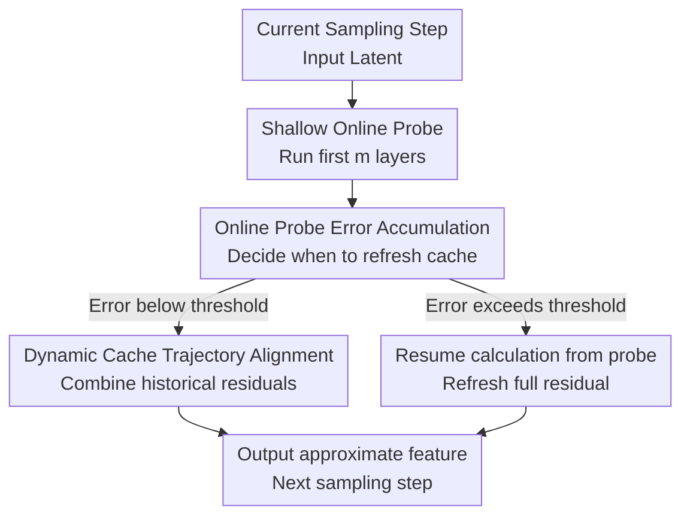

# DiCache: Let Diffusion Model Determine Its Own Cache

**Conference**: ICLR 2026  
**OpenReview**: [https://openreview.net/forum?id=kflYZjGumW](https://openreview.net/forum?id=kflYZjGumW)  
**Paper**: [Project Page](https://bujiazi.github.io/dicache.github.io/)  
**Code**: https://github.com/Bujiazi/DiCache  
**Area**: Model Compression / Diffusion Model Acceleration  
**Keywords**: Diffusion Model Caching, DiT Inference Acceleration, Training-free Acceleration, Online Probe, Feature Reuse  

## TL;DR
DiCache proposes a training-free adaptive caching strategy for diffusion models. It allows DiT to use shallow online probes during inference to determine when to reuse cache and how to combine historical caches. It improves speed while maintaining higher fidelity relative to the original model across WAN 2.1, HunyuanVideo, and Flux.

## Background & Motivation
**Background**: Diffusion models, particularly those using Diffusion Transformer (DiT) as the backbone for image and video generation, have become the mainstream approach for high-quality visual generation. As models become deeper, parameters increase, and video frames get longer, the cost of running a full DiT pass at each sampling step becomes prohibitively high. Training-based acceleration requires additional data and costs, while routes like solvers, distillation, sparse attention, and quantization have specific trade-offs. Caching-based acceleration has become an active research area due to its training-free nature and lightweight deployment.

**Limitations of Prior Work**: Caching methods essentially reuse intermediate features or residuals between adjacent sampling steps, but they must address two questions: first, when can full computation be safely skipped; and second, how should the cache be used when skipping. Existing methods often use fixed intervals, offline-fitted empirical functions, dataset-level priors, or manual rules based on Taylor expansion. These rules might work on average but fall short because diffusion sampling is highly dynamic: feature variations differ across prompts, random seeds, models, and time intervals. Uniform empirical laws easily lead to over-reuse or under-reuse for individual samples.

**Key Challenge**: The ideal caching decision should be based on the model's output change for the current sample at the current step, specifically the difference between full model outputs $y_t$ and $y_{t+1}$. However, if the full model must be run to determine if it can be skipped, the cache loses its purpose. The contradiction is: can reliable dynamic signals be obtained at a very low cost to allow the model to perceive "whether to reuse now" during runtime.

**Goal**: The authors decompose the problem into two layers. The first is "when to cache": using a cheap online metric to estimate caching error for sample-customized scheduling. The second is "how to use cache": when reusing, instead of mechanically taking the latest cache, utilize multi-step historical caches to more accurately approximate the current residual.

**Key Insight**: A key observation comes from the internal feature trajectories of DiT. Within the same sampling process, the trend of shallow feature differences is highly correlated with that of deep/final output differences. Moreover, residual trajectories across different layers exhibit similar shapes. This implies that the first few shallow layers serve not just as "preprocessing" but also as online probes for diffusion dynamics, providing real-time feedback for caching strategies with minimal additional computation.

**Core Idea**: Replace offline empirical rules with shallow online probes. This allows the diffusion model to perceive its own feature changes at each sampling step before deciding whether to reuse the cache, using the probe's trajectory to guide the dynamic alignment of multi-step caches.

## Method

### Overall Architecture
DiCache is a plug-and-play, training-free caching acceleration framework for DiT. It does not modify model weights or require fitting additional predictors for specific datasets. In each sampling step, it first runs the first $m$ shallow DiT blocks to obtain a probe feature. This probe serves two decisions: estimating cumulative caching error to decide when to refresh, and using the probe residual's trajectory to estimate how the current full residual should be composed of historical caches.

In terms of output, DiCache caches the model residual $r_t = y_t - x_t$ rather than attention matrices. If reuse is selected, it approximates the full output as $y_t = x_t + r_t$. If cumulative error exceeds a threshold, it continues computation from the shallow probe through the remaining deep layers to refresh the cache, ensuring the probe cost is not wasted on full-computation steps.

### Key Designs
**1. Shallow Online Probe: Estimating expensive output changes with cheap shallow differences**

Caching scheduling ideally requires knowing the relative change in the full model output of adjacent steps. The paper defines the ideal caching error as $\epsilon_{t,t+1}=L1_{rel}(y_t,y_{t+1})=\frac{\lVert y_t-y_{t+1}\rVert_1}{\lVert y_{t+1}\rVert_1}$, where $y_t$ is the full DiT output. A smaller value indicates higher similarity, making reuse safer.

Since the full $y_t$ is expensive, DiCache observes that the adjacent step difference of shallow output $y_t^m$, $L1_{rel}(y_t^m,y_{t+1}^m)$, is highly correlated with the full output difference. Statistics show that even with a probe depth $m \in [1,3]$, the Spearman correlation coefficient is close to $0.8$. Thus, DiCache runs only the first $m$ layers per step and uses $\hat{\epsilon}_{t,t+1}=L1_{rel}(y_t^m,y_{t+1}^m)$ as a real-time error metric. This is more discriminative than latent differences (which often change monotonically) and more robust than offline functions since it is sample-specific.

**2. Cumulative Error Scheduling: Runtime sample-level caching decisions**

Instead of fixed intervals, DiCache maintains a cumulative error $\Sigma_{error}$. After a full computation, each subsequent step runs a shallow probe and adds $\hat{\epsilon}_{t,t+1}$ to the accumulator. As long as $\Sigma_{error} \le \delta$, cache reuse continues. Once it exceeds the threshold $\delta$, computation resumes from the $m$-th layer to refresh $y_t$ and residual $R=y_t-x_t$, and $\Sigma_{error}$ is reset.

This allows cache intervals to extend during stable segments and shorten during drastic changes. The threshold $\delta$ controls the quality-speed trade-off: smaller $\delta$ means more frequent recalculation and higher quality; larger $\delta$ brings higher acceleration but potential bias. The authors use $\delta=0.2, 0.1, 0.4$ for WAN 2.1, HunyuanVideo, and Flux respectively, with $m=1$.

**3. Dynamic Cache Trajectory Alignment: Guiding cache combination with probe residuals**

Directly using the most recent residual during reuse creates a zero-order approximation that flattens feature motion. DiCache observes that shallow residuals $r_t^m = y_t^m - x_t$ and full residuals $r_t = y_t - x_t$ share similar trajectory shapes.

Selecting two recent full computation steps $t_\alpha$ and $t_\beta$ with cached residuals $r_{t_\alpha}$ and $r_{t_\beta}$, the current residual is modeled as a first-order trajectory: $r_t = r_{t_\beta} + \gamma_t(r_{t_\alpha} - r_{t_\beta})$. The parameter $\gamma_t$ is estimated in the shallow space: $\hat{\gamma}_t = \frac{L1_{rel}(r_t^m, r_{t_\beta}^m)}{L1_{rel}(r_{t_\alpha}^m, r_{t_\beta}^m)}$. This Dynamic Cache Trajectory Alignment (DCTA) allows the cache combination to adapt to the current sample's trajectory, better preserving identity and motion details compared to manual Taylor rules.

**4. Resumption Mechanism: Making probe costs reusable**

When a step requires full recalculation, the model does not restart from layer 1. Instead, it resumes from the already computed $y_t^m$ and processes layers $m+1$ to $M$. This ensures the probe is an integral part of the forward pass rather than overhead during refresh steps. 

This mechanism is crucial for efficiency. Reports show probe costs are small: $4\%$ of total inference for Flux, $5\%$ for WAN 2.1-1.3B, and $2\%$ for HunyuanVideo (where $m=1$).

### Mechanism Example
Take a 50-step video generation in HunyuanVideo. Step 1 computes fully and caches residual $R$. From step 2, the model runs only the 1st DiT block to get $y_t^1$, calculates the relative difference, and adds it to $\Sigma_{error}$. 

If the motion is stable (e.g., slow background pan), the probe difference stays low, and $\Sigma_{error}$ may not exceed $\delta=0.1$ for several steps. During these steps, the full DiT is skipped, and historical residuals are combined via DCTA. When a major movement or scene cut occurs, the probe difference spikes, $\Sigma_{error}$ crosses the threshold, and DiCache resumes full computation to refresh the cache.

## Key Experimental Results

### Main Results
Verified on WAN 2.1-1.3B, HunyuanVideo, and Flux.1.0-dev. Metrics include LPIPS, SSIM, PSNR (relative to vanilla), speedup, and latency.

| Model | Method | LPIPS↓ | SSIM↑ | PSNR↑ | Speedup↑ | Latency↓ |
|------|------|--------|-------|-------|----------|----------|
| WAN 2.1 | TeaCache-fast | 0.2161 | 0.8226 | 20.97 | 2.20× | 87.58s |
| WAN 2.1 | EasyCache | 0.2013 | 0.8562 | 24.80 | 2.21× | 86.96s |
| WAN 2.1 | DiCache | 0.1734 | 0.8885 | 26.45 | 2.45× | 78.42s |
| HunyuanVideo | TeaCache-fast | 0.2898 | 0.8015 | 22.01 | 2.20× | 538.49s |
| HunyuanVideo | EasyCache | 0.1558 | 0.9270 | 30.71 | 2.12× | 558.71s |
| HunyuanVideo | DiCache | 0.1492 | 0.9396 | 32.79 | 2.34× | 507.24s |
| Flux | TaylorSeer | 0.4709 | 0.6721 | 16.63 | 3.13× | 4.83s |
| Flux | EasyCache | 0.3049 | 0.7527 | 19.75 | 2.49× | 6.06s |
| Flux | DiCache | 0.2704 | 0.8211 | 22.39 | 3.22× | 4.69s |

DiCache consistently outperforms TeaCache-fast and EasyCache in both speed and fidelity (LPIPS/SSIM/PSNR). On Flux, TaylorSeer shows high deviation from vanilla results, while DiCache maintains 3.22x speedup with significantly better fidelity.

### Ablation Study
| Configuration | LPIPS↓ | SSIM↑ | PSNR↑ | Speedup↑ | Description |
|------|--------|-------|-------|----------|------|
| Probe depth $m=5$ | 0.1367 | 0.9495 | 33.47 | 2.10× | Highest quality, slower speed |
| Probe depth $m=3$ | 0.1397 | 0.9472 | 33.30 | 2.20× | Mid quality and speed |
| Probe depth $m=1$ | 0.1492 | 0.9396 | 32.79 | 2.34× | Balanced choice for main results |
| Threshold $\delta=0.05$ | 0.1047 | 0.9584 | 35.45 | 1.76× | Conservative, near vanilla |
| Threshold $\delta=0.10$ | 0.1492 | 0.9396 | 32.79 | 2.34× | HunyuanVideo main setting |
| Threshold $\delta=0.20$ | 0.1886 | 0.8980 | 29.81 | 2.90× | Aggressive, lower quality |
| w/o DCTA | 0.1517 | 0.9314 | 31.98 | 2.34× | Scheduling only |
| w/ DCTA | 0.1492 | 0.9396 | 32.79 | 2.34× | Improved fidelity at same speed |

### Key Findings
- Shallow probe depth $m=1$ is sufficient to support 2.34x speedup with high fidelity, showing strong shallow dynamic signals.
- $\delta$ is the primary quality-efficiency knob. Increasing $\delta$ on HunyuanVideo raises speedup from 1.76x to 2.90x but significantly increases LPIPS deviation.
- DCTA consistently improves SSIM and PSNR at equal speeds by better approximating vanilla trajectories, which is critical for texture and identity preservation.
- DiCache is compatible with other technologies. Combined with Sparse VideoGen, speedup on HunyuanVideo reaches 3.08x; combined with AccVideo on WAN 2.1-14B (10 steps), it reaches 1.56x.

## Highlights & Insights
- The core innovation is shifting caching scheduling from "external rules" to "model self-awareness." Shallow probes are features naturally generated by the model, offering better transferability across prompts and models.
- The unified treatment of "when" and "how" reduces rule-patching. The same online probe estimates both error and trajectory parameters.
- DCTA views caching as moving along a trajectory rather than just static replacement. This idea could be applied to other iterative processes like state reuse in autoregressive video generation.
- Practical implementation details, such as the resumption mechanism, ensure that probe costs do not erode acceleration gains.
- Diverse validation across image/video tasks and model scales (WAN, HunyuanVideo, Flux) proves its robustness compared to parameter-tuned tricks.

## Limitations & Future Work
- Shallow probes are still required at every step. While the cost is low, it may become more noticeable on extremely shallow or highly optimized models.
- Threshold $\delta$ still requires calibration per model. Although recommended scanning ranges are provided, new resolutions or step counts might require re-tuning.
- Current DCTA uses first-order combinations. High-order extensions showed limited gains in the appendix and increased memory usage; finding a more adaptive cache order selection is a future direction.
- Evaluation focuses on similarity to vanilla output rather than human preference. While appropriate for "lossless acceleration," it doesn't fully capture subjective quality.
- The method assumes stable correlation between shallow and deep trajectory trends in DiT, which may require further verification in non-DiT architectures or special attention structures.

## Related Work & Insights
- **vs TeaCache**: TeaCache uses offline-calibrated polynomial estimators, which depend on dataset-level priors. DiCache uses current-sample online probes for better adaptation to local dynamics.
- **vs EasyCache**: EasyCache uses empirical transformation rates. DiCache's signals come from internal features, leading to more natural generalization.
- **vs TaylorSeer**: TaylorSeer uses manual Taylor expansions for multi-step cache prediction, which can increase VRAM pressure and deviation. DiCache's DCTA uses probe trajectories to balance speed and fidelity.
- **vs Sparse VideoGen / AccVideo**: These modify attention or the sampling model itself. DiCache acts as a separate inference-time residual caching plugin that can be stacked on top of them.

## Rating
- Novelty: ⭐⭐⭐⭐⭐ Uses shallow online probes for both caching timing and alignment, clearly distinguishing it from empirical rules.
- Experimental Thoroughness: ⭐⭐⭐⭐⭐ Covers three major DiT models, image and video, ablation, compatibility, and overhead analysis.
- Writing Quality: ⭐⭐⭐⭐☆ Clear main line; some math symbols regarding sampling time directions could be more user-friendly.
- Value: ⭐⭐⭐⭐⭐ Highly practical for diffusion deployment, especially for accelerating DiT image/video generation without retraining.

<!-- RELATED:START -->

## Related Papers

- [\[NeurIPS 2025\] Graph Your Own Prompt](../../NeurIPS2025/model_compression/graph_your_own_prompt.md)
- [\[ICLR 2026\] Q&C: When Quantization Meets Cache in Efficient Generation](qc_when_quantization_meets_cache_in_efficient_generation.md)
- [\[ICLR 2026\] Diffusion Models as Dataset Distillation Priors](diffusion_models_as_dataset_distillation_priors.md)
- [\[ICLR 2026\] WINA: Weight Informed Neuron Activation for Accelerating Large Language Model Inference](wina_weight_informed_neuron_activation_for_accelerating_large_language_model_inf.md)
- [\[ICLR 2026\] LookaheadKV: Fast and Accurate KV Cache Eviction by Glimpsing into the Future without Generation](lookaheadkv_fast_and_accurate_kv_cache_eviction_by_glimpsing_into_the_future_wit.md)

<!-- RELATED:END -->
