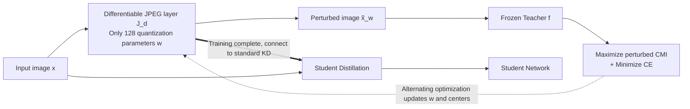

# Differentiable JPEG-based Input Perturbation for Knowledge Distillation Amplification via Conditional Mutual Information Maximization

**Conference**: ICLR 2026  
**OpenReview**: [https://openreview.net/forum?id=ZKYPoPn0fP](https://openreview.net/forum?id=ZKYPoPn0fP)  
**Code**: TBD  
**Area**: Model Compression / Knowledge Distillation  
**Keywords**: Knowledge Distillation, Conditional Mutual Information (CMI), Differentiable JPEG, Input Perturbation, Frozen Teacher, Alternating Optimization  

## TL;DR
This paper proposes inserting a **differentiable JPEG compression layer** in front of a frozen teacher, training only 128 quantization parameters to perturb teacher inputs and directly maximize the teacher's Conditional Mutual Information (CMI). This generates "softer" and more informative supervisory signals—a plug-and-play distillation amplifier that does not modify teacher weights, achieving student Top-1 gains of up to 4.11%.

## Background & Motivation
- **Background**: Knowledge Distillation (KD) is a mainstream model compression technique. However, traditional teachers are trained using Cross-Entropy (CE), and their "teaching quality" is often overlooked. Recent work like MCMI (Ye et al., 2024) demonstrated that **maximizing Conditional Mutual Information $I(X;\hat{Y}\mid Y)$** during teacher training can disperse prediction distributions of same-class samples on the probability simplex, providing softer supervision and improving distillation performance.
- **Limitations of Prior Work**: ① "Student-oriented teachers" like MCMI require **fine-tuning teacher weights**, which is impractical for fixed, closed-source, or extremely large models. ② MCMI uses proxy objectives and **fixes class centers $S_y$**; during fine-tuning, centers drift, making the proxy imprecise. ③ Another path is input perturbation (adversarial samples or CKD adaptive compression), but generating additional samples or selecting quantization tables per image entails **high computational overhead**.
- **Key Challenge**: How to harness the benefits of CMI maximization to improve teacher supervision without modifying teacher weights or incurring high per-sample generation costs.
- **Goal**: Maximize the teacher's CMI with minimal parameters while keeping the teacher **completely frozen**, ensuring a plug-and-play approach orthogonal to any KD pipeline.
- **Core Idea**: **Shift the focus from "modifying the teacher" to "modifying the teacher's input"**—insert a differentiable JPEG layer $J_d$ before the teacher and optimize only its quantization parameters $w$ to maximize the **perturbed CMI**. An **alternating optimization** strategy is used to update class centers dynamically, overcoming the fixed-center limitation of MCMI.

## Method

### Overall Architecture
DJIP consists of two phases: **(1) Differentiable JPEG layer training**—Input $x$ is perturbed via $\tilde{x}_w=J_d(x,w)$ and fed into the frozen teacher. Only the JPEG encoding parameters $w$ are optimized under combined CE and DJIP objectives to maximize perturbed CMI. **(2) Student distillation**—The trained JPEG layer is integrated into standard KD pipelines. The teacher processes perturbed images and outputs more informative soft labels to distill the student. This JPEG layer acts as a "lens": removing it restores the original model, and it does not require changing any KD hyperparameters.

### Key Designs

**1. Differentiable JPEG Layer as Input Perturbator: Using compression parameters as "knobs" to tune the teacher.** Standard JPEG converts RGB to YCbCr, performs DCT on 8x8 blocks, and applies uniform quantization with table $Q$. However, the hard quantization $Q_u$ is non-differentiable. DJIP adopts the differentiable soft quantization $Q_d$ from JPEG-DL (parameterized by quantization step $q$ and sharpness $\alpha$, using smooth expectations over bins to approximate $Q_u$), making the entire $J_d$ layer end-to-end differentiable. The reconstructed image is $\tilde{x}_w=J_d(x,w)$, where $w=(Q,\alpha)$. Unlike JPEG-DL, which trains this layer jointly with DNN weights, DJIP **decouples it from the teacher**, keeping the teacher frozen and using only these **128 quantization parameters** as perturbation knobs. This is the root of its "lightweight" nature: a tiny search space capable of significantly shifting teacher behavior.

**2. Joint CE–CMI Objective + Perturbed CMI.** Since $\tilde{X}_w$ is a deterministic function of $X$, the Markov chain $Y\to X\to\tilde{X}_w\to\hat{Y}$ holds, hence $I(X;\hat{Y}\mid Y)=I(\tilde{X}_w;\hat{Y}\mid Y)$ (i.e., "perturbed CMI"). The goal is to maximize perturbed CMI while maintaining low CE, replacing MCMI's optimization variable $\theta$ (teacher parameters) with JPEG parameters $w$:

$$\min_{w}\ \Big\{\,\mathbb{E}_X\big[H(P_{Y|X},f(\tilde{X}_w))\big]-\lambda\, I(\tilde{X}_w;\hat{Y}\mid Y)\,\Big\}$$

where $\lambda>0$ balances CE and CMI. In the CMI expression, $I(X;\hat{Y}\mid Y=y)=\mathbb{E}_{X|Y}[D_{KL}(f(X)\|S_y)]$, where $S_y$ is the center of the $y$-cluster on the simplex. Higher CMI indicates more dispersed same-class predictions and softer supervision.

**3. Introducing a "Reverse Channel" for Dual Minimization.** Directly maximizing CMI is difficult because the centers $S_y$ depend on all $f(x_j)$ in a class, hindering numerical solutions and GPU parallelism. MCMI fixes centers, which is theoretically unsound. DJIP introduces a virtual "reverse channel" distribution $Q(\cdot\mid i,y)$. By Theorem 1, the objective is rewritten as a **dual minimization** over $w$ and $\{Q\}$, where the inner minimization is achieved when $Q(x\mid i,y)=\dfrac{P_{X|Y}(x\mid y)\,f(\tilde{x}_w)[i]}{P_{\hat{Y}|Y}(i\mid y)}$. The empirical objective for a mini-batch is $L_B=L_{CE}-\lambda L_{DJIP}$, where $L_{DJIP}=-\frac{1}{|B|}\sum_{(x,y)}\sum_i f(\tilde{x}_w)[i]\ln Q(x\mid i,y)$.

**4. Alternating Optimization: Dynamic Center Updates.** Based on the dual minimization, the algorithm alternates between two steps: **Step 1 (Fix $w$)** updates centers empirically via $S_y[i]=\frac{1}{|D_y|}\sum_{x_j\in D_y}f(J_d(x_j,w))[i]$ and updates $Q(x\mid i,y)$; **Step 2 (Fix $\{Q\}$)** updates $w$ using standard SGD. By re-estimating centers in every round, DJIP avoids the approximation errors of MCMI's fixed centers, leading to more stable and effective training—this allows DJIP to match or exceed MCMI despite having far fewer degrees of freedom (128 parameters vs. the entire teacher).

## Key Experimental Results
Evaluated on CIFAR-100 and ImageNet across various homogeneous/heterogeneous CNN/ViT teacher-student pairs. CMI is measured on the training set without data augmentation.

### Main Results (CIFAR-100 Homogeneous Pairs, Top-1 %)

| Teacher→Student | Method | CE Teacher | DJIP Teacher | Gain (Δ) |
|---|---|---|---|---|
| ResNet-32×4→ResNet-8×4 | KD | 73.33 | 74.38 | **+1.05** |
| VGG-13→VGG-8 | KD | 72.98 | 74.01 | +1.03 |
| ResNet-110→ResNet-32 | KD | 73.08 | 73.71 | +0.63 |
| ResNet-32×4→ResNet-8×4 | FT | 72.86 | 73.76 | +0.90 |
| WRN-40-2→WRN-40-1 | RKD | 72.22 | 72.36 | +0.14 |

CMI generally increased from ~0.006–0.16 (CE teacher) to ~0.25–0.72 (DJIP teacher), proving that perturbation effectively amplifies CMI.

### Key Findings / ImageNet & Cross-Paradigm

| Setup | Method | CE | DJIP | Gain (Δ) |
|---|---|---|---|---|
| ResNet-34→ResNet-18 (ImageNet) | KD | 70.66 | 71.65 | **+0.99** |
| ResNet-50→MobileNetV1 (ImageNet) | AT | 69.56 | 70.57 | +1.01 |
| CIFAR-100 Heterogeneous (Selected) | SP | 73.48 | 75.92 | **+2.44** |
| CIFAR-100 Heterogeneous (Max Gain) | — | — | — | **+4.11** |

- **Significant Gains in Heterogeneous Pairs**: Gains are more pronounced when the capacity gap is large, reaching up to **+4.11%** in cross-paradigm settings.
- **Strong Orthogonality**: Improves performance across 13 different distillers (KD, DKD, DIST, etc.) and can be stacked on top of MCMI.
- **Efficiency**: Achieving results comparable to or better than MCMI (with far more parameters) and CKD/TALD (which require per-image table selection) by using only a single globally shared quantization table and 128 parameters.

## Highlights & Insights
- **Paradigm Shift**: Moves the optimization object from **teacher weights** to **teacher inputs**, bypassing the obstacles of re-training massive or closed-source teachers.
- **Extreme Lightweight**: 128 quantization parameters constitute the entire trainable surface. It is plug-and-play, leaves no footprint after removal, and requires no changes to KD hyperparameters.
- **Theoretical Reinforcement**: Uses a "reverse channel + dual minimization" framework to provide a rigorous, parallelizable form for CMI maximization with dynamic center updates.
- **Interpretability via CMI**: Directly reports CMI values, quantifying the intuition that "softer labels carry more information" into an observable metric.

## Limitations & Future Work
- **Dependency on CMI Assumption**: The method assumes "higher CMI ⇒ better distillation"; if the teacher distribution is abnormal or the task does not follow this rule, gains may be limited.
- **Upper Bound of JPEG Expressiveness**: 128 quantization parameters provide limited degrees of freedom compared to MCMI. In some scenarios, gains are modest (+0.04 to +0.2).
- **Local Optima in SGD**: Like most SGD-based methods, the alternating optimization converges to local optima.
- **Domain Binding**: JPEG compression is tailored for natural images. Migrating to other modalities (text, audio, point clouds) would require designing different differentiable perturbation operators.

## Related Work & Insights
- **CMI-based Distillation**: MCMI (Ye et al., 2024) pioneered training teachers to maximize CMI. DJIP inherits the CMI estimator but introduces alternating optimization to fix center drift and targets the input space of a frozen teacher.
- **Differentiable JPEG / JPEG-DL** (Salamah et al., 2025b): Provides the soft quantization layer; DJIP repurposes this from a "DNN component" to an "independent input perturbator."
- **Input Perturbation Distillation**: Work on adversarial/divergent inputs (TALD) and adaptive compression (CKD) proves that perturbing teacher inputs is beneficial. DJIP replaces per-sample generation/selection with a global quantization table and minimal parameters, significantly reducing costs.
- **Insight**: When modifying models is too costly, "modifying the input distribution" is a powerful and parameter-efficient alternative; information-theoretic metrics like CMI serve as effective proxies for supervision quality.

## Rating
- **Novelty**: ⭐⭐⭐⭐ — The shift to "frozen teacher + differentiable JPEG input perturbation" is a clear and rare perspective change, backed by solid dual minimization theory.
- **Experimental Thoroughness**: ⭐⭐⭐⭐ — Extensive coverage of datasets, architectures, and 13 distillers. While some gains are small, the comparisons with MCMI/CKD/TALD are comprehensive.
- **Writing Quality**: ⭐⭐⭐⭐ — Clear motivation-theory-algorithm-experiment flow. The CMI and dual minimization derivations are well-explained.
- **Value**: ⭐⭐⭐⭐ — Highly practical for industrial scenarios with closed-source or massive teachers where re-training is not an option.

<!-- RELATED:START -->

## Related Papers

- [\[ICLR 2026\] Token Distillation: Attention-Aware Input Embeddings for New Tokens](token_distillation_attention-aware_input_embeddings_for_new_tokens.md)
- [\[ICLR 2026\] Light Differentiable Logic Gate Networks](light_differentiable_logic_gate_networks.md)
- [\[ICLR 2026\] In Good GRACES: Principled Teacher Selection for Knowledge Distillation](in_good_graces_principled_teacher_selection_for_knowledge_distillation.md)
- [\[ICLR 2026\] SGD-Based Knowledge Distillation with Bayesian Teachers: Theory and Guidelines](sgd-based_knowledge_distillation_with_bayesian_teachers_theory_and_guidelines.md)
- [\[ICLR 2026\] Generative Diffusion Prior Distillation for Long-Context Knowledge Transfer](generative_diffusion_prior_distillation_for_long-context_knowledge_transfer.md)

<!-- RELATED:END -->
