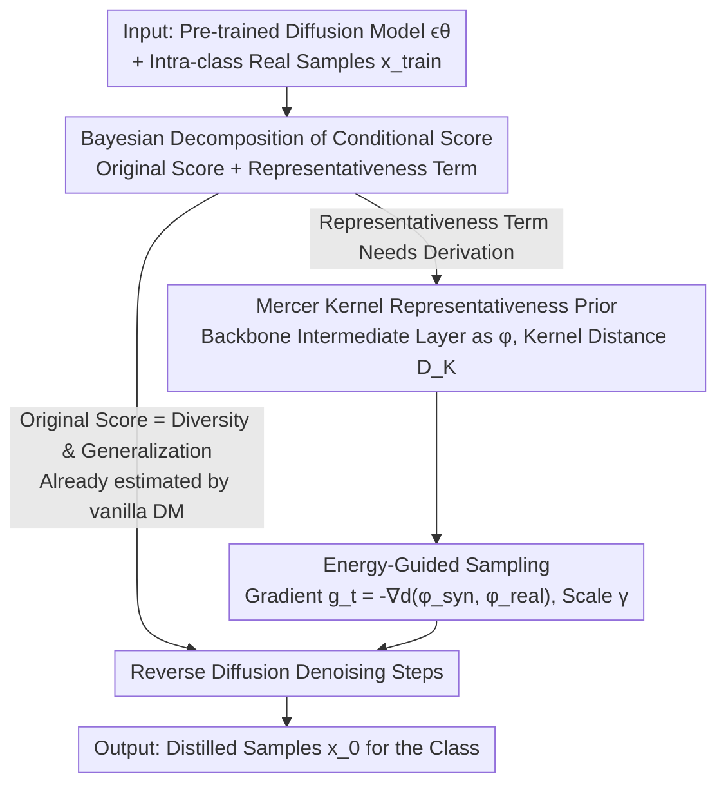

# Diffusion Models as Dataset Distillation Priors

**Conference**: ICLR 2026  
**OpenReview**: [https://openreview.net/forum?id=Hvge3NzkJN](https://openreview.net/forum?id=Hvge3NzkJN)  
**Paper**: [Project Page](https://suduo94.github.io/Diffusion-As-Priors)  
**Code**: https://suduo94.github.io/Diffusion-As-Priors (Project Page)  
**Area**: Model Compression / Dataset Distillation / Diffusion Models  
**Keywords**: Dataset Distillation, Diffusion Prior, Mercer Kernel, Representativeness, Guided Sampling

## TL;DR
This paper formalizes "representativeness" as the Mercer kernel induced distance between synthetic and real samples within the feature space of diffusion models. By injecting this as an energy-based guidance into the reverse diffusion process, the method enables pre-trained diffusion models to output distilled datasets characterized by diversity, generalization, and representativeness in a **training-free** manner. It outperforms various SOTA generative distillation methods on ImageNet-1K and its subsets.

## Background & Motivation

**Background**: Dataset Distillation (DD) aims to compress a massive dataset into an extremely small synthetic subset while retaining the ability to train high-performance models (achieving $10\times\sim200\times$ training scale compression). Recent mainstream approaches utilize "generative distillation"—directly employing trained diffusion models (e.g., U-Net in Stable Diffusion, Transformer in DiT) as base models to synthesize distilled samples, leveraging their strong distribution modeling for high-fidelity and diverse data.

**Limitations of Prior Work**: An ideal distilled dataset must simultaneously satisfy **Diversity** (covering all variations of original data), **Generalization** (avoiding overfitting to a specific downstream architecture), and **Representativeness** (preserving the most critical information). The issue is that samples from vanilla diffusion models naturally possess the first two but lack **explicitly encoded representativeness**. To address this, methods like IGD and MGD3 often rely on external constraints (e.g., influence-guided sampling using a proxy network), which increases complexity and tends to bind inductive biases to specific architectures (e.g., IGD explicitly uses ResNet-18 as a proxy, leading to performance drops when architectures change).

**Key Challenge**: The authors investigate two questions: ① Do vanilla diffusion priors satisfy DD requirements? ② Are there **overlooked priors** in diffusion models that can serve representativeness? They posit that diffusion models already provide diversity and generalization by modeling the manifold via the score function $\nabla_x \log p(x)$. Representativeness **does not need to be external**—a trained diffusion backbone is inherently an excellent feature extractor whose understanding of visual content (strong vision-language alignment, potential as a discriminative classifier) can act as a representativeness prior.

**Goal**: Extract the missing "representativeness" attribute from the diffusion model's own prior and inject it into the sampling process without re-training or external proxy networks.

**Core Idea**: Decompose the conditional score function via Bayes into "original score (diversity + generalization) + representativeness term." Formulate representativeness as a differentiable energy term using **Mercer kernel induced distance** and inject it into each step of reverse diffusion via **classifier guidance**—termed "Diffusion As Priors (DAP)."

## Method

### Overall Architecture

The input to DAP is a **pre-trained diffusion model** $\epsilon_\theta$ and real training samples of a certain class $c$; the output is the distilled samples for that class. The entire pipeline involves no additional training and occurs entirely during the **sampling stage**: reverse diffusion denoising proceeds as usual, but an additional guidance gradient is added at each step to pull the current sample toward the "representative region" of the real data.

Its theoretical foundation lies in the Bayesian decomposition of the conditional score function (Eq. 4):

$$\nabla_x \log p(x|R) = \underbrace{\nabla_x \log p(x)}_{\text{Diversity \& Generalization}} + \underbrace{\nabla_x \log p(R|x)}_{\text{Representativeness}}$$

The first term is the original score already estimated by the vanilla diffusion model (providing diversity and generalization priors) for **free**. This paper focuses on deriving the second term—the representativeness term. This is done in two steps: first, represent the "representativeness of synthetic samples relative to the real set" as a differentiable kernel induced distance $D_K$ using Mercer kernels; then, use it as an energy function to calculate gradients for injection into the reverse SDE.

### Key Designs

**1. Bayesian Decomposition: Isolating the Missing Capability**

Instead of designing a new distillation objective from scratch, the authors argue that vanilla diffusion models are already halfway there. Diversity stems from the stochasticity of diffusion trajectories—different noise initializations lead to different paths covering the manifold rather than memorizing individuals, avoiding mode collapse. Generalization comes from the fact that diffusion-based distillation **does not involve pixel-level optimization targeted at specific downstream classifiers** (unlike traditional DD matching gradients/parameters/features); thus, it distills "data-related" rather than "architecture-related" knowledge. Since the first two are provided for free by $\nabla_x \log p(x)$, the only part needing construction after the Bayesian split (Eq. 4) is the representativeness term $\nabla_x \log p(R|x)$. This "divide and conquer" approach allows DAP to be training-free.

**2. Mercer Kernel Representativeness Prior: Formalizing Representativeness as a Differentiable Distance**

The challenge is that "representativeness" is an abstract concept difficult to optimize. The authors formalize it using kernel functions: the more a synthetic sample $x_{syn}$ represents the training set, the higher its similarity $\mathbb{E}_{x_{train}}[K(x_{syn}, x_{train})]$ to real samples in the feature space. They define the kernel induced distance as:

$$D_K(x, y) = \big(K(x,x) + K(y,y) - 2K(x,y)\big)^{1/2}$$

They prove (Theorem 3.1) that as long as kernel $K$ is positive semi-definite (PSD), $D_K$ is a valid distance metric. Furthermore (Theorem 3.2), a Mercer kernel can be decomposed as $D_K(x,y) = d \circ (\phi \times \phi)(x,y)$, involving a complex feature map $\phi$ and a simple Hilbert norm $d$. Crucially, for $\phi$, the authors use the **output of a specific layer in the diffusion backbone (U-Net / DiT)**, reasoning that the backbone has already learned high-level semantic features. In practice, they use a linear kernel $K(x,y)=x^\top y$. Thus, representativeness is transformed from an abstract concept into a gradient-calculable distance between synthetic and real features, **reusing the diffusion model's internal features without external networks**.

**3. Energy-Guided Sampling: Injecting Representativeness via Classifier Guidance**

With the differentiable distance $D_K$, the representativeness conditional probability is formulated as a Boltzmann distribution (Eq. 6):

$$p(R|x_{syn}) \triangleq \frac{1}{Z}\Big\{\exp\big(-\tfrac{1}{N}\textstyle\sum_N D_K(x_{syn}, x_{train})\big)\Big\}^{\gamma}$$

where $\gamma>0$ controls the strength of the representativeness prior. The logarithmic gradient yields the representativeness score (Eq. 7):

$$\nabla_{x_{syn}} \log p(R|x_{syn})propto -\gamma \frac{1}{N}\sum_N \nabla_{x_{syn}} d\big(\phi(x_{syn}), \phi(x_{train})\big)$$

This follows the form of energy-based guidance/classifier guidance. It is superimposed into the reverse diffusion SDE (Eq. 8). Borrowing from diffusion classifiers, the pre-trained model itself acts as a **time-dependent** feature extractor $\phi(x_t, t) \approx \phi(x_0)$, eliminating the need for additional training on noisy samples. In Algorithm 1 (VP-SDE), each step first performs standard denoising to get $\tilde{x}_{t-1}$, calculates the guidance gradient $g_t = -\nabla_{x_t} d(z_t, z_{train}^{c})$, and updates $x_{t-1} = \tilde{x}_{t-1} + \gamma g_t$. Note that $\gamma$ **cannot be infinitely large**, as an excessive $\gamma$ would distort the fixed gradient field of diversity/generalization, leading to a performance drop.

### Loss & Training
DAP has **no training objective**: it does not fine-tune the diffusion model, train proxy networks, or pre-select $x_{train}$ samples. The only hyperparameters are the guidance scale $\gamma$ and the selection of the feature layer $\phi$. Sampling uses VP-SDE, reporting mean±std over three runs.

## Key Experimental Results

### Main Results

On ImageNet-1K (soft-label protocol, ResNet-18), DAP achieves the best performance across IPC settings:

| Dataset | IPC | Prev. SOTA | DAP | Gain |
|--------|-----|--------------|-----|------|
| ImageNet-1K | 10 | 46.7 (VLCP) / 45.6 (MGD3) | **49.1** | +2.4 ~ +3.5 |
| ImageNet-1K | 50 | 60.5 (VLCP) / 60.2 (MGD3) | **62.7** | +2.2 |

On ImageNette / ImageWoof (hard-label protocol), DAP leads across ConvNet-6 / ResNetAP-10 / ResNet-18 architectures:

| Dataset | Model | IPC | IGD | MGD3 | DAP | Full (Ref) |
|--------|------|-----|-----|------|-----|--------------|
| ImageNette | ConvNet-6 | 10 | 61.9 | 56.2 | **64.8** | 94.3 |
| ImageNette | ResNetAP-10 | 100 | 85.2 | 85.0 | **86.0** | 94.6 |
| ImageWoof | ResNet-18 | 100 | 70.6 | 68.8 | **71.6** | 89.0 |

One exception is ImageWoof / ResNet-18 / IPC10 where IGD is slightly higher; the authors attribute this to IGD's explicit use of ResNet-18 as a proxy, introducing architecture-specific inductive bias. Using a Stable Diffusion backbone, DAP consistently outperforms vanilla SD and MGD3.

### Ablation Study

| Configuration / Factor | Observation | Description |
|------------|------|------|
| W/o representativeness guidance ($\gamma=0$) | DiT/ImageNette IPC10 62.8% | Only diversity + generalization |
| W/ representativeness guidance ($\gamma=0.5$) | 66.4% | +3.6 after injecting representativeness |
| W/ representativeness guidance ($\gamma=1$) | 67.8% | Further +1.4 |
| Feature layer selection $\phi$ | "Mid" layer for U-Net; blocks 4–12 for DiT | Mid-layers are best; final layers optimize alignment over representation |
| Increasing $\gamma$ scale | Rise then fall | Excess $\gamma$ distorts the gradient field and weakens other priors |

Cross-architecture generalization (Table 5): Baselines drop due to architecture-specific bias; DAP remains highest across ResNet-101, MobileNet-V2, EfficientNet-B0, and Swin. Scaling experiments (Table 4) show DAP has almost no degradation when sub-sampling IPC100 to IPC10, suggesting it captures transferable knowledge.

### Key Findings
- **Representativeness guidance is the primary performance driver**: Under the stricter hard-label protocol, DAP matches or exceeds prior methods that typically require soft-labels to be competitive.
- **Feature layer selection is critical**: Intermediate semantic layers are better for representativeness than final output layers, which focus more on distribution alignment.
- **Prior trade-offs**: There is an optimal guidance strength $\gamma$; exceeding it sacrifices diversity and generalization.
- **Cross-domain robustness**: Even when SD is pre-trained on LAION and used to distill ImageNet, DAP remains robust, showing the ability of diffusion priors to bridge domain gaps.

## Highlights & Insights
- **The "fill the gap" decomposition is elegant**: Splitting distillation needs into "free diversity/generalization + missing representativeness" makes the method naturally training-free.
- **Backbone as a self-extractor**: Reusing U-Net/DiT internal layers for $\phi$ with Mercer kernel guarantees transforms an abstract concept into a differentiable energy term with minimal engineering overhead.
- **Innovative use of Classifier Guidance**: Packaging representativeness as feature-space proximity and using maturation guidance mechanisms at zero additional cost.
- **Sensitivity of $\gamma$**: The Boltzmann distribution and gradient derivation (Eq. 6-8) are core; details regarding the normalization $Z$ and time-dependent approximation $\phi(x_t, t)$ should be checked against the original text.

## Limitations & Future Work
- **Reliance on backbone feature quality**: If the backbone lacks good features for a specific domain, the guidance may fail.
- **Manual tuning**: Optimal $\gamma$ and layers vary by backbone (U-Net vs. DiT); an automated selection mechanism is currently missing.
- **Simplified kernel**: Only the linear kernel was extensively used; complex Mercer kernels remain unexplored.
- **Future directions**: Extending to video or 3D modalities, and dynamic scheduling of $\gamma$ to balance the three priors.

## Related Work & Insights
- **vs IGD**: IGD uses external proxies (ResNet-18), introducing architecture bias. DAP uses backbone features, making it more robust across target architectures.
- **vs MGD3**: Both use generative distillation, but MGD3 requires external constraints. DAP shows these constraints are internal to the diffusion prior itself.
- **vs Traditional DD**: Traditional methods are architecture-specific (distilling "architecture knowledge"); DAP is generative and architecture-agnostic (distilling "data knowledge").
- **vs Diffusion Classifier**: Inspired by the fact that if a diffusion model can be a discriminative classifier, its features are sufficient for measuring representativeness.

## Rating
- Novelty: ⭐⭐⭐⭐⭐ First to activate the overlooked representativeness prior in DMs with solid theoretical grounding.
- Experimental Thoroughness: ⭐⭐⭐⭐ Covers multiple backbones, datasets, and architectures; more out-of-domain validation could be beneficial.
- Writing Quality: ⭐⭐⭐⭐ Clear narrative on the three priors; mathematical derivations are well-integrated.
- Value: ⭐⭐⭐⭐⭐ Training-free, plug-and-play, and robust, offering direct utility for generative dataset distillation.

<!-- RELATED:START -->

## Related Papers

- [\[CVPR 2026\] Mitigating The Distribution Shift of Diffusion-based Dataset Distillation](../../CVPR2026/model_compression/mitigating_the_distribution_shift_of_diffusion-based_dataset_distillation.md)
- [\[ICLR 2026\] FutureMind: Equipping Small Language Models with Strategic Thinking-Pattern Priors via Adaptive Knowledge Distillation](futuremind_equipping_small_language_models_with_strategic_thinking-pattern_prior.md)
- [\[CVPR 2026\] DMGD: Train-Free Dataset Distillation with Semantic-Distribution Matching in Diffusion Models](../../CVPR2026/model_compression/dmgd_train-free_dataset_distillation_with_semantic-distribution_matching_in_diff.md)
- [\[ICLR 2026\] Understanding Dataset Distillation via Spectral Filtering](understanding_dataset_distillation_via_spectral_filtering.md)
- [\[CVPR 2026\] IMS3: Breaking Distributional Aggregation in Diffusion-Based Dataset Distillation](../../CVPR2026/model_compression/ims3_breaking_distributional_aggregation_in_diffusion-based_dataset_distillation.md)

<!-- RELATED:END -->
