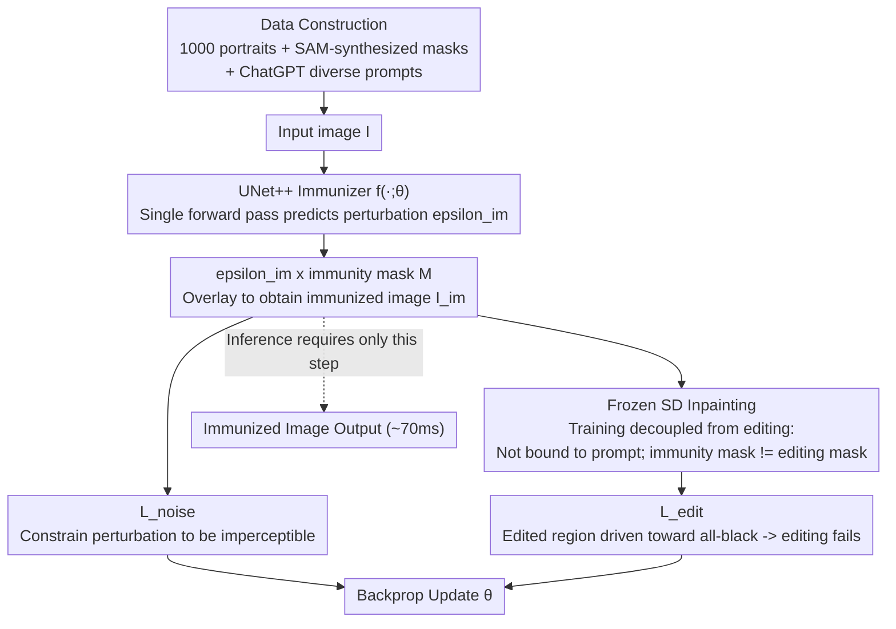

# DiffVax: Optimization-Free Image Immunization Against Diffusion-Based Editing

**Conference**: ICLR 2026  
**arXiv**: [2411.17957](https://arxiv.org/abs/2411.17957)  
**Code**: Available (Project Webpage)  
**Area**: Diffusion Models / Security  
**Keywords**: Image Immunization, Adversarial Perturbation, Diffusion Editing Protection, Feed-forward Network, Video Protection  

## TL;DR

DiffVax trains a feed-forward immunizer (UNet++) that generates imperceptible adversarial perturbations for any image in a single forward pass (~70ms). This causes diffusion-based malicious editing to fail, achieving a 250,000× speedup over prior per-image optimization methods and extending immunization to video content for the first time.

## Background & Motivation

**Background**: The editing capabilities of diffusion models (e.g., Stable Diffusion) are increasingly powerful. Tools like inpainting and InstructPix2Pix enable realistic modifications but are exploited by malicious users to generate deepfakes and non-consensual sexual content.

**Limitations of Prior Work**: Existing image immunization methods (PhotoGuard, DAYN) require running Projected Gradient Descent (PGD) optimization for every individual image. A single image consumes 10 minutes to several hours, with GPU memory requirements exceeding 15GB, and fails to generalize to unseen content.

**Key Challenge**: Effective immunization requires backpropagation through the diffusion model to create adversarial perturbations, but the per-image optimization paradigm cannot scale to large-scale scenarios (e.g., millions of daily uploads on social media).

**Goal**: (a) Transition immunization from per-image optimization to feed-forward inference; (b) ensure perturbations are imperceptible while causing editing failure; (c) maintain robustness against counter-attacks (JPEG compression, denoising).

**Key Insight**: Train an image-conditioned perturbation generator that learns "how to place noise intelligently" from large training samples, rather than optimizing from scratch each time. This design generalizes to unseen images, prompts, and video frames.

**Core Idea**: Replace per-image optimization with an end-to-end trained UNet++ immunizer. Use dual-objective learning with $\mathcal{L}_{\text{noise}} + \mathcal{L}_{\text{edit}}$ to generate low-frequency, imperceptible, and highly disruptive perturbations.

## Method

### Overall Architecture

The core problem is transforming the process of "applying adversarial perturbations for diffusion editing defense" from per-image optimization (hundreds of steps, minutes to hours) into a single forward inference. DiffVax decomposes this into an end-to-end two-stage training pipeline. In Stage 1, the immunizer $f(\cdot;\theta)$ takes image $\mathbf{I}$ and predicts perturbation $\epsilon_{\mathrm{im}}$, which is multiplied with the immunization mask $\mathbf{M}$ and added to the original image to obtain the immunized image $\mathbf{I}_{\mathrm{im}}=\mathbf{I}+\epsilon_{\mathrm{im}}\odot\mathbf{M}$. Stage 2 feeds $\mathbf{I}_{\mathrm{im}}$ into a **frozen** SD Inpainting model for editing, using an editing failure loss to backpropagate and train the immunizer. Training data includes carefully constructed images, synthetic masks, and diverse prompts to ensure generalization. Once trained, inference only requires the single forward pass of Stage 1 (~70ms).

### Key Designs

**1. UNet++ Immunizer: Replacing Per-Image Optimization with Single Forward Prediction**

Previous methods required hundreds of PGD steps in pixel space for every new image. This work instead trains an image-conditioned generator $f(\cdot;\theta)$ to directly map the input image to a perturbation map $\epsilon_{\mathrm{im}}$. UNet++ is chosen over standard U-Net because adversarial noise prediction is highly unstable and requires precise multi-scale coordination. UNet++'s nested skip connections provide denser multi-scale feature aggregation, leading to stable convergence. Inference speed is reduced to ~70ms, providing a 250,000× speedup.

**2. Training-Editing Decoupling: Agnostic to Prompts and Mask Shapes**

A major vulnerability in previous methods is that perturbations are often optimized for specific prompts or masks; attackers can bypass protection by changing the prompt or shifting the mask. DiffVax ensures the immunizer is **not conditioned on prompts** (experiments verify effective perturbations are prompt-agnostic) and does not bind to specific mask shapes. Consequently, training immunization masks and inference/attack editing masks can differ significantly, enhancing robustness.

**3. Data Construction: Generalization via Synthetic Masks and Diverse LLM Prompts**

For the feed-forward immunizer to generalize to unseen images and prompts, data diversity is critical. Using 1,000 portraits from the CCP dataset as a base, the method uses SAM to automatically generate foreground masks and ChatGPT to generate 2,000 diverse background editing prompts. This dataset is split into 80/20 seen/unseen categories to evaluate generalization performance.

### Loss & Training

$$\mathcal{L} = \alpha \cdot \mathcal{L}_{\text{noise}} + \mathcal{L}_{\text{edit}}$$

- $\mathcal{L}_{\text{noise}} = \frac{1}{\text{sum}(\mathbf{M})} \|(\mathbf{I}_{\mathrm{im}} - \mathbf{I}) \odot \mathbf{M}\|_1$: Ensures perturbations are imperceptible.
- $\mathcal{L}_{\text{edit}} = \frac{1}{\text{sum}(\sim\mathbf{M})} \|\text{SD}(\mathbf{I}_{\mathrm{im}}, \sim\mathbf{M}, \mathcal{P}) \odot (\sim\mathbf{M})\|_1$: Forces pixels in the edited region toward solid black, representing complete editing failure.

Training parameters: 350 epochs, batch size 5, Adam lr=1e-5, $\alpha=4$, ~22 hours on an A100.

## Key Experimental Results

### Main Results

| Method | SSIM↓ (seen/unseen) | PSNR↓ (seen/unseen) | SSIM(Noise)↑ | CLIP-T↓ | Runtime(s)↓ | GPU(MiB)↓ |
|------|---------------------|---------------------|--------------|---------|-------------|-----------|
| PhotoGuard-E | 0.558/0.565 | 15.29/15.63 | 0.956 | 31.69/30.88 | 207.0 | 9,548 |
| PhotoGuard-D | 0.531/0.523 | 14.70/14.92 | 0.978 | 29.61/29.27 | 911.6 | 15,114 |
| DiffusionGuard | 0.551/0.556 | 14.37/14.71 | 0.965 | 26.98/27.10 | 131.1 | 6,750 |
| **DiffVax** | **0.510/0.526** | **13.96/14.32** | **0.989** | **23.13/24.17** | **0.07** | **5,648** |

### Robustness against Counter-attacks

| Method | SSIM↓ (w/ Denoiser) | SSIM↓ (w/ JPEG 0.75) | SSIM↓ (w/ IMPRESS) |
|------|--------------------|-----------------------|--------------------|
| PG-D | 0.702/0.709 | 0.664/0.674 | 0.578/0.563 |
| DiffusionGuard | 0.708/0.719 | 0.680/0.684 | 0.604/0.595 |
| **DiffVax** | **0.552/0.565** | **0.522/0.538** | **0.488/0.500** |

### Key Findings

- DiffVax learns low-frequency perturbations (rather than high-frequency scattered noise), making it inherently resistant to JPEG compression and denoising, which typically remove high-frequency components.
- The average $L_1$ magnitude of the perturbation is only 0.001, significantly lower than the 0.003~0.012 of baselines, indicating that its advantage stems from strategic placement rather than intensity.
- In a user study (67 participants), DiffVax received an average rank of 1.64 (most dissimilar to original edits), outperforming PG-D (2.63).
- Video immunization: Processing 64 video frames takes only 0.739 seconds, compared to 64 hours for PG-D.

## Highlights & Insights

- **Feasibility of Feed-forward Paradigm**: Proves that the adversarial perturbation space contains learnable structures that can be generalized via neural networks, eliminating the need for per-image optimization.
- **Low-frequency Perturbations via $L_1$**: The $L_1$ constraint in $\mathcal{L}_{\text{noise}}$ encourages the model to learn low-frequency perturbation distributions, which is more robust than fixed $L_\infty$ budgets against common image processing.
- **Pioneering Video Immunization**: While prior methods were computationally infeasible for video, DiffVax's efficiency makes industrial-scale video content protection viable for the first time.

## Limitations & Future Work

- Protection effectiveness decreases in scenes containing many small objects (insufficiently concentrated noise).
- Protection may partially fail when the mismatch between the immunization mask and the editing mask is extreme.
- Cross-model transferability is limited (effective but imperfect when moving from SD v1.5 to v2).
- Training data is limited to 1,000 portraits; expanding to broader domains (e.g., anime, digital art) remains a significant future direction.

## Related Work & Insights

- **vs PhotoGuard**: PG uses PGD for per-image optimization (3,000× slower) and relies on high-frequency noise easily removed by JPEG; DiffVax learns low-frequency strategic perturbations.
- **vs DiffusionGuard**: DG extends PG with augmented masks but remains a per-image paradigm (131s/image); DiffVax requires 0.07s/image.
- **vs DAYN**: An attention-based semantic attack that reduces computation but still lacks generalization capability.
- Insight: The feed-forward adversarial generator approach can be transferred to other security domains (e.g., defending against audio deepfakes).

## Rating

- Novelty: ⭐⭐⭐⭐ The feed-forward immunizer paradigm is innovative, though the core idea of training noise generators has precedents in adversarial attack literature.
- Experimental Thoroughness: ⭐⭐⭐⭐⭐ Comprehensive coverage including ablations, counter-attacks, cross-model tests, user studies, video, and various editing tools.
- Writing Quality: ⭐⭐⭐⭐ Well-structured with rich visualizations.
- Value: ⭐⭐⭐⭐ Strong practical utility; the 250,000× speedup makes large-scale deployment feasible.

<!-- RELATED:START -->

## Related Papers

- [\[ICLR 2026\] DVD-Quant: Data-free Video Diffusion Transformers Quantization](dvd-quant_data-free_video_diffusion_transformers_quantization.md)
- [\[ICLR 2026\] Plug-and-Play Fidelity Optimization for Diffusion Transformer Acceleration via Cumulative Error Minimization](plug-and-play_fidelity_optimization_for_diffusion_transformer_acceleration_via_c.md)
- [\[ICCV 2025\] MotionFollower: Editing Video Motion via Lightweight Score-Guided Diffusion](../../ICCV2025/model_compression/motionfollower_editing_video_motion_via_score-guided_diffusion.md)
- [\[CVPR 2026\] CADC: Content Adaptive Diffusion-Based Generative Image Compression](../../CVPR2026/model_compression/cadc_content_adaptive_diffusion-based_generative_image_compression.md)
- [\[ICLR 2026\] Modality-free Graph In-context Alignment](modality-free_graph_in-context_alignment.md)

<!-- RELATED:END -->
