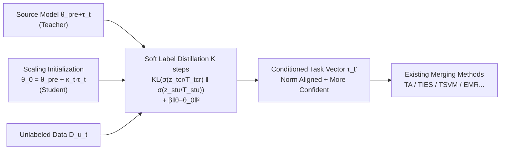

# DisTaC: Conditioning Task Vectors via Distillation for Robust Model Merging

**Conference**: ICLR 2026  
**OpenReview**: [https://openreview.net/forum?id=W70w5JCzdq](https://openreview.net/forum?id=W70w5JCzdq)  
**Code**: [https://github.com/katoro8989/DisTaC](https://github.com/katoro8989/DisTaC)  
**Area**: Model Merging  
**Keywords**: task vector, model merging, knowledge distillation, robustness, task vector norm, model confidence  

## TL;DR
This paper reveals two hidden failure modes of model merging—task vector norm discrepancy and low source model confidence—and proposes DisTaC: "pre-conditioning" task vectors via knowledge distillation (rescaling norms + boosting confidence) before merging, enabling existing SOTA merging methods to function in realistic scenarios where they would otherwise fail.

## Background & Motivation
**Background**: Model merging involves linearly combining multiple independently fine-tuned models in the weight space into a multi-task model without retraining or pooling all task data. This has become a popular multi-task learning paradigm. The core object is the task vector $\tau_t := \theta_t - \theta_{pre}$, representing the shift from pre-trained weights. Methods like TA, TIES, Consensus, and TSVM design transformation matrices $P_t$ to mitigate inter-task interference.

**Limitations of Prior Work**: Existing SOTA methods are mostly evaluated on "merge-friendly" idealized benchmarks where all source models are fine-tuned using uniform learning rates, hard labels, and the same number of steps. In the real world, fine-tuning hyperparameters vary significantly across tasks. This ideal assumption does not hold, and the robustness of these methods has rarely been systematically examined.

**Key Challenge**: This paper conducts a diagnostic experiment identifying two "harmful" yet overlooked characteristics of source models—**(1) Task vector norm discrepancy**: Different learning rates, steps, or weight decay can cause norms to differ by 5–7×. Proposition 1 proves that when two vectors are nearly orthogonal and the norm ratio is $\delta \ll 1$, the merged result $\cos(\tau_{merge}, \tau_1) \le \delta$, meaning the large-norm task dominates and the small-norm task's knowledge is washed out; **(2) Low source model confidence**: Common techniques like label smoothing, Mixup, or focal loss increase prediction entropy by orders of magnitude. Counter-intuitively, well-calibrated models are fragile in merging; lower confidence leads to sharper performance drops after merging (up to 24% normalized accuracy loss).

**Goal**: Rather than improving merging algorithms themselves, this work aims to "cure" these two pathological features of source models before merging.

**Core Idea**: **Pre-conditioning approach** — The paper proposes DisTaC, which uses lightweight knowledge distillation with only unlabeled data to simultaneously rescale task vector norms to a target value and boost source model confidence while preserving task-specific knowledge, providing plug-and-play robustness for existing merging methods.

## Method

### Overall Architecture
DisTaC (Distillation for Task vector Conditioning) is a preprocessing step added **before** the merging pipeline: for each problematic source model, the "conditioned weights" are used to initialize a student, while the original fine-tuned model serves as the teacher. After $K$ steps of pure soft-label distillation, a new task vector with corrected norm and boosted confidence is generated for use with any merging method. Both conditioning types (norm + confidence) are unified in Algorithm 1 by adjusting the scaling coefficient $\kappa_t$ and temperature pair $(T_{tcr}, T_{stu})$.

### Key Designs
**1. Task Vector Norm Conditioning: Restoring accuracy after scaling via distillation.** A naive approach scales $\tau_t$ by a scalar $\kappa_t$ to reach a target norm, but this hard scaling often degrades performance. The key to DisTaC is using the scaled model $\theta_{pre} + \kappa_t \tau_t$ as the student initialization (anchor point $\theta_0$) and the original model $\theta_{pre} + \tau_t$ as the teacher. Distillation on unlabeled data from the same task recovers the accuracy lost during scaling. Since there are no labels, $\zeta=1$ is fixed, using only the soft target KL term $T_{tcr} T_{stu} \mathrm{KL}(\sigma(z_{tcr}/T_{tcr}) \| \sigma(z_{stu}/T_{stu}))$ with an $\ell_2$ regularization $\beta \|\theta - \theta_0\|_2^2$ to prevent the norm from drifting back. The target norm is set to the mean of the other task vector norms, and neutral temperatures $(10, 10)$ are used.

**2. Confidence Conditioning: Lowering entropy through higher student temperatures.**To address low confidence, the student and teacher are initialized identically ($\theta_0 = \theta_{pre} + \tau_t$, $\kappa_t = 1$). The lever is temperature—deliberately setting the student temperature higher than the teacher ($T_{stu} > T_{tcr}$, e.g., $(1, 10)$). The student trains on a "softened," high-entropy distribution; when the temperature is reset to 1 during inference, the student's output is sharper and more confident than the teacher's. The authors acknowledge this causes overconfidence but argue it can be fixed later via calibration (e.g., temperature scaling), whereas merging collapse from under-confidence is irreversible.

**3. Unified Single-Pass Distillation.** Algorithm 1 performs a single pass of distillation to correct both issues simultaneously by selecting the appropriate $\kappa_t$ and asymmetric temperature pair. Because DisTaC initializes with trained task vectors and runs for few steps ($K=500$, often converging in ~100), using only unlabeled data, the computational overhead is minimal and non-intrusive to existing pipelines.

## Key Experimental Results
Settings: CLIP ViT-B-32 / ViT-L-14 backbones, 8 vision tasks. 7 merging methods are compared across Original / Norm Mismatch / Low Confidence configurations.

### Main Results (Partial, Absolute Accuracy / [Normalized Accuracy], ViT-B-32)

| Method | Original | Norm Mismatch | + DisTaC | Low Confidence | + DisTaC |
|------|---------|---------------|----------|----------------|----------|
| Task arithmetic | 70.4 (78.0) | 63.6 (71.8) | **70.0 (78.2)** | 51.0 (58.3) | **63.6 (72.2)** |
| TIES | 74.0 (82.0) | 59.1 (66.4) | **73.1 (81.0)** | 54.5 (62.0) | **68.7 (77.9)** |
| EMR-Merging | 88.5 (98.4) | 80.0 (88.7) | **88.1 (97.3)** | 39.2 (45.1) | **70.3 (79.2)** |
| TSVM | 83.3 (92.4) | 72.2 (80.2) | **82.9 (91.8)** | 60.7 (68.4) | **81.5 (91.8)** |
| WUDI-Merging | 85.5 (93.9) | 49.2 (52.6) | **84.4 (93.2)** | 38.0 (40.8) | **73.8 (83.3)** |

DisTaC restores almost all methods to near-Original performance in both adverse settings. In ViT-B-32, absolute gains reach up to 35.8%, and in ViT-L-14, up to 63.6%. TSVM recovers from 68% to 92% normalized accuracy under low confidence; EMR-Merging recovers from 45.1% to 79.2%.

### Ablation Study

| Analysis | Key Findings |
|------|---------|
| Convergence (Fig 2) | Accuracy restores to or exceeds teacher levels within ~100 steps; $\ell_2$ reg keeps norm at ~1.1× of init. |
| Scaling Direction (Fig 3) | Reducing norms ($\kappa_t < 1$) maintains or boosts accuracy; stretching ($\kappa_t > 1$) causes rapid drops (below zero-shot at $\kappa_t=3$). |
| Student vs. Teacher | Reducing $\kappa_t$ acts like weight decay regularization; students occasionally outperform teachers (echoing Born-Again Networks). |

### Key Findings
- **Norm discrepancy and low confidence are real failure modes hidden by benchmarks**, with low confidence being more harmful (up to 24% vs 14% drop).
- **Practical merging rules**: (i) When norms are mismatched, shrinking long vectors is superior to stretching short ones; (ii) When source models have low confidence, it is better to make them "overconfident" before merging and calibrate the final model later.

## Highlights & Insights
- **Diagnosis precedes solution**: The work first attributes merging failure in reality to two quantifiable source model features via controlled experiments, supported by Proposition 1 and NTK-based theoretical explanations.
- **Agnostic to merging algorithms**: DisTaC does not modify merging methods; it acts as a plug-and-play pre-processing step effective across 7 SOTA methods.
- **Low cost**: Requires only 100–500 steps, unlabeled data, and initialization from existing task vectors, adding minimal overhead.
- **Counter-intuitive insight**: Good calibration $\neq$ merge-friendly. "Overconfidence + post-hoc calibration" is a more robust engineering path.

## Limitations & Future Work
- Experiments focused on CLIP with 8 vision classification tasks; generalization to NLP, generative models, or detection remains to be verified.
- Requires "unlabeled data from the same task distribution," which might be unavailable in privacy-restricted or cold-start scenarios.
- Encouraging overconfidence sacrifices calibration, relying on post-hoc temperature scaling, which requires caution in reliability-sensitive applications.
- Scaling coefficients $\kappa_t$ and temperature pairs are currently set via heuristics (e.g., mean of other norms); an adaptive selection mechanism is lacking.

## Related Work & Insights
- **Task Vectors and Model Merging**: Task Arithmetic, TIES, Consensus, EMR, TSVM, Iso-CTS, WUDI are the "users" of this work; DisTaC provides robustness for them.
- **Knowledge Distillation**: Reuses soft-label distillation but innovatively applies it as a "task vector conditioner" rather than a compression tool; the student outperforming the teacher echoes Born-Again Networks.
- **NTK / Weight Decoupling**: Theoretical insights from Ortiz-Jimenez, Yoshida, and Wei explain why small norms are more suitable for merging, unifying empirical rules with theory.
- **Insight**: Future model merging research should focus not just on "how to merge" but also on "how to prepare source models"—pre-conditioning could be a new, systematic dimension.

## Rating
- Novelty: ⭐⭐⭐⭐ Reframes "merging failure" as a source model conditioning problem with solid theoretical backing.
- Experimental Thoroughness: ⭐⭐⭐⭐ Systematic comparison across 7 methods, 3 config, and 2 backbones, though limited to CLIP vision tasks.
- Writing Quality: ⭐⭐⭐⭐ Clear logic (Diagnosis–Theory–Method–Ruless) with well-supported figures.
- Value: ⭐⭐⭐⭐ High practical value as a plug-and-play, low-cost method to boost real-world robustness.

<!-- RELATED:START -->

## Related Papers

- [\[ICLR 2026\] MergOPT: A Merge-Aware Optimizer for Robust Model Merging](mergopt_a_merge-aware_optimizer_for_robust_model_merging.md)
- [\[CVPR 2025\] Task Singular Vectors: Reducing Task Interference in Model Merging](../../CVPR2025/model_compression/task_singular_vectors_reducing_task_interference_in_model_merging.md)
- [\[ICLR 2026\] Expert Merging: Model Merging with Unsupervised Expert Alignment and Importance-Guided Layer Chunking](expert_merging_model_merging_with_unsupervised_expert_alignment_and_importance-g.md)
- [\[ICML 2026\] Saliency-Aware Model Merging](../../ICML2026/model_compression/saliency-aware_model_merging.md)
- [\[ICLR 2026\] Pedagogically-Inspired Data Synthesis for Language Model Knowledge Distillation](pedagogically-inspired_data_synthesis_for_language_model_knowledge_distillation.md)

<!-- RELATED:END -->
