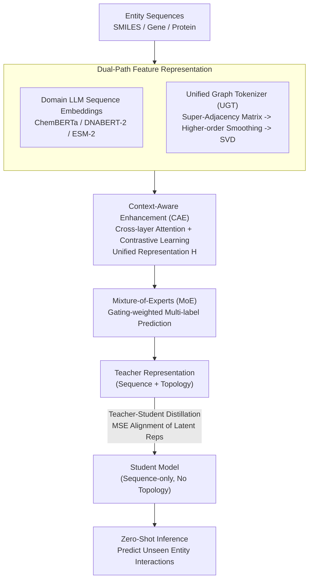

# Distilling and Adapting: A Topology-Aware Framework for Zero-Shot Interaction Prediction in Multiplex Biological Networks

**Conference**: ICLR 2026  
**arXiv**: [2603.06618](https://arxiv.org/abs/2603.06618)  
**Code**: [Yes](https://github.com/alanadeng/CAZI-MBN)  
**Area**: Model Compression  
**Keywords**: Multiplex Biological Networks, Zero-Shot Prediction, Knowledge Distillation, Graph Transformer, Multimodal Representation Learning

## TL;DR

The CAZI-MBN framework is proposed, which integrates domain-specific LLM sequence embeddings, a topology-aware graph tokenizer, context-aware cross-layer attention, and teacher-student distillation. It achieves zero-shot interaction prediction for unseen entities in multiplex biological networks, improving AUROC by 3.1-20.4% over the best baselines across five benchmark datasets.

## Background & Motivation

Multiplex Biological Networks (MBNs) represent different types of interactions among the same set of entities through multi-layered structures (e.g., various drug-gene mechanisms or protein interactions across different cell types). They are critical tools for understanding complex biological systems. However, existing methods suffer from three core deficiencies:

**Inadequate Multiplexity Handling**: Most rely on single-layer network analysis, losing relational heterogeneity and semantic differentiation between interaction types.

**Weak Multimodal Integration**: Difficulty in effectively combining biological/chemical sequence features with network topology.

**Difficulty in Zero-Shot Prediction**: Existing GNN methods fail to generalize to new entities not seen during training (those without prior neighborhood information).

This paper proposes CAZI-MBN (Context-Aware and Zero-shot Interaction prediction in MBNs) to systematically address these three challenges.

## Method

### Overall Architecture

CAZI-MBN follows a main pipeline of "characterizing each entity using both sequence and topology features, fusing multi-layer information into a unified representation via cross-layer attention and contrastive learning, and performing multi-label prediction with Mixture-of-Experts." A teacher-student distillation layer is added to compress the teacher's neighborhood-dependent knowledge into a sequence-only student model, enabling prediction for entirely new entities lacking graph structure during inference. The teacher side is driven by a hybrid loss $\mathcal{L} = \mathcal{L}_{disc} + \mathcal{L}_{reg} + \mathcal{L}_{cls} + \beta\|\Theta\|^2$, and the student side is aligned via distillation loss.

### Key Designs

**1. Dual-Path Feature Representation: Feed both sequence semantics and multiplex topology to the model**

Since biological entity sequences carry the most critical semantics for interaction prediction, this layer reuses domain-specific pretrained LLMs rather than learning encoders from scratch: ChemBERTa for drug/metabolite SMILES, DNABERT-2 for gene sequences, and ESM-2 for protein sequences. To capture the critical inter-layer heterogeneous structures of multiplex networks, the authors design a Unified Graph Tokenizer (UGT) to generate topological embeddings. UGT first constructs a super-adjacency matrix $\hat{A}$ from intra-layer connections via direct sums and adds the inter-layer connection matrix $C$ to preserve the multiplex structure. Symmetric normalization $\bar{A} = D^{-1/2}\hat{A}D^{-1/2}$ is performed, followed by accumulating higher-order terms to form a smoothed matrix $\tilde{A} = \bar{A} + \bar{A}^2 + \cdots + \bar{A}^O$, allowing a single embedding to capture topology, multiplexity, and high-order connectivity. Finally, SVD on $\tilde{A}$ yields $U, \Sigma, V$, and node embeddings are taken as $e_v = \tilde{A}_{v,:} \cdot \text{LN}(U\sqrt{\Sigma} \| V\sqrt{\Sigma})$. Ablations show LLM embeddings are the most significant component (dropping AUROC by 15-20% when removed), validating the prioritization of sequence semantics.

**2. Context-Aware Enhancement (CAE): Fuse multi-layer embeddings into a consensus representation using cross-layer attention and contrastive learning**

The role of an entity varies across different interaction layers; simple concatenation or averaging erases these differences. CAE first performs node-level cross-layer attention, allowing the representation of an entity in layer $p$ to adaptively absorb information from other layers $q$. Weights are calculated as $a_n^{(p \leftarrow q)} = \text{softmax}\left(\frac{\sigma(\theta^{(p)} \cdot (H_n^{(p)} \otimes H_n^{(q)}))}{\sum_{l \neq p} \sigma(\theta^{(p)} \cdot (H_n^{(p)} \otimes H_n^{(l)}))}\right)$, followed by layer-level attention to aggregate layers into a unified representation $H$. To ensure $H$ is robust and discriminative, a parallel contrastive learning framework is used: a perturbed graph $\tilde{G}_i$ is generated via negative sampling for each layer, and a discriminator distinguishes between real and negative edge embeddings (discriminative loss $\mathcal{L}_{disc}$). Simultaneously, a consensus embedding $Z$ is learned and pulled towards the real representation $H$ while being pushed away from the perturbed representation $\tilde{H}$ via a regularization loss $\mathcal{L}_{reg} = 1 + \text{CosineSim}(H, Z) - \text{CosineSim}(\tilde{H}, Z)$. CAE's removal leads to a 7-10% drop in AUROC.

**3. Mixture-of-Experts (MoE): Use multiple experts to handle imbalanced interaction types in multi-label prediction**

Interaction prediction in MBNs is inherently multi-label classification with severe class imbalance. MoE utilizes $K$ experts $f_k$ to capture specific interaction patterns, with a gating network calculating weights $\boldsymbol{a} = \text{softmax}(W_g \mathbf{h} + b_g)$. The final prediction is a weighted sum $\hat{\mathbf{Y}} = \sum_{k=1}^{K} a_k f_k(\mathbf{h})$. This adaptive allocation ensures rare interaction types are handled by specialized experts, contributing to stable performance on sparse types; its removal results in a 5-8% AUROC drop.

**4. Teacher-Student Distillation: Compress topological knowledge into a sequence-only student for zero-shot prediction**

The core contradiction in zero-shot prediction is that new entities lack neighborhood structures, making topological embeddings unavailable. The solution involves a teacher model that utilizes both sequence and topology embeddings to learn from neighborhood context, and a student model that uses only sequences. Distillation loss (MSE alignment of latent representations) and classification loss are used to "translate" the teacher's topological knowledge into the student's sequence space. During inference, only the student is used, enabling predictions for entirely unseen entities without graph structure. Performance degradation in zero-shot settings is minimal, indicating effective knowledge transfer.

### Loss & Training

The teacher model is driven by a hybrid loss $\mathcal{L} = \mathcal{L}_{disc} + \mathcal{L}_{reg} + \mathcal{L}_{cls} + \beta\|\Theta\|^2$, where $\mathcal{L}_{disc}$ is the discriminator's binary cross-entropy loss, $\mathcal{L}_{reg}$ is the cosine similarity-based consensus regularization loss, $\mathcal{L}_{cls}$ is the multi-label soft margin loss, and the final term is $L_2$ weight regularization. The student model uses $\mathcal{L}_{distill}(\text{MSE}) + \mathcal{L}_{cls}$.

## Key Experimental Results

### Main Results (5 MBNs, 13 baselines)

**DGIdb (Drug-Gene, 1846 nodes, 5 interaction types)**:

| Setting | Model | AUROC | AUPRC | HS | SA |
|------|------|-------|-------|-----|-----|
| Transductive | Graph Transformer | 0.505 | 0.514 | 0.493 | 0.508 |
| Transductive | HDMI | 0.551 | 0.557 | 0.540 | 0.511 |
| Transductive | **Ours** | **0.715** | **0.729** | **0.687** | **0.684** |
| Zero-shot | DMGI | 0.524 | 0.528 | 0.529 | 0.502 |
| Zero-shot | **Ours** | **0.671** | **0.709** | **0.688** | **0.663** |

**ChEMBL (Compound-Bacteria, 9368 nodes, 3 interaction types)**:

| Setting | Model | AUROC | AUPRC | HS | SA |
|------|------|-------|-------|-----|-----|
| Transductive | HDMI | 0.663 | 0.762 | 0.789 | 0.730 |
| Transductive | **Ours** | **0.812** | **0.863** | **0.889** | **0.757** |
| Zero-shot | DMGI | 0.652 | 0.745 | 0.756 | 0.711 |
| Zero-shot | **Ours** | **0.791** | **0.839** | **0.857** | **0.723** |

**PINNACLE (Protein-Protein, 7044 nodes, 12 interaction types)**:

| Setting | Model | AUROC | AUPRC |
|------|------|-------|-------|
| Transductive | xCAPT5 | 0.781 | 0.804 |
| Transductive | **Ours** | **0.831** | **0.845** |
| Zero-shot | xCAPT5 | 0.785 | 0.791 |
| Zero-shot | **Ours** | **0.812** | **0.820** |

### Ablation Study

Average performance drop after module removal (across 5 datasets):
- **LLMs**: AUROC Gain -15-20% (Largest contribution)
- **CAE**: AUROC Gain -7-10%
- **UGT**: AUROC Gain -5-8%
- **MoE**: AUROC Gain -5-8%

### Key Findings

1. CAZI-MBN consistently outperforms 13 baselines in AUROC and AUPRC across all 5 datasets, with improvements of **3.1-20.4%**.
2. Performance degradation under zero-shot settings is minimal, confirming that distillation effectively transfers topological knowledge to the sequence space.
3. Domain-specific LLM embeddings are the most critical component (15-20% contribution), highlighting the importance of sequence-level semantics.
4. Stable performance on rare interaction types demonstrates that MoE effectively handles label imbalance.
5. Case studies on IBD recovered 82.7% (DGIdb) and 85.7% (TRRUST) of known interactions.

## Highlights & Insights

1. **First Systematic Zero-Shot MBN Prediction Framework**: Compresses topological knowledge into sequence space via distillation, enabling prediction for entirely unseen entities.
2. **Elegant UGT Design**: Encodes topology, multiplexity, and high-order connectivity in one step via SVD and higher-order smoothing of the super-adjacency matrix.
3. **Rational Modular Design**: The sequence → topology → cross-layer → prediction pipeline allows for separable and ablatable component contributions.
4. **Five High-Quality Benchmark Datasets**: Fills the gap in standardized evaluation for MBNs.

## Limitations & Future Work

1. Lack of integration of **3D structural data** (3D structures of proteins/compounds), limiting fine-grained modeling.
2. Zero-shot generalization is limited to the entity level; generalization to entirely new interaction types is not yet verified.
3. Scalability of cross-layer attention in CAE for large-scale networks needs verification.
4. Selection of domain LLMs requires prior knowledge, making the framework dependent on suitable pretrained models.
5. Transfer learning across species networks remains unexplored.

## Related Work & Insights

- **Single-layer GNNs (GCN/GraphSAGE)**: Insufficient for handling multiplex data.
- **Multiplex Network Models (DMGI/HDMI)**: Retain intra/inter-layer dependencies but lack strong multimodal integration.
- **Knowledge Graph Methods**: Flattened layer structures lead to loss of interaction type specificity.
- **Knowledge Distillation** is widely used in NLP/CV but largely unexplored in MBNs and zero-shot generalization.
- Insight: The topology → sequence distillation paradigm can be extended to other graph learning tasks requiring zero-shot generalization.

## Rating

- **Novelty**: ★★★★☆ — Zero-shot prediction for MBNs is a fresh problem; framework design is systemic.
- **Technical Depth**: ★★★★☆ — Combination of UGT, CAE, MoE, and distillation is technically sound.
- **Experimental Thoroughness**: ★★★★★ — Comprehensive coverage with 5 datasets, 13 baselines, and 2 settings.
- **Value**: ★★★★☆ — Direct application potential in drug discovery and precision medicine.
- **Writing Quality**: ★★★☆☆ — Many modules; some details are dispersed in appendices.

<!-- RELATED:START -->

## Related Papers

- [\[ICLR 2026\] Boomerang Distillation Enables Zero-Shot Model Size Interpolation](boomerang_distillation_enables_zero-shot_model_size_interpolation.md)
- [\[ICLR 2026\] Topology and Geometry of the Learning Space of ReLU Networks: Connectivity and Size](topology_and_geometry_of_the_learning_space_of_relu_networks_connectivity_and_si.md)
- [\[NeurIPS 2025\] Enhancing Semi-supervised Learning with Zero-shot Pseudolabels](../../NeurIPS2025/model_compression/enhancing_semi-supervised_learning_with_zero-shot_pseudolabels.md)
- [\[ICCV 2025\] Perspective-Aware Teaching: Adapting Knowledge for Heterogeneous Distillation](../../ICCV2025/model_compression/perspective-aware_teaching_adapting_knowledge_for_heterogeneous_distillation.md)
- [\[ICLR 2026\] Parallel Token Prediction for Language Models](parallel_token_prediction_for_language_models.md)

<!-- RELATED:END -->
