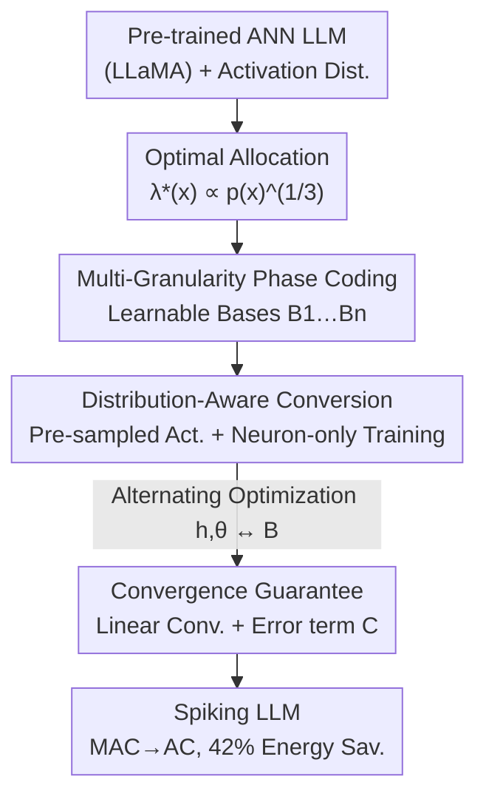

# Distribution-Aware Multi-Granularity Phase Coding: Towards Lower Conversion Error for Spike-Driven Large Language Models

**Conference**: ICLR2026  
**OpenReview**: [https://openreview.net/forum?id=meDMftHUlX](https://openreview.net/forum?id=meDMftHUlX)  
**Code**: https://github.com/njzhenghy/SpikingLLM  
**Area**: Model Compression / Spiking Neural Networks / ANN-to-SNN Conversion  
**Keywords**: Spiking LLMs, ANN-to-SNN Conversion, Phase Coding, Activation Distribution Alignment, Energy Efficiency

## TL;DR
To address the conversion error caused by the "uniform discretization of non-uniform activations" in Spiking LLMs, this paper proposes **Distribution-Aware Multi-Granularity Phase Coding**. It uses multiple learnable phase bases to align discrete value density with activation distributions, coupled with an alternating optimization paradigm that trains only neurons without updating weights. On LLaMA-2-7B and LLaMA-3-8B, it achieves near-ANN accuracy and the lowest perplexity with extremely short conversion times (~2 minutes), while reducing MAC+AC energy consumption by 42%.

## Background & Motivation
**Background**: Spiking Neural Networks (SNNs) replace floating-point Multiply-Accumulate (MAC) with binary spikes and Accumulate (AC) operations, offering high energy efficiency on neuromorphic hardware. However, training an SNN at LLM scale from scratch using surrogate gradients is prohibitively expensive. Consequently, **ANN-to-SNN conversion** is a more practical route: reusing pre-trained ANN weights and minimizing the conversion error—the approximation error between SNN neurons and original ANN activations.

**Limitations of Prior Work**: Existing coding schemes (rate coding, temporal coding) for Spiking LLMs almost universally discretize activations into **uniform** bins. However, real LLM activations are highly **non-uniform** (Figure 1: activations cluster near zero within layers and vary across layers). Forcing uniform discrete values onto non-uniform activations leads to insufficient precision and error accumulation in dense regions, known as the **distribution misalignment** conversion error.

**Key Challenge**: Conversion error is essentially equivalent to **quantization distortion** in information theory. Quantization theory dictates that to minimize distortion, more discrete values should be allocated where the probability density is higher. The uniform allocation of rate/temporal coding violates this principle as they lack distribution-aware capabilities.

**Goal**: (1) Design a coding scheme that **adaptively aligns** discrete value density to activation distributions; (2) Develop a **low-cost** conversion pipeline (avoiding full-network backpropagation); (3) Provide theoretical convergence guarantees.

**Key Insight**: The authors observe that **phase coding** assigns a phase value $B^{-t}$ to each timestep $t$ (where $B$ is the phase base). By adjusting $B$, non-uniform discrete value allocation can be achieved—a degree of freedom rate/temporal coding lacks. Extending a single base to "multiple learnable bases of different granularities" allows for approximating arbitrary non-uniform distributions.

**Core Idea**: Use **multi-granularity learnable phase bases** to align the discrete value distribution $\propto p(x)^{1/3}$ with the activation distribution, and train only neuron parameters (without fine-tuning weights) to minimize conversion error.

## Method

### Overall Architecture
The method converts a pre-trained ANN LLM (LLaMA) into a Spiking LLM with minimal conversion error and cost. The logical chain is: **derive the goal (optimal allocation $\propto$ activation density) from information theory → use multi-granularity phase coding to provide learnable allocations → use an alternating optimization algorithm to fit neuron parameters to real activation distributions → provide theoretical convergence guarantees**.

Specifically, "SNN neurons with multi-granularity phase coding" are inserted before each linear layer or matrix operation to convert floating-point activations into spikes, replacing floating-point matrix multiplications with spike-driven additions. Training data for each neuron is **not** obtained from full-network forward passes but is **pre-sampled** from the activation distribution of the corresponding layer. Training occurs only within individual neurons, eliminating full-network forward/backward propagation.

### Key Designs

**1. Information-Theoretic Optimal Allocation: Translating "Conversion Error" to "Quantization Distortion"**

The authors express the ANN-to-SNN conversion error as the weighted mean squared error $E=\int p(x)(\hat{x}-x)^2 dx$, where $\hat{x}$ is the SNN approximation. The key insight is that this error is **equivalent to the asymptotic distortion of a quantizer**. Using the Bennett integral (Gray & Neuhoff), distortion with $M$ intervals and point density $\lambda(x)$ is:

$$D(q)\simeq \frac{1}{12}\frac{1}{M^2}\int \frac{p(x)}{\lambda^2(x)}\,dx.$$

Minimizing this under the constraint $\int\lambda(x)dx=1$ yields the **optimal point density** $\lambda^*(x)\propto [p(x)]^{1/3}$. This establishes that since LLM activations $p(x)$ are non-uniform, $\lambda^*(x)$ must be non-uniform—allocating more values where activations are dense. This identifies the flaw in uniform coding and provides a clear target for coding design.

**2. Multi-Granularity Phase Coding: Flexible Non-uniform Allocation via Learnable Bases**

Traditional phase coding assigns phase $B^{-t}$ to timestep $t$. Neuron dynamics are $v(t{+}1)=v(t)-B^{-t}s(t)$, $O(t)=B^{-t}s(t)$, $s(t)=\Theta(v(t)-B^{-t})$. While adjusting $B$ allows some non-uniformity and expands discrete values to $2^T$ within $T$ steps, a single base lacks the expressiveness for complex distributions.

Ours extends this to a **set of learnable bases with different granularities** $\{B_1, B_2, \dots, B_n\}$ and reformulates the phase sequence into a piecewise form:

$$\{B^{-t}\}_{t=1}^{T}\ \to\ \{B_1^{-1},B_1^{-2},\dots,B_2^{-t},B_2^{-(t+1)},\dots,B_n^{-T}\},$$

where different segments of timesteps use different bases. The output weight $d(t)$ is drawn from these bases. Simultaneously, $h(t), \theta(t), d(t)$ are **decoupled** (traditional coding forces all to be $B^{-t}$), treating $\{h, \theta\}$ as learnable parameters. This allows discrete values to be "densified" in activation-dense sub-intervals, implementing the $\lambda^* \propto p(x)^{1/3}$ objective.

**3. Distribution-Aware Conversion Paradigm + Alternating Optimization: Minute-level Conversion Cost**

With learnable multi-granularity neurons, the goal is to minimize the expected conversion error:

$$\min_{\{h,\theta\},B}\int p(x)\,\big(\mathrm{SN}(x;\{h,\theta\},B)-x\big)^2\,dx,$$

where $\mathrm{SN}(\cdot)$ is the neuron mapping. In practice, a batch of activation samples $X$ is **down-sampled** from the estimated distribution to minimize empirical error $\min \lVert \mathrm{SN}(X)-X\rVert^2$. **Algorithm 1 (Alternating Optimization)** is used: fix $B$ to update $\{h, \theta\}$ (using sigmoid surrogate gradients), then fix $\{h, \theta\}$ to update $B$. This requires **no full-network propagation and no weight fine-tuning**, reducing conversion time for LLaMA-2-7B to ~2 minutes.

**4. Convergence Guarantee: Ensuring Stability of Surrogate Gradient Optimization**

The authors prove (Theorem 2) that under Lipschitz gradients, Polyak–Łojasiewicz (PL) conditions, and bounded smoothing bias $|f-g|\le\sigma$:

$$f(o_{k+1},B_{k+1})-f^*\le (1-\mu_3\eta_2)(1-\mu_1\eta_1)\,[f(o_k,B_k)-f^*]+C,$$

representing **linear convergence** plus an **error term $C$** determined by the smoothing level. This provides theoretical backing for training SNN neurons with surrogate gradients.

### Loss & Training
The core training objective is the empirical conversion error $\min \lVert\mathrm{SN}(X;\{h,\theta\},B)-X\rVert^2$. Optimization uses Algorithm 1: update $\{h,\theta\}$ for $N_1$ steps using surrogate gradients and learning rate $\eta_1$, then update $B$ for $N_2$ steps with $\eta_2$. No model weights are fine-tuned. Key hyperparameters include the number of grains $n$ (Grain=2/3) and total timesteps $T\in\{6,8,10\}$.

## Key Experimental Results

### Main Results
Evaluations on LLaMA-2-7B / LLaMA-3-8B for perplexity (Wikitext2, C4, etc.) and zero-shot accuracy (WinoGrande, Arc, etc.). Baselines include SpikeLLM, TTFSFormer, LAS, and SpikedAttention.

LLaMA-2-7B ($T=8$) Average Perplexity Comparison (Lower is better):

| Method | $T$ | Conv. Time | Avg. PPL ↓ | Avg. ACC ↑ |
|------|-----|----------|-----------|-----------|
| LLaMA-2-7B (ANN) | — | — | 5.67 | 67.25 |
| SpikeLLM | 8 | 5h 54m | 6.10 | 64.80 |
| TTFSFormer | 128 | — | 12.71 | 66.87 |
| SpikedAttention | — | 2m 02s | 19.91 | 63.89 |
| **Ours (Grain=2)** | 8 | **2m 01s** | **7.16** | **67.17** |
| **Ours (Grain=3)** | 8 | 2m 04s | 7.68 | **67.31** |

At $T=10$, Ours (Grain=2) achieves a PPL of **5.73** and Accuracy of **67.30**, nearly matching the ANN (5.67 / 67.25) in ~2.5 minutes, whereas SpikeLLM requires ~6 hours.

### Energy Consumption (LLaMA-3-8B, $T=6$)
Based on 45nm CMOS estimates ($E_{\mathrm{MAC}}\approx4.6\,\text{pJ},\ E_{\mathrm{AC}}\approx0.9\,\text{pJ}$):

| Model | Computation | Energy (J) |
|------|--------|---------|
| ANN | 3912.08G MACs + 0.17G ACs | 18.00 |
| Ours (Grain=2) | 15.87G MACs + 11521.88G ACs | **10.44** |

Energy consumption decreases from 18.00 J to ~10.44 J, a **42.0% reduction**.

### Key Findings
- **Multi-granularity learnable bases drive performance**: Significant PPL drop compared to LAS (a special unoptimized case) validates the neuron training algorithm.
- **Conversion paradigm efficiency**: ~2 minutes vs. ~6 hours for SpikeLLM due to neuron-only training.
- **Robustness at small $T$**: Maintains near-ANN performance at $T\in\{6,8,10\}$ where others may collapse.
- **Grain Trade-off**: Grain=2 and Grain=3 perform similarly, with Grain=2 often slightly better, suggesting more grains aren't always necessary.

## Highlights & Insights
- **Quantization Analogy**: Mapping conversion error to quantization distortion provides a mathematically grounded target ($\lambda^* \propto p(x)^{1/3}$).
- **General Coding Trick**: Multi-granularity learnable bases are applicable to any scenario requiring non-uniform budget allocation for non-uniform distributions.
- **Weightless Training**: Freezing the backbone and only calibrating activation mapping is highly efficient for resource-constrained environments.
- **Convergence Proof**: Adds theoretical security to the "non-differentiable but functional" surrogate gradient training in SNNs.

## Limitations & Future Work
- **Risk of Over-concentration**: Allocating density based on $p(x)^{1/3}$ might neglect outliers (large activations).
- **Empirical Grain Selection**: The choice of $n$ and timestep allocation across grains remains somewhat heuristic.
- **Theoretical Energy Estimates**: 42% reduction is based on 45nm CMOS CMOS constants; real hardware acceleration depends on efficient AC support.
- **Generalization**: Mainly verified on LLaMA; testing on 70B+ models or MoE/Qwen architectures is pending.

## Related Work & Insights
- **Comparison with LAS**: LAS uses fixed single-base neurons ($\tau \cdot 2^{-t}$); Ours outperforms it by decoupling parameters and introducing learnable multi-granularity bases.
- **Comparison with SpikeLLM**: SpikeLLM requires hours of training through decoding layers; Ours is faster and more stable at smaller $T$.
- **Comparison with TTFSFormer**: TTFSFormer requires large $T=128$; Ours achieves better results with significantly smaller $T$.

## Rating
- Novelty: ⭐⭐⭐⭐⭐ Clear innovation grounded in information theory.
- Experimental Thoroughness: ⭐⭐⭐⭐ Extensive LLaMA testing but lacks ultra-large scale or real hardware measurements.
- Writing Quality: ⭐⭐⭐⭐ Logical flow from motivation to proof.
- Value: ⭐⭐⭐⭐⭐ Practical paradigm for low-cost, efficient Spiking LLMs.

<!-- RELATED:START -->

## Related Papers

- [\[ICLR 2026\] RCPU: Rotation-Constrained Error Compensation for Structured Pruning of Large Language Models](rcpu_rotation-constrained_error_compensation_for_structured_pruning_of_large_lan.md)
- [\[AAAI 2026\] First-Order Error Matters: Accurate Compensation for Quantized Large Language Models](../../AAAI2026/model_compression/first-order_error_matters_accurate_compensation_for_quantized_large_language_mod.md)
- [\[ACL 2026\] TLoRA: Task-aware Low Rank Adaptation of Large Language Models](../../ACL2026/model_compression/tlora_task-aware_low_rank_adaptation_of_large_language_models.md)
- [\[ICLR 2026\] QWHA: Quantization-Aware Walsh-Hadamard Adaptation for Parameter-Efficient Fine-Tuning on Large Language Models](qwha_quantization-aware_walsh-hadamard_adaptation_for_parameter-efficient_fine-t.md)
- [\[ICLR 2026\] ES-dLLM: Efficient Inference for Diffusion Large Language Models by Early-Skipping](es-dllm_efficient_inference_for_diffusion_large_language_models_by_early-skippin.md)

<!-- RELATED:END -->
